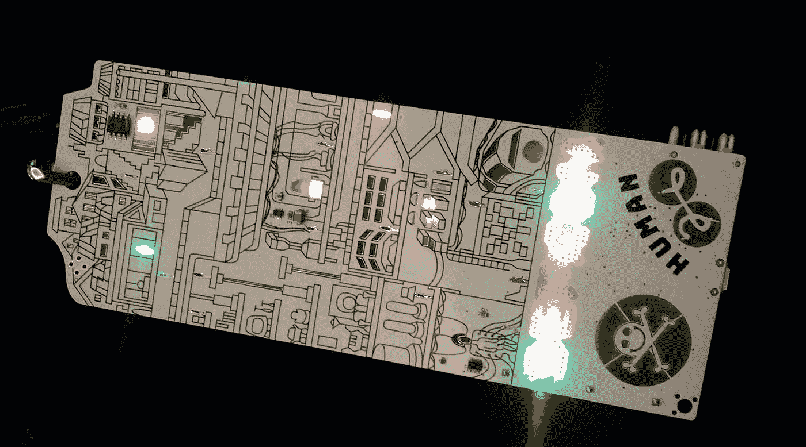
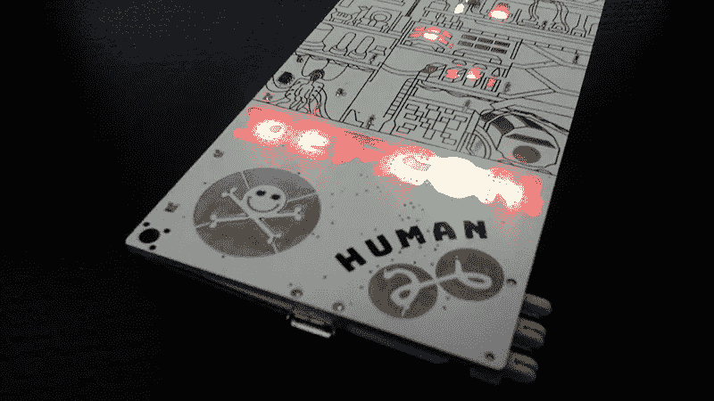
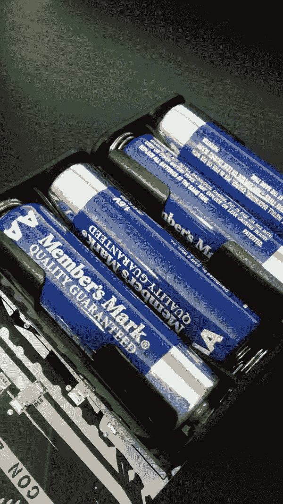
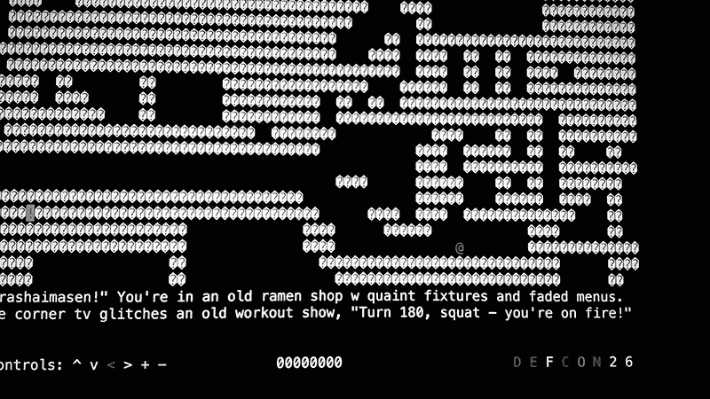
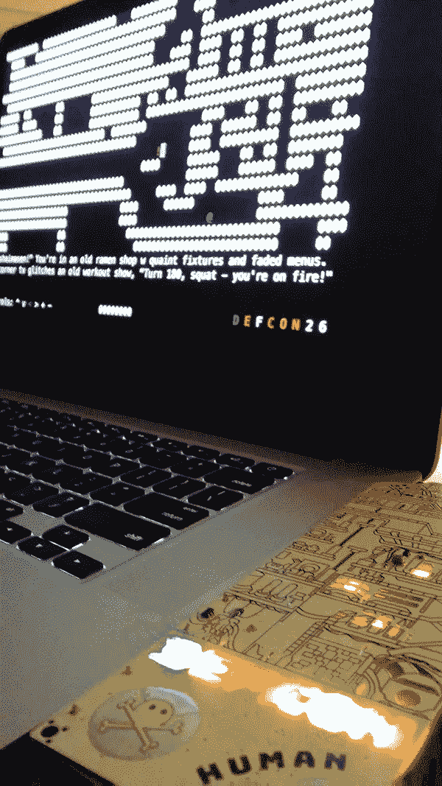

# 探索 DEF CON 26 徽章

> 原文：<https://medium.com/hackernoon/exploring-the-def-con-26-badge-dfcae0a5746d>

我得到了 DEF CON 26 网络安全会议的官方“人类”徽章，现在正在探索它的隐藏功能。Defcon 徽章有谜题要解开，可以解决获得梦寐以求的“黑色徽章”。徽章基本上是一个电路板，所以它是你戴在脖子上的硬件。它很重，因为你还需要添加 4 节 AA 电池来供电。它看起来很有艺术感，也很酷，但穿起来没有那么多乐趣。电池的重量会压在你的脖子上。这幅艺术作品展示了不同类型的房间。电路板上有各种芯片组件，包括 SOIC、微控制器和主处理器。DEF CON 26 徽章的创造者是玩具制造商(TYMKRS)，一个明尼苏达州的集体。

让我们继续探索徽章本身。

## *以下是徽章的物理尺寸:*

*   **8 英寸 x 3 英寸**
*   **4 个电池盒(每个 1.5 伏，总共 6 伏)**
*   **30 个 LED**
*   **PIC32MM0256GPM 处理器 48 针 TQFP**
*   **256 kB RAM，512 kB SRAM**
*   **1 个 USB 端口微型 USB B 型**

徽章本身在其正面有一个插图，其中“DEFCON”字样位于其下方，触摸电容按钮位于其下方。左下角的一个按钮是 DEF CON 标志，另外两个代表数字“2”和“6”。这些按钮是有用途的，一旦你按下它们，它就会改变 LED 的颜色。

在徽章的底部，靠近电池座的地方，是可以用来连接其他徽章的插脚。我在这方面探索的还不够，但这是一种与其他徽章互动的方式。

徽章由 4 节 AA 电池供电，但也可以通过 USB 连接供电。我将它连接到笔记本电脑的 USB 型端口，它给电路板供电，立即点亮了 led。根据 DEF CON 活动工作人员的说法，一些用户徽章出现故障是因为电池放错了位置。我不会去尝试，只是看看它是否真的发生，因为我足够重视这些徽章，不会破坏它。放置电池时，正极“+”端必须与支架上的“+”端相匹配，负极“-”端也是如此。有些人只是粗心大意还是他们以前从未在设备中放入电池？这是可能的，因为许多电子设备都集成了锂离子电池，不需要 AA 电池。

USB 连接不仅为徽章供电，它还可以做其他事情。一旦您在计算机上将徽章枚举为一个设备，您就可以访问一个特殊屏幕。进入屏幕后，您会看到输出使用了 ASCII 字符。它也在终端风格的界面中打开。它将输出一个看起来像是游戏的东西，并附有一些说明。我没有玩过这个游戏，所以我现在不能说这是关于什么的。这个游戏肯定有更多值得讨论的地方。

DEF CON 徽章越来越有创意了。与会者可以有多种类型的徽章，如记者，演讲者，打手等。你甚至可以创建自己的非官方徽章，因为这样做也很酷。有趣的是，它是开源的，所以你可以侵入徽章，添加你自己的定制功能和界面。这就是徽章的意义所在。在其他会议中，徽章只是一个名字标签，而 DEF CON 使它更容易记住，甚至更实用。只是“黑客”玩的又一个玩具。

*注:*本文展示了官方 DEF CON 26 徽章，在美国内华达州拉斯维加斯的凯撒宫举办(2018 年 8 月 9 日至 12 日)。