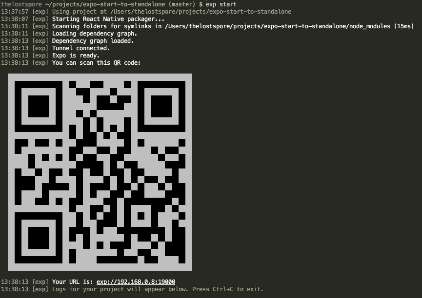
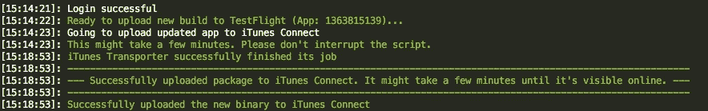

# 世博会开始到独立应用程序

> 原文：<https://medium.com/hackernoon/expo-start-to-standalone-app-353408bf8982>


Fungi photographed by thelostspore in Marin County

## 马斯洛创造者的操作指南

Maslo private beta iOS 应用程序于去年 9 月发布，使用 [Expo](https://expo.io/) 构建——这是一个围绕 React Native 构建的开源工具链，用于帮助构建原生 iOS 和 Android 项目。从那以后，我们不得不[分离](https://docs.expo.io/versions/latest/guides/detach.html)以添加本机模块，如 [RN Firebase](https://rnfirebase.io/) ，但我想我们会分享完整的自述文件，其中包含使用[浪子的试点](https://docs.fastlane.tools/actions/pilot/)部署到 iTunes Connect 的说明，以及一些关于避免一些陷阱的文档。

回购可以在[这里](https://github.com/HeyMaslo/expo-start-to-standalone#expo-start-to-standalone-app)找到。

如果你是一名 web 开发人员，还没有尝试过 Expo，你会有一个愉快的体验——明显的好处是能够使用 Javascript 和 React 开发原生应用程序，同时避免 Xcode 等原生开发 ide。入门非常容易——通过 npm 安装`[exp](https://docs.expo.io/versions/latest/guides/exp-cli.html)` [CLI](https://docs.expo.io/versions/latest/guides/exp-cli.html) ,并使用内置的 scaffolding 命令初始化您的项目。

```
$ npm install -g exp
$ exp init my-project
```

如果您从我们的 repo 开始，只需克隆、安装依赖项并运行启动命令(完整说明[在这里](https://github.com/HeyMaslo/expo-start-to-standalone#requirements)，如果您没有使用 watchman【不需要】，您将需要[增加您的最大打开系统级文件限制](https://github.com/HeyMaslo/expo-start-to-standalone#pitfalls))。

```
$ git clone git@github.com:HeyMaslo/expo-start-to-standalone.git
$ cd expo-start-to-standalone
$ yarn
$ exp start
```

Expo dev 服务器启动后，会提示您扫描二维码🦄



打开手机上的世博客户端 app，扫描一下。本地构建时间很短，Expo 支持实时重载。只需保存您的 Javascript，应用程序将会立即重建！我们将为您保存令人惊叹的 gif——编码、预览、重复。

当您准备好分享您的应用程序时，通过更新您的[应用程序配置](https://docs.expo.io/versions/latest/guides/configuration.html) &运行`exp publish`，将您的项目发布到 Expo 的 CDN。一旦发布，任何拥有 Expo 客户端应用的人都可以通过[开胃](https://appetize.io)在他们的设备上或 Expo 的[网站](https://expo.io)的浏览器中打开一个链接来运行该项目(发挥想象力，使用`exp send`发送文本或电子邮件链接到您的项目)。

到时候，你无疑会想要为你选择的平台构建你的项目(最初我们只针对 iOS)。这个过程只需要三个命令，总共需要大约 45 分钟(除了在 iTunes Connect 中创建应用程序，您还需要安装`[fastlane](https://github.com/HeyMaslo/expo-start-to-standalone#deployment)` [](https://github.com/HeyMaslo/expo-start-to-standalone#deployment)和[注册一个 Expo 帐户](https://expo.io/signup)，这也可以通过 CLI — `exp register`完成)。

```
$ exp build
$ curl -O <.ipa download URL> 
$ fastlane pilot upload
```

`exp build`提示您输入开发者账户信息，并询问您希望如何管理您的证书(Expo [可以为您处理此事](https://docs.expo.io/versions/latest/guides/building-standalone-apps.html#if-you-choose-to-build-for-ios)，但允许您[上传您自己的](https://calvium.com/how-to-make-a-p12-file/))。一旦构建完成，您将获得一个下载[的链接。ipa](https://en.wikipedia.org/wiki/.ipa) 。下载工件并运行`fastlane`命令(注意:当遇到[传输错误时，我们使用这个](https://github.com/fastlane/fastlane/issues/4544)[魔咒](https://github.com/fastlane/fastlane/issues/4544#issuecomment-217519255))——在遵循提示并等待半小时后，您的构建将出现在您的应用程序的构建列表中🙌 🎉



如果你和我们一样，你会想要通过倒一杯 IPA 来庆祝一次[部署](http://help.apple.com/xcode/mac/current/#/dev067853c94)🍺在举杯庆祝之前，请向在博览会上的[人表达爱意，因为他们让开发本地应用变得如此容易🍻](https://slack.expo.io/)

[**马斯洛**](https://maslo.ai/) **是一本有个性有智慧的声音期刊。get Maslo for**[**iOS**](https://itunes.apple.com/us/app/maslo/id1330018942?mt=8)**。**