# 勒索、警察突袭和秘密:委内瑞拉比特币采矿世界内部

> 原文：<https://medium.com/hackernoon/extortion-police-raids-and-secrecy-inside-the-venezuelan-bitcoin-mining-world-6e97a25e7402>

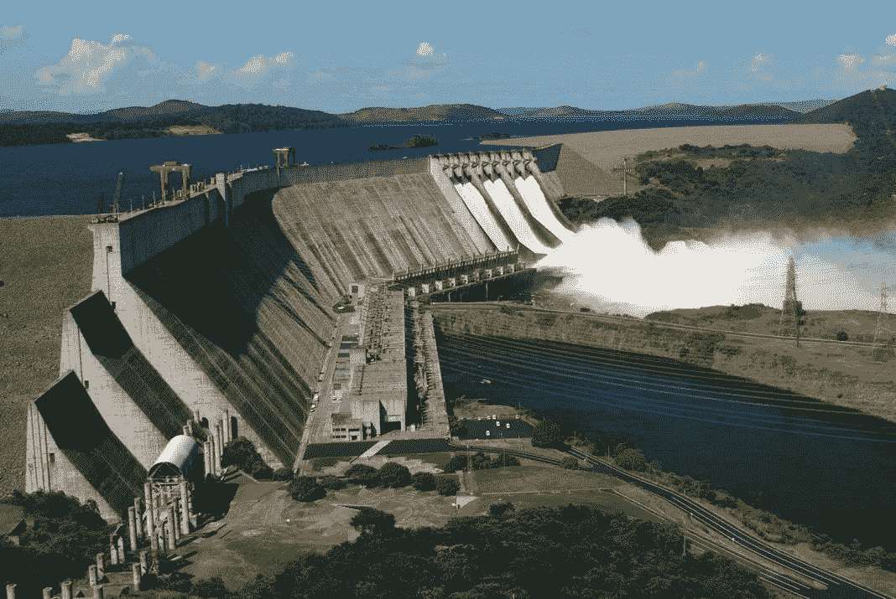

The Simon Bolivar Hydroelectric Power Station, also known as “El Guri,” is one of the largest hydroelectric power plants in the world.

我从未担心过与我合作采访的任何人的安全。许多人将他们的生命和家庭置于危险之中，因为我将要告诉你的事情。这是我从未想过要写的故事之一，但我觉得有必要尽可能诚实地讲述它。

我最近发表了《委内瑞拉比特币场景中的归零地》，并随机收到了一条来自匿名 Twitter 账户的称赞文章的消息。他们还告诉我，我错过了真实的故事。我当然问，“那是什么？”他们回应影射委内瑞拉政府参与比特币挖矿。我心想，现在有故事了。

我回了一条信息，问他们是否有兴趣就此进行匿名采访。他们回复我说，“我无法提供政府如何滥用矿业的证据，但我已经看到了，也认识帮助建立矿业的人。”我当然很感兴趣，但也持怀疑态度。我又发了一条消息，试图敲定一次采访，并提供了一个加密的电子邮件地址。我没有得到回应。在接下来的几周里，我看到这个账户在 Twitter 上很活跃，我以为他们对此不感兴趣。

## 四周后，X 先生出场

我在很大程度上已经放弃了这个故事。我问我以前在委内瑞拉的消息来源，他们是否有兴趣帮我联系一个委内瑞拉的比特币矿工，结果遭到了抵制，并被全面关闭。有人告诉我，“这太危险了。矿工们非常隐秘。没人愿意谈。”

四周后，我随机收到一封邮件，来自一个自称是委内瑞拉比特币矿工的人，愿意接受采访。我让他们知道我不会问他们是谁，并向他们保证我会保守他们的身份秘密。我告诉他们，我会称他们为 x 先生。随着我们之间的交流，信任的因素越来越大。尽管语言不通，我们还是通过电子邮件开始拼凑这次采访。

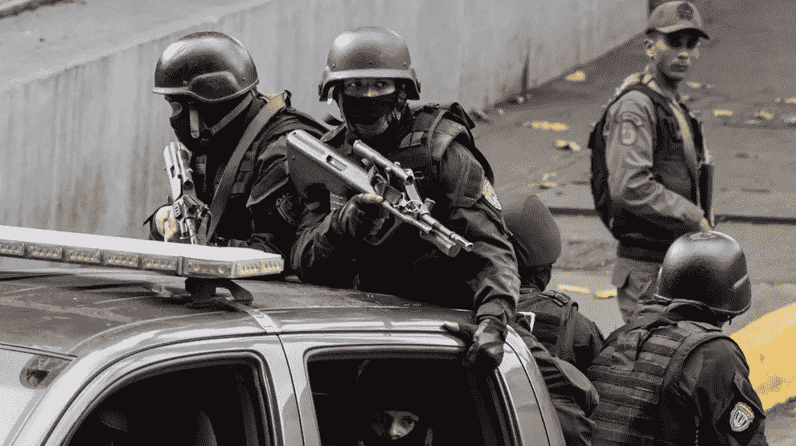

Venezuelan Police task forces are intimidating and miners are beholden to their power.

X 先生的电子邮件之间往往会隔几周。就在我以为这个故事已经结束的时候，我的委内瑞拉朋友的电子邮件又一次出现在我的收件箱里。我觉得用更多的问题和澄清来回应他的问题是自私的。当我一遍又一遍地阅读他的电子邮件时，我意识到 X 先生冒了多大的风险，这些邮件描述了比特币矿工被当地警方追捕、突袭、勒索和逮捕，并证实了国家层面的比特币开采正在进行的传言。

我和 X 先生之间的争吵持续了将近三个月。我每天都担心他的安全，现在仍然如此，还有许多委内瑞拉人冒着生命危险开采比特币。谁会想到比特币挖矿会是一场试图智取和欺骗政府和警察特遣部队的猫鼠游戏？话说回来，谁会想到比特币采矿对那些依靠比特币生态系统生活的家庭来说会如此有利可图。

## 迂回曲折

在我们来回穿梭的过程中，委内瑞拉政府内部就加密货币展开了许多新的曲折。第一个是政府宣布了比特币开采注册，是的，想象一下，任何开采比特币的人现在都需要向政府注册。除此之外，马杜罗总统还开启了新的委内瑞拉秘密政权，T2 石油公司。这枚硬币据称是由委内瑞拉石油支持的。

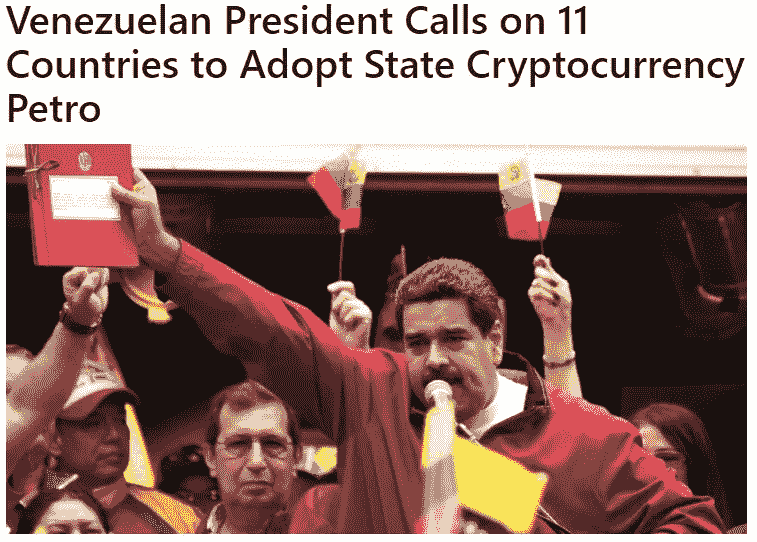

[Interesting background article on the Petro published on CCN.com](https://www.ccn.com/president-maduro-calls-on-alba-governments-to-join-venezula-in-adopting-the-petro/)

委内瑞拉发生了这么多事情，很难让这次采访完全围绕比特币挖矿展开。X 先生和我尽了最大努力让世界了解委内瑞拉人民如何依靠比特币和比特币采矿生活和生存。由于主题的微妙性，我允许 X 先生自由回答或不回答任何问题。我没有办法证实他故事中的事实，但是我有充分的理由相信他说的是真的。

***重要提示:***

*最后一件需要澄清的事情。不是每个委内瑞拉人都能负担得起比特币采矿设备或比特币。我们绝不想描绘委内瑞拉的每个人都靠比特币采矿或比特币生活的画面。通常，比特币矿工由委内瑞拉中上层阶级组成，他们有钱购买采矿所需的设备。这使得贫困的委内瑞拉人在这个苦苦挣扎的经济中比他们的同胞更加处于劣势。*

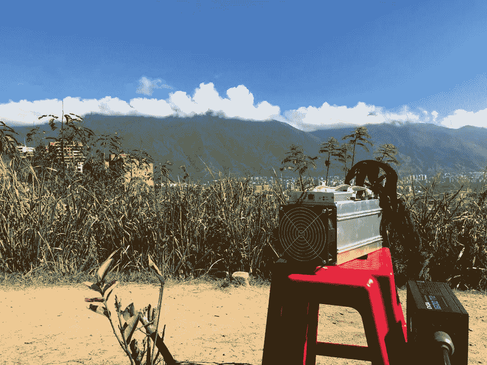

An original photo sent to me during this interview of an S9 Antminer currently used by Mr. X in Venezuela. To put it into perspective, one S9 can feed a family.

## 名称:

薛汀哲

## 你在哪里工作？

加拉加斯

## 为什么要匿名做这个采访？

因为采矿尚未受到监管，委内瑞拉的许多矿工已经陷入困境。

## 从现实生活的角度来看，比特币在委内瑞拉的开采对你意味着什么？

现在，这意味着一切，因为通过这样的活动，你可以绕过外汇管制，战胜我们面临的经济灾难。我的全部注意力都在这件事上。

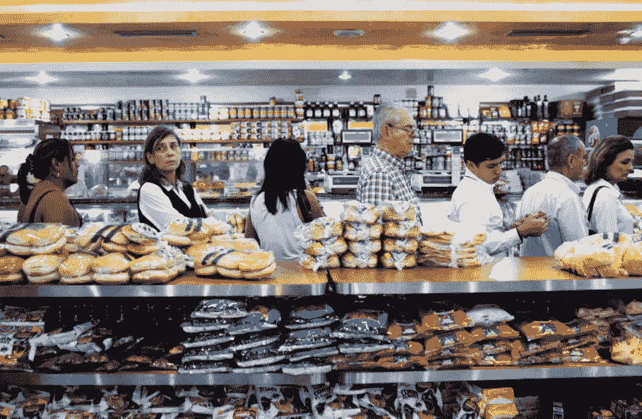

Grocery shopping in Venezuela is a frustrating all day affair with long lines and limited selection.

## 这对委内瑞拉人民意味着什么？它带来了什么经济机会？

你可以养活你的家人，还可以为将来存些钱，还有其他好处，就是有盈余。

## 人们开采完 BTC 后会怎么处理它？

如果你马上需要当地的现金，那么你可能最终会在[localbitcoins.com](http://localbitcoins.com)卖掉一些 btc 来应付你的生活费用。如果不是，那么它主要存储在 coinbase 和交易所。冷藏还不是文化。

## 他们怎么换，换什么？

就像我说的，对于当地费用，你需要放弃 btc 以换取玻利瓦尔，因为几乎没有任何商店会以常规方式接受你的 btc。如果你购买更多的采矿设备来增加或保持你的业务，那么你必须将 btc 换成 bch(只有在 bitmain's 直接这么做的时候)。

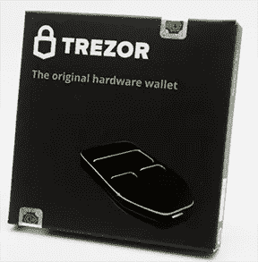

Here is an example of a [Trezor](https://trezor.io/) hard wallet.

## 在委内瑞拉，大多数人把他们的 BTC 存放在哪里？(即硬钱包、热钱包)

从我所听到和看到的，这里最受欢迎的钱包是比特币基地。我总是告诉人们买一个冷藏设备，比如 [Nano Ledger](https://www.ledgerwallet.com/products/ledger-nano-s) 或者 [Trezor](https://shop.trezor.io/?h=7472657a6f722e696f) 。人们也喜欢[支持](https://uphold.com/)，因为这让他们可以将 BTC 兑换成美元，直接进入他们的美元银行账户。

## 委内瑞拉有多少人在采矿。猜测？

这通常只发生在中高阶层，因为穷人买不起这些设备。在这个范围内，可能是五分之一。然而，你应该注意到，一些委内瑞拉人正在美国建立非常大的农场，因为他们在那里不会面临任何勒索，而且坐飞机只有三个小时的路程。

## 你觉得有多少人在这么做？

成千上万。

## 人们如何获得设备？

这很有趣。似乎从制造商到买家的整个设备供应链都是凭空出现的。部分原因是一些人决定不开采，而是买卖设备。那里有足够的设备，朋友们通常在那里谈论其他人的采矿设备交易。

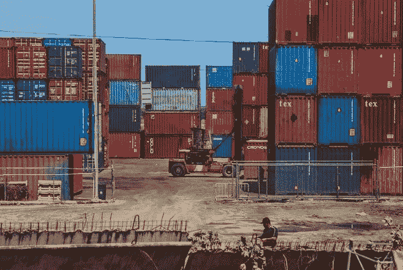

Mr. X says there is no short supply of Bitcoin mining equipment making its way into Venezuela.

## 政府是否监督设备的进口？

应该是的，但是我不明白这些设备是怎么到这里的。我听说，当它直接来自中国的集装箱，他们抓住它。

## 描述一下比特币挖矿设备的黑市？

首先，你不要和任何人谈论这件事。你只和你信任的人谈论它。如果你想的话，你可以很快加入这个市场。

## 人们是如何学习挖掘比特币并能够赚钱的？

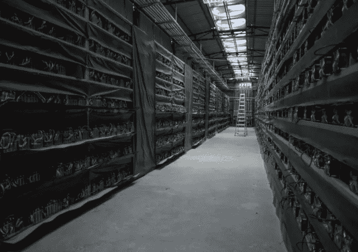

An example of a BTC mining farm in China (We couldn’t get a photo of a VZ farm).

也很有趣。总会有足够聪明的人学会如何连接设备，大多数情况下，他最终会成为“那个人”“我认识一个家伙，他为我做了所有这些，并收取我 X 美元”问题是，你不希望陌生人进入你的采矿设施，因为任何事情都可能把你引向敲诈聚会。即使是为你安装制冷系统的人，也可能会在那天晚上晚些时候背叛你，当时他正在郊区的家乡和他的邻居喝啤酒。

## 你认为有多少地下采矿场？

没有办法判断，但很容易在数千，可能超过十万。街上的说法是，基本上任何有电力服务的物理空间都是托管空间。

## 他们从这些小型、中型和大型业务中赚了多少钱？

他们赚了很多钱，考虑到电费便宜得离谱，大农场赚的钱甚至更多。

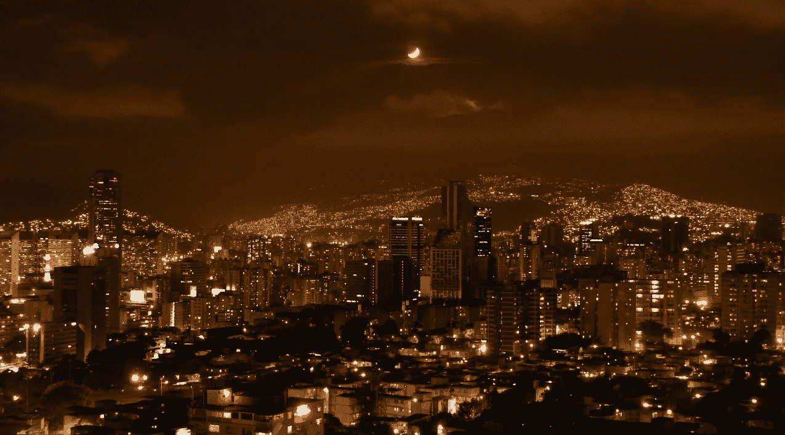

Powering up Caracas at night is no easy task. 74% of Venezuelan electricity comes from renewable energy like hydro electric power which is cheap to produce.

## 描述电费。让人们理解成美元？

0.0000125 美元每千瓦/小时(不，这些不是 Satoshis，这些是黑市上的美元评级)

## 一台电脑挖矿能为一个家庭提供多少食物和必需品？

在食物方面，你会增加体重。就必需品而言，根据你的生活状况，你几乎可以买得起你生活所需的任何东西。保险、食物、学费、水电费和几乎所有日常开支都变得负担得起。即使对那些收入是玻利瓦尔的人来说，公用事业也毫无意义。

## 你对要求矿工向政府登记的新法律有什么看法？

制定这样的法律很有意思，但我们必须等着看它进展如何。我的意思是，在我们生活的人道主义问题得到解决之前，腐败行为不会消失。人们不允许从地表开采黄金或钻石，那么为什么数字宝藏会有什么不同呢？

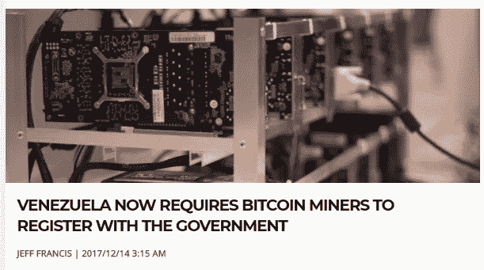

[Interesting article on the miner registration program pubished on bitcoinist.com](http://bitcoinist.com/venezuela-now-requires-bitcoin-miners-register-government/)

## 你认为政府的真正目标是什么？

找出谁在采矿，你赚了多少钱。

## 你认为他们会利用这些信息来勒索或拿走设备吗？

我希望不会。

## 有多少人会遵守这条规则？

我想最勇敢的人会第一个跳下去，而其余的观众等着看它如何发展。

## 采矿被抓会有什么后果？

不太好。勒索，殴打，拘留。

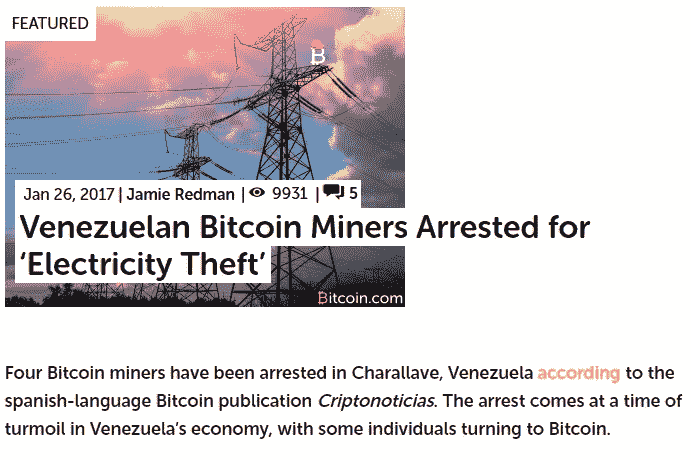

[Interesting story of VZ Bitcoin miners arrested for “Electricity Theft.”](https://news.bitcoin.com/venezuela-bitcoin-miners-arrested-electricity-theft/)

## 有报道称，政府没收了人们的电脑和采矿设备。给我们讲讲这个。

是的，有时警察小队会去你的住处，决定没收你的采矿设备，而你对此却无能为力。

## 他们用这些设备做什么？

有传言说他们把它们安装在政府设施上。

## 这不是一个秘密，据传委内瑞拉政府正在使用没收的采矿设备来经营他们自己的农场，并让那些从他们那里获得设备的人来建立它。告诉我们这些秘密行动？

这是最坏的情况，但我听过很多这样的故事。如果由于某种原因，他们不喜欢你在突袭中，他们会没收你的设备，并让你为他们安装。他们甚至“雇佣”你作为渗透者，让你出卖其他矿工。

## 政府和警方是如何找到矿工的？

有一个专门从事采矿狩猎的情报警察部门。他们通过监控电力消耗来寻找异常情况。

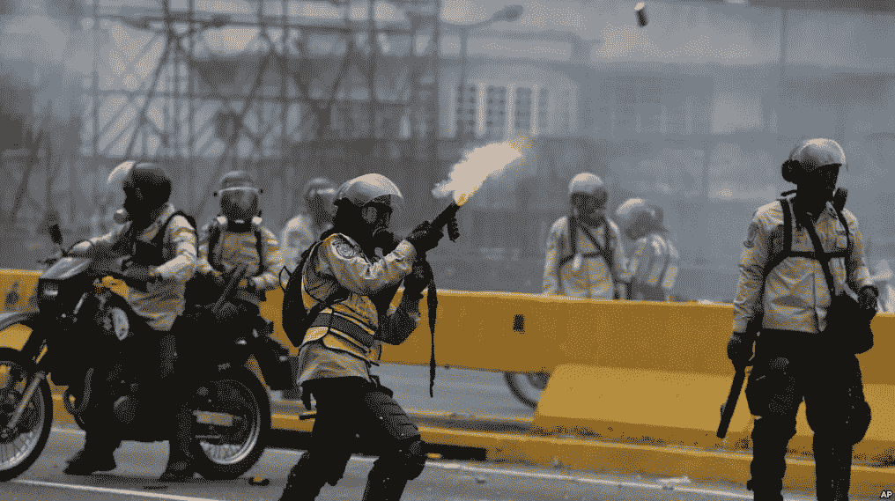

Venezuelan police shooting tear gas into crowds of protesters last year in Caracas.

## 警察勒索矿工什么钱？

我听说每台机器 1000 美元，但还是要看情况。我猜比特币的价值增长得越多，他们就会问得越多。

## 这些钱去了哪里？

我不能肯定地告诉你，但是我的猜测是每个队员都会分一杯羹，包括大老板。

## 如果他们拒绝并说不呢？

我不建议这样。很可能你会被逮捕和痛打一顿。

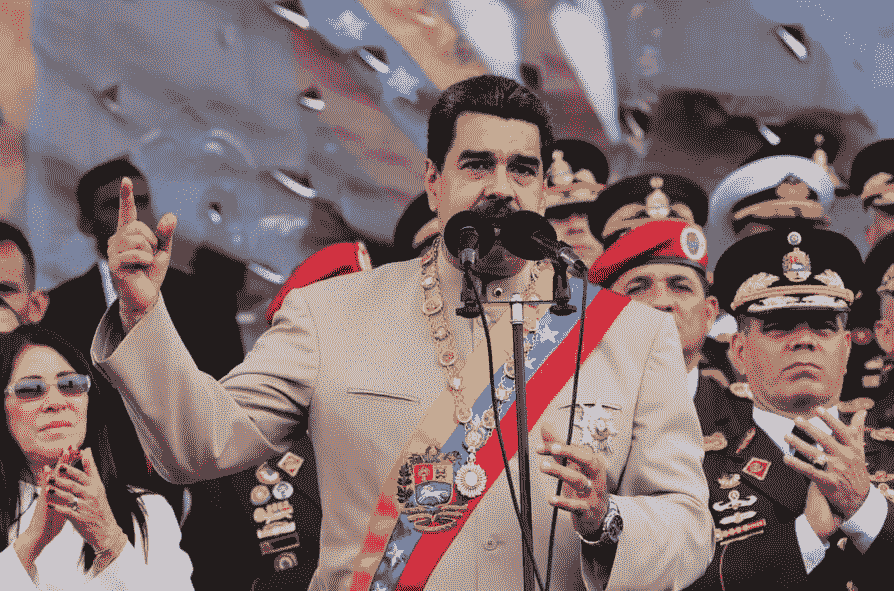

President Maduro in full regalia making a speech with his top brass.

## 评论正在进行的国家级采矿。没有人想谈论它，但事实是我们都知道这是怎么回事

有传言说首都军事总部到处都是蚂蚁矿工。

## 委内瑞拉的互联网连接如何，这对采矿有何影响？

除了必须应对世界上最慢的网速之一，我们还必须接受它甚至不稳定的事实。

## 如果他们在采矿，人们必须隐瞒他们的 IP 或在线活动吗？

他们最好是。

## 人们会在多大程度上隐藏他们的采矿活动？

采矿活动的每一步都必须隐蔽起来。

## 你是怎么学会采矿的？

这辈子你学习做任何事情的方式都是一样的:谷歌、YouTube 等等。

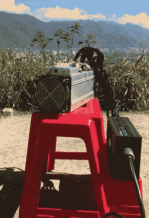

One of Mr. X’s S9 Antminers.

## 你运行什么设备？

我只做比特币挖矿。我个人不在乎其他什么加密货币。对我来说，几个 9 就够了。

## 你认为这样的东西会产生多少美元？

投资越多，赚的也就越多，但只有一个档位的产量就足以维持生活。

## 可以指点别人去哪里学习或者获取装备？

[Bitcointalk.org](https://bitcointalk.org/)和[bitmain.com](http://bitmain.com/)

## 你投资了多少？

大约 7000 美元

## 真正的大运营投入了多少？

超过 10 万美元甚至更多。

## 解释一下那里的电力是如何工作的，人们要付多少钱？

谈到公用事业，委内瑞拉人在价格方面很有天赋。电比水便宜，如果我告诉你一个完整的房子的账单是多少，你不会相信我。

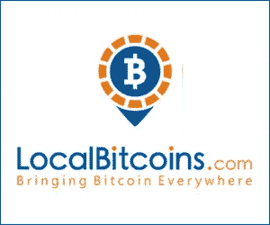

[localbitcoins.com](http://localbitcoins.com)

## LocalBitcoins.com 的[和这一切是如何发生的？](https://localbitcoins.com/)

对于矿工来说，这是一个很好的工具，因为你可以放弃一些 btc 收入来换取当地货币。

## 你能给委内瑞拉的矿工们什么建议，让他们躲起来，避免被发现？

每个位置不要超过两个工人。

## 你提到大矿工像皇室一样生活。解释一下你的意思，这样别人就能明白了

他们在 BTC 或任何其他加密货币的收入以玻利瓦尔计算是巨大的，这意味着你立即成为一个高级公民。

## 他们是如何不被发现的？

不把它浪费在大街上。

## 随着人们积累越来越多的 BTC，BTC 的生态系统是什么样的呢？

几乎每个中产阶级以上的人都在谈论 BTC。甚至军官也在用比特币基地购买菲亚特的股份，并存放他们的 BTC。

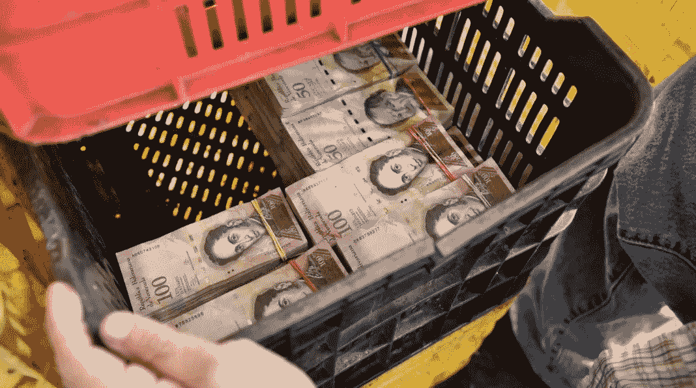

A basket full of stacks of Bolivars like this will barely buy you lunch.

## 描述 BTC 的黑市交易。

你不会在黑市上看到太多 btc 产品出售。我想人们只是在开玩笑，但是偶尔你会听到一个大的卖出报价，比如 30 btc，用美元现金支付。这通常是警方在寻找流动性。

## 你如何看待新政府石油加密货币？

也许他们正试图通过用另一种货币出售石油来绕过美元黑手党，但我们都知道每个试图这样做的国家会发生什么。问问中东。

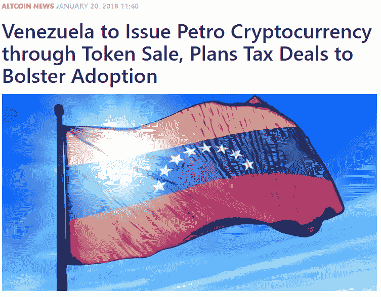

[Interesting background article on the Petro published on CCN.com](https://www.ccn.com/venezuela-issue-petro-cryptocurrency-token-sale-plans-tax-deals-bolster-adoption/)

据我所知，这是一个商品系绳，因为它的价值与石油桶挂钩。因此，即使它在主要交易所上市，你如何冻结价格？Tethers 是一个市场基础，因此在任何情况下，比特币都必须与 Petro 交易。所以 1 BTC ~ 300 彼得罗？

## 解释一下谁是幕后黑手？

也许俄罗斯和中国正在对委内瑞拉进行他们不敢对自己国家进行的秘密实验。

## 委内瑞拉人民会支持吗？

它来自摧毁了以前的货币的同一个政府，所以开始并不好，但与此同时，人们正在绝望地寻找一种当地的替代货币。

## 为什么你认为它会像玻利瓦尔一样失败？

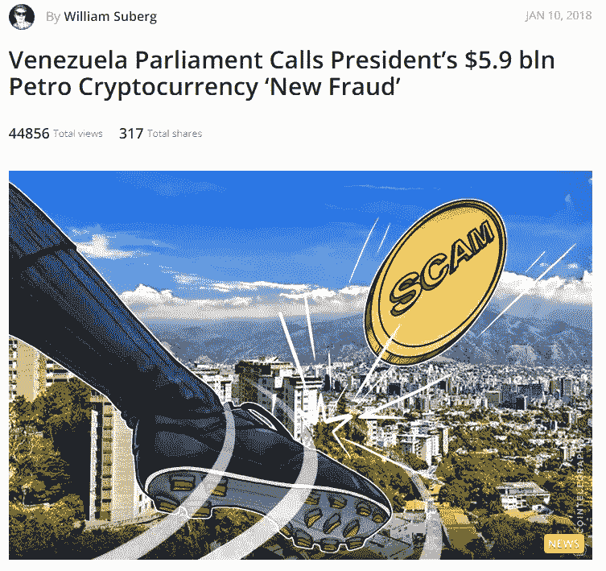

[Another background article on the Petro published by Cointelegraph.com](https://cointelegraph.com/news/venezuela-parliament-calls-presidents-59-bln-petro-cryptocurrency-new-fraud)

因为我们国家的财富主要用于地缘政治目的，任何国家都不可能既挑战美国霸权又享受内部福利。

## 除了采矿，委内瑞拉人在 BTC 还有哪些投资方式？

他们通过 localbitcoins.com 和其他一些交易所进行购买。这是当地的一些赌场，你可以用玻利瓦尔买入。

## 你能给这些人什么样的提示或警告？

阅读和学习你需要知道的关于这项技术的一切，这样就没有人能欺骗你了。

## 你做这次采访冒了多大的风险？

如果我加入了一个政治反对党就不会了。

## 你想让世界了解委内瑞拉什么？

我们很棒，我们会证明这一点。地理给了我们一切。我们位于南方的北方，同时也是(自然资源)最丰富的国家之一。

## 我们如何帮助委内瑞拉人民？

通过获得高质量的西班牙语比特币内容，并允许我们加入外部交易所。

## 如果下面的情况保持不变，你对未来有什么感觉？

古巴是什么？叙利亚是什么？

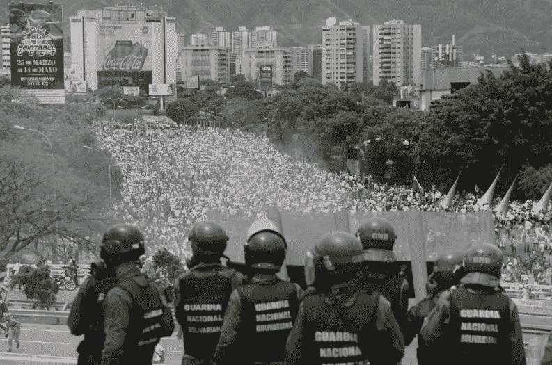

Venezuela faces many tougher challenges than Bitcoin mining. Government protests like this are common.

# 结论

完成这次采访后，我让它酝酿了几个星期。我有一部分不想发表它。当我编辑文本时，我觉得我在读一本虚构的小说。最重要的是，我不想给任何人制造任何麻烦。我给 X 先生发了最后一封电子邮件，里面有这次采访的全部记录。我告诉他我们讲述这个故事的唯一方法就是讲述这个故事！我请他通读一遍，并仔细思考我们写的每一件事。我给了他最后一次机会来做最后的编辑，如果他高兴的话，我还可以选择把整个故事删掉。

几天后，X 先生回复了我。他做了一些小调整，说一切看起来都很好。我永远不会知道 X 先生的身份，我也不在乎。我不相信他是最初联系我的那个匿名 Twitter 用户。X 先生的英语和打字技巧要好得多。这是故事的一部分，对我来说永远是个谜。我唯一的希望是，在写这篇报道时，我为他和委内瑞拉的比特币矿工讨回了公道。抵抗万岁！

*特别感谢 X 先生和所有帮助这个故事发生的人。如果有人想把这篇文章翻译成西班牙语或其他语言，请随意。请记住要归功于*[*@ piratebachbum*](https://twitter.com/piratebeachbum)*[*coin strategy . io*](http://www.coinstrategy.io)*和*[*Hackernoon.com*](http://www.hackernoon.com)*。**

*帮助我们在委内瑞拉的加密朋友的最好方法就是分享这篇文章。那是…如果你不觉得它很烂的话。#Knowledgeispower*

**在 twitter 上找我*[*@ piratebachbum*](https://twitter.com/piratebeachbum)[*www . coin strategy . io*](https://www.coinstrategy.io/)*[*@ coin _ strategy*](https://twitter.com/coin_strategy)**

****

**[ftwtour.com](http://www.ftwtour.com)**

**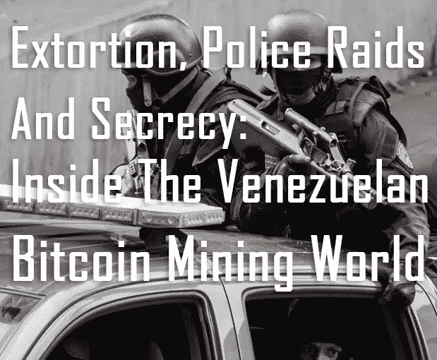**