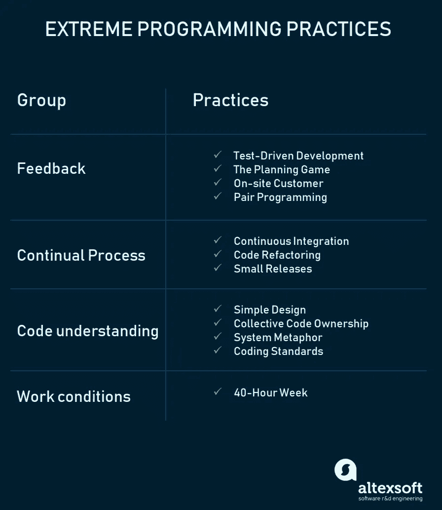

# 极限编程:价值、原则和实践

> 原文：<https://medium.com/hackernoon/extreme-programming-values-principles-and-practices-6d270957fef7>

随着软件工程这样一个快节奏的环境，传统的项目管理方法不再可行。这意味着 IT 专业人员必须找到新的方法来处理频繁变化的开发任务。

分享这一想法并关注现有的增量开发技术，17 名软件专家在 2001 年引入了[敏捷项目管理哲学](https://www.altexsoft.com/whitepapers/agile-project-management-best-practices-and-methodologies/?utm_source=MediumCom&utm_medium=referral)。灵活、快速和以协作为中心的软件开发原则在[敏捷宣言](http://agilemanifesto.org/)中进行了概述。

极限编程(XP)是 IT 公司应用的众多敏捷框架之一。但是它的关键特征——强调软件开发的技术方面——将 XP 与其他方法区分开来。

软件工程师[肯·贝克](https://en.wikipedia.org/wiki/Kent_Beck)在 90 年代引入了 XP，目标是找到快速编写高质量软件的方法，并能够适应客户不断变化的需求。1999 年，他在《极限编程 [*一书中对 XP 方法进行了提炼解释:拥抱变化*](https://www.amazon.com/Extreme-Programming-Explained-Embrace-Change/dp/0201616416) 。

XP 是一套工程实践。开发人员在执行这些实践时必须超越他们的能力。这就是框架标题中的极端的来源。为了更好地理解这些实践，我们将首先讨论 XP 的价值和原则。

# 极限编程的价值和原则

XP 有基于 **5 值**的简单规则。

**沟通:**团队中的每个人都在项目的每个阶段共同工作。
**简单性:开发人员努力编写简单的代码，为产品带来更多价值，因为这样可以节省时间和精力。
**反馈:**团队成员频繁地交付软件，获得关于它的反馈，并根据新的需求改进一个产品。
**尊重:**每个被分配到一个项目的人都为一个共同的目标做出贡献。
**勇气:**程序员客观评价自己的结果，不找借口，时刻准备应对变化。**

**这些价值观代表了积极的团队成员在实现共同目标的过程中尽最大努力的特定心态。XP 原则来源于这些价值观，并以更具体的方式反映它们。**

**大多数研究人员将 **5 XP 原则**定义为:**

****快速反馈:**团队成员理解给出的反馈，并立即做出反应。
**假设简单:**开发人员需要专注于当前重要的工作，并遵循 YAGNI(你不会需要它)和 DRY(不要重复自己)原则。
**渐进式改变:对产品逐步进行小的改变比一次大的改变效果更好。
**拥抱变化:**如果客户认为产品需要改变，程序员应该支持这个决定，并计划如何实现新的需求。
**优质工作:**工作出色、做出有价值产品并为此感到自豪的团队。****

****现在是时候学习将软件开发团队变成梦之队的实践了。****

# ****极限编程实践****

****XP 建议在开发软件时使用 **12 条实践**。因为 XP 是由价值和原则定义的，所以它的实践也代表了它们，并且可以分成四组。****

********

## ****反馈****

******测试驱动开发。**有没有可能快速写出清晰的代码？根据 XP 实践者的说法，答案是肯定的。软件的质量来源于短的开发周期，这反过来又允许频繁地接收反馈。有价值的反馈来自良好的测试。XP 团队实践测试驱动开发技术(TTD ),这需要在代码本身之前编写自动化单元测试。根据这种方法，每段代码都必须通过测试才能发布。因此，软件工程师因此专注于编写能够完成所需功能的代码。这就是 TDD 允许程序员使用即时反馈来生产可靠软件的方式。你可以在我们的专题文章中了解更多关于[改进软件测试](https://www.altexsoft.com/blog/engineering/6-ways-to-improve-software-testing-through-planning-work-environment-automated-testing-and-reporting/?utm_source=MediumCom&utm_medium=referral)的信息。****

******策划游戏。**这是在迭代周期开始时召开的会议。开发团队和客户一起讨论和批准产品的特性。在规划游戏的最后，开发人员为即将到来的迭代和发布进行规划，为他们每个人分配任务。****

******现场客户。根据 XP，最终客户应该完全参与开发。如有必要，客户应始终在场，回答团队的问题，设定优先级，并解决争议。******

******结对编程。**这种实践要求两个程序员共同处理相同的代码。当第一个开发人员专注于编写时，另一个开发人员审查代码，提出改进建议，并在此过程中修正错误。这样的团队合作带来了高质量的软件，更快的知识共享，但是花费了[15%到 60%的时间](http://www.cs.utah.edu/~lwilliam/Papers/ieeeSoftware.PDF)。在这方面，对于长期项目，尝试结对编程更合理。****

## ****连续过程****

******代码重构。为了在每一次短暂的迭代中用设计良好的软件交付商业价值，XP 团队也使用重构。这项技术的目标是不断改进代码。重构是关于去除冗余，消除不必要的功能，增加代码的一致性，同时解耦元素。保持你的代码简洁明了，这样你就可以在需要的时候很容易理解和修改它这是任何一个 XP 团队成员的建议。******

******持续整合。开发人员总是保持系统的完全集成。XP 团队将迭代开发带到了另一个层次，因为他们一天多次提交代码，这也被称为[连续交付](https://www.altexsoft.com/blog/business/continuous-delivery-and-integration-rapid-updates-by-automating-quality-assurance/?utm_source=MediumCom&utm_medium=referral)。XP 从业者理解交流的重要性。程序员讨论代码的哪些部分可以重用或共享。这样，他们确切地知道他们需要开发什么功能。共享代码的策略有助于消除集成问题。此外，自动化测试允许开发人员在部署之前尽早检测并修复错误。******

******小发布。**这种实践建议快速发布第一个版本，并通过小的增量更新来进一步开发产品。小版本允许开发人员频繁地接收反馈，及早发现错误，并监控产品在生产中的工作情况。这样做的方法之一是我们之前提到的持续集成实践(CI)。****

## ****代码理解****

******简洁的设计。最好的软件设计是最简单可行的设计。如果发现任何复杂性，应该将其删除。正确的设计应该通过所有的测试，没有重复的代码，并且包含尽可能少的方法和类。它还应该清楚地反映程序员的意图。******

****XP 实践者强调，在产品投入生产一段时间后，简化设计的机会更大。Don Wells 建议为那些你计划马上实现的功能编写代码，而不是提前为其他未来的功能编写代码:“最好的方法是只为你正在实现的功能编写代码，同时你搜索足够的知识来揭示最简单的设计。然后逐步重构，实现你新的理解和设计。”****

******编码标准。**团队必须有共同的编码实践，使用相同的格式和风格来编写代码。标准的应用允许所有团队成员轻松地阅读、共享和重构代码，跟踪谁处理了某些代码片段，并使其他程序员更快地学习。根据相同规则编写的代码鼓励集体所有权。****

******集体代码所有权。**这个实践声明了整个团队对系统设计的责任。每个团队成员都可以审查和更新代码。能够访问代码的开发人员不会陷入不知道在哪里添加新功能的境地。这种做法有助于避免代码重复。集体代码所有权的实现鼓励团队进行更多的合作，并随时带来新的想法。****

******系统比喻。系统隐喻代表一个简单的设计，它具有一系列特定的品质。首先，一个设计和它的结构必须是新人们可以理解的。他们应该能够在不花费太多时间检查规范的情况下开始工作。第二，类和方法的命名要连贯。开发人员应该以命名一个对象为目标，就好像它已经存在一样，这使得整个系统设计可以理解。******

## ****程序员的工作条件****

****40 小时工作制。XP 项目要求开发人员快速、高效地工作，并保持产品的质量。为了坚持这些要求，他们应该感觉良好和休息。保持工作与生活的平衡可以防止专业人士过度劳累。在 XP 中，最佳工作时间不得超过每周 45 小时。只有在下一周没有加班的情况下，一周才有可能加班一次。****

# ****何时使用 XP****

****确保公司的规模、结构、专业知识以及员工的知识基础允许应用 XP 实践是很重要的。这些都是要考虑的因素。****

******高度适应性开发。** XP 是为了帮助开发团队适应快速变化的需求而设计的。****

******高风险项目。**应用 XP 实践的团队更有可能避免与开发新系统相关的问题，尤其是当产品所有者为项目设定严格的期限时。****

******小团队。对于不超过 12 人的团队来说，XP 实践是有效的。******

******自动化测试。**另一个影响 XP 选择的因素是开发人员创建和运行单元测试的能力。****

******可用客户参与。由于 XP 要求客户、开发人员和管理人员并肩工作，确保你的客户可以在办公室呆到项目结束。******

# ****结论****

****极限编程是一种基于简单、交流、反馈和勇气的软件开发方法。****

****基于 XP 原则和价值观构建工作流程的公司在团队内部和团队之间创造了一种竞争但激励的氛围。程序员欣赏彼此的项目输入，快速交付软件，因为他们可以区分相关任务和不必要的任务。他们对反馈反应迅速，意识到这是旨在使产品更好的合理批评。****

****XP 团队并不认为每个技术挑战都是一个问题，而是认为这是一种发展技能的方式。****

****喜欢这个故事吗？为我们鼓掌，让更多人发现它！👏
原载于 AltexSoft 的博客:*[*极限编程:价值观、原则、实践*](https://www.altexsoft.com/blog/business/extreme-programming-values-principles-and-practices/?utm_source=MediumCom&utm_medium=referral)*****