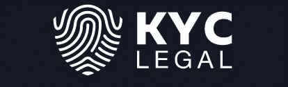

# FUD 和会议丰富多彩！

> 原文：<https://medium.com/hackernoon/f-the-fud-conferences-galore-146ab0e4957b>

FUD 和会议丰富多彩！

本周是特殊的一周，因为在 FUD 发生重大袭击和随后的市场调整之后，会议日程安排非常庞大。过去几天，FUD 受到了来自 Mt. Gox、SEC 和币安的攻击，毫不奇怪，市场对每个事件都反应过度了。

这些过度反应之后会发生什么？篮板。

在这次调整之后，中国和韩国都传出了非常积极的消息，但市场并没有像人们想象的那样反弹。最令人惊讶的是，FUD 是没有根据的。证券交易委员会在过去的两个月里陈述了完全相同的事情。这些文章只是“重申”了已经是常识的东西。他们正在评估当前的 ico，尤其是价值数亿美元的 ico。要消除骗局，需要拥抱而不是打击 SEC 和监管机构。

所谓的币安黑客并没有导致任何“真正的”损失，因为没有资金丢失，网站运行良好。然而，币安可能遭到黑客攻击的消息足以使 BTC 和整个加密市场的价值暴跌。

Mt. Gox 接到通知，他们必须停止出售过去几个月在公开市场上出售的成千上万的 BTC，直到 9 月份。最大的“卖家”之一现在是未来六个月(最少)的“持有人”。在没有紧急禁令的情况下，过去几个月压低 BTC 价值的主要候选人被告知，在 9 月份开庭日之前，停止所有销售。

本周的结果是，本应被积极看待的 SEC 消息被解读为负面消息，因为监管机构将允许机构资金进入加密领域。币安·FUD 的攻击没有得到证实，币安没有被黑客攻击(如果你有资金在那里，你会意识到谢天谢地他们没有)。同样，强调 Mt. Gox 如何在公开市场上倾销 40，000+BTC 的文章没有发布后续或更正，宣布他们现在已经完全停止所有销售，直到他们的下一个法庭日期。

所有这三个与 FUD 有关的事件要么是不真实的，要么被歪曲成负面的，要么当真相浮出水面时被掩盖了。

本周没有“坏”消息，但 BTC 下跌了 30%以上。好消息是，随着鲸鱼现在持有大部分硬币，市场情绪即将逆转。本周提供了一个独特的机会，在周末泵之前回到加密市场(或添加菲亚特)。

本周的会议多得一个人用一只手都数不过来。这些会议不是标准的“会面”,而是花费 2000-4000 美元的会议。这些会议现在已经远远超出了标准的区块链和加密讨论，包括世界上最大的公司(谷歌、亚马逊、Discover、万事达卡等等)与区块链团队一起出席。

本周的会议包括 TokenFest 和 Money 20/20 Asia 作为亮点。然而，每一个都有其特定的原因和曝光率。一定要看看最近的会议，突出本周的会议，哪些硬币应该有漂亮的泵导致他们:

[**会议层出不穷！**](https://btcmanager.com/blockchain-cryptocurrency-conferences-taking-place-mar-12-19/)

即使有一些政府干预和一周的 FUD，这些 ico 仍然在踢…

[**Vestarin ICO**](https://www.vestarin.io/?ref=38b3eff8baf56627478ec76a704e9b52)**(ICO 刚开始…预售创 300 万美元硬封顶)**

Vestarin 的预售 ICO 期三天前就结束了。他们在预售期间筹集了 3000ETH(硬帽)，并正在全力以赴地推进他们的 ICO。在常规 ICO 期间，VST 将降至 1500 vst/1 ETH 的比率。目前你的奖金比例仍然远远高于这个数字！该团队由东欧的丹·布利泽里安领导(大量宣传)。

在此购买 VST:

[**维斯塔利科**](https://www.vestarin.io/?ref=38b3eff8baf56627478ec76a704e9b52)

[**KYC 法律 ICO**](https://bookbuild.kyc.legal/?ref=23734776ffa2051a83eb8bc1) **(ICO 很快就结束了！)**

超过其硬上限的一半，它有能力解决区块链和 ICOs 的最大问题之一。《了解你的客户》(可怕的 KYC 表格)。如果你最近完成了一个 ICO，你就会知道我所说的形式。KYC 称他们的概念是区块链“个人身份的通用替代品”。他们的 ICO 很快就要结束了，最终 ICO 价格仍有 8%的折扣。

在此购买 KYC:

[**KYC 法律 ICO**](https://bookbuild.kyc.legal/?ref=23734776ffa2051a83eb8bc1)

[**【Mobilink ICO】**](https://dashboard.mobilink.io/?ref=94815b7c)**(全球无限免费蜂窝服务和数据)**

Mobilink-承诺在全球范围内免费提供语音和数据。没有漫游，没有手机话费。用户只需更换 Mobilink SIM 卡，就可以开始使用了。世界各地的用户将获得免费的手机数据，并在他们的手机上打广告。一张 0 美元的钞票可能值得一换…

在此购买 Mobilink:

[**Mobilink ICO**](https://dashboard.mobilink.io/?ref=94815b7c)

[**VINChain ICO**](https://vinchain.io/?aid=5a91d4c3c10da) (接近软帽，软帽时奖金减少)

在软封顶之前，VINCHAIN 目前每季度提供 24，000 瓶葡萄酒。硬性上限是 23,250 ETH(约 2000 万美元)。VIN 从非常微薄的奖金开始，并且在达到软上限后只会继续减少。一辆汽车在区块链的历史，保证篡改里程表和事故被正确记录。

在此购买 VINChain:

[**VINChain ICO**](https://vinchain.io/?aid=5a91d4c3c10da)