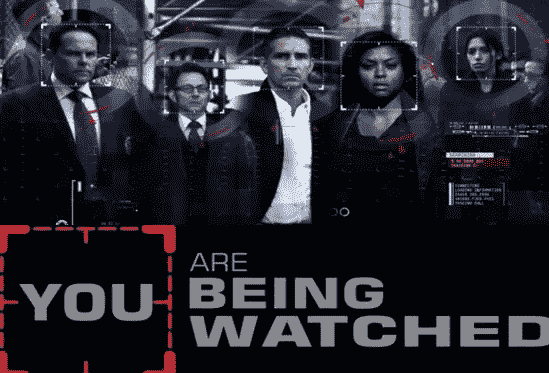
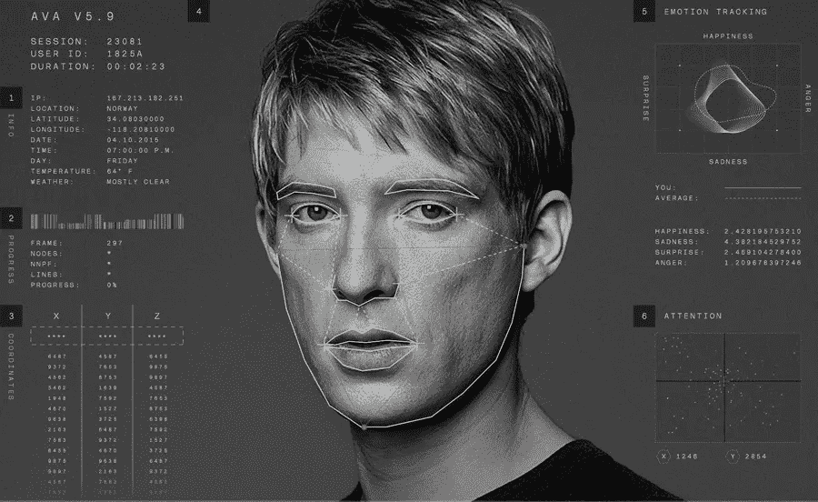

# 使用 OpenCV 的人脸识别:构建人脸识别系统的逐步指南

> 原文：<https://medium.com/hackernoon/face-recognition-using-opencv-a-step-by-step-guide-to-build-a-facial-recognition-system-8da97cd89847>

每当你听到 F *ace Recognition* 这个词，你会立刻想到视频中的监控，并且永远不会忘记著名的开篇旁白“**你正被监视着。政府有一个秘密系统，一台每时每刻都在监视你的机器。我知道，因为它是我在电视节目[的第一季](https://en.wikipedia.org/wiki/Person_of_Interest_(TV_series))中制作的。每当我听到它的时候，我仍然会起鸡皮疙瘩。**



首先要做的事

**文学:**

在过去十年左右的时间里，人脸识别已经成为计算机视觉中的一个热门研究领域，也是图像分析和理解中最成功的应用之一。由于这个问题的性质，不仅计算机科学研究人员对此感兴趣，神经科学家和心理学家也感兴趣。人们普遍认为，计算机视觉研究的进展将为神经科学家和心理学家提供关于人类大脑如何工作的有用见解，反之亦然。

面部识别系统使用计算机算法来挑选出一个人面部的具体、独特的细节。这些细节，如双眼之间的距离或下巴的形状，然后被转换成数学表示，并与人脸识别数据库中收集的其他人脸数据进行比较。关于特定面部的数据通常被称为面部模板，它与照片不同，因为它的设计仅包括用于区分面部的特定细节。



Source: [https://thefwa.com/cases/ava-sessions-t64](https://thefwa.com/cases/ava-sessions-t64)

在简单地向你解释了什么是人脸识别以及它是如何工作的之后，是时候明确我对这篇文章的意图了。在这篇文章中，我将用非常简单易懂的 python 代码向您介绍如何构建一个可以在您选择的任何人的视频上运行的人脸识别系统。

所以，不再拖延，让我们深入研究一下，我向你保证，到本文结束时，你将能够非常顺利地通过视频进行自己的人脸识别。

# 装置

# 要求

*   Python 3.3+或 Python 2.7
*   macOS 或 Linux (Windows 不被官方支持，但可能工作)
*   OpenCV

# 安装选项:

## 在 Mac 或 Linux 上安装

首先，确保已经用 Python 绑定安装了 dlib:

*   [如何在 macOS 或 Ubuntu 上从源码安装 dlib](https://gist.github.com/ageitgey/629d75c1baac34dfa5ca2a1928a7aeaf)

然后，使用`pip3`(或者 Python 2 的`pip2`)从 pypi 安装这个模块:

```
pip3 install face_recognition
```

如果你在安装上有问题，你也可以尝试一个[预配置的虚拟机](/@ageitgey/try-deep-learning-in-python-now-with-a-fully-pre-configured-vm-1d97d4c3e9b)。

在安装完所有的依赖项之后，是时候动手了，这意味着要编写代码来实现你的人脸识别系统。

```
# module and library required to build a Face Recognition System
import face_recognition
import cv2# objective: this code will help you in running face recognition on a video file and saving the results to a new video file.# Open the input movie file
# "**VideoCapture**" is a class for video capturing from video files, image sequences or camerasinput_video = cv2.VideoCapture("input.mp4")#"**CAP_PROP_FRAME_COUNT**": it helps in finding number of frames in the video file.length = int(input_video.get(cv2.CAP_PROP_FRAME_COUNT))# Create an output movie file (make sure resolution/frame rate matches input video!)
#  So we capture a video, process it frame-by-frame and we want to save that video, it only possible by using "**VideoWriter**" object
# [**FourCC**](http://en.wikipedia.org/wiki/FourCC) is a 4-byte code used to specify the video codec. The list of available codes can be found in [fourcc.org](http://www.fourcc.org/codecs.php). It is platform dependent.fourcc = cv2.VideoWriter_fourcc('M','P','E','G')# 25.07-  number of frames per second (fps)
#(1280,720)- frame sizeoutput_video = cv2.VideoWriter('output.avi', fourcc, 25.07, (1280, 720))# Load some sample pictures and learn how to recognize them.
female_image = face_recognition.load_image_file("warina.jpg")
female_face_encoding = face_recognition.face_encodings(female_image)[0]#  "**face_recognition.face_encodings**": it's a face_recognition package which returns a list of 128-dimensional face encodingsmale_image = face_recognition.load_image_file("aayush.jpeg")
male_face_encoding = face_recognition.face_encodings(male_image)[0] known_faces = [
    female_face_encoding,
    male_face_encoding
]
```

我用的图片是:


Bollywood Actress and Actor : Warina Hussain and Aayush sharma

```
# Initialize some variables
face_locations = []
face_encodings = []
face_names = []
frame_number = 0while True:
    # Grab a single frame of video
    ret, frame = input_video.read()
    frame_number += 1# Quit when the input video file ends
    if not ret:
        break# Convert the image from BGR color (which OpenCV uses) to RGB color (which face_recognition uses)
    rgb_frame = frame[:, :, ::-1]# Find all the faces and face encodings in the current frame of video
    face_locations = face_recognition.face_locations(rgb_frame)
    face_encodings = face_recognition.face_encodings(rgb_frame, face_locations)face_names = []
    for face_encoding in face_encodings:
        # See if the face is a match for the known face(s)
        match = face_recognition.compare_faces(known_faces, face_encoding, tolerance=0.50) name = None
        if match[0]:
            name = "Warina"
        elif match[1]:
            name = "Aayush"face_names.append(name)# Label the results
    for (top, right, bottom, left), name in zip(face_locations, face_names):
        if not name:
            continue# Draw a box around the face
        cv2.rectangle(frame, (left, top), (right, bottom), (0, 0, 255), 2)# Draw a label with a name below the face
        cv2.rectangle(frame, (left, bottom - 25), (right, bottom), (0, 0, 255), cv2.FILLED)
        font = cv2.FONT_HERSHEY_DUPLEX
        cv2.putText(frame, name, (left + 6, bottom - 6), font, 0.5, (255, 255, 255), 1)# Write the resulting image to the output video file
    print("Writing frame {} / {}".format(frame_number, length))
    output_video.write(frame)# All done!
input_video.release()
cv2.destroyAllWindows()
```

就是这样，如果你完全按照这里展示的方式去做，那么你也会达到我所达到的成就。

我建立的人脸识别系统的演示可以在下面看到。

info:do see it in full-screen

特别说明:如果没有[亚当·盖特基](https://medium.com/u/ba4c55e4aa3d?source=post_page-----8da97cd89847--------------------------------)通过他著名的人脸识别 github 库给出的指导，这篇文章是不可能完成的[点击这里](https://github.com/ageitgey/face_recognition)。

参考资料:

1.  GitHub 回购可以在这里找到。
2.  为了了解更多关于面部识别的信息，请点击[此处](https://electronics.howstuffworks.com/gadgets/high-tech-gadgets/facial-recognition.htm)。
3.  为了了解更多关于库 dlib 的信息，点击[这里](https://github.com/davisking/dlib)。
4.  为了了解更多关于 OpenCV 的信息，点击[这里](https://docs.opencv.org/3.1.0/index.html)。

**感谢您的关注**

你用你的时间阅读我的作品对我来说意味着一切。我完全是这个意思。

如果你喜欢这个故事，那就和**一起疯狂鼓掌吧(**👏 **)** 按钮！这将有助于其他人找到我的工作。

此外，如果你愿意，可以在 Medium、LinkedIn 或 Twitter 上关注我！我很乐意。

[](/@naveenmanwani) [## 纳文·曼瓦尼培养基

### 阅读纳文·曼瓦尼在媒介上的作品。一个机器学习工程师，一个深度学习爱好者|谷歌印度…

medium.com](/@naveenmanwani) [](https://www.linkedin.com/in/naveen-manwani-65491678/) [## Naveen Manwani -机器学习工程师- AIMonk Labs Private Ltd | LinkedIn

### 查看纳文·曼瓦尼在全球最大的职业社区 LinkedIn 上的个人资料。Naveen 有一份工作列在他们的…

www.linkedin.com](https://www.linkedin.com/in/naveen-manwani-65491678/) [](https://twitter.com/NaveenManwani17) [## 纳文·曼瓦尼(@纳文·曼瓦尼 17) |推特

### 纳文·曼瓦尼的最新推文(@纳文·曼瓦尼 17)。机器学习工程师@ AIMONK Labs Pvt ltd，深…

twitter.com](https://twitter.com/NaveenManwani17)