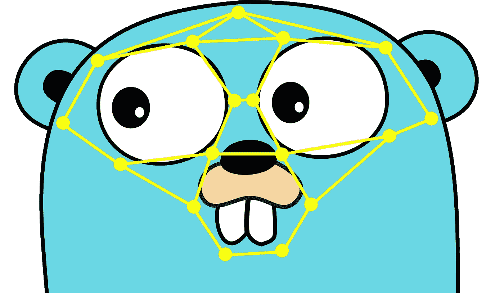

# 使用 Go 进行人脸识别

> 原文：<https://medium.com/hackernoon/face-recognition-with-go-676a555b8a7e>



*本文讲述了围棋语言* [*人脸识别库*](https://github.com/Kagami/go-face) *的创建和使用过程。*

神经网络今天非常流行，人们用它们来完成各种任务。一个特别有用的设备是人脸识别。

最近，我意识到我的爱好项目，一个带有 Go 后端的论坛软件，将受益于人脸识别功能。如果有一种方法可以识别上传照片上的人(流行歌手)，让新人不需要问照片上的人是谁，那就太好了。这听起来是个好主意，所以我决定试一试。

有一点需要注意的是，我试图保持该软件的系统要求非常低，这样更多的人可以使用便宜的服务器安装它。这就是为什么实现不能用 CUDA 或者要求 GPU 的原因。虽然今天你可以很容易地租到这样的服务器，但价格会更高，从而降低了潜在的听觉。如果它能只在 CPU 上工作就更好了，最好没有外来的依赖。

## 选择语言

如果你问数据科学家或参与神经网络实践经验的人，几乎所有人都会推荐你使用 Python 语言来解决机器学习任务。这绝对是一个明智的选择，因为社区、可用的库数量、语言的简单性等等。不用说，你可以很容易地找到非常流行的 Python 人脸识别库，里面有很好的例子和文档。

然而，我还是决定选择 Go，原因有几个:

*   我的论坛是用 Go 写的，我真的很喜欢单二进制后端的便利，所以如果能将人脸识别例程与后端的其余部分简单集成就好了，而不是实现一些 IPC 和需要 Python 依赖。
*   Go 通常比 Python 更快，更重要的是消耗更少的内存。当然，任何高性能 Python 库的关键部分都是用 C/C++编写的，但无论如何，你都会有 Python VM 的开销。如果我们在谈论主机，你总是可以租一台内存更大的机器，但是我更喜欢更快的语言，除非它会严重影响开发时间。我不会使用 C 或 C++作为我编写 web 应用程序的主要语言，但是 Go 很好，几乎和 Python 一样简单。
*   我还没有为 Go 找到人脸识别库，所以写一个既有趣又对社区有帮助。

## 选择框架

如前所述，神经网络以及实现它们的框架非常普遍。只有在计算机视觉中你才有 Caffe，Torch，TensorFlow 等。

但是有一个特别酷的图书馆 [dlib](http://dlib.net) 几乎立刻吸引了我的注意。首先，它是用 C++编写的，所以你可以很容易地用 cgo 创建 Go 绑定。第二，它[声称](http://blog.dlib.net/2017/02/high-quality-face-recognition-with-deep.html)在野生基准测试中对标记的人脸有 99.38%的准确率，这听起来相当令人印象深刻。第三，流行的人脸识别库，如 [face_recognition](https://github.com/ageitgey/face_recognition) 和 [openface](https://github.com/cmusatyalab/openface) 在底层使用 dlib，因此它看起来是一个非常好的选择。

## 安装依赖项

选择了框架，但是我们如何在开发和生产机器上使用它呢？C++依赖项可能很难安装，你不能使用方便的“go get”或“pip install”命令。要么它在你的操作系统的库中提供，要么期待一个乏味的编译过程。如果你是库的所有者，并要求你的用户自己编译软件，这个问题会更加严重。例如[在这里](https://gist.github.com/ageitgey/629d75c1baac34dfa5ca2a1928a7aeaf)你可以看到有多少真实的人遇到了 dlib 编译的问题。

幸运的是，有更好的选择:如果用户的目标系统是已知的，我们可以构建 dlib 的二进制包，这将大大简化安装。既然我们在谈论服务器软件，Ubuntu 几乎是这里的标准，所以你真的想首先支持它。

Ubuntu 的标准回购中有 dlib，但版本太旧了:人脸识别支持仅在 dlib 19.3 中添加。所以我们需要构建自己的包。我为 Ubuntu 16.04 和 18.04 创建了 [PPA](https://launchpad.net/~kagamih/+archive/ubuntu/dlib) (自定义库)，这是两个最新的 LTS 版本。安装非常简单:

```
sudo add-apt-repository ppa:kagamih/dlib
sudo apt-get update
sudo apt-get install libdlib-dev
```

它将安装最新的 dlib(目前为 19.15)和英特尔的数学内核库，这似乎是标准 BLAS 和 LAPACK 接口的最快实现，至少对于英特尔处理器来说是如此。

对于 Debian sid 和 Ubuntu 18.10(尚未发布)来说是个好消息，相当新鲜的 dlib 在标准回购中可用。你只需要:

```
sudo apt-get install libdlib-dev libopenblas-dev
```

这将使用 OpenBLAS 实现，而不是 MKL，它也非常快。或者你可以[启用非自由软件包](https://serverfault.com/a/240921)并安装`libmkl-dev`来代替。

我们还需要 libjpeg 来加载 jpeg 图像，在 Ubuntu 上安装`libjpeg-turbo8-dev`包，在 Debian 上安装`libjpeg62-turbo-dev`(不要问我为什么名字如此不同)。

现在我没有其他系统的说明，所以[让我知道](https://github.com/Kagami/go-face/issues)如果你有获得 dlib 的问题。至少为最受欢迎的食谱提供简短而精确的食谱是很有意义的。

我正在考虑也为 dlib 提供 Docker 镜像(已经存在的很少)，许多具有复杂依赖关系的项目倾向于使用这种分发方法。但在我看来，原生包总是能提供更好的用户体验。您不需要在控制台中编写长命令或处理沙盒环境，一切都像以前一样工作。

## 编写库

现代人脸识别库的工作原理是为照片上的每张脸返回一组数字(向量嵌入或描述符)，这样你就可以将它们相互比较，并通过比较这些数字找到所传图像上的人的名字(通常通过向量之间的[欧几里德距离](https://en.wikipedia.org/wiki/Euclidean_distance)，距离最小的两张脸应该属于同一个人)。这个概念已经在其他文章中描述过了，所以我在这里不再赘述。

从传过来的图像中创建面部描述符的基本代码很简单，它非常符合[官方示例](https://github.com/davisking/dlib/blob/v19.15/examples/dnn_face_recognition_ex.cpp)。查看 [facerec.cc](https://github.com/Kagami/go-face/blob/ex/facerec.cc) 。对应的头文件 [facerec.h](https://github.com/Kagami/go-face/blob/ex/facerec.h) 定义了 Go 和 dlib 之间交互的 5 个函数和几个结构。

在这里，我和 dlib 讨论了一件不幸的事情。虽然它支持所有流行的图像格式，但它只能从文件中加载它们。这可能是非常令人困惑限制，因为您通常只将图像数据保存在内存中，而将它写入临时文件则是一团乱麻。所以我不得不使用 libjpeg 编写自己的[图像加载器](https://github.com/Kagami/go-face/blob/ex/jpeg_mem_loader.cc)。因为大多数照片都是以这种格式存储的，所以现在应该足够了，以后可能会添加其他格式。

在 [face.go](https://github.com/Kagami/go-face/blob/ex/face.go) 中放置了一个连接 C++和 Go 的微小粘合层。它提供了`Face`结构，用于保存图像上人脸的坐标及其描述符。和实际识别等所有操作的`Recognizer`接口。

一旦我们有了描述符，我们该做什么？如前所述，在最简单的情况下，您可以比较未知描述符和所有已知描述符之间的欧几里德距离。它并不完美，就目前的技术水平而言，有时你会得到错误的答案。如果我们想改善一点结果，我们会为每个人使用许多图像，并检查是否至少有几个非常接近提供的脸。

正是 [classify.cc](https://github.com/Kagami/go-face/blob/ex/classify.cc) 所做的。首先，它计算距离，然后对它们进行排序，然后计算同一个人在前 10 个最小距离中的命中次数。

对于这项任务，有更好的算法存在，例如[支持向量机](https://en.wikipedia.org/wiki/Support_vector_machine)经常被使用。dlib 甚至提供了方便的 [API](http://dlib.net/ml.html#svm_multiclass_linear_trainer) 来训练这类模型。我很少看到有人提到大型数据集上的 SVM 可能会很慢，所以我需要先在大型数据集上测试它，我还没有这样做。

## 使用

生成的库可在[github.com/Kagami/go-face](https://github.com/Kagami/go-face)获得，照常将其包含在您的 Go 项目中:

```
import "github.com/Kagami/go-face"
```

所有结构和方法的概述见 [GoDoc 文档](https://godoc.org/github.com/Kagami/go-face)。它们并不多，典型的工作流程是:

1.  初始化识别器
2.  识别所有已知图像，收集描述符
3.  将具有相应类别的已知描述符传递给识别器
4.  获取未知图像的描述符
5.  分类它的类别

以下是说明上述所有步骤的工作示例:

```
package mainimport (
  "fmt"
  "log"
  "path/filepath" "github.com/Kagami/go-face"
)// Path to directory with models and test images. Here it's
// assumed it points to the
// <[https://github.com/Kagami/go-face-testdata](https://github.com/Kagami/go-face-testdata)> clone.
const dataDir = "testdata"// This example shows the basic usage of the package: create an
// recognizer, recognize faces, classify them using few known
// ones.
func main() {
  // Init the recognizer.
  rec, err := face.NewRecognizer(dataDir)
  if err != nil {
    log.Fatalf("Can't init face recognizer: %v", err)
  }
  // Free the resources when you're finished.
  defer rec.Close() // Test image with 10 faces.
  testImagePristin := filepath.Join(dataDir, "pristin.jpg")
  // Recognize faces on that image.
  faces, err := rec.RecognizeFile(testImagePristin)
  if err != nil {
    log.Fatalf("Can't recognize: %v", err)
  }
  if len(faces) != 10 {
    log.Fatalf("Wrong number of faces")
  } // Fill known samples. In the real world you would use a lot of
  // images for each person to get better classification results
  // but in our example we just get them from one big image.
  var samples []face.Descriptor
  var cats []int32
  for i, f := range faces {
    samples = append(samples, f.Descriptor)
    // Each face is unique on that image so goes to its own
    // category.
    cats = append(cats, int32(i))
  }
  // Name the categories, i.e. people on the image.
  labels := []string{
    "Sungyeon", "Yehana", "Roa", "Eunwoo", "Xiyeon",
    "Kyulkyung", "Nayoung", "Rena", "Kyla", "Yuha",
  }
  // Pass samples to the recognizer.
  rec.SetSamples(samples, cats) // Now let's try to classify some not yet known image.
  testImageNayoung := filepath.Join(dataDir, "nayoung.jpg")
  nayoungFace, err := rec.RecognizeSingleFile(testImageNayoung)
  if err != nil {
    log.Fatalf("Can't recognize: %v", err)
  }
  if nayoungFace == nil {
    log.Fatalf("Not a single face on the image")
  }
  catID := rec.Classify(nayoungFace.Descriptor)
  if catID < 0 {
    log.Fatalf("Can't classify")
  }
  // Finally print the classified label. It should be "Nayoung".
  fmt.Println(labels[catID])
}
```

要运行它，请执行以下操作:

```
mkdir -p ~/go && cd ~/go  # Or cd to your $GOPATH
mkdir -p src/go-face-example && cd src/go-face-example
git clone [https://github.com/Kagami/go-face-testdata](https://github.com/Kagami/go-face-testdata) testdata
edit main.go  # Paste example code
go get .
../../bin/go-face-example
```

编译 go-face 需要一些时间(在我的 i7 上大约 1 分钟)，因为 dlib 的代码中大量使用了 C++模板。幸运的是，Go 缓存了构建输出，所以将来的构建会快得多。

示例应打印“Nayoung ”,表明未知图像被正确识别。

## 模型

go-face 需要`shape_predictor_5_face_landmarks.dat`和
`dlib_face_recognition_resnet_model_v1.dat`型号进行工作。您可以从 [dlib-models](https://github.com/davisking/dlib-models) 资源库下载:

```
mkdir models && cd models
wget [https://github.com/davisking/dlib-models/raw/master/shape_predictor_5_face_landmarks.dat.bz2](https://github.com/davisking/dlib-models/raw/master/shape_predictor_5_face_landmarks.dat.bz2)
bunzip2 shape_predictor_5_face_landmarks.dat.bz2
wget [https://github.com/davisking/dlib-models/raw/master/dlib_face_recognition_resnet_model_v1.dat.bz2](https://github.com/davisking/dlib-models/raw/master/dlib_face_recognition_resnet_model_v1.dat.bz2)
bunzip2 dlib_face_recognition_resnet_model_v1.dat.bz2
```

它们也可以在 [go-face-testdata](https://github.com/Kagami/go-face-testdata) 存储库中获得，您已经克隆了该存储库来运行示例。

## 未来的想法

我对结果相当满意，库有简单的 API，体面的识别质量，可以很容易地嵌入到 Go 应用程序中。但是当然总有改进的空间:

*   为了简单和快速，go-face 目前在创建描述符时不[抖动面部图像](https://github.com/davisking/dlib/blob/v19.15/examples/dnn_face_recognition_ex.cpp#L182-L190)，但是绝对值得为此添加选项，因为它可能会提高识别质量。
*   dlib 支持很多图像格式(JPEG、PNG、GIF、BMP、DNG ),但是 go-face 目前只支持 JPEG，如果能支持更多格式就更好了。
*   正如 dlib 的作者 Davis 所建议的那样，多类 SVM 可能会给出比搜索最小距离更好的分类结果，所以这需要额外的测试。
*   在 go-face 中，我尽量不复制值，除非真的有必要，但还没有实际测试过大量(10，000+)人脸样本的性能，可能会有一些瓶颈。
*   从人脸提取特征向量是一个强大的概念，因为你不需要收集自己的训练数据，这是一项非常雄心勃勃的任务(Davis [提到](http://blog.dlib.net/2017/02/high-quality-face-recognition-with-deep.html)用于创建 dlib 的 ResNet 模型的 300 万人脸数据集)，但这可能是不可避免的，以获得更高质量的识别，因此值得提供工具来训练你自己的模型。