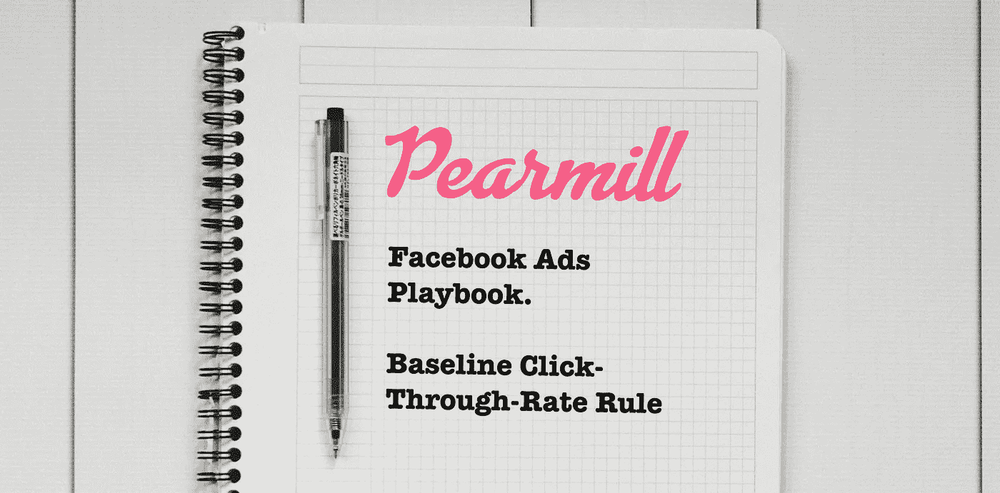

# 脸书广告基线点击率规则

> 原文：<https://medium.com/hackernoon/facebook-ads-baseline-click-through-rate-rule-60a93701dfde>

Pearmill’s Facebook Ads Playbook: Baseline Click-Through-Rate Rule

## 皮尔米尔[脸书广告手册](/@ngardideh/were-open-up-our-playbook-to-run-facebook-ads-9ea89fe8b212)的一部分

在我们进入 CTR 规则之前，有必要谈谈我们在脸书广告中使用的镜头。

有很多不同的方式来使用脸书广告促进增长，但是，我们特别将其视为一个[绩效营销渠道](https://www.forbes.com/sites/forbesnycouncil/2018/08/23/is-performance-marketing-the-next-big-step-in-digital/#180893b8767b) —这意味着我们开展的所有活动，以及我们剧本系列中的所有规则都旨在让用户执行特定的操作(例如，购买、安装应用程序等)。)

这是一个重要的区别，因为每个指标都与其对帮助我们达到最终绩效目标的积极或消极影响相关联。

记住这一点，让我们来看看脸书广告中第一个基于比率的指标:点击率。

# 基线 CTR 规则

我们关注点击率指标的主要原因是为了帮助我们判断广告单元和创意与我们的活动和/或广告系列所针对的受众的相关性。

我们的规则基于我们开展的活动，预算从每天 5 美元到每天 50，000 多美元不等，因此该规则适用范围很广。

然而，一个很好的经验法则是，你花在广告上的钱越少，你的点击率就应该越高。

## 规则

如果一个链接广告的链接点击率低于 0.75%，你应该考虑换一个新的广告单元。如果点击率高于 0.8%，接近 1%或更高，你应该降低改变创意或广告单元的优先级。

## 警告

只有当一个广告单元或创意通过了[足够印象法则](https://hackernoon.com/facebook-ads-enough-impressions-rule-8d043e5ea063)后，你才能判断它的点击率。

如果点击后转换率高于你在活动中看到的平均水平，并且成本是可持续的，你应该对较低的点击率感到满意。例如，一个广告单元可能不是最吸引人的，但它提供了大量的背景。在这种情况下，当有人最终点击它时，他们比来自其他广告的人更有可能转化。

如果你使用的是自我选择的创造力，在这个范围的低端也是可以的(这一点我们将在以后详细讨论)。

# 迷你词汇表

**—广告被浏览的次数(计算同一个人的多次浏览)**

****到达人数** —显示广告的人数**

****活动** —广告组合的分组，通常表示目标和/或创意方向**

****广告组** —广告活动中广告单元的分组，通常表示广告活动和/或创意方向中的子目标**

****广告单元** —作为单个广告单元显示的图像、文本和/或视频组合**

****创意** —广告单元的独立部分(即图像、文案和/或视频)**

****点击率** —点击数超过独特印象数**