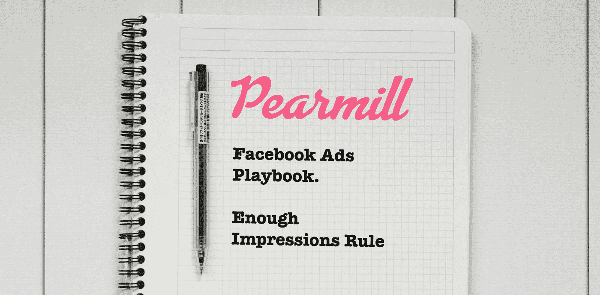

# 脸书广告足够印象法则

> 原文：<https://medium.com/hackernoon/facebook-ads-enough-impressions-rule-8d043e5ea063>

Facebook Ads Playbook: Enough Impressions Rule

## 皮尔米尔[脸书广告手册](/@ngardideh/were-open-up-our-playbook-to-run-facebook-ads-9ea89fe8b212)的一部分

我们看到的广告商最常犯的错误是没有一个清晰的框架来知道何时对广告单元做出决定。我们的规则系列的一个重要部分将集中于给你如何以及何时做决定的明确指导方针。

我们希望足够清楚，这样你就不必问自己是否等得太久了。还是你等的时间不够长？这个广告单元一天下来做的好吗？两天？10 次点击？100 转换？2k 印象？

注意:在这篇文章的末尾有一个小词汇表，列出了我们使用的所有大写单词和短语，以此来保持我们的规则系列的一致性。

# 足够的印象法则

这条规则的主要目的是确保我们不会过早或过晚地对广告单元、广告系列或活动进行更改。

我们在这里的裁决是基于多年的经验，尽管它在统计上一点也不显著。正如所有围绕脸书的广告，你应该半信半疑。

然而，我们可以自信地说，下面的数字是你应该满意的最低*印象量。*

## 规则

在对任何广告单元、创意、广告组合或活动做出决定之前，你至少应该收到 2000 次以上的印象。

这假设你只有一个创意，一个广告单元，一个广告系列。

## 警告

这个数字不会在有多个广告单元或广告集的活动中线性扩展，所以我们建议在广告单元的基础上查看数据，以保持简单。

重申一下——这是最小值，不是最大值。如果您的点击率或转换率普遍较低，我们建议您设置更高的最低点击率，以确保更大的信心。

如果脸书正处于学习模式，并且你通常有很高的转化率，那么我们建议等待几天，让活动退出学习模式，然后再做决定。尽管如此，我们并不严格遵循这一点。不幸的是，和所有的广告一样，它都是与上下文相关的。

# 迷你词汇表

**印象** —广告被浏览的次数(统计同一个人的多次浏览)

**到达尺寸**——显示广告的人数

**活动** —广告组合的分组，通常表示目标和/或创意方向

**广告组** —广告活动中广告单元的分组，通常表示广告活动和/或创意方向中的子目标

**广告单元** —显示为单个广告单元的图像、文本和/或视频组合

**创意** —广告单元的独立部分(即图像、文案和/或视频)

**点击率** —点击次数与独特印象数之比