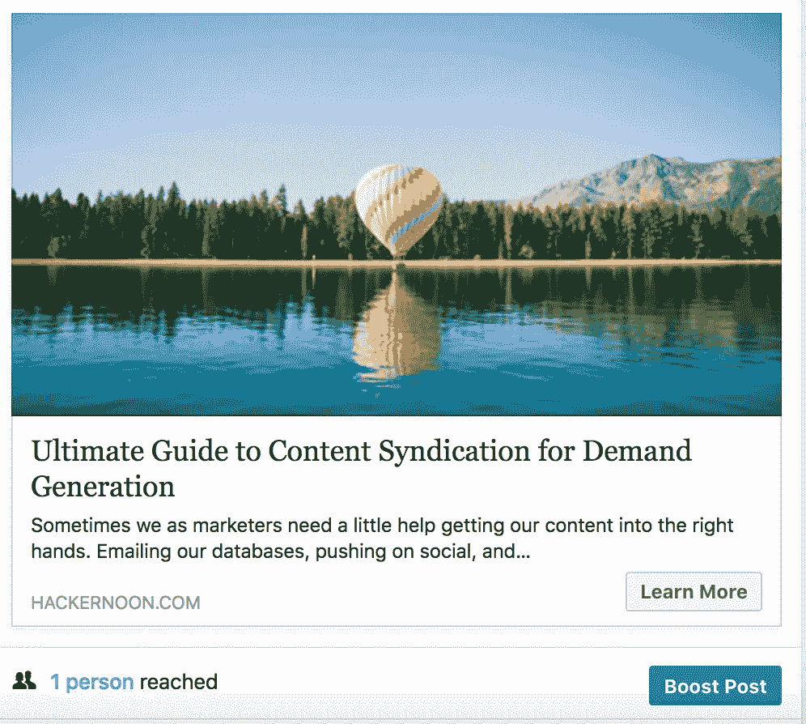

# 面向 B2B 需求挖掘的脸书广告

> 原文：<https://medium.com/hackernoon/facebook-ads-for-b2b-demand-generation-126e5a6318f>

Photo by [Branden Harvey](https://unsplash.com/photos/wyN0QFDiXw0?utm_source=unsplash&utm_medium=referral&utm_content=creditCopyText) on [Unsplash](https://unsplash.com/search/photos/facebook?utm_source=unsplash&utm_medium=referral&utm_content=creditCopyText)

在多次谈论 B2B Saas 的脸书广告以及它们是如何被严重挖掘的需求挖掘渠道后，我想写下一些我如何处理脸书广告的东西。

## 为跟踪和报告创建合适的基础架构

> *这意味着“后端”服务。*

首先，在整个网站和登陆页面中插入脸书的基本像素代码。如果你使用 WordPress/Hubspot——使用 WordPress 插件(插入页眉和页脚),或者如果你是 PHP 友好的，编辑主题文件。对于 Hubspot，进入内容设置并将其粘贴到标题部分。这适用于你所有的 Hubspot 页面。

确保它与 Chrome 扩展一起工作，或者检查业务管理器中的像素数据，以检查它是否接收事件。

转换事件是 Facebooks 算法学习优化广告投放的方式。让我们深入研究一下:

脸书提供两种活动类型:

默认事件

在基本像素代码之上，您可以添加额外的代码来触发特定的转换事件。在企业 Saas 中，使用受限制内容的感谢页面上的 lead 事件来触发 lead 事件。

你也可以通过每一个事件传递货币和价值，让脸书知道每一个转换对你的业务有什么价值。

在 Hubspot 这样的营销自动化工具中，为你的登陆页面设置两个模板。一个是带有表单的登录页面。另一个是感谢页面。为了在缩放登录页面时简化流程，请在感谢页面的模板中包含销售线索事件代码。这样做将确保你总是有你的线索事件在正确的页面，因为任何人都创建了 100 个新的。

**自定义转换**

自定义转换就像谷歌分析中的目标——它们可能会变得难以处理&每个账户仅限 20 次。如果可能的话，坚持使用脸书事件代码，除非您不能插入代码或者您想单独跟踪高值转换。

自定义转换寻找目的地的网址。例如，感谢页面有一个 www.example.com/ebook/xyz/thank-you,[的 url](http://www.example.com/ebook/xyz/thank-you,)，当 URL 与上面的 URL 完全匹配时，可以创建自定义转换来记录转换。

通过创建 URL 结构，避免为每个独特的报价进行数百次的自定义转换。这样做对 SEO 是有益的，并且简化了自定义转换:

如果 URL 包含= thank-you '记录自定义转换-在表单上转换。

以下是广告报告中脸书事件(销售线索)和演示请求(定制转换)的示例。

想了解更多关于脸书 Pixel & Events 的信息，这里有一篇我最近看到的好文章。

URL 参数

如果使用一致，UTM 参数是追溯用户旅程的有力工具。保持 UTM 参数定义的整洁。在 Marketo/Hubspot 等营销自动化联系人属性中创建 3 个标准 UTM 字段。

Hubspot 确实有一个广告插件，但我们将稍后再讨论。

1.utm_source:这是渠道(按需生成的语言),如 facebook/twitter 等。

2.utm_medium:更广泛的存储桶，如 cpc(每次点击成本)或 paidsocial

3.utm_campaign:理想情况下，应该与您的 MA/CRM 中的营销活动相关联，以便您可以查看营销活动视图，并查看其下的渠道细分。

> 可选:
> 
> 4.utm_content
> 
> 营销自动化托管的登录页面或您的网站上的捕获表单应将这些字段添加为隐藏字段，以便您可以将其归因于活动。

提醒一句，UTM 会被覆盖，所以如果有人第一次通过 Twitter 广告活动，填写内容表格，然后通过脸书广告请求演示，你的 UTM 将显示脸书价值，因为它是最近的转换。

## 创建广告:增加帖子、脸书广告和 URL 参数

你可以用两种方法制作脸书广告:

*   提升页面帖子:这些页面帖子对任何访问你的脸书页面的人都是可见的。您可以通过 ads dashboard 将单个帖子提升到已保存的受众，并跟踪转化率和其他指标。您不能创建活动、广告组、广告结构或尝试不同的广告格式或位置，如 Canvas、Lead 或右手边(RHS)和 boosted 帖子。

一篇文章的例子——点击此处查看全文。

*   脸书广告:所谓的暗帖只对你选择的受众可见。它不能通过您的脸书页面公开访问。借助广告，您可以创建活动和广告组结构、所有格式、变体测试和位置控制。

**URL 参数**是您可以输入 UTM 或其他 URL 变量来跟踪广告级别数据的地方。这些可以与来源/媒体/活动相同。

URL 参数—脸书广告

只有在广告中的链接被直接点击时，参数才会被附加。有机链接或社交分享点击不会附加参数。这用于直接从广告中的链接来确定谷歌分析等工具中的网络转化率和活动指标。

## 直接转换报告

大多数 Salesforce/Marketing Automation 实例报告销售线索来源和子销售线索来源值。通过构建的一些工作流，您可以轻松地将 UTM 映射到销售线索/子销售线索来源值。下面是一个例子。

您可以根据自己的业务流程和分类法修改这个例子。

在 Salesforce 或 Marketo/Hubspot 中，您可以基于潜在客户来源创建仪表板，并通过子潜在客户来源向下钻取来查找您表现最佳的活动。或者将所有数据导出到 excel 中，并使用数据透视表绘制它们。

注意:如果您仅报告 UTM 参数或潜在客户来源/子潜在客户来源，则您仅报告最后一次接触，并遗漏了实际上可能推动大量转化的辅助渠道。

## 报告和归属

## 脸书广告仪表板:

报告脸书广告业绩最简单的方法是使用广告仪表板。您可以使用默认栏，也可以创建带有自定义转换的视图，并在活动|广告集|广告级别上报告。

脸书最近还引入了创意报告，让你看到你的广告创意是如何表现的。要查找创意报告，请访问广告客户概述:

> 脸书广告归因窗口
> 
> Rob Sobers 有一篇关于这些是如何工作的精彩文章。
> 
> TLDR:脸书归因显示了在某个时间窗口内发生的行为(引导/转化)。因此，如果有人点击了你的广告，并在 5 天后通过直接流量下载了一本电子书，脸书将因这一线索而受到表扬，因为它发生在 7 天(或 28 天)的窗口内。
> 
> 您可以在您的帐户和报告中比较和定制这些“窗口”。

## Salesforce 活动报告:

您可以更进一步，在 Salesforce 活动中登记联系人，以获得更全面的报告视图，包括活动影响报告。要在 Salesforce 活动中登记联系人，您可以监听使用附加到您的活动的关联 UTM 参数创建的联系人。

在 Marketo 中，您可以创建一个程序，在创建联系人时触发该程序，并检查 UTM 参数。如果参数存在，请将联系人登记到关联的 Salesforce 活动中。

在 Hubspot 中—创建一个智能列表，该列表将脸书广告 UTM 的联系人添加到 Salesforce 广告中。

在 Salesforce 中，您可以运行营销活动影响力报告，以查看脸书广告如何与其他营销活动一起增加收入。

## 擅长

将您与脸书 UTMs 的所有联系或原始来源作为付费社交(Hubspot)导出到 Excel 文件中。您可以创建数据透视表来报告不同的字段，例如:

*   关联交易—跟踪有多少交易具有由脸书活动创建的联系人
*   结束日期—将脸书广告支出与该时间段内结束的交易数量相关联
*   生命周期阶段—对达到 SQL/SAL 阶段的联系人进行质量检查。
*   收入完成—直接归因于脸书广告创造的联系
*   收入受影响—来自脸书广告的渠道收入

## 线索来源报告:

当通过脸书广告(使用 UTM 跟踪或 Hubspots 广告 Addon)创建销售线索/联系人时，创建一个工作流，将销售线索来源和子销售线索来源值分配为脸书广告或 Paidsocial(取决于您的命名惯例)。您可以使用这些值在 Salesforce 中基于潜在客户来源跟踪创建基本报告。

## 归属:

## 谷歌分析中的脸书广告归属。

大多数公司都以首次接触模型来衡量一切，这种模型总是最信任他们在转换之前的最后一次互动。最后一次接触模型具有误导性，因为它将 100%的功劳归于最后一个渠道，而忽略了之前发生的所有其他事情。

您可以从 Google Analytics 获取一些营销路径数据，而无需 Bizible、Brightfunnel 或 FullCircle 等完整的归因解决方案，只需在 g a 中使用 UTM 和渠道分组即可。

*   树立你的目标和价值观。谷歌分析可以跟踪表单提交。在 Google Analytics 中将你所有的重要表单设置为目标。使用感谢 URL 设置自定义目的地目标。

*   因为 Hubspot 和其他 MA 系统会在表单提交后将其他信息附加到实际的感谢页面 URL 上，所以页面 URL 实际上很可能是这样的—[https://example.com/ebook/thank-you?submission-glid-1129h372-email=example@example.com](https://example.com/ebook/thank-you?submission-glid-1129h372-email=example@example.com)。使用以 or [开头的正则表达式条件](/@spanishgringo/why-every-marketer-should-know-how-to-use-regular-expressions-regex-639baa0cc420)。不要使用等于精确 URL，因为在提交时，URL 会附加其他参数。如果你的目标增长太快，开始使用正则表达式。始终单击验证此目标，根据过去 30 天的数据查看您的设置是否正确。
*   已经将 [UTM 参数清理到位。](https://www.annielytics.com/guides/definitive-guide-campaign-tagging-google-analytics/)指向你网站的每个链接都应该有来源|媒介|活动价值。如果你想深入杂草，跟随谷歌的频道分组。否则，您的一些源/媒体可能会被捆绑在“其他”下。
*   一旦你在收购报告中看到目标转换。导航到转换->多渠道渠道->辅助转换路径。

*   显示的数据显示了您的主要转换途径:

Google Analytics 提供了一个非常方便的漏斗和归因模型，对填表非常有帮助。它不会下降到 SAL/Opp/客户级别的数据，因为这些数据存在于您的 CRM 中。

在 Google Analytics 中，您可以根据默认的频道分组查看转换数据，并了解哪些频道帮助了转换，哪些频道实际上推动了转换。

例如:

上图显示的是在 30 天的时间内导致转化的一系列互动。我可以看到前 4 名是直截了当的——这些来源推动了转化。如果你看 5-它说，他们首先通过脸书广告，然后直接和转换。

如果谷歌分析中没有这种形式转换的数据，自然倾向于将直接转换归因于“耸肩——他们肯定在某个地方听说过我们或者点击了一个未标记的链接”。有了谷歌分析中的归因报告，我们可以开始更好地了解是什么推动了转化，这样我们就可以更专注于有效的渠道。

你可以尝试不同的模型，比如 Last AdWords Click——线性、时间衰减，看看它如何影响你的归因漏斗。

## **Bizible vs 谷歌分析:**

> 快速注释— Bizible 或任何其他基于 Salesforce 的归因工具将提供完整的画面—从第一次接触到引导创造到机会再到收入。Bizible 还可以与广告网络集成，以同步 Salesforce 中机会的成本数据和收入，从而让您更全面地了解漏斗以及哪些渠道正在推动渠道发展。然而，Bizible 是一个企业工具，需要实施和 Salesforce 活动才能发挥作用。
> 
> Google Analytics 的目标本质上不能决定什么时候赢得一个客户，或者这个客户值多少钱。在没有归属和纯粹看第一次接触的情况下——谷歌分析是可行的，而且是免费的。
> 
> 在这两种情况下——您都绝对需要干净和定义好的 UTM 来理解数据。

## 活动策略:

大体上，企业 Saas 活动分为以下几个主要类别:

*   意识
*   转换
*   漏斗速度
*   保留/追加销售

**观众:**

*   自定义受众—基于您的 CRM 数据。
*   看起来相似的观众——脸书基于种子观众创造的。
*   兴趣受众—基于对脸书的兴趣类别，包括行业/公司/职位或出版物/竞争对手
*   网络营销受众——访问你网站的人。
*   互动受众——最近在 Instagram 或脸书等脸书网站上与你的内容互动的人

## **攻略:**

**博客再营销:**锁定过去 60 天内访问过你博客的访客。如果你的访问量很大，根据他们访问的博客类型对他们进行分类，并对那些在过去 30 天内访问过相关帖子的人进行评论。

**网络营销:**这是过去 30 天内访问过你的网站的人的一个小范围。

*再营销提示:*不要追溯太久(> 90 天)，除非你有一个小的再营销名单。

感兴趣的受众:在你的客户群中找到 4-6 个出版物和兴趣小组或软件，并使用 Facebooks 受众来建立一个基于此的受众群。你也可以进入受众观察，看看哪些页面最受你的受众欢迎，然后从那里开始。如果你有足够大的竞争对手，他们也可能以利益集团的形式出现。例如，如果我在销售社交媒体软件，我可以瞄准那些对 Hootsuite 和 SME(行业酒吧)感兴趣的人

**自定义受众:**将您的客户名单&上传到脸书，以创建自定义受众。使用电子邮件、电话、城市、邮政编码、名字、姓氏——你向脸书提供的信息越多，你的匹配率就越高。我见过这个平均匹配率在 75%左右。不要把每个人都捆在一起。使用您的 MA/CRM 创建分段列表进行上传，这样您就可以分别针对它们——在下面的 Hubspot Adds Ad-On 部分中有更多相关信息。除非您正在进行客户营销或交叉销售/追加销售活动，否则请将客户排除在外，将其用作抑制列表。

**长相相似的观众:**使用自定义观众列表来播种长相相似的观众。从 1%的样子开始，在你销售的地区。种子列表中的数据点越多，效果越好。如果受众看起来太大，在创建活动时使用兴趣来缩小范围。

**战略**:通过实时聊天挖掘 MQL 的合格销售线索(漂移)&门控内容下载(白皮书/电子书/网络研讨会)

受众:通过在页面上停留的时间来重新营销主页:这些人不会马上离开，但会在你的网站上停留一段时间。伟大的重新营销与一些门控内容，以进一步证明他们的资格。

向产品/解决方案页面访问者进行再营销:访问您的解决方案/产品页面的访问者已经含蓄地表达了对您的产品的兴趣。

**从你的数据库中找出与现有 MQL 相似的作品:**上传一份你的 MQL 作品列表，让脸书将它们与脸书上与它们相似的其他作品进行匹配。从 1%的相似度开始，然后在地理位置的限制下扩大。

**订户的定制受众&非 MQL 的潜在客户:**如果你已经通过电子邮件获得了这些潜在客户，这是在更多地方获得他们的绝佳方式。提供一致的信息&。

**策略**:利用脸书领先广告产生更多试用注册&演示请求。

这需要仔细考虑您的销售线索管理流程。如果销售线索由 SDR/BDR 团队跟进——使用 Zapier 或 Facebooks 原生 CRM 同步工具将销售线索同步到您的 MA / CRM，并通过分配规则/销售线索评分/培育等方式发送。

如果您基于注册创建了一个用户帐户—在脸书创建联系人后，使用您的 MA/CRM API 创建一个用户帐户，并向他们发送一封电子邮件，其中包含从您的 MA 生成的登录链接。

一个示例过程

**观众**:

浏览演示/定价页面或在页面上花了一定时间但没有完成表单的访问者。

当前 SAL 和 MQLS 的客户受众—这些联系人已经表达了兴趣，但没有做出回应。

**基于客户的营销——针对脸书的特定公司、行业或职位。**

注意:这是基于自我报告的数据(你在脸书个人资料中填写的工作和公司)，所以请谨慎使用。

**观众**:深入调查人口统计-工作&雇主，搜索你想锁定的公司。如果脸书上至少有 20 个人，你可以把他们添加到你的观众中。同样，你也可以为职位头衔&行业做同样的受众。对于更微观的目标营销活动，您可以通过兴趣小组内的“必须匹配”兴趣目标来缩小范围

## **Hubspot Ads Ad-On:**

如果你有 Hubspot 营销堆栈，我建议你添加广告:

*   如果你已经在 Hubspot 中有了你的数据库，Hubspot 可以让你非常容易地将脸书的广告同步到 Hubspot 中。使您不必在两个系统之间导出和导入 CSV 文件，并使您的自定义受众保持最新。这有助于在开展电子邮件活动的同时创建培养流或参与流。Y
*   您可以根据脸书广告点击属性创建列表和报告。这对于报告受脸书广告影响的收入或渠道非常有帮助。例如，有人可能点击了一个广告，但他们可能不会立即转化，而是通过 Direct 和 convert 进入。如果您没有脸书广告，您将会丢失脸书广告参与度的联系人属性数据，并对直接流量进行积分。这样你就可以把脸书广告和直接访问/转化联系起来。

## **一些小技巧和窍门:**

如果你有免费增值或试用模式——在试用期间使用脸书广告增加产品参与度，同时产生更多试用。您可以在应用程序中设置活动，并根据已完成或未完成的活动创建自定义受众，模仿您的产品上线漏斗或根据电子邮件地址创建自定义受众。

从 25 美元/天的预算/广告开始，运行一周来确定结果。较低的预算将限制您的数据，并增加学习周期。

监控你的广告频率— [Klipfolio](https://www.slideshare.net/Vidyard/what-klipfolios-marketing-team-learned-from-spending-100k-on-facebook-ads) 了解到广告频率会导致更高的 CPA，因为用户会一遍又一遍地看到广告。

相关性分数很重要，但是如果你得到了 CPA 目标，你可以忽略相关性分数来简化你的脸书广告操作。

转换事件每周至少需要触发 50-100 次，脸书才能围绕它们进行优化。当您创建一个新的营销活动时，围绕一个事件进行优化，如浏览内容或登录页面浏览次数。一旦您获得足够的已查看内容事件数据，您就可以克隆和切换潜在或定制转化事件。当创建一个广告集脸书会给你一个选项来优化登陆页面浏览或点击开始。

如果你按月预算周期工作，不要每个月都创建新的活动。相反，管理预算，因为这些广告集已经有大量的数据可以挖掘，并且更容易比较更长时间内的表现。

永远不要设置和忘记脸书广告。就像 Adwords 一样，你需要每天监控和优化它们。

使用自动规则，但始终设置通知，这样您就可以知道在哪里更改了什么。

我偶尔也会写这样的随笔。订阅我的通迅透支，偶尔会收到你的收件箱。

在 twitter 上把你的想法和反馈发给我 [@kamilrextin](https://twitter.com/kamilrextin) | [定个时间](http://calendly.com/kamilrextin) |给我发个[电子邮件](mailto:me@kamilrextin.com) | [请求提案。](http://fourtytwo.agency/)

*最初发表于*[*Kamil Rextin*](http://kamilrextin.com/facebook-ads-for-b2b-demand-generation/)*。*