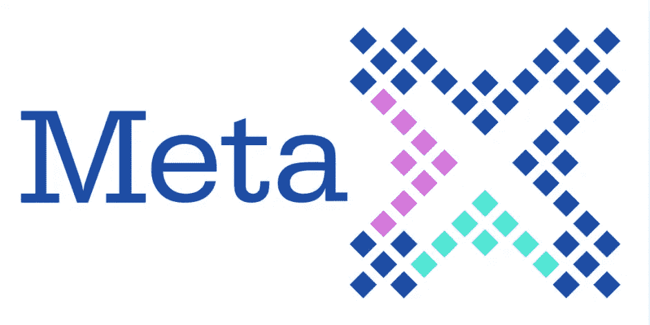

# 脸书和加密:2018 年你需要知道什么

> 原文：<https://medium.com/hackernoon/facebook-and-crypto-what-you-need-to-know-for-2018-6bcd71794853>

你不会因为落后而成为世界上最强大的公司之一。

# 脸书已经注意到了区块链

QQ 和微信背后的中国互联网巨头腾讯已经与英特尔合作，并详细说明了他们在区块链的计划。他们正在采取措施，现在我们可以预期脸书会反击。

1 月 4 日，脸书首席执行官兼创始人马克·扎克伯格发表了一篇[脸书邮报](https://www.facebook.com/zuck/posts/10104380170714571)，概述了他 2018 年的个人目标。首要任务是解决人们滥用脸书的问题。他提出加密和加密货币作为解药，他说

> “我有兴趣深入研究这些技术的积极和消极方面，以及如何在我们的服务中最好地使用它们。”

如果脸书决定介入，他们会怎么做？看看脸书的过往记录可以提供一些启示。

# 脸书喜欢获取新技术

从历史上看，脸书在战略性收购方面取得了成功。花费[数百亿收购 50 多家创业公司](https://en.wikipedia.org/wiki/List_of_mergers_and_acquisitions_by_Facebook)并启动脸书平台的关键领域。这种行为可以追溯到 2009 年，当时他们购买 Friendfeed 来改善他们的聚合 feed。这种情况一直持续到今天，他们最近收购了 Ozlo，以构建他们的人工智能产品。

他们也有购买火箭船产品的成功历史，与脸书一起运行，并扩展到新的市场。一些没有人会忘记的例子是 Instagram、Whatsapp 和 Oculus Rift。

这里的百万美元问题变成，当他们在 crypto 中首次亮相时，他们将收购哪些公司？

我们分析了市场上已经存在的 50 种硬币，创建了一个候选名单。以下是脸书可以考虑的 3 个领域和收购。

# 1.布鲁姆的金融身份

从一开始，脸书就是你的在线身份。从你分享的内容到散布在互联网上的“登录脸书”按钮，脸书就是互联网上的你。

事实上，脸书作为认证身份的优势是约会应用 Tinder 成功的原因之一，该应用要求用户通过脸书登录。通过与脸书的联系，它表明这些是“真实的人”，而不是模仿或钓鱼的人。

有了区块链，脸书可以将你的在线身份范围扩大到金融领域。这将为脸书及其提供的服务带来新的机遇。

这方面的一个关键收购可能是[布鲁姆](https://hellobloom.io/)。

Bloom 由斯坦福大学的工程师创建，并于 2017 年 12 月推出了他们的 ICO。Bloom 做身份认证(证明你是你)，报告和跟踪债务义务，并发布信用评分。他们还通过使用 Bloom 信用卡帮助个人提高信用评分。

这可能会使脸书进入金融领域。他们可以开始发行信用卡，进行身份认证和信用评分。

结果是:更多的用户财务数据(广告商会喜欢的)和新的赚钱方式。此外，它将进一步巩固脸书作为我们生活中不可动摇的一部分。

将来，当你有了脸书信用卡、银行账户和汽车租赁时——你可能会发现自己处于这样一种境地:你*“一旦你偿还了这笔抵押贷款，就会停止使用脸书”*。

# 2.通过 Steem 向用户支付内容费用

脸书可以为用户的内容付费。随着 YouTube、Twitch 和 Medium 等平台向顶级创作者提供金钱激励的成功，令人惊讶的是，脸书创作者仍然只在脸书生态系统之外赚钱。

其他企业可能会陷入困境，但脸书已经证明，如果有必要，他们会颠覆自己的商业模式。最近的一个例子是他们转向视频。事实证明，越来越少的人滚动提要，而不是观看更长的视频内容，意味着更低的利润率和更少的每用户收入。

扎克伯格[在 2017 年初解释](http://variety.com/2017/digital/news/facebook-future-business-margins-video-1202509145/)说，

> “利润率结构将会不同，(视频)几乎肯定会成为比我们目前利润率更低的收入来源”。

这可能是相同的——对他们的核心业务模式的重大改变，这是保持这种变化的关键。这方面的一个战略收购是 Steem (SMT) 。

Steem 是一个奖励出版商并允许他们将其内容货币化的平台。使用 Steem 构建的第一个主要应用程序是 Steemit，这是一个类似于 Medium 的博客风格的社交网络。在 Steemit 上，用户可以收到钱，而不是 upvotes，到目前为止，已经向出版商支付了超过 2200 万美元。

对脸书来说，在斯蒂尔姆建造房屋将是一项重大举措。

马上，他们可以添加一个“超级喜欢”按钮。现在当你看到惊人的内容时，不只是喜欢，你可以让他们知道你在乎。或者捐款。就像如果你的朋友结婚或有了孩子——你可以给他们寄几美元，只是为了表示祝贺！

第二步更大。现在用户的账户上有了“钱”。脸书已经有了用户可以买卖产品的市场。有了代币，现在用户可以很容易地在脸书购买商品。只要轻轻一点，脸书就能从亚马逊那里抢走市场份额，成为网上购物最方便的地方。

这是一个挑战。由于 Steem 是一个开源社区，脸书不能只收购传统意义上的。但是，他们可以“采用”社区，确保投入社区的大量资源由脸书控制。

这些举措将把脸书置于区块链的前沿，改善他们的用户生成内容，并赋予他们对其他内容驱动型网站的影响力。

# 3.利用 MetaX 提高信任度和透明度

脸书在 2017 年经历了一段非常艰难的信任时期。扎克伯格甚至说 T2 是他 2018 年的重点。

脸书正试图通过以下方式修复信任:

1.  对真实性的要求越来越高，以及
2.  让广告更加透明

酷的是，区块链经常因解决这些[一模一样的问题](https://sabinext.com/blockchain-in-logistics-enabling-transparency-and-trust)而出名。

一家公司可能会在这方面提供帮助，那就是 MetaX (ADT) 。

MetaX 是一家利用区块链来增加透明度和揭露广告行业欺诈的公司。他们位于洛杉矶，与 Consensys 和 DMA(数据和营销协会)有合作关系。他们的产品通过将域名列入白名单来工作，但是这个过程可以反过来用于脸书的应用。

通过使用区块链来众包哪些广告商是好的，哪些是坏的，这可能会使坏人更难逃脱。就像打地鼠游戏——除了有 100 个人拿着棍子等着并准备好。

此外，MetaX 可以解决围绕印象跟踪的问题。

这意味着更少的假新闻，更少的骗局，更少的机器人，你可以更好地了解脸书向广告商发送了什么信息。似乎是一场胜利，胜利，胜利。

## 结论

区块链是一项令人兴奋的技术，有可能解决以前非常困难的问题。脸书很可能会以某种身份使用它，但很难准确预测如何使用。

他们可以利用区块链来改善现有平台的信任度和内容生成等领域，或者他们可以利用它来拓展新的市场，巩固他们对每个人生活的牢牢控制。

**如果你知道任何可能与脸书有有趣合作的区块链公司，请在下面的评论区留言！**

## 喜欢这篇文章吗？我们现在有电报信号组了！

我们发布**简单有效的交易信号**。所以你可以花更少的时间做技术分析，花更多的时间**得到结果。**
👉[https://t.me/coinandcrypto](http://telegram.coinandcrypto.com/medium)

