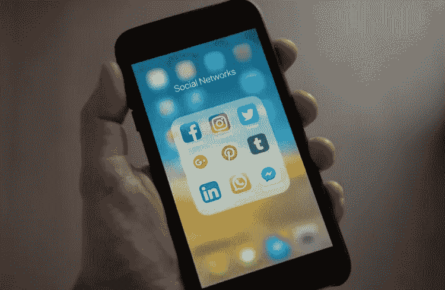

# 脸书和数据:远不止新的 Myspace

> 原文：<https://medium.com/hackernoon/facebook-and-data-much-more-than-the-new-myspace-460ba1ba3c2f>

啊，社交网络的不变性。那些记性好的人会回想起 1997 年推出的六度社交网络(如在凯文·贝肯)的社交乐趣。它允许用户列出朋友和联系人，并邀请他们加入这个新的时髦的网络聊天区。在巅峰时期，SixDegrees 拥有超过 300 万用户。

这与 2010 年拥有近 2400 万用户的《老友记》或 2002 年推出的 Friendster 相比不算什么，Friendster 在 2011 年进行了以游戏为重点的改造，同年拥有 1.15 亿用户。

社交网络的历史之父当然是 MySpace。在 2008 年的巅峰时期，MySpace 的月用户数也达到了 1.15 亿。它以其页面的疯狂色彩令人难忘，允许任何用户创建各种引发偏头痛的主题。对于那些只想，嗯，表达自己的人来说，这是极大的授权和乐趣。这是它的巨大优势，讽刺的是，这也是它失败的主要原因。因为在 2008 年 4 月，更年轻、更简单、适应性更强的脸书与 MySpace 并驾齐驱，同样宣称拥有 1.15 亿用户。从那时起，它再也没有回头，当然，我们都知道我们现在在哪里——到 2017 年底，将有 22 亿用户，这相当于全球 35 亿互联网用户的 63%。

但是我们现在所处的位置已经不是几周前的位置了。关于脸书的惊人崛起，关于它如何简化和统一了当时刚刚兴起的社交网络体验的整个行为，人们已经说了很多；它如何在最初挣扎，然后掌握了移动体验，以及它的聪明和及时的收购，进一步支持了它的发展。在其生命早期，它收购了其他较小的社交网络平台，如 FriendFeed。2010 年，它收购了 Friendster 专利，2012 年，它收购了 Instagram。2014 年，它收购了 WhatsApp 和 Oculus，并从那时起收购了一系列人工智能和音频/视觉机器学习应用。这是明智的、有远见的采购，着眼于未来。然而，它与用户和广告商保持密切联系的关键在于它对数据的使用——数十亿用户的偏好、评论和喜欢，这些数据被输入到算法中，这些算法以一种可以将你包裹在温暖、模糊的社交网络中的方式进行分类、反馈和传递。

这也许是为什么最近几天的揭露如此具有破坏性。毫不奇怪，剑桥分析公司(Cambridge Analytica)等公司寻求利用用户数据，并扭曲数据以达到自己的目的。在美国和其他国家最近离奇的选举结果之后，当这些数据被其他国家盗用时，麻烦的事情可能会发生。在社交媒体新闻、民意调查和影响者的世界里，数据为王。然而，脸书的沉默，以及它充其量只是睁一只眼闭一只眼的确凿证据，现在让用户和投资者睁一只眼闭一只眼。过去两天损失了 500 亿美元——几乎是公司总价值的 10%。扎克伯格呼吁对英国议会滥用数据做出解释。一大堆媒体现在都在解释如何锁定隐私设置，甚至 WhatsApp 的创始人布莱恩·阿克顿(Brian Acton)也通过 Twitter 宣布他将#删除 facebook。使用一个社交媒体网络宣布他将删除另一个网络，这是一个讽刺；你可以想象 Twitter 会搓着手。然而，脸书是一家如此庞大的公司，这一消息正在影响其他科技股——它们都在下跌，因为投资者似乎被以下因素吓坏了:(a)谷歌和苹果等公司掌握的大量数据被滥用，以及(b)对整个行业更严格监管的预期。GDPR 将于 5 月 25 日在欧洲正式启动，它将对任何处理超过 250 个数据主体的公司进行更严格的数据控制，并将权力交还给用户。未来几个月，人们可以期待更多针对社会数据的监管，特别是在美国。今天，扎克伯格承认脸书及其用户之间发生了“背信弃义”，并宣布计划严格审计和限制插入他平台的应用程序的数据使用。他没有解释为什么他等了将近整整一周才对公众做出回应，也没有解释是否有其他邪恶的公司以类似的方式滥用数据。

这里的教训是，用户数据实际上是大数据。一些人生活中的琐碎事实——那些他们以前很乐意与大型免费社交网络分享的事实——不再那么琐碎了。人们开始质疑他们是否真的想分享它们。出于这个原因，脸书应该非常害怕。

 [## 脸书的价值自毁计:500 亿美元，而且还在增加

### 本周，脸书公司的市值缩水了约 500 亿美元。今天才星期二。螺旋上升的丑闻…

qz.com](https://qz.com/1233816/facebook-has-lost-50-billion-in-market-value-over-the-past-two-days/)  [## 扎克伯格被传唤到下议院质询

### 一个议会委员会要求脸书老板马克·扎克伯格就使用…

www.bbc.com](http://www.bbc.com/news/uk-43474760)  [## 被脸书以 190 亿美元收购的 WhatsApp 的联合创始人、亿万富翁刚刚发推特说…

### WhatsApp 联合创始人布莱恩·阿克顿(Brian Acton)周二加入了#删除 facebook 的潮流。这个标签是在声称…

www.businessinsider.com](http://www.businessinsider.com/whatsapp-cofounder-brian-acton-tweet-time-to-delete-facebook-2018-3?IR=T)  [## GDPR 比以往任何时候都重要:剑桥分析-脸书危机

### 如果你还没有领会这次惨败的程度，那可能是因为美国时间上周五深夜…

www.csoonline.com](https://www.csoonline.com/article/3263438/privacy/gdpr-is-more-important-than-ever-the-cambridge-analytica-facebook-meltdown.html)  [## 马克·扎克伯格对剑桥分析公司丑闻直言不讳

### 在对政治数据公司剑桥分析公司涉嫌滥用 5000 万脸书保持沉默几天后…

www.wired.com](https://www.wired.com/story/mark-zuckerberg-statement-cambridge-analytica/)