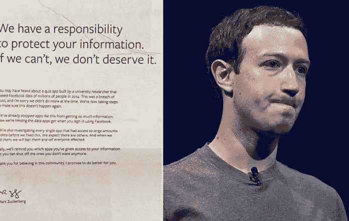
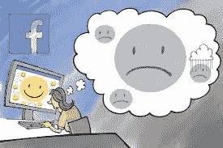

# 脸书不在乎保护它的用户

> 原文：<https://medium.com/hackernoon/facebook-doesnt-care-about-its-users-2d2811d606e4>

脸书一再表明，它不在乎保护用户的隐私或数据。这里有证据

脸书首席执行官马克·扎克伯格似乎正处于全面的损害控制模式，因为最近有消息披露，剑桥分析公司在 5000 万用户不知情的情况下获取了他们的信息。在 3 月 21 日的[脸书邮报](https://www.facebook.com/zuck/posts/10104712037900071?pnref=story)上，马克·扎克伯格为该事件公开道歉，声明*“我们有责任保护你的数据，如果我们做不到，我们就不配为你服务……我一直在努力了解到底发生了什么，以及如何确保这种事情不再发生”。*他还在接受 CNN 采访时表示，*“这显然是一个错误”*。马克·扎克伯格还在《纽约时报》、《华尔街日报》、《华盛顿邮报》和其他 6 家英国报纸上刊登了整版广告公开道歉。

尽管做出了道歉，尽管马克·扎克伯格声称脸书将从现在开始采取措施保护用户的数据，但我仍然认为马克·扎克伯格和脸书的其他高管团队都不真正关心保护用户的数据或隐私。原因如下。

马克对脸书数据隐私的冷漠始于 2004 年，脸书早期。据[商业内幕](http://www.businessinsider.com/well-these-new-zuckerberg-ims-wont-help-facebooks-privacy-problems-2010-5)报道，当时 19 岁的马克·扎克伯格在宿舍创办脸书(当时的“脸书”)后不久，与一位朋友有如下交流:

扎克:是的，所以如果你需要哈佛任何人的信息

扎克:尽管问。

扎克:我有超过 4000 封电子邮件、照片、地址和社交网站

*【编辑好友姓名】:什么？你是怎么做到的？*

扎克:人们刚刚提交了它。

扎克:我不知道为什么。

扎克:他们“信任我”

Zuck:愚蠢的 f-ks。

这表明从一开始就完全无视脸书用户的数据隐私。对于这一证据，可以提出几个反驳点，以及我反对这些反驳点的理由:

**对位一**:扎克伯格大学期间的这段交流并不代表马克扎克伯格目前对脸书用户的看法。马克·扎克伯格的观点自此成熟。

**反对对位法的论点一**:大学期间确实有人说傻话，做傻事。然而，我认为，一般来说，人们的信念是在大学期间形成的，并保持一致，除非有重大原因改变信念。由于认知失调，人们通常不喜欢与他们的世界观相反的信息。在这次交流中，马克·扎克伯格在引号中声明“相信我”，暗示脸书的用户天真地相信他的数据。马克·扎克伯格明确侮辱脸书用户的下一句话清楚地证明了他对使用脸书的人的漠视。大学里会有人做傻事吗？绝对的。但在大学派对上喝多了是一回事。心甘情愿地把你网站的几千名用户(他们对隐私有所期待)的信息免费给你的朋友，然后侮辱你的用户，暗示他们信任你是幼稚的，这是另一回事。

**反驳二**:这种交流是为了让扎克伯格难堪而编造的(也就是“假新闻”的说法)

**反对 counterpoint two** 的观点:马克·扎克伯格和脸书的发言人都没有公开否认这一交易的发生

此外，在《脸书效应》一书中，脸书早期的工程老板和扎克伯格的密友查理·契弗(Charlie Cheever)在《T9》之后说了《T8》:《我觉得马克并不那么相信隐私，或者至少相信隐私是一个敲门砖。也许他是对的，也许他是错的。”

2010 年，电子隐私信息中心(EPIC)和其他 14 个消费者团体[指控脸书](https://arstechnica.com/tech-policy/2010/05/privacy-groups-complain-to-ftc-over-facebook-privacy-tweaks/?comments=1)操纵“*用户的隐私设置和它自己的隐私政策，以便它可以出于有限的目的获取用户提供的个人信息，并将其广泛用于商业目的……该公司一再这样做，用户变得越来越愤怒和沮丧”。这份声明是对脸书决定公开越来越多的用户个人信息的回应。脸书方面的回应是，他们是在合法范围内运作的。*

**反驳一**:脸书的行为是合法的

**反对第一种观点的理由:**为不道德的行为辩护，从本质上说“这很好，因为这是合法的”，这并不完全令人放心。

2014 年，据透露，脸书[对其部分用户进行了一项研究](https://www.washingtonpost.com/news/the-intersect/wp/2014/07/01/9-answers-about-facebooks-creepy-emotional-manipulation-experiment/?utm_term=.834f818cdf11),以了解是否有可能根据用户在新闻订阅中看到的内容来从情绪上操纵他们的情绪。事实证明，是的，通过人们在脸书的表现来操纵他们的情绪是可能的。未经他人同意就参与操纵他人情绪的实验是非常不道德的，也是对信任的严重侵犯。

**对位一:**脸书的数据科学家只对其用户的 0.04%(共 698003 人)做了这个实验，时间只有一周。没什么大不了的。

**反对对位一的理由** : 这项研究本身并无恶意，但重要的是脸书能力的暗示。想象一下，如果脸书想在用户不注意的情况下操纵他们的大量情绪。他们有能力这样做。不管怎样，即使只能操纵 0.04%也是一件大事，取决于他们操纵这些用户做什么。据显示，2016 年选举由大约 77，000 张选票决定。这还不到脸书用户的 0.01%。这意味着脸书(以及使用脸书的广告商)有能力通过操纵极其微小的一部分用户来左右选举。

**对位二:**用户在脸书的服务条款协议中对此表示同意。

**反对第二种观点的理由:**众所周知的事实[几乎没有用户真正阅读那些令人难以置信的长服务条款，考虑到它们是用冗长而难以理解的法律术语写成的，即使是经验丰富的律师也难以剖析。我认为可以肯定地说，脸书的用户在同意它的 ToS 时，没有想到会同意被心理操纵。](https://techcrunch.com/2015/08/21/agree-to-disagree/)

Facebook purposely manipulated the moods of its users

2017 年 5 月，脸书澳洲办公室的一份[文件泄露](https://arstechnica.com/information-technology/2017/05/facebook-helped-advertisers-target-teens-who-feel-worthless/)披露了脸书高管如何推广广告活动，这些广告活动将允许广告商利用其用户的情绪状态，有能力瞄准 14 岁的人。这份文件最初指出，广告商可以找到*“年轻人需要增强信心的时刻。”*如果这看起来无伤大雅，那就想想这份文件还声称，脸书可以估计青少年何时会感到“毫无价值”、“没有安全感”、“失败”、“焦虑”、“愚蠢”、“无用”、“愚蠢”、“不知所措”、“压力大”和“失败”允许广告商根据青少年感知的情绪状态来锁定他们，这有点难以置信的奥威尔式。假设一个坏人掌握了这些信息，那么可能发生的潜在负面后果将是无穷无尽的。毫无疑问，脸书允许广告商根据用户的政治偏好来锁定目标用户，而这些信息对剑桥分析公司来说至关重要。

2018 年 3 月 21 日，一名推特用户 [(@dylanmckaynz](https://twitter.com/dylanmckaynz) )在一条[推特](https://twitter.com/dylanmckaynz/status/976368845635035138)中报告称，脸书从他的安卓手机中记录了大约两年的电话通话元数据，包括姓名、电话号码以及每次拨打和接听电话的时长。

**Counterpoint One:** Android 用户允许脸书这样做，因为它明确请求联系人的许可。

**反对 counterpoint one 的理由:**这是一个非常好的例子，说明用户不知道他们同意什么，因为他们认为公司最关心他们的利益。我不认为大多数人期望他们手机的元数据会给脸书。

脸书还在其网站上列举了一个成功的故事，称佛罗里达州州长 Rick Scott 利用脸书的广告来增加拉美裔的支持。脸书声称广告是“斯科特再次当选的决定性因素”。 [列举的另一个来自脸书的成功故事](https://web.archive.org/web/20180326034412/https://www.facebook.com/business/success/snp)展示了脸书如何在苏格兰民族党在 2015 年英国大选中取得压倒性胜利的过程中发挥了关键作用。

# **结论**

有人认为，脸书不可能像马克·扎克伯格(Mark Zuckerberg)和[最初建议的那样对 2016 年大选产生影响，或者剑桥分析公司(Cambridge Analytica)的数据泄露是脸书不可能知道的某种模糊利用，这种想法是荒谬的。剑桥分析公司使用的数据收集技巧对数字营销人员来说是](https://www.nytimes.com/2017/09/22/technology/mark-zuckerberg-facebook-russian-ads.html)[公开的秘密](https://www.theverge.com/2018/3/25/17161726/facebook-cambridge-analytica-data-online-marketers)，他们知道这种事情已经很多年了。考虑到这些数据收集手段广为人知，脸书应该已经知道了。那么，为什么脸书对这些功绩不做任何事情呢？

第一种解释是，脸书非常无能。第二个解释是，脸书并不真的关心保护数据和用户隐私，因为它的整个商业模式是向广告商出售用户数据。考虑到脸书团队的智慧和经验，我认为第二种解释更有可能。

感谢您的阅读。请点击并按住👏下面，还是留下评论吧。

这篇文章没有给我报酬。如果你愿意支持我，你可以捐赠 ETH 到这个地址:0x 0 BCB 78d 67 d8d 929 DC 03542 a5 aedef 257 f 378 e 513