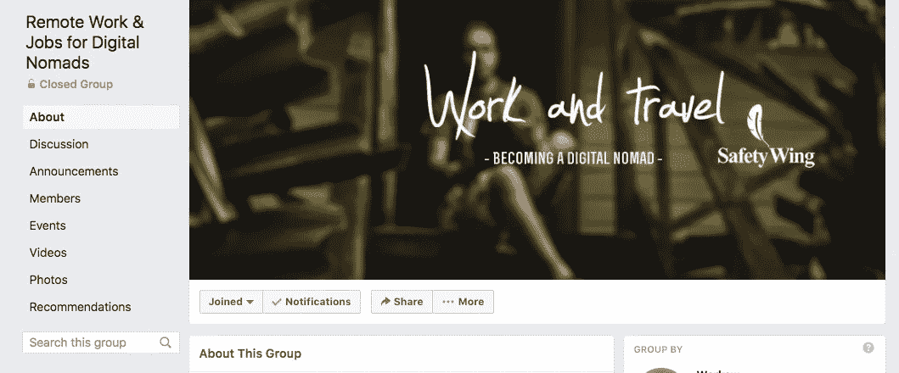
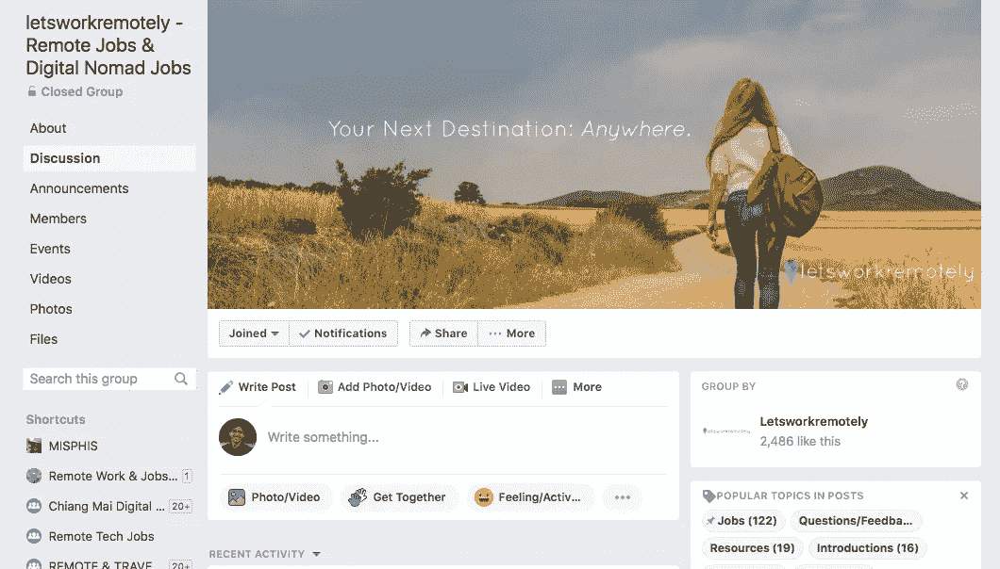
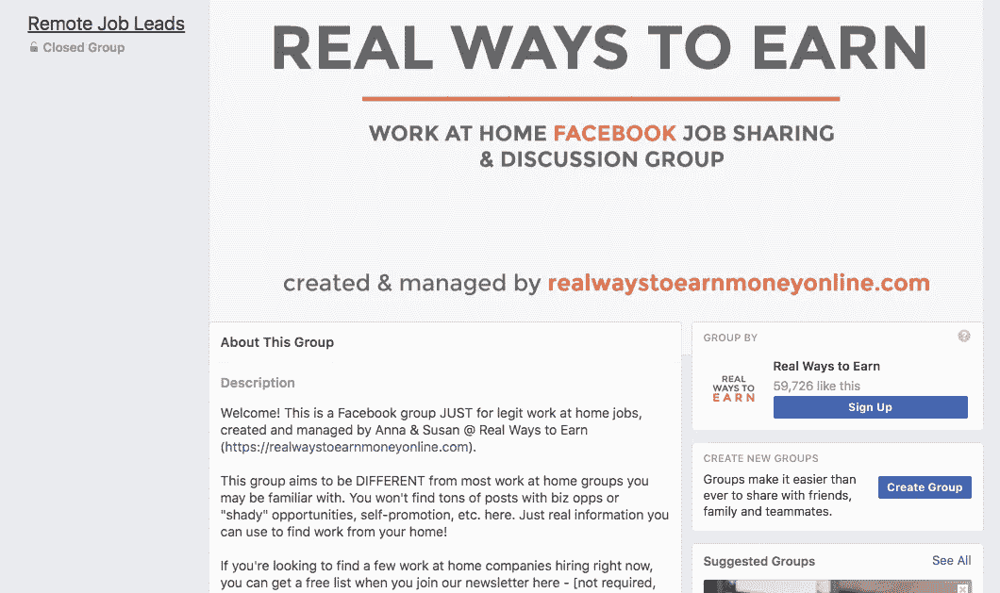
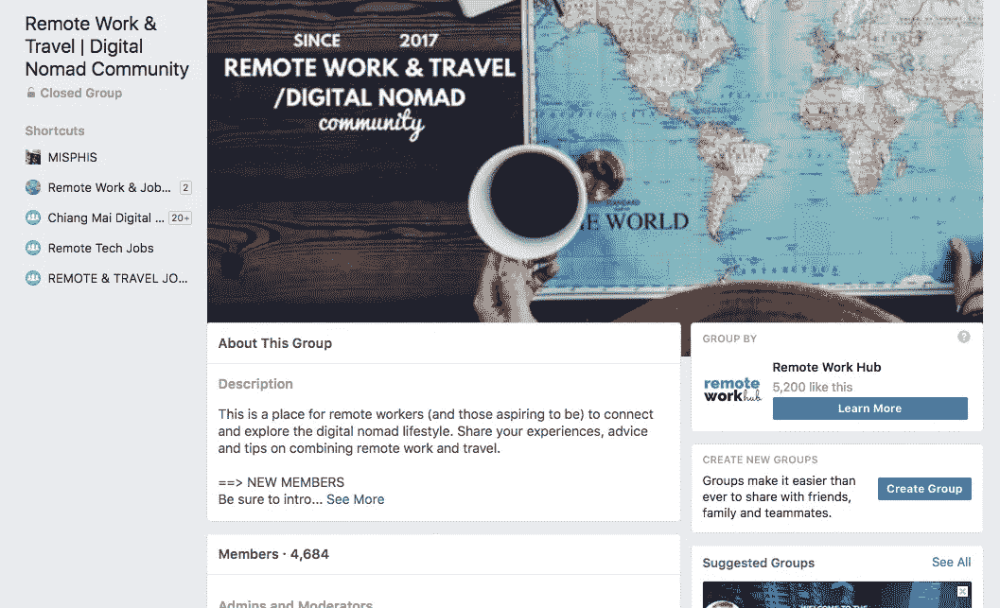

# 你可以免费加入 10 个脸书小组，找到下一份远程工作或项目

> 原文：<https://medium.com/hackernoon/facebook-groups-remote-job-freelance-project-ee52c542946d>

你知道吗，脸书有专门的组织帮助你找到远程工作？

像 UpWork、自由职业者、Fiverr.com 这样的中间人市场并不是唯一可以找到远程自由职业者工作的地方。

客户在脸书小组、Twitter、Reddit、社区网站、论坛等地方发布他们的远程工作和项目。

在本帖中，我将与你分享 10 个脸书小组，你今天可以免费加入，开始寻找你的下一个远程自由职业项目。

# 1)数字游牧者的远程工作和工作

这是脸书最受欢迎的远程工作组之一，拥有 50，000 多名成员，并且还在不断增加。

这个组更关注一般的远程工作，较少关注远程开发工作。但是，有这么多的成员，他们得到了很多远程工作岗位。

这里的帖子类型包括发布远程工作的客户，发布他们正在寻找工作的人，以及与远程工作相关的文章。

**链接:**[https://www.facebook.com/groups/remotework.digitalnomads/](https://www.facebook.com/groups/remotework.digitalnomads/)

# 2)远程技术工作

这个要小得多，主要面向寻找远程开发工作的开发人员。它大约有 2500 名成员。

**这个群体的帖子几乎 100%关注远程全职和自由职业开发岗位。**我在这个群上没有看到太多的文章和内容。

**链接**:[https://www.facebook.com/groups/remotestartupjobs/](https://www.facebook.com/groups/remotestartupjobs/)

# 3)远程和旅行工作

Remote & Travel Jobs 是另一个大型组织，拥有 36，000 名成员，专注于一般远程工作。

再说一次，你得到的帖子的多样性与小组成员的数量相关。据我所见，你会得到客户发布的工作，数字游民寻求建议，以及博客帖子的链接。

这里发布的所有内容都与远程工作有关，如果你正在寻找一个远程职位，这个小组将非常有用，因为他们有很多帖子。

**链接:**[https://www.facebook.com/groups/RemoteTravelJobs/](https://www.facebook.com/groups/RemoteTravelJobs/)

# 4)远程工作，随处工作——创新中心

远程工作，随处工作由创新中心拥有超过 22，000 名成员。

根据我在这个群体中的经验，你会看到一些机构和公司发布招聘员工或自由职业者的信息。你还会收到其他帖子，比如自由职业者发布的作品集，以及与工作相关的远程博客帖子。

**链接**:https://www.facebook.com/groups/inventivehub/

# 5)数字游牧工作:远程工作机会

Digital Nomad Jobs 有超过 26，000 名成员参与。

**我大多只在这个群组里看到远程工作机会。**

许多其他群组会发布各种各样的内容。如果你想避免看到与工作无关的内容，可以加入这个小组。

**链接:**[https://www.facebook.com/groups/remotejobsfordigitalnomads/](https://www.facebook.com/groups/remotejobsfordigitalnomads/)

# 6)远程工作—远程工作和数字移动工作

LetsWorkRemotely 大约有 19000 名会员。这也是一个专注于一般远程工作的团队。

在这个组里，你会得到各种各样的帖子。你会看到寻求建议的帖子，寻找雇员或自由职业者的客户，以及关于远程工作的博客帖子。

**链接:**https://www.facebook.com/groups/827012854123588/

# 7)远程工作机会

**该群组约有 5300 名成员，他们每天大约会收到 6 条新帖子。**

帖子的重点是那些能帮你找到工作的文章和找人的帖子。工作类型包括开发、商业、文案和社交媒体管理。

**链接**:[https://www.facebook.com/groups/realwaystoearn/](https://www.facebook.com/groups/realwaystoearn/)

# 8)面向开发人员的远程工作和项目

这是一个新成立的脸书团队，专注于开发人员的远程工作和自由职业项目。

这个小组只关心为开发人员发布 100%的远程工作和项目。它还发布了一些信息，可以帮助开发者学习如何找到工作。

**链接:【https://www.facebook.com/groups/539394463145974/】T22**

# 9)远程工作和旅行|数字游牧社区

这是一个较小的团体，约有 4600 名成员。这是一个更专注于帮助数字游牧民和有抱负的数字游牧民开始远程生活方式的普通团体。

这里也发布了工作和项目，如果你正在寻找一个项目，在这里查看肯定会有帮助。

**链接:**【https://www.facebook.com/groups/remoteworktravel/】T2

# 10)前端开发人员的工作

这个小组的重点纯粹是寻找工作的前端开发人员。刚刚达到 10000 会员。

你会在这里看到招聘人员寻找候选人，客户寻找自由职业者，链接到其他远程工作板，以及对开发者有用的信息。

**如果你是一名网络开发人员，想找一份偏远的工作，这很有用。**

**链接:**[https://www.facebook.com/groups/556739801135588/](https://www.facebook.com/groups/556739801135588/)

# 结论:加入一个脸书团体，找到你的下一份远程工作

我在这里没有列出更多你可以加入的团体。只要在脸书搜索“远程”就能找到很多。

*祝你寻找远程工作好运！*