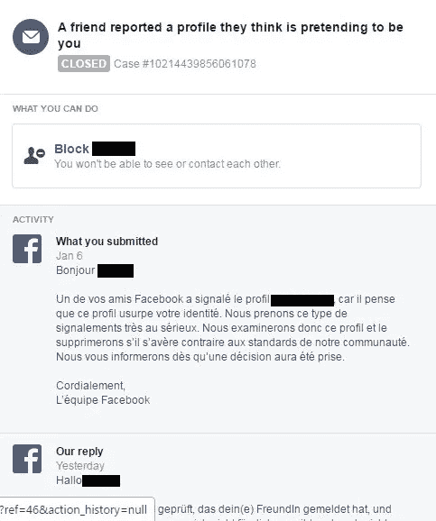

# 脸书身份盗窃报告被打破

> 原文：<https://medium.com/hackernoon/facebook-identity-theft-reporting-is-broken-7c7c931702fe>

## 调查意见

## 而此时在线身份往往等同于脸书或谷歌签到(嗨，Medium！)，最近的一个案例表明，脸书正在以一种完全错误的方式处理至少一些身份盗窃的指控。

> TL；DR:尽管有明确的证据和几个条款的违反足以暂停一个账户，脸书并没有对一个账户假冒他人的多次重复报告采取行动，也没有采取任何有效的行动。这一切似乎表明，他们的决策算法/内部规则存在严重缺陷，因为迄今为止，只收到了罐头答案，没有人参与。这已经是第三天了，还看不到解决方案。

我在周末目睹了以下事情。一位朋友的联系人警告她，一个使用她全名和照片的账户正在向她网络中的许多人发送联系请求，重点是她的同事。她在社会部门、青年福利部门工作，因此总是非常小心地锁定她所分享的一点点。她在个人资料中没有使用全名，而是使用名+中间名(真实的名字)。她不希望和她一起工作的孩子能够挖掘出她的个人信息，也不希望心怀不满的父母能够通过脸书或她的朋友针对她。

因此，当最初冒充她的企图以她的同事为目标时，这并不奇怪，当这种冒充被发现时，他们中的几个人已经添加了欺诈帐户。之后，她开始警告朋友和家人，以及同事，有一个账户假装是她的。

然后，她通过脸书的专用渠道向脸书报告了这个欺诈账户。大约有 10 个朋友也报告了该帐户是欺诈性的，使用了相同的专用渠道，即进入欺诈性帐户的个人资料页面，找到正确的报告类别，并发送他们的报告。

她收到通知说她的朋友举报这个账户冒充她。至少可以说，过去几天脸书的回答令人印象深刻。

Screens of the reports. The astute observer will see 3 different languages, that’s the beauty of the modern EU friendships for you, and more seriously the highlighted German bit actually says that “we have checked the profile (..) and came to the conclusion it is not pretending to be you”.

不仅这些反应停留在很大程度上是一成不变的，也就是说，人类几乎不可能真的花 10 秒钟去发现，是的，的确，有人在模仿。然而，该案件随后被结案，身份被盗的人没有上诉的可能。与此同时，损害还在继续——时间在这里至关重要——假冒帐户试图在合法帐户的工作网络中隐藏自己。

错过这样一个明显的冒名顶替对任何在脸书面临类似问题的人来说都不是好兆头，伴随着拒绝报告的建议完全是超现实主义的:封锁账户或隐藏其出版物，远远不能解决身份盗窃问题，实际上会剥夺其身份被冒用的人看到发生了什么的能力。

人们可以假设一种算法可以衡量在网络中已经活跃多年的 10+个帐户实际上可能比公然显示所述网络的现有成员的照片的新帐户更受信任的机会。

人们可能会认为，脸书对“保护你的账户和个人信息安全”的承诺是认真的，但这个例子表明，事实远非如此。请注意，这似乎不是人为错误，而是系统性的，这使得它的影响比任何给定的个人案例都要广泛得多。

A screen grab from Facebook’s community standards, that according to the exchanges above, were being respected by the impersonating account.

假冒他人也违反了脸书使用条款中的至少 3 条，即 3.9、4.1 和 5.1。违反这些条款中的任何一条都足以导致账户被关闭，脸书在回应中当然不应忽视这一点。

截至格林威治时间周一下午 3 点，尽管通过其专用渠道反复报道，发推文解释问题，并试图对周末做出的错误决定提出上诉，脸书仍无回应。问题依然存在。

如果有人在脸书读到这封信，请:

*   解决首要的身份盗窃报告管理政策，如果他们可以错过这样一个显而易见的案件，似乎有严重的缺陷
*   正确处理此案例——您会在上面的一个屏幕中看到一个案例号，请好好利用它