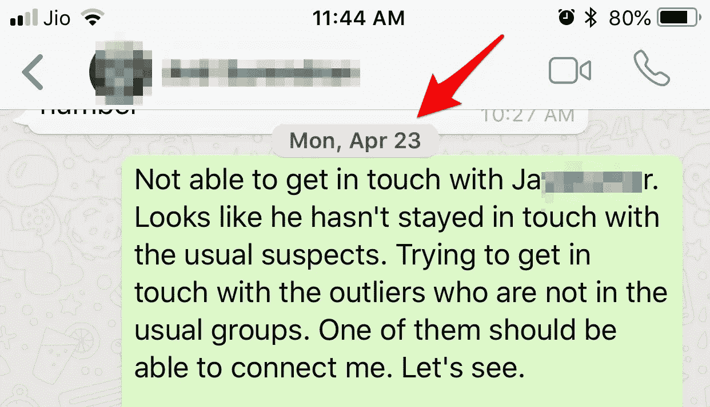

# 脸书在看我的“加密”WhatsApp 对话吗？

> 原文：<https://medium.com/hackernoon/facebook-is-reading-my-encrypted-whatsapp-conversations-375d2eba0c18>

I look for a friend on WhatsApp. A few days later, Facebook mysteriously finds him for me.

2018 年 4 月 23 日，哥哥有事找我帮忙。我知道一个同学非常适合给他提建议。问题是我不知道如何与他联系。我知道在这个时代这是不可能的，但有“情有可原的情况。”

我最后一次和我的朋友联系是在上个世纪，那时我们都还是大学生。其次，我不能谷歌他，因为我不知道他的真实姓名。这并不奇怪，因为我们是直呼其名，在印度，这是你父母/朋友称呼你的名字(假设他的名字是乔，可以代表约瑟夫或乔·威尔弗莱德·特松加)。第三，乔从未出现在社交网络或现实生活中的老男孩聚会上，他完全沉浸在自己热爱的工作中。第四，我自己转行了，和很多同学失去了联系。无论如何，我告诉我的兄弟，我将四处检查并回复他。

2018 年 4 月 26 日，当我关闭一天的时候，一封来自脸书的邮件弹出来。我通常不理会脸书的邮件，但乔的名字却从主题栏里跳了出来。我点击了邮件，出现了乔的脸，虽然老了些，但显然还是他。我点击了链接，它把我带到了脸书。好像他是在 2010 年加入脸书的，那时候我也离开了。

事情是这样的。

我的脸书和 WhatsApp 账户没有关联。他们有不同的电话号码，对我来说也有不同的位置，我也选择退出 WhatsApp 与脸书的数据共享(稍后会详细介绍)。但在我与我哥哥在一次据称是端到端加密的 WhatsApp 对话中提到乔的名字三天后，他的名字奇迹般地出现在一封来自脸书的邮件中。

一点背景。2009 年左右，我与脸书签约，为一个特定项目成立了一个脸书团队，并在几年内完成了这个项目。我那时在脸书很活跃，但是我从来没有想过要把我吃的东西、去的地方或者跑了多远的照片贴出来。那不关任何人的事，只关我的事。然而，当一个学校的朋友在脸书找到我时，我非常激动。所以我以一个沉默的观察者的身份在平台周围徘徊(没有照片，没有个人资料更新，只有一些帖子，只有一条奇怪的私人信息通过我的网络浏览器)。我从未要求脸书的任何人成为我的“好友”。我确实收到了脸书发来的“朋友建议”邮件，但不是给乔的。如果我这样做了，我会记得，因为他是我少数几个完全从雷达上消失的同学之一。这是为了找到失散多年的朋友，所以我仍然保留着脸书的电子邮件通知。简而言之，我与理想的脸书用户完全相反。

我不相信奇迹，所以那封邮件让我的天线嗡嗡作响。

脸书还有别的方法知道我在找乔吗？(我的意思是，不看我加密的 WhatsApp 对话)。每当我使用脸书的时候，我总是注销它，这是一种习惯。但是扎克伯格拒绝回答脸书是否会在你退出后跟踪你的问题。

问题是我不知道我朋友的真名。因此，除了在 WhatsApp 的那条信息中，我没有在任何地方输入它。我的意思是你不能谷歌一个你不知道名字的人。所以那是不可能的。我所做的是亲自去拜访一个共同的朋友，口头上问他是否能给我乔的电话号码？我们共同的朋友确实给我发了 Jo 的号码，我记得我把 Jo 加到了我的手机联系人里。但他是在我收到脸书的“朋友建议”邮件之前还是之后发给我的呢？快速查看了一下我的收件箱，确认我是在 5 月 1 日收到的，也就是脸书邮件的三天后。

这证实了脸书只能从加密的 WhatsApp 信息中获得乔的名字。唯一的另一种可能性是，这是一个纯粹的巧合，这将是一个无限小的概率。

无论如何，这并不是脸书第一次发生这样的事情。我最初在印度以外的地方注册了脸书，有一个非印度的电话号码。几年后，当我搬回印度时，我没有费心去改变我的国家，也没有把我的电话号码更新为我目前在脸书的印度电话号码。我在脸书的资料仍然列出了那个过时的号码和地点。但脸书不知何故打开了我现在手机的联系人列表，时不时地从我现在手机的联系人列表里给我发脸书的“好友建议”。那将是我没有给他们的电话号码。

当然，其中的关联是 2014 年脸书对 WhatsApp 的收购。印度的每个人都在使用 WhatsApp，所以我别无选择，只能加入这个团队。2016 年 8 月，WhatsApp 的一次更新给用户 [30 天时间选择不与脸书分享](https://www.theguardian.com/commentisfree/2016/sep/18/whatsapp-nudge-to-share-data-with-facebook)数据，我确保在更新应用程序时选择退出。但看起来 WhatsApp 还是在未经我允许的情况下，与脸书分享了我的数据。与脸书[共享 WhatsApp 数据的设置不再出现在 WhatsApp](https://www.deccanchronicle.com/technology/mobiles-and-tabs/260916/whatsapp-removes-option-for-sharing-information-with-facebook.html) 中，一个可能的原因是印度最高法院已经将[卷入了这个问题](https://economictimes.indiatimes.com/tech/internet/supreme-court-refers-whatsapp-privacy-policy-matter-to-constitution-bench/articleshow/58024966.cms)。德国和意大利也禁止了 WhatsApp 和脸书之间的[数据共享](https://www.independent.co.uk/life-style/gadgets-and-tech/news/whatsapp-facebook-data-sharing-update-ads-germany-hamburg-banned-a7332606.html)，意大利甚至对 WhatsApp €公司罚款 300 万英镑*，原因是其诱使“该信息服务的用户与其母公司脸书共享其数据*”。

反正 2018 . 4 . 30 我的眼睛抓住了标题下面的[。](https://www.theverge.com/2018/4/30/17304792/whatsapp-jan-koum-facebook-data-privacy-encryption)

Here’s a [link to the post](https://www.theverge.com/2018/4/30/17304792/whatsapp-jan-koum-facebook-data-privacy-encryption)

简·库姆显然在意识到扎克伯格在剑桥分析丑闻后不会在用户数据隐私问题上让步的那一刻就退出了。相反，扎克伯格似乎变本加厉地侵犯用户数据隐私。

我明白扎克伯格的想法。天下没有免费的午餐之类的东西。我知道脸书需要以某种方式创收，因为他们不向用户收费。事实上，脸书的雪莉·桑德伯格曾[提到过](https://www.engadget.com/2018/04/25/facebook-considering-paid-subscriptions/)他们曾经考虑过付费订阅。我完全同意她的观点，也许我不会介意像在 Medium 上一样支付一小笔费用。

那么，他们为什么放弃这条直白的道路，而坚持走“用户数据”货币化的道路呢？尽管剑桥分析公司对用户数据的滥用可能已经深刻地改变了历史的进程，而且不是变得更好。

当然是贪婪。它总是归结为人类对更多金钱的贪婪。

就拿 WhatsApp 来说吧。它目前有 15 亿用户，以前的年费是 0.99 美元。脸书在收购 WhatsApp 后取消了订阅，可能是因为竞争对手没有收费。

让我们假设 WhatsApp 重新引入了这项费用，并因此失去了目前 15 亿用户中的 90%。最重要的是，WhatsApp 不必泄露用户数据。该公司仍将赚取 1.5 亿美元，成为一家可行且盈利的企业，仅使用年度订阅模式作为其收入来源。

使这成为可能的是 WhatsApp 是世界上最高效的实体之一。2015 年，当 WhatsApp 已经拥有 9 亿用户时，它只需要 50 名工程师来运营企业。即使把所有其他费用都计算在内，我的猜测是这 1.5 亿美元还有很多剩余。

但这对脸书来说只是杯水车薪，他们肯定想要更多，甚至不惜牺牲用户数据。我想这就是导致简·库姆辞职的意见分歧。WhatsApp 的另一位联合创始人布莱恩·阿克顿(Brian Acton)早些时候离开了脸书，他已经表明了自己对这个问题的强烈感受。

那么前进的方向是什么？当我看到简·库姆[关于他们在创办 WhatsApp 时打算如何与众不同的想法](https://www.theguardian.com/commentisfree/2016/sep/18/whatsapp-nudge-to-share-data-with-facebook)时，我有点伤感。

> “三年前，当我们坐下来开始我们自己的事情时，”库姆写道，“我们想做的不仅仅是另一个广告结算所。我们想花时间去建立一个人们愿意使用的服务，因为它能工作，能为他们省钱，并以一种微小的方式让他们的生活变得更好。我们知道，如果我们能做到所有这些，我们就可以直接向人们收费。我们知道我们可以做到大多数人每天都想做的事情:避开广告。”

当脸书出价 190 亿美元时，WhatsApp 的创始人可能已经出卖了他们的理想。尽管为时已晚，但我很高兴他们的良知触动了他们。他们已经向世界表明，WhatsApp 不再是之前脸书收购时的 WhatsApp。

以下是[最受欢迎的安全消息应用](http://fortune.com/2017/01/17/most-popular-secure-apps/)的对比。事实上，布莱恩·阿克顿已经向信号公司投资了[5000 万美元，它甚至没有](https://www.wired.com/story/signal-foundation-whatsapp-brian-acton/)[保留你的电话号码](https://lifehacker.com/how-to-use-signal-without-revealing-your-private-phone-1818996580)，忘记数据。如果布莱恩·阿克顿真的认真对待保持 Signal 独立并使其成为隐私的黄金标准，Signal 可能会成为比 WhatsApp 更大的现象。我没有信号的唯一原因是我有掉线的问题，可能是出牙的问题。

在欧洲流行的电报是另一个很好的选择。它也是 ISIS 的最爱，这一事实令人沮丧。但是后来普京就在俄罗斯禁止了。如果普京说它不好，那它一定非常好！

就我而言，我喜欢 Telegram，因为它有一个很棒的功能，可以让我在发完信息后，在收件人的手机上编辑它。这里有一小段视频。请记住，键盘上的“a”、“s”和“d”是相邻的，实际上 gboard 的自动更正功能曾经对我这样做过。注意左下角。在收件人的手机上。

这就是为什么它是像我这样不能忍受逗号错位的人的完美消息应用程序。有点矛盾的是，我沉迷于 gboard 的滑动键盘。这让我受到了它的自动更正功能的支配，当它工作的时候是令人惊奇的，当它不工作的时候是糟糕的。

WhatsApp 只能让你删除所有不正确的信息，而且是在很短的时间内。然而，对于 Telegram 的编辑功能，我只能说“为什么不是每个消息应用都有这个功能？”这就是应用程序伟大的定义。

不幸的是，大多数印度的消息社区似乎没有意识到逗号的存在，并且似乎对他们混乱的存在感到高兴。

因此，我把一只脚留在电报船上，努力把另一只脚从 WhatsApp 的沼泽中解脱出来。

或者如诗人所言，*‘愤怒，对光明的消逝的愤怒。’*