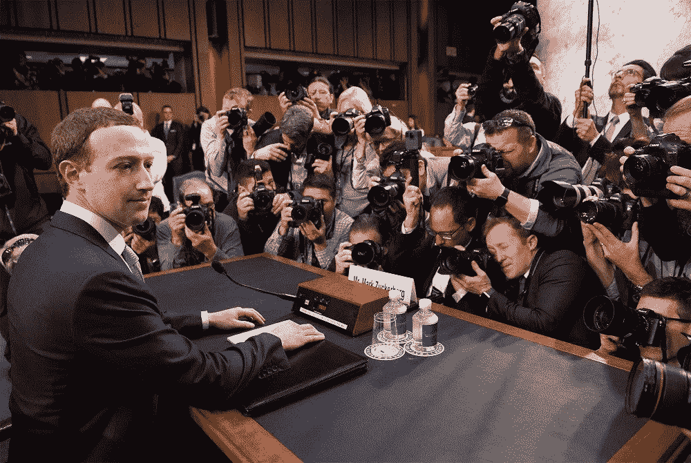
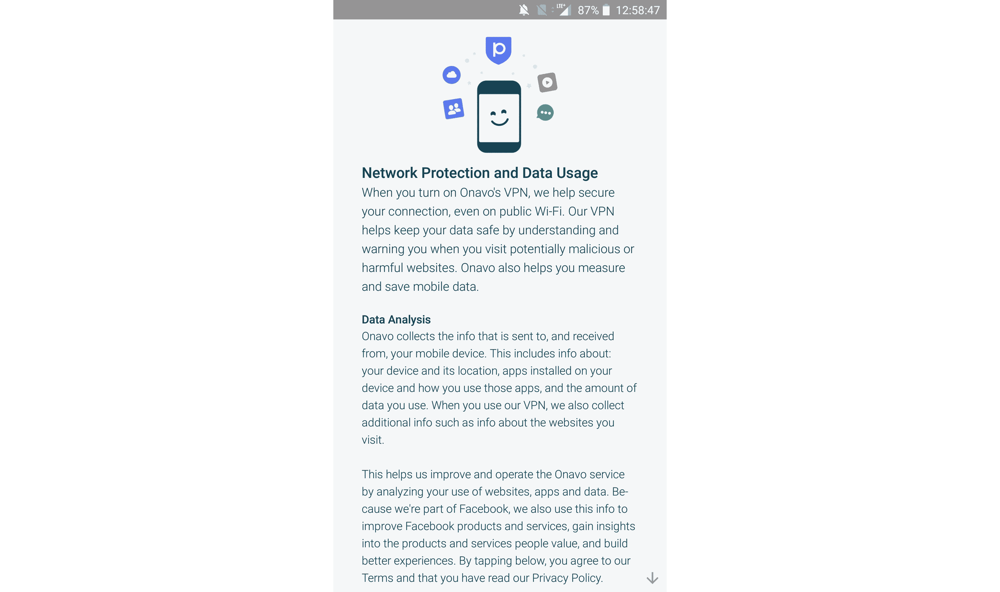
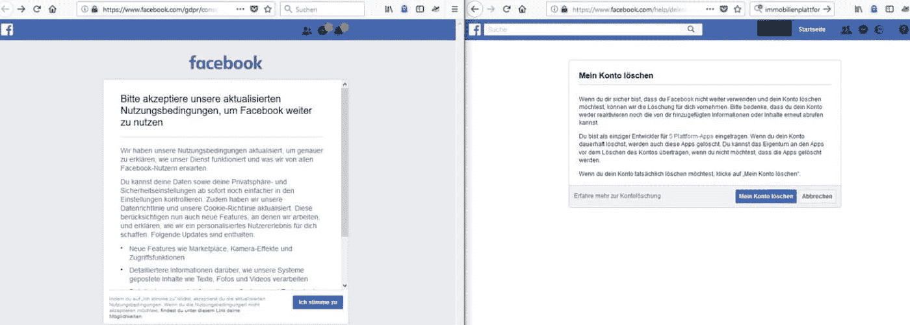

# 脸书隐私:从国会 2000+后续问题中吸取的教训

> 原文：<https://medium.com/hackernoon/facebook-privacy-lessons-learned-from-congresss-2000-follow-up-questions-44d2dacd4634>

## 揭开数百页答案和废话的神秘面纱

今年 4 月，马克·扎克伯格在国会作证，阐述脸书如何处理你的数据。今年 5 月，国会发出了 2000 多个后续问题，本月早些时候，脸书公布了数百页的回复。我通读了这些答案，在这篇文章中，我将结合最近的其他新闻给出最大的收获。

## 脸书收集什么，从坏到什么？？

国会的许多问题都与脸书首先收集了哪些用户信息有关。这是显而易见的。帖子，赞，照片。但是脸书收集了很多人们意想不到的信息。

像许多其他公司一样，脸书允许用户同步他们的联系人。对脸书来说，这意味着你的通话和短信记录。令人毛骨悚然，当然，但脸书承诺这只是为了找到你的朋友…对不对？

不清楚。在他们给国会的正式回复中，脸书透露他们发送了关于你的短信和电话的信息，而这些信息对于这个功能来说根本不是必要的。为脸书说句公道话，用户需要主动点击“确定”来分享他们的通话和短信记录。但是有很多是你没有机会同意的。

脸书抓取一切，从你的手机信号强度，到你的电池电量，到你的浏览器插件(93)。这些特征中的每一个单独来看都是无害的，但是综合起来，[它们在互联网上唯一地识别你](https://amiunique.org)，即使你没有登录。尽管你可能认为自己正在切换到隐姓埋名模式，但你的电池电量仍然只有 62%，你骗不了任何人。

脸书还会留意你每天走过的无线接入点和蓝牙设备(94)。与你在脸书、WhatsApp、Instagram 或 Oculus 上的体验没有太大关系。我能想到的唯一用途是[追踪你在世界上的位置](https://qz.com/1169760/phone-data/)。

他们还跟踪你在网上的位置。有 840 万个网站嵌入了脸书喜欢按钮，允许脸书记录你上网时访问的网站。脸书承认，如果你登录的话，可以使用这种近似的浏览器历史来运行定向广告(159)。他们承诺不会在你注销时使用这些信息来锁定你，但他们仍然会存储你的设备访问的网站。

对你们中的一些人来说，情况可能更糟。Onavo 是脸书在 2013 年购买的一款用户友好的 VPN 应用。通常，VPN 意味着安全、隐私和保护，但脸书将 Onavo 变成了一种工具，用于监视从你的手机发送和接收的每一个字节。用脸书自己的话说:“当你使用我们的 VPN 时，我们会收集你的移动设备收发的信息”(124)。

If you were racing to the “continue” button, would you notice that Onavo was a Facebook product?

显然，脸书在了解你的在线状态方面做得非常出色。不幸的是，这远远不够。

企业会向脸书发送通常只有他们知道的关于你的信息，比如你昨天玩了多长时间的堡垒之夜，以及你上周在当地的 JCPenny's 买了哪个钱包(18)。从这个角度来看，T2 有超过 7000 万的商家在使用脸书。是的，你没看错。脸书知道你在互联网之外采取的行动，他们从合作伙伴那里接收这些信息，不管你是否有脸书账户(18)。

## 获取更多数据的技巧和诀窍

脸书与买卖消费者个人数据的数据经纪商有着长期的关系。尽管 T4 最近采取措施与这些经纪人保持距离，但脸书尚未对他们从这些神秘、粗略的公司收集的数据提供任何透明度。脸书的[工具](https://www.facebook.com/your_information/)用来查看他们声称掌握的你的数据，只显示了他们实际知道的一小部分。

大多数人之前都没有听说过数据经纪人，所以我们来看一个有趣的例子:LocationSmart。LocationSmart 跟踪美国每个移动设备的实时位置。他们与威瑞森和美国电话电报公司等主要运营商合作，收集提供这项服务所需的数据。他们的客户只需要你的电话号码，就能准确估计出你在哪里。

上个月，[新闻报道【LocationSmart 有一个漏洞，允许任何随机的人提交一个查询并找到你的实时位置。](https://www.robertxiao.ca/hacking/locationsmart/)[威瑞森](http://www.businessinsider.com/verizon-cell-phone-location-data-brokers-2018-6)、 [AT & T](https://www.nytimes.com/aponline/2018/06/19/technology/ap-us-tec-verizon-wireless-tracking-the-latest.html) 、Sprint 和 T-Mobile 花了一个多月才决定停止向这个不负责任的数据经纪人出售你的位置信息。最糟糕的是，有许多数据经纪人处理所有类别的敏感个人信息。

从更积极的方面来看，欧盟的《通用数据保护条例》是全球消费者隐私的巨大胜利。不幸的是，在 2018 年 5 月 25 日实施时，脸书不得不让用户同意一些政策变化，并且[这份正式投诉指控](https://noyb.eu/wp-content/uploads/2018/05/complaint-facebook.pdf)脸书伪造通知，以便用户更快同意。

Fakebook faking a notification to get you to skip reading a policy change faster.

从投诉来看:

> 因此，用户的唯一选择是接受新的条款和隐私政策，或者删除账户。没有不同意、选择退出或以任何其他方式、形式说不的选项。

不要让脸书首席执行官脆弱的公开道歉放松了你的警惕。即使在脸书承诺变得更好之后，他们似乎仍然愿意不惜一切代价获取更多的数据。

例如，脸书分析你朋友分享的内容，比如照片和事件，来推断你的信息。他们从他们的元数据中知道照片是在哪里拍摄的，并且由于面部识别，他们知道你在哪些照片中(142–143，222)。因此，即使你没有告诉他们，他们也可能知道你在哪里。

## 他们与谁共享您的数据

收集数据本身并不邪恶。对一个组织来说，知道我们这么多的生活是令人不安的，LocationSmart 向我们展示了为什么集中数据是可怕的，但我们应该给脸书一个机会。他们如何处理我们的数据？

脸书掌握的你的数据有助于他们向你展示极其相关的广告。为此，他们不需要与任何第三方共享您的数据。他们有你的信息，他们提供广告。简而言之，这就是脸书能赚这么多钱的原因。

我们不能责怪脸书这样做——他们为我们提供免费服务，我们在注册时就同意了他们的数据政策(即使我们并没有全部阅读)。这是人们所期望和理解的。当然，还有更多。

脸书利用它的数据做了很多研究，我不是在谈论公平所做的所有整洁的人工智能东西。我指的是玩弄数千万不知情的人的生活的有争议的社会实验。2012 年，脸书想对投票率进行试验，所以他们在 2010 年 11 月 2 日操控了所有 18 岁以上使用脸书的美国用户的新闻。总的来说，他们的实验涉及超过 6000 万人，他们证明了他们可以通过改变向每个用户显示的内容来显著影响投票率。

明确地说，这 6000 万人并不同意参加这一政治实验。如果脸书天真地决定对共和党人和民主党人进行不同的实验，而不知道其政纲会对选民产生什么影响(如果有的话)，会怎么样？如果脸书不小心扭转了全国国会选举的局势会怎样？

我并不是说脸书过去曾经使用过这种巨大的权力来操纵选举。我甚至没有说他们会有这样的风险。我指出，像脸书这样的中央集权平台拥有如此大的控制权，却没有多少积极的同意，这是多么危险。

让我们看看 2014 年的另一个例子:脸书臭名昭著的[情绪实验](http://www.pnas.org/content/pnas/111/24/8788.full.pdf)。通过改变人们的新闻内容和分析他们状态的情绪，脸书跟踪了他们对人们帖子的积极和消极的影响。如果你是这项研究中近 700，000 名实验对象之一，那么脸书可能是你在 2012 年 1 月 11 日至 18 日度过比平常更悲伤的一周的原因。

但是脸书从来没有征得你的同意，所以你不可能知道。

顺便说一句，脸书告诉国会，你不可能选择退出这些实验(125)。

从好的方面来看，至少这些研究人员的意图是好的。他们不是来抓你的。他们只是不惜一切代价追求知识，并利用可用的资源。脸书与其他人分享你的数据呢？

到目前为止，你可能已经听说过一些关于剑桥分析公司的事情，如果仅仅是它的名字的话。这是 tl。dr:脸书与你使用的应用程序和游戏分享你的数据，有一段时间，他们也给那些应用程序你朋友的数据。一家名为 GSR 的公司利用这一点收集了多达 8700 万脸书用户的数据，包括他们的私人脸书信息(24)。他们将这些数据出售给第三方，如剑桥分析公司，用于邪恶的选举目的。

指导 GSR 的人是约瑟夫·钱塞勒和亚历山大·科岗。这里有一个奇怪的事实:大约在他们发现剑桥分析公司惨败(203 年)的时候，脸书雇佣了约瑟夫·财政大臣。

与此相关的是，有很多关于俄罗斯广告干预 2016 年大选的言论。总部设在俄罗斯的爱尔兰共和军，试图通过利用脸书扰乱投票率来“欺骗和操纵美国人民”，成功地达到了 1.26 亿脸书用户(205)。

在这些案例中，第三方——而不是脸书——才是滥用你和你朋友数据的罪魁祸首。没有办法知道还有多少这样的实体，但是我们可以估计一下。自 2006 年以来，脸书已经“向超过 1600 个目标发送了超过 1150 封停止函”，并限制或删除了超过 30 万个侵犯用户隐私的应用程序(129)。显然，脸书正在努力审计大量的应用程序，但这是一个如此巨大的问题这一事实让我感到不舒服。

## 离别的思绪

看起来脸书可能是个坏人，但是读了他们对国会数百万个问题的回答——顺便说一句，他们的很多回答都是回避——我并没有过多指责脸书。脸书的使命只是与向用户收费不相容；你不能用一个付费的 app 连接整个世界。也许*付得起*的用户可以为那些付不起的用户支付费用。但脸书是一家企业，所以他们选择了更直接的解决方案。

公司不会利用你的隐私。他们只是被困在一个系统中，在这个系统中，唯一有意义的商业模式是那些要求他们将他们对你的了解货币化的商业模式。随着我们产生的数据量的增加，这个问题的范围只会越来越大，因此通过监管、技术或简单的透明性，数据生态系统的某些方面必须改变。

[1]“参议院商业委员会问题记录。”【https://www.commerce.senate.gov/public/_cache/files/...】><[。](https://www.commerce.senate.gov/public/_cache/files/9d8e069d-2670-4530-bcdc-d3a63a8831c4/7C8DE61421D13E86FC6855CC2EA7AEA7.senate-commerce-committee-combined-qfrs-06.11.2018.pdf)

感谢阅读。如果你喜欢这篇文章，请鼓掌或者在下面的评论中开始讨论。

下次见！