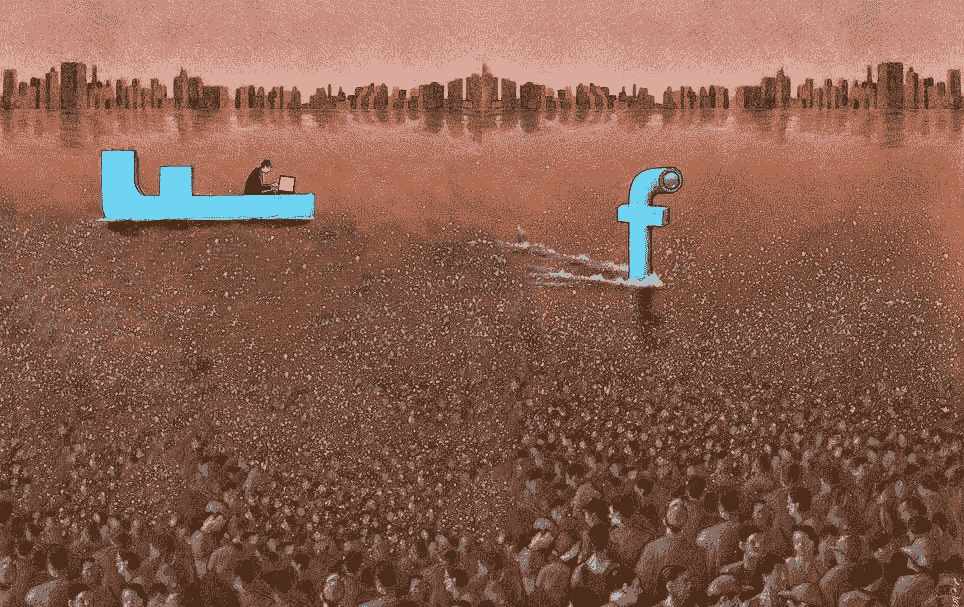
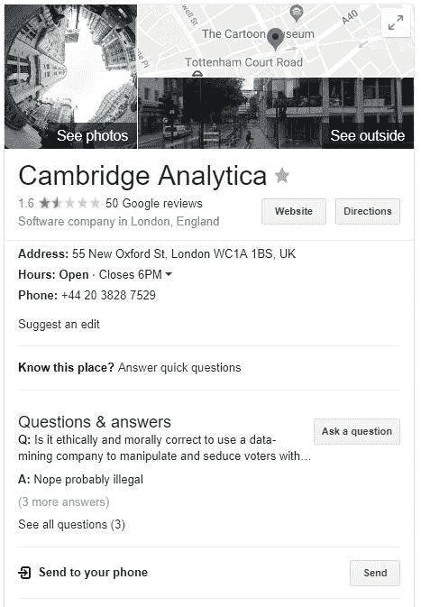
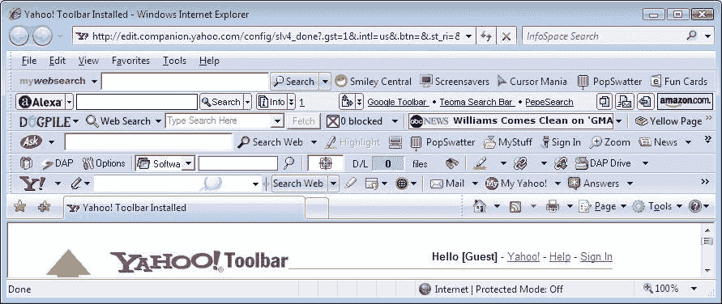
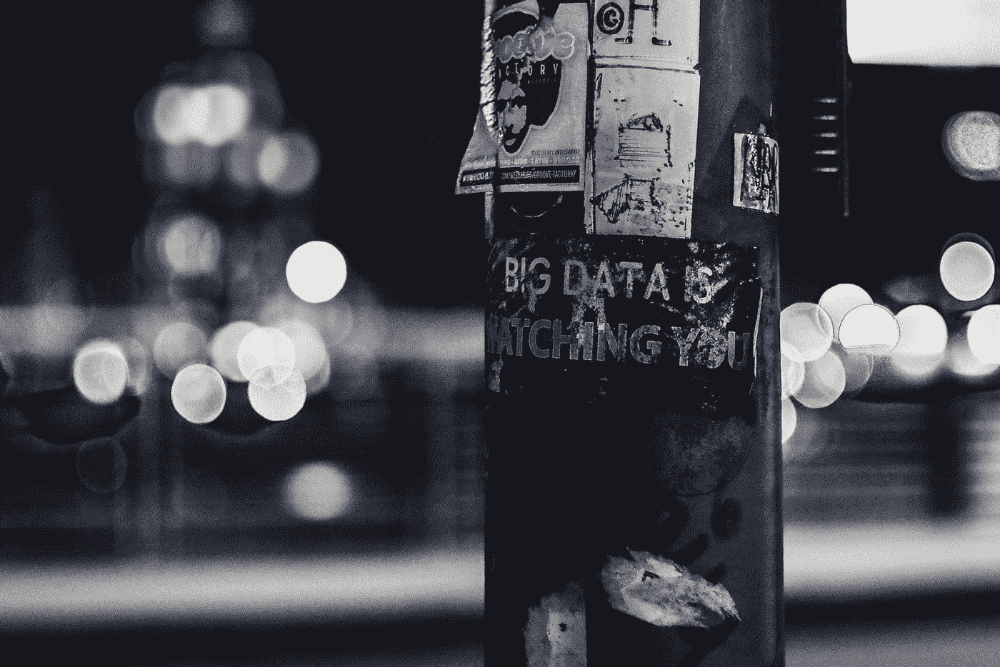

# 脸书 X 剑桥分析:免费服务的隐性成本

> 原文：<https://medium.com/hackernoon/facebook-x-cambridge-analytica-the-hidden-cost-of-free-services-3f5724e80baf>

[Image Credit: Pawel Kucynsky](https://www.facebook.com/pawelkuczynskiart/)

上个月是个奇怪的月份。在最近对美国大选的担忧之后，我们看到主流媒体质疑脸书和剑桥分析公司的做法。[《卫报》](https://www.theguardian.com/technology/2018/mar/24/facebook-week-of-shame-data-breach-observer-revelations-zuckerberg-silence)用一句令人恐惧的话总结道:

> 他们操纵了全球民主国家的选民，特别是在美国，用不一定真实的非来源宣传；并以诱捕行动和蜂蜜陷阱为荣

Cambridge Analytica 参与了对[英国退出欧盟](https://hackernoon.com/tagged/brexit)竞选的支持，唐纳德·川普的当选，特德·克鲁兹的竞选，以及[数十场地方选举](https://www.washingtonpost.com/politics/cruz-campaign-paid-750000-to-psychographic-profiling-company/2015/10/19/6c83e508-743f-11e5-9cbb-790369643cf9_story.html)(2014 年显然有 44 场，仅针对美国)。他们现在是一股巨大的政治力量，在全球范围内强烈支持保守派候选人。

虽然剑桥分析公司从 2015 年 8 月起就已经在 Youtube 上为其服务做广告了，但他们并不掩饰他们的意图；以下是他们在宣传视频中吹嘘的内容:

*   在美国市场上，他们声称拥有**“关于 2.2 亿美国人的多达 5000 个数据点”**
*   “我们超越了大数据，我们增加了一层额外的个性数据，以**深入到个人层面”**

《剑桥分析》的活动及其对选举的影响已经得到了很好的报道，例如《卫报》的《剑桥分析》档案或《纽约时报》的。现在，即使是谷歌也会告诉你:

很少讨论的是我们怎么会走到这一步？考虑到公司的目标和实践，滥用本应在意料之中并得到阻止。让我们扩大讨论范围，解决与“免费”服务的权衡，以及这种数据盗窃的**后果:政治和个人权力的丧失。**

# 广告模式:必要的痛苦？

实际上是马克·扎克伯格的一句话让我开始写这篇文章。在以斯拉·克莱恩的节目中，当被问及脸书当前商业模式在 T2 的局限性时，他没有明确回答这个问题，但给出了一个有趣的回答:

> 你知道，我发现那个论点，如果你不付钱，不知何故我们不能关心你，是非常油嘴滑舌的，根本不符合事实。这里的现实是，如果你想建立一个有助于连接世界上每个人的服务，那么有很多人付不起钱。因此，和许多媒体一样，有一个广告支持的模式是**唯一合理的模式，可以支持建立这种服务来接触人们**。

他将广告支持的模式**描述为唯一能够为世界带来免费服务的理性模式**。我认为这是最简单的方法。本质上，广告允许从服务的每个/大多数用户那里产生收入。由于与广告相关的金钱激励，提供商倾向于关注收集更多的数据和进一步增加用户基础，而不是服务的实际开发。不可能是可持续的。

随着他们不停地利用数据，在线服务获得了对个人和社会的实际权力和影响。脸书现在是国王的创造者，还是已经是国王了？如果脸书是国王，那也是一个狡猾的国王:他对自己的帝王本性遮遮掩掩。他们没有公开剑桥分析公司的丑闻，他们等待公众注意并耐心准备。

[在 2017 年撰写的一份关于脸书未来的宣言中](https://www.theguardian.com/technology/2017/feb/16/mark-zuckerberg-new-facebook-manifesto-letter)，他为社交网络描绘了一个宏伟而可怕的愿景，即**“全球社区的社会基础设施”。我们今天看到的只是第一阶段。**

然而，脸书不是一只孤独的狼。有一整个行业建立在类似的概念上:在线广告。虽然剑桥分析公司和脸书可能有错，但许多其他公司如谷歌、雅虎或百度也有类似的做法。整个行业都有责任。

# 不正当的行业

广告业一直充斥着滥用和欺诈，但是数字广告将它带到了另一个高度。对广告商和其他演员来说，滥用是很普遍的。

仔细看看这个行业，你会发现几场战斗同时进行。首先，**行业内黑幕横行**。在广告客户方面，装瓶和点击欺诈是巨大的。更糟糕的是，被越来越多的侵扰性广告惹恼的用户现在开始反击。

# 滥用职权和不正当行为

滥用和误导策略在各种广告和设备上遍布整个行业。

在手机上，应用程序和游戏可能会有**激进的数据收集做法**，要求不必要的权限(联系人、图片、文件……)，这使得它们可以收集不必要的数据。不出所料，脸书应用是权限要求最高的应用之一。

在桌面上，到处都是侵入性的横幅广告和弹出窗口，恶化了网络浏览体验。最糟糕的是，还有很多更具侵入性的做法，比如与免费软件捆绑在一起的**间谍软件**(你心爱的奶奶的工具栏)**。**

A glimpse in toolbars’ hell

如果说欺诈策略对广告商来说很常见，那么品牌为此付出了代价，因为自动点击很难区分真实点击。

# 实际上是在内战中

机器人或自动化活动在在线广告世界中确实是巨大的。品牌很难认识到这些做法，这让广告商增加了利润。

又名，为什么 Twitter 上有这么多机器人？大约 20%的帐户是机器人(全自动)，至少 20%的其他人使用自动方法。因此，如果 Twitter 采取实际措施反对自动化活动，它可能会失去多达 40%的卖给广告商的印象。

这个行业本身很清楚这个问题，世界广告人联盟估计有 10%到 30%的广告位因为欺诈而没有被消费者看到。总损失估计为每年 500 亿美元，约为当前在线广告业年收入的三分之一。

# 用户也在反击

除了点击欺诈，你还必须为广告商增加另一项收入损失:使用广告拦截器的用户。为了保护自己，冲浪者自行开发了广告拦截器扩展，如 [NanoBlock](https://chrome.google.com/webstore/detail/nano-adblocker/gabbbocakeomblphkmmnoamkioajlkfo?hl=en) 或 [uBlock origin](https://chrome.google.com/webstore/detail/ublock-origin/cjpalhdlnbpafiamejdnhcphjbkeiagm?hl=en) 。

考虑到广告已经变得如此侵扰和恼人，这是必然会发生的。虽然广告拦截器最大限度地减少了用户的烦恼，但它根本没有解决行业层面的问题。因为越来越少的用户现在看到他们托管的广告，媒体广告收入减少，使他们的生存处于危险之中。

[Image Credits](https://images.unsplash.com/photo-1523274620588-4c03146581a1?ixlib=rb-0.3.5&ixid=eyJhcHBfaWQiOjEyMDd9&s=51d12d7bddbb377232d4624061dc335a&auto=format&fit=crop&w=1950&q=80)

一方面，安装 Firefox/Chrome 扩展对一些人来说很容易，很多人不知道它们，甚至不知道广告拦截器。**只有最懂技术的用户才会使用广告拦截器。**

然而，**广告行业正在反击**，一些网站现在通过启用广告拦截器来阻止用户访问。幸运的是，拦截器目前拥有像 [Nano Defender](https://jspenguin2017.github.io/uBlockProtector/) 这样的反广告拦截器拆除器。这是一个持续的来回。

广告行业充斥着恶性循环，导致用户反击。由于这降低了他们的收入，媒体和广告商被推向更具侵入性的广告和数据收集做法，以试图实现收支平衡。

整个广告模式是不可持续的。免费服务发展的实际后果一直蔓延到个人层面。我们的贡品已经很多了。

这些包括行业内的滥用，与用户的持续战争，但最重要的是在线服务声称的政治影响力，这使他们现在能够强迫公众舆论。

这不仅仅是关于剑桥分析，它比这要大得多。我分享 [Max Evans 对扎克伯格听证会的观点](/club-max/zuckerberg-in-dc-exposes-how-little-our-governments-understand-where-humanity-is-heading-b568607ab216):

> “话会说，道歉会记，法律会通过，但问题会越来越多。公司不会因为只需要加入个别国家就完全收敛它们的行为”。

如果国家不适合处理这个问题，我们只有一个选择:做点什么。

广告模式不仅有倾向性，而且有悖常理。它真的是扎克唯一的选择吗，或者只是碰巧最先被提出并悄悄地被确立为标准的那个？[允许在生态系统的所有参与者之间更公平地分配价值的其他模型也存在。](/@BBerdah/growing-beyond-the-advertising-model-to-achieve-democracys-true-potential-5990de48a86f)

如果你喜欢这篇文章，请告诉我，并查看我的维基以获得更多类似的内容。 **别忘了拍拍它** **帮它传播:**可以一直按👏高达 50 次鼓掌。