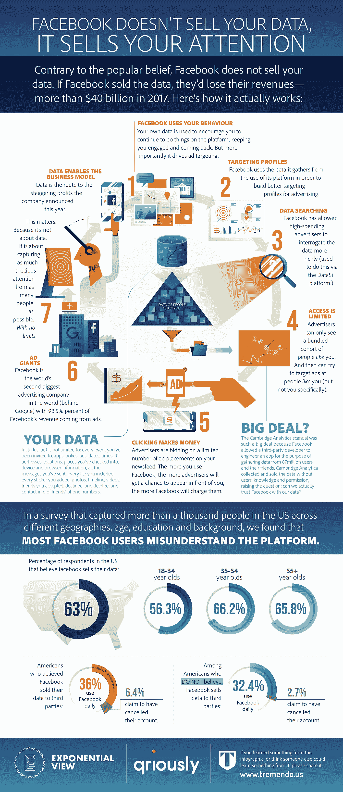

# 脸书的注意力机器，解释道

> 原文：<https://medium.com/hackernoon/facebooks-attention-machine-explained-7547b10cb710>

## 为什么脸书不出售你的数据的简要指南

你没看错。[脸书](https://hackernoon.com/tagged/facebook)不会出售你的[数据](https://hackernoon.com/tagged/data)，尽管人们普遍认为它会。

我们在 [*指数视图*](http://www.exponentialview.co) 联合[quirly](https://www.qriously.com/)研究人们如何看待他们在脸书的数据，发现[三分之二的人误解了](https://shift.newco.co/two-thirds-of-the-u-s-population-wrongly-believe-facebook-sells-their-data-bfeec8385b42?source=user_profile---------10------------------)他们提供的信息服务于这个行业的方式。

为了让机器离你更近，我们和 [Tremendo.us](http://tremendo.us/) 一起演示了这个过程。理解它，分享它，教育你身边的人。

《指数观点》是一份关于指数技术和社会的每周时事通讯。超过 30，000 名企业家、投资者、技术专家和政策制定者阅读该书。 [***亡国***](http://www.exponentialview.co)