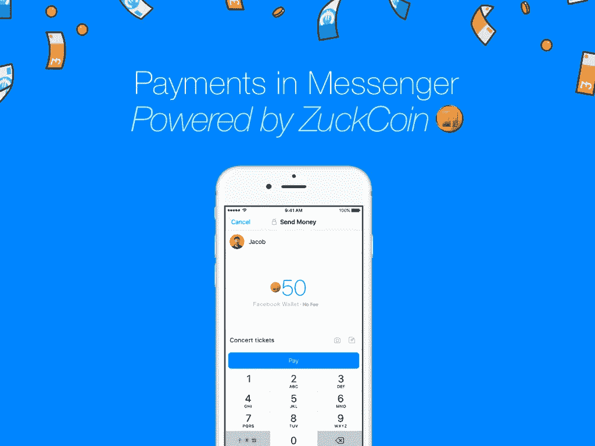
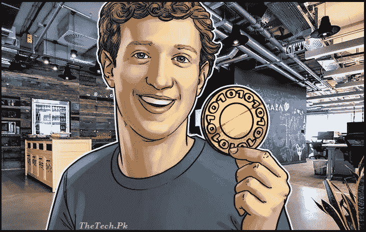
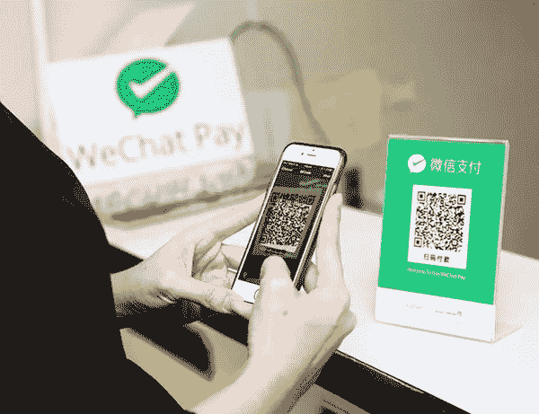

# 脸书的(假设的)加密策略

> 原文：<https://medium.com/hackernoon/facebooks-hypothetical-crypto-strategy-3fa6ec61fab2>

## acebook 新组建的区块链团队代表了脸书、[的重大战略决策，由 David Marcus(前 Messenger 和 Paypal 总裁)和 Kevin Weil(前 Instagram 和 Twitter 产品副总裁)等高管掌舵。这篇文章探讨了脸书可以采取的四步阶梯战略，即(1)从 P2P 支付(2)到 FB 内的 B2C(3)到网络/移动 B2C(4)到最终与线下零售整合——所有这些都大大降低了处理费用，以刺激商家采用。](https://stratechery.com/2018/open-closed-and-privacy-follow-up-facebooks-earnings-notes-on-facebooks-earnings/?utm_source=Memberful&utm_campaign=8313592079-daily_update_2018_04_26&utm_medium=email&utm_term=0_d4c7fece27-8313592079-110979513)

【】脸书最近的重组是方在任期间首次在 crypto 领域宣布战略意图。人们一定想知道谷歌、苹果和亚马逊会落后多少。

# 你知道什么很酷吗？十亿多用户来稳定一种新的加密货币。

D 尽管 ico 在过去几年里呈爆炸式增长，**几乎每种加密货币都被细分为真正稳定的******交易媒介。**它们都缺少两种核心成分:**

1.  **一个庞大的、积极参与的**最终用户群****
2.  ****高频**用例**

**这就是脸书超过 20 亿活跃用户和 B2C/P2P 支付用例——在 Messenger/WhatsApp 以及商业(ads)中——的用武之地。谷歌、亚马逊和苹果也有自己类似的定位。**

**这发生在一个对脸书来说特别不稳定的时期——在围绕用户数据隐私和#fakenews 选举余波的剑桥分析报告中，扎克伯格已经开始了他的世界旅行。**

**但广告收入依赖于这些数据，脸书一直在努力将他们的盈利模式转移到其他地方。过去几年，他们在 Messenger 上投入了大量资源，尝试了从客服机器人、购物机器人到像 T2 优步 T3 这样的合作伙伴的各种方式，但都没有取得大规模的成功。**

**回到一月份，[扎克伯格首次暗示区块链是他们长期战略的一部分:](https://www.facebook.com/zuck/posts/10104380170714571?pnref=story)**

> **“许多人现在认为技术只会集中权力，而不是分散权力。有一些重要的反趋势——比如加密和加密货币(**——从中央系统中获取能量，并把它放回到人们手中。但它们也伴随着更难控制的风险。我有兴趣**深入研究这些技术的积极和消极方面，以及如何最好地在我们的服务中使用它们**。”****

****现在，在其分散的性质和高效的支付模式之间，在区块链建立一个“ZuckCoin”能帮助脸书对抗数据隐私的逆风*和*开发一个新的货币化模式吗？****

# ****脸书的[“阶梯”加密策略](https://stratechery.com/2016/snapchats-ladder/)****

> ****“这就是一家公司如何完成一开始看似不可能的事情:从这里到那里的一系列步骤，这些步骤相互依赖。此外，它不仅是一个令人印象深刻的成就，也是一个强大的护城河；任何希望参与竞争的人都必须遵循同样耗时的流程。”— [战略研究](https://stratechery.com/2016/snapchats-ladder/)****

****脸书有一条清晰的路线将加密技术集成到其所有产品中，每一步都建立在最后一步的基础上，并在此过程中在最终用户和商家之间产生双向网络效应:****

1.  ****给 20 亿以上的人一个使用加密的理由****
2.  ****降低处理费用以激励**商家采用******
3.  ****从“在酒店住宿签到”转变为**“在酒店住宿支付”******
4.  ****按照微信的剧本，实现线下低收费支付****

## ****梯级 1:给 20 多亿人一个使用加密的理由****

********

****脸书在 FB、Messenger、WhatsApp、Instagram 上拥有[22 亿](https://newsroom.fb.com/company-info/) +用户——巧合的是，这些用户组成了克里斯·考克斯(Chris Cox)最近重组的“[应用家族](https://www.recode.net/2018/5/8/17330226/facebook-reorg-mark-zuckerberg-whatsapp-messenger-ceo-blockchain)”团队。相比之下，T4 全球有数千万的加密用户。**脸书的*日均*达到比 crypto 高 20 倍以上。******

****首先，ZuckCoin 成为向任何连接发送 P2P 支付的新方式。与传统支付方式相比，ZuckCoin 的处理过程实际上不收取任何费用，结算速度也更快。突然间，用户开始将他们的网络视为功能连接——他们可以在 Messenger 上汇款回家，在 WhatsApp 上支付朋友的晚餐费用。****

****对于生活在美国和欧洲以外的 10 亿多 dau(超过 67%的 FB 用户)来说，**把钱存在 ZuckCoin 钱包里也可能是比他们当地更不稳定的货币更稳定的价值储存手段**。****

## ****梯级 2:降低处理费用以激励商家采纳****

> ****"**与 feed** 相比，消息传递可能是一种更具事务性的媒介。所以我认为你将开始看到的是人们与页面互动，也许是关注脸书或 Instagram 上的一个页面。您可以看到该页面的内容。你可以点击或挖掘一条信息线索，然后获得客户支持或完成交易或进行后续交易。”——[扎克伯格](https://stratechery.com/2018/open-closed-and-privacy-follow-up-facebooks-earnings-notes-on-facebooks-earnings/?utm_source=Memberful&utm_campaign=8313592079-daily_update_2018_04_26&utm_medium=email&utm_term=0_d4c7fece27-8313592079-110979513)****

****接下来，这些用户开始拥有更多的扎克币。他们有机会利用脸书现有的全球支付网络，将这些代币变现为纸币。这个网络，在他们的广告和市场业务的支持下，可以接受超过 50 种货币的支付，并与转账合作以促进全球支付轨道。但有了足够多的原生 FB 用例，就没什么理由转移到菲亚特。****

******随着** **脸书的**[80m+商家](https://stratechery.com/2018/open-closed-and-privacy-follow-up-facebooks-earnings-notes-on-facebooks-earnings/) **遍布全球，很容易想象出跨越广告单元、客服接触点、品牌页面的有机交易机会。**例如，用户只需点击一个简单的按钮，就可以直接点击定向广告进行购买和支付，从而立即提供卓越的用户体验和更清晰的商家属性。****

****为什么商人想要那个？首先，电子商务已经在难以置信的微薄利润上运营。对于努力实现个位数利润率的公司来说，[2-4%的支付处理费](https://squareup.com/guides/credit-card-processing-fees-and-rates)是很大一笔费用。一枚基于区块链的硬币可以将通过脸书的费用降低到个基点，给商家全额返还个百分点的利润。****

****这些零售商突然受到激励，将 ZuckCoin 作为他们的首选支付方式进行推广——他们可以向这些受众提供更大的折扣和忠诚度奖励。**带着明显的边际动机，商家其实成了 ZuckCoin 最大的拥护者。******

## ****梯级 3:从“通过餐饮签到”变为“通过餐饮付款”****

****今天，“用 FB 登录”是迄今为止最常见的帐户注册和登录流程。明天，**“用 FB 支付”可能会成为最常见的支付流程，搭载在网络/移动设备上现有的 FB 认证小工具之上**。****

****在线商家非常关心 3 个问题:****

1.  ****篮子**废弃**率****
2.  ****付款**处理**费用****
3.  ******欺诈性**收费率****

****他们想把这三者都最小化。理论上，用 FB 支付应该解决以下问题:****

1.  ****由于 FB 的登录已经是一键操作，15 亿以上的用户可能已经存储了 ZuckCoin 凭证，因此完成购买比手动输入送货和抄送信息要快得多。****
2.  ****如前所述，加工费可能会下降一个数量级。****
3.  ****因为脸书有身份和社交图谱丰富的登录用户，它应该有**数据来减少欺诈费用。******

********

****消费者渴望更低的摩擦支付，商家希望更高的利润和更少的欺诈，FB 可以在网络和移动应用程序上提供这两种服务——这带来了巨大的潜在支付机会。****

## ****第四步:遵循微信的剧本，实现线下低费用支付****

********

****较低的费用同样吸引着线下的商家，他们仍然占零售支出的 90%以上。****

****类似于[微信](https://a16z.com/2015/08/06/wechat-china-mobile-first/)在中国的做法，**脸书可以在该行建立“用脸书支付”的 POS 整合。**对于 20 多亿在手机上安装了 FB 应用的人来说，他们只需打开手机，获得个人资料(QR)码，就可以在结账时付款。****

****想象一下这将是多么具有变革性——像**杂货这样的大型零售行业，其净利润率为**[**1.6%**](http://pages.stern.nyu.edu/~adamodar/New_Home_Page/datafile/margin.html)**，可以使其净收入增加一倍以上，**收回 200 个基点的加工费。****

# ****超越商户支付****

****这些横档简单地描述了区块链的脸书支付令牌向 P2P 和 B2C 交易的自然延伸。****

****ZuckCoin 还可以实现一种全新的小额支付经济，这在当今固定成本处理费用高昂的世界里是没有意义的。这些小额支付自然会支持脸书现有的新闻和视频内容，作为替代广告的盈利模式。它们还可以用来管理内容，促进脸书本土媒体市场的繁荣。****

****最后，脸书可以分离部分身份，允许用户更直接地拥有他们的数字数据。在这种情况下，生成的 FB 个人数据将被加密，用户将持有他们的个人数据解密密钥。他们可以控制与广告商、第三方应用等分享数据，并随意撤销访问权限。虽然这在某些方面会破坏脸书自己的数据护城河，但对扎克伯格来说，通过技术监管自己的公司可能比让华盛顿通过政策监管更好。****

> ****“不可避免的是，将需要一些监管，(但)你必须小心你实施了什么样的监管。”— [马克·扎克伯格，2018 年 4 月，国会证词](https://www.wsj.com/articles/congressional-hearing-on-facebook-turns-up-heat-on-mark-zuckerberg-1523464332)****