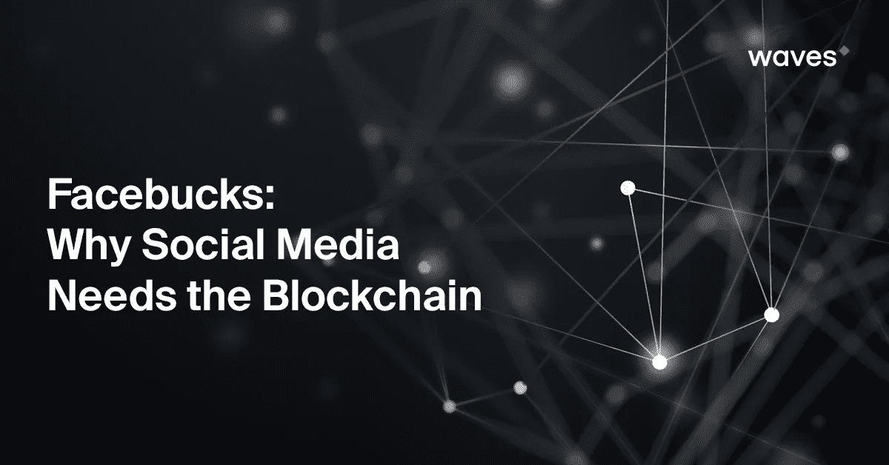

# Facebucks:为什么社交媒体需要区块链

> 原文：<https://medium.com/hackernoon/facebucks-why-social-media-needs-the-blockchain-3a2e84d6498f>

最近的事件清楚地表明，社交媒体存在问题。区块链为我们最喜爱的平台背后的大公司提供了强大的解决方案——分散模式可能是创建适合目的的社交媒体的唯一长期方式。

社交媒体公司[已经对区块链技术](https://blog.wavesplatform.com/blockchain-based-messaging-and-social-media-50776c50e289)表现出相当大的兴趣。原因并不总是很清楚——在动机明显的地方，它们会有很大的不同——但这有直观的意义。社交网络旨在以对等的方式将人们联系起来。区块链服务于同样的目的。这场比赛是很自然的——如果[电报公司 17 亿美元的代币出售](https://blog.wavesplatform.com/blockchain-based-messaging-and-social-media-50776c50e289)有什么可看的，将会有更多关于这个主题的头条新闻出现。

然而，这里有一个更大的画面和更大的奖励。区块链不仅可以解决社交媒体公司面临的严重问题。这可能会完全开启社交网络历史的新篇章。

## **新的商业模式**

大约三个月前，有消息称[英国公司 Cambridge Analytica 在未经所有者明确许可的情况下，从超过 5000 万个脸书账户中获取数据](https://www.wired.com/story/wired-facebook-cambridge-analytica-coverage/)，利用他们收集的信息试图影响美国总统选举。

剑桥分析公司丑闻的直接后果可能已经平息，但这一插曲表明了所有传统社交媒体核心的根本紧张关系。一方面，社交网络的存在是为了将用户彼此联系起来。但是，和所有上市公司一样，它们对所有者负责，并有受托责任让股东收益最大化。当你不向你的用户收取订阅费时，产生收入的方式就只有这么多了。

这种动态导致用户通过收集他们的个人数据用于广告，包括政治竞选，从而被货币化。这次对脸书的反弹如此强烈的原因之一是，这一过程现在变得如此复杂，以至于有可能针对非常小众的人群，讨论甚至他们可能都没有意识到对他们来说很重要的问题。操纵的范围是非常真实的。正如揭发者克里斯托弗·威利所说的那样，剑桥分析公司“建立模型来利用我们对他们的了解，并瞄准他们内心的恶魔”。

> **简单来说，社交媒体平台的使用者和拥有者之间存在利益冲突。**

随着分布式文件存储的兴起，区块链技术为完全去中心化的模式开辟了道路:用户拥有的社交媒体，没有股东，甚至没有传统的公司结构。虽然这在理论上是可能的，但从头开始创建和启动这样一个网络将是一项艰巨的任务。更有可能的是，我们将看到加密货币钱包逐渐集成类似社交媒体的功能，从消息和新闻订阅到图像存储。

大型社交媒体公司显然不会走上分散运营的相反路线。但是区块链仍然提供了巨大的优势——以及不依赖于收集个人数据的新的收入来源。

## **社交密码**

正如我们上面提到的，点对点货币是点对点交流平台的天然选择。将区块链整合到一个社交媒体平台上，不仅为用户提供了分享图片、更新和其他信息的方式，还可以为彼此和各种在线服务付费。它还提供了一种新的平台盈利方式。一个大型社交网络代表着数千万甚至数亿潜在客户的直接用户群——甚至超过现有最大的区块链平台，包括比特币——这意味着任何程度的采用都可能给公司带来可观的收入。

集成的加密货币将实现用户之间的即时支付，无论他们在世界的哪个角落，从小额支付到汽车和房子等大件商品的结算。这将是该平台更广泛的生态系统中一切事物的默认现金形式:小费、汇款、支付广告和宣传活动、应用/游戏/升级、短期和自由职业职位的外包工人，以及几乎所有其他东西。社交网络公司应该不难看出这一点的价值。它们已经为用户的生活提供了如此多的用途，成为在线钱包是很自然的一步。一个使用虚拟加密货币“Facebucks”的例子可以说明为什么:

你想和几个朋友组织一次聚会。脸书已经是你开始这个过程的方式。你创建了一个新的小组，邀请所有人，然后在一个对你们所有人都方便的地方寻找一家好餐馆。在你的搜索结果中，有几个广告(在 Facebucks 中付费)出现在合适的地方。其中一家的评论特别好，其他用户也给了一些访问者小费，因为他们花时间提供了有用的信息，比如什么时候去，吃什么菜。你按时预订了餐厅，和朋友们玩得很开心，并在晚上结束时用智能手机用 Facebucks 支付账单。第二天，你在朋友之间结算账单，还是用 Facebucks。换句话说，整个过程，从召集一群人到支付，都是在同一个社交网络上进行的，使用的是同一个集成的数字货币。

## **新的收入模式**

尽管这在原则上是一个强有力的想法，但仍存在一些问题，比如哪种区块链解决方案才是正确的，哪种货币模式最有效，以及社交网络将如何将其货币化。

**区块链方法**。高吞吐量的区块链是社交网络等大众市场应用的先决条件。最快的区块链现在能够支持每秒数百次交易(见 [Waves-NG](https://waves-ng.wavesplatform.com/) )，尽管可能需要侧链来提供必要的能力。还有一些关于财务隐私的问题，所以可能需要一定程度的匿名。同时，社交媒体公司可能需要保持对区块链的一些控制和/或监督，以便满足合规性要求。私有或开放的区块链都可能是合适的—许可分类帐的优势不仅在于控制，还在于速度和吞吐量。菲亚特将需要顺利地进入和退出区块链生态系统，网关代表了 KYC 在开放的区块链实施情况下的一个自然点。

**货币类型**。社交网络至少有两种方式可以提供区块链货币。第一种是更传统的类似比特币的方法，这种方法认为比特币的价值由公开市场决定。这免除了公司的某些责任，但意味着定价项目的额外复杂性，以及用户因波动性而承担的更大风险。一个更广为接受的方法是维持一个财政部，发行一种由准备金 1:1 支持的硬币，通过专用支付网关接收，并存放在经审计的保险账户中。一个面值的硬币可以兑换成一美元或等值的货币。

**收入模式**。假设脸书没有铸造自己的货币(在这种情况下，它将以整体奖励或新造硬币的形式获得铸币税)，有几种方法可以将区块链体系货币化。Gateways 将负责将法定货币转换成 Facebucks，这些交易所可能会收取差价或佣金。每次一个用户向另一个用户汇款时，也可能会产生小额交易费——无论是采取固定费用的形式，还是总额的百分比，或者两者的某种组合(例如，1%到最高 100 美元)。

鉴于一个主要社交网络的市场和用户群的庞大规模，有理由期待从这种日常运营中获得可观的收入——特别是当越来越多的经济活动从传统金融系统转移到社交网络及其整合的区块链货币时。商业和哲学案例都很有力，第一个实现出现肯定只是时间问题。