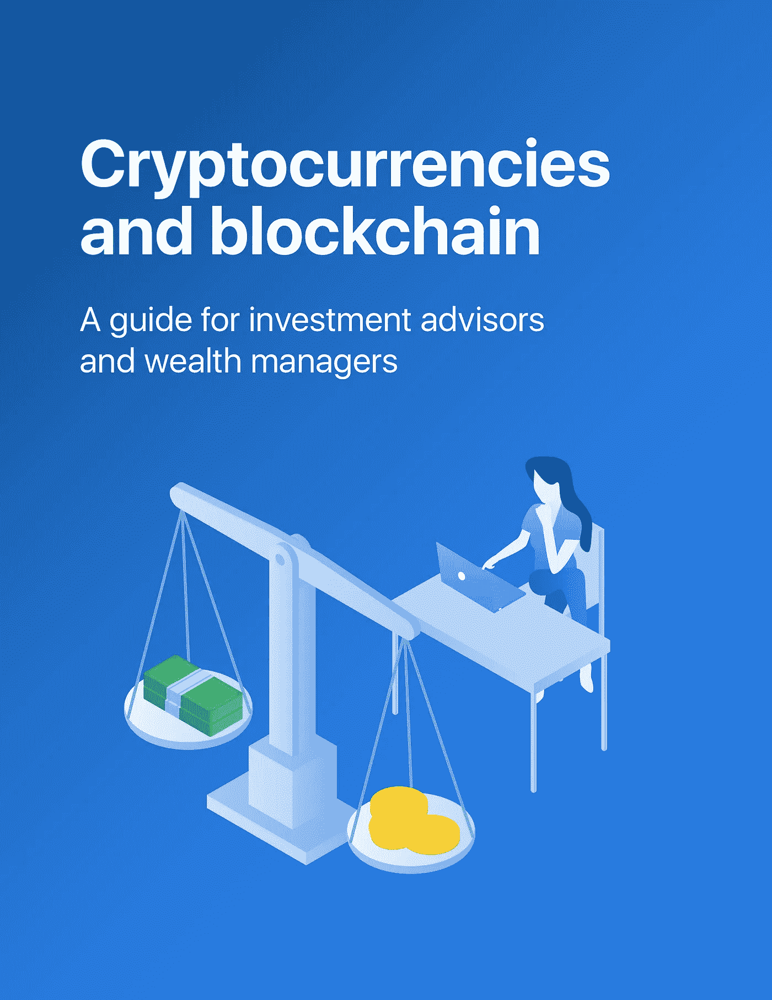

# 面对恐惧因素:与客户谈论加密

> 原文：<https://medium.com/hackernoon/facing-the-fear-factor-talking-crypto-with-clients-4629d65abd6b>

> 许多金融顾问了解加密货币，但不敢向客户提起这个话题，因为害怕被笑出房间。 [*然而，有一些实用的方法可以引发关于这一新兴资产类别的真实对话。*](http://fscrypto.co/mediumguide)

在技术大变革的时代，从来不缺少反对者。

我们对这些人都很熟悉，很快就把新技术斥之为“短暂的时尚”，是“没有实际应用”或在某些方面“有致命缺陷”的欠考虑的创造。

我们的过去充斥着反对者的言论。1964 年，福克斯电影公司的老板达里尔·扎努克对电视做了一个著名的大胆预测:

抱歉，达里尔，但我整个童年都不同意。

没有哪个群体比科技投资者更熟悉说“不”了。回想一下谷歌因缺乏现金流而被嘲笑没有可持续的模式。亚马逊、网飞和脸书都面临着同样的短视，今天仍在继续，就像明天和后天一样。

然而，对于所有的怀疑者来说，在另一边有许多人，他们看到了新技术的巨大机会。最真实的例子莫过于加密货币领域[和区块链领域](https://hackernoon.com/tagged/cryptocurrency)和,这是长期投资者再也不能忽视的真正机会。

但是，作为个人投资者的管家，投资顾问和财富管理人员如何就这项新技术展开严肃的对话呢？仅仅是术语——哈希函数、冷存储、工作证明——本身就是一个挑战。那么所有的价格波动、黑客攻击和邪恶的黑社会活动又是怎么回事呢？顾问应该如何与客户进行这些困难的对话？

关于这一点，我们想了很多，最近我们整理了一份详细的指南，解答了财务顾问不断向我们提出的许多问题。

在指南中，我们推荐了三种简单的方式让顾问进行这些对话:

# **1。聚焦过去**

首先，让你的客户回想十年前他们对谷歌等公司的看法。然后问他们现在对这些科技巨头的看法。

我敢肯定这是一个完全不同的故事。

鼓励你的客户思考这些公司曾经在哪里，以及今天它们如何成为任何投资组合的主流组成部分，这一点很重要。

最大的赢家是那些有远见和适当风险承受能力的投资者，他们在早期投资了这些公司。让你的客户在过去的创新背景下思考加密货币和区块链，将有助于他们掌握这个新行业将如何发展的全面框架。

# **2。专一才是王道**

关注*真实*加密货币和区块链用例也很重要，这将帮助你的客户认识到潜在的结局。

*   许多顾问了解加密货币和区块链的基础知识，但他们不知道足够多的具体例子来理解该行业的最终游戏。例如，价值投资者可能很难将比特币和其他加密货币视为除了产生通胀对冲的非现金流以外的任何东西。
*   使用现实生活中的案例研究可以帮助证明区块链技术为企业和政府提供了独特的优势。这些包括跟踪供应链和收藏品，投票审计，土地登记，创造当地或特定产品的货币等等。加密货币是从这些新区块链中获取价值的一种方式。
*   阐明这一点的另一种方法是将加密资产与早期创业公司私人持有的更具流动性的股票进行比较。加密货币允许进入以前几乎完全基于网络和内部人士的资产类别。想象一下在脸书早期投资，而不是在 IPO 期间投资——这将是获得 10 亿美元回报(如彼得·泰尔的情况)和仅仅获得几千美元回报的区别。

换句话说，对于这种新的资产类别来说，有一个超越虚拟黄金的结局。具体说明该技术的用途将有助于支持其作为投资的吸引力。

# **3。确定一个框架**

最后，与客户讨论一种评估新区块链和加密货币项目的系统方法，避免短期价格波动的炒作。

评估项目的框架可能包括以下内容:

*   *考虑团队*:这个领域有强大的商业、设计和技术玩家吗？他们有建立有影响力的公司的良好记录吗？
*   *考虑融资*:他们是否筹集了传统一轮的风险资本，或者他们是否与加密领域的高声望加速器有关联(例如，Consensys)？这都是强烈的积极信号。
*   *考虑商业模式*:描述该项目的登陆页面和白皮书是否简单地解释了可行的商业模式和现实的付费客户？

也就是说——即使有了上面的路线图——在加密领域，噪音比你摇一根棍子能听到的还要多。辨别好坏绝非易事。如果你被噪音淹没了，开始关注 3 个核心的基本原则:

1.  资产是否足够成熟，能够对有效的交易策略做出反应。
2.  **开发人员是在区块链上建造房屋吗(跟着开发人员走，对吗？)**
3.  **令牌是否被实际使用。这一点怎么强调都不为过——没有真正的客户就没有成功的企业**

不言而喻，目前投资加密货币并不适合所有人。如果你是一名顾问，你应该确保你了解客户的整体风险承受能力，对技术实用性的理解，以及对波动性的适应程度。

当然，还有许多其他因素——监管环境是一个重要因素——不应被忽视。

> 一个不可回避的事实是，区块链和加密货币领域仍然存在很多风险。然而，有一种方法可以描绘出上行的图景，同时合理地管理下行的预期(例如，专注于将创造长期价值的项目，避免那些对其商业模式缺乏思考的项目)。

恐惧不应该推动客户关于投资加密领域的对话，反对者的声音应该只是讨论的一部分。随着越来越多的投资者开始了解加密货币和区块链技术，对话应该专注于区分好坏，而不是完全避开这个领域。

## ***如需免费的 30 页加密货币电子书，请点击*** [***此处***](http://fscrypto.co/mediumguide) ***。***