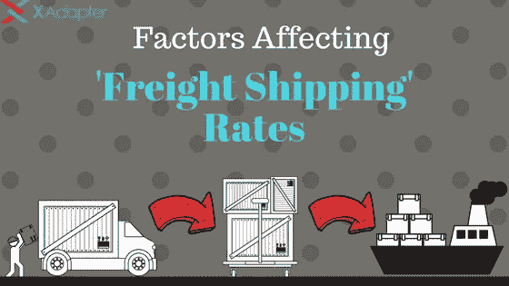
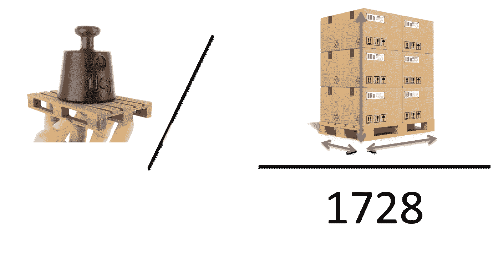
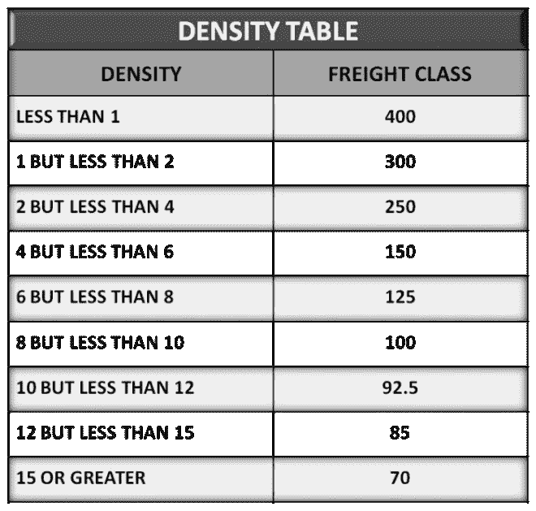

# 影响运费的因素

> 原文：<https://medium.com/hackernoon/factors-affecting-your-freight-shipping-rates-1efce1707d71>

*原载于 2018 年 2 月 5 日*[*【www.xadapter.com】*](https://www.xadapter.com/factors-affecting-freight-shipping-rates/)*。*

当[在全球运输](https://hackernoon.com/tagged/shipping)产品时，犯错是很常见的。有时你可能会算错包裹重量，甚至你选择的运输公司可能不是最适合这项工作的。这些小错误可能会在运输常见产品时造成一点损失。但是**运费**却不是这样。虽然运输正常的产品可能是也可能不是一项有风险的工作，但当涉及到货运时，事情需要尽善尽美。对于更大的出货量，即使是像航运承运人，航运服务，甚至运输方式这样的事情也会造成严重的问题。

在这篇文章中，我们将涵盖一些重要的因素，你需要记住，而通过货运。这样，这些因素将有助于您在运费方面做出更好的决定。但在此之前，让我们来看看货运和它到底是如何不同于正常的装运。

# 货运

货运包括通过空运、陆运或水运方式运输货物、货物和商品。换句话说，货运可以定义为通过卡车、火车、轮船或飞机运输的货物。货运主要使用卡车、火车车厢和可以运载巨大集装箱的大船来进行。

# 货运与普通运输有何不同..？

通常包裹运输与尺寸和数量较小的产品相关联。在大多数情况下，货物允许包含重达 150 磅的产品。但运费却不是这样。货运涉及重量超过 150 磅的货物。

除了重量差异之外，货运中还有其他不同之处。这些包括:

*   **货运产品分类** 货运被认为有助于避免消费者和承运商之间的运费混淆。这是一种标准化的方法，有助于形成统一的货运定价结构。根据包裹重量、密度和价值，大约有 18 种不同的货物类别。货运分类编号介于 50 和 500 之间。您可以在此链接 中 [**获取更多关于货运班别的信息。**](http://www.nmfta.org/pages/nmfc)
*   **装运方式** 货物装运有多种方式。它们包括:
*   **满载** 支持 15000 磅以上的装运重量。
*   **零担(LTL)**
    支持 150–15000 磅的装运重量。
*   **部分货车运输** 支持与其他托运人分摊一辆货车的费用，适用于装运重量超过 5000 磅的货物。
*   **联运** 包括一次装运的多种运输方式。
*   **加急货运**
    速度更快，但运费更高的货运方式。

# 影响货运费率的因素

以下是一些影响运费的因素。

*   **装运重量**
*   **货物密度**
*   **源和目的地之间的距离**
*   **运费分类**
*   **运输方式**
*   **燃料成本**
*   **关税税率和协议税率**

现在我们将详细讨论每一个因素，以及每一个因素是如何影响货运成本的。

# 装运的重量

无论是标准运输还是货运，货物的重量都是影响运费的最重要因素之一。但在货运的情况下，重量影响运费的方式似乎有轻微的变化。**谈到每 100 磅的运输价格，运费往往更便宜**。这背后的原因是预定义的货运组。随着货物重量的增加，它倾向于移动到下一个货物组。一旦进入下一个装运组，该重量将被视为该特定组中的最低重量类别。因此，重量与该特定组的相应运费相匹配。

此外，还有一个原因是货物的重量是影响运费的主要因素之一。**重量和密度有助于识别货物类别**。因此，成为运费的决定因素。

# 装运密度

在我们讨论货物的密度如何影响运费之前，首先让我们讨论一下如何计算密度。理想情况下，要计算密度，您需要将货物的总重量除以每立方英尺(cu。制成).但是，如果是货盘，使用货盘的尺寸、货盘和纸箱的总高度以及货盘的重量来计算密度。

计算密度后，您可以确定包裹的**货运等级**。这将决定您货件的运费。此外，货物的密度还允许承运人精确定位货物将占据的**空间**，最重要的是，**突破**有多容易。这种方式将增加你的运费。

# 源和目的地之间的距离

出发地和目的地之间的距离遵循一个非常简单的规则— **距离越远，运输成本就越高**。然而，这并不简单，运费可能会因地而异。这种差异是由于承运人可能会也可能不会涵盖确切的地理位置。在这种情况下，**一家承运商可以联系另一家承运商来完成装运**。这样，承运人将消除覆盖送货地址的问题。然而，由于承运人的不同，每个承运人的不同来源和目的地，以及各种其他因素可以在很大程度上影响运费。

如果只有一家承运商，则会考虑出发地和目的地与最近大都市的距离。此外，不同的地点可能会改变运输能力，也可能会增加运费。

# 货物分类

正如我们在上述章节中所讨论的，运费等级对运费有着巨大的影响。运费等级包括两个极端点——低运费等级和高运费等级。货物等级是根据货物的重量、密度、搬运以及货物的责任来确定的。所以基于这些因素，**低端的货运等级会有较低的运费。**包括密度较高、不易损坏的货物。因此，产品将更容易处理。另一方面，**货运等级越高，产品的运费就越高**。原因是密度较低，装运过于精细，不易搬运，容易损坏。

根据经验，运费越高，运费也越高。

# 运输方式

正如我们讨论的各种运输方式，这些也会影响运费。运输方式只影响运输的时间方面。一旦您选择了运费等级，唯一重要的是您希望您的货件到达目的地的紧急程度。根据紧急程度，像**加急货运** **这样的运输方式会导致更快但成本更高的运输**。这是因为当您选择更快的运输服务时，会增加额外的费用。

# 燃料费

显而易见，运输成本也取决于燃料的价格。然而，事情并不像看起来那么简单。船运公司没有办法补偿燃料费用的增加甚至减少。因此，唯一可行的选择是**将燃料费用的差额转嫁给消费者**。万一燃料价格上涨，运费会更高。这主要是通过在运费中引入燃料成本来实现的。如果燃料费下降，同样的事情也会发生。航运承运人可以选择征收燃料成本或减少金额，使航运费率更便宜，但他们仍然设法赚取利润。

# 关税税率或协议税率

在包裹和货物运输中，与运输公司的合作是相似的。运费取决于你从承运商处获得的运费类型。因此，根据您是选择费率还是选择协商运费，您的运费会有所不同。在这种情况下，最好的选择是联系**第三方物流(3 PL)** 。如果公司一直在向多个地点运送多批货物，运输公司一般会根据协商价格为**提供 20-25%的折扣**。如果不是，那么选择物流将很容易以积极的方式影响运输成本。这样，他们可能会为你提供你无法直接得到的价格谈判。

这是关于货运的一些见解，以及影响货运费率的一些最重要的因素。

# 总结…

这篇文章涵盖运费运费。在现代世界，随着电子商务的蓬勃发展，任何东西都可以在网上买到。这导致航运成为一个重要的领域。尤其是当要运输的物品很大的时候。货运包括重量超过 150 磅(68 千克)的货物。由于很重，有一些非常重要的因素使运费与普通包裹有所不同，很难运送。这篇文章涵盖了一些重要的因素，构成货运成本。在这篇文章的帮助下，你可以很容易地知道你的货物运输是贵还是便宜。

如果你对这篇文章的内容有任何疑问，欢迎在下面的评论区分享你的观点。我们将非常乐意帮助您了解运费以及它与正常运输有何不同。

除此之外，你也可以在你的 WordPress 站点上使用下面的 [**WordPress 运输插件**](https://www.pluginhive.com/product-category/shipping-plugins/) **，来处理货物运输。**

[**WooCommerce UPS 运输插件带打印标签**](https://www.xadapter.com/product/woocommerce-ups-shipping-plugin-with-print-label/)

*   根据包裹重量和目的地地址提供实时 UPS 运输报价
*   支持国内和国际运输。
*   支持包裹以及货运。
*   允许打印运输标签和退回运输标签。
*   支持从商店内部进行 UPS 货件追踪。
*   向客户发送电子邮件通知，其中包含跟踪详情和运输标签。

[**WooCommerce 联邦快递发货插件带打印标签**](https://www.xadapter.com/product/woocommerce-fedex-shipping-plugin-with-print-label/)

*   根据包裹重量和目的地地址提供实时联邦快递运输报价
*   支持国内和国际运输。
*   支持包裹以及货运。
*   允许打印运输标签和退回运输标签。
*   支持商场内的联邦快递货物跟踪。
*   向客户发送电子邮件通知，其中包含跟踪详情和运输标签。