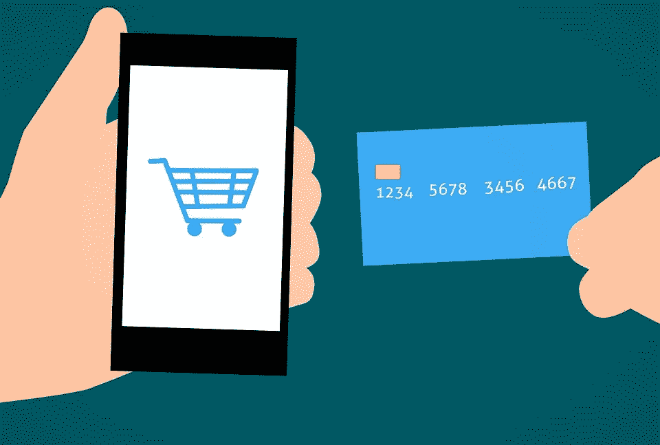

# 使你的电子商务生意大获成功的因素

> 原文：<https://medium.com/hackernoon/factors-to-make-your-e-commerce-business-wildly-successful-befc3f735467>

我们都处在一个人人都熟悉电子商务的时代。我们都是这个时刻的一部分，我们每个人都与一个电子商务网站相关联。这些网站随着用户购买衣服、食物、娱乐、家具、假期等的步伐而运行。所有这些都是通过在线购物门户网站实现的。

由于已经使用的电子商务网站的设计，它被认为是容易和用户友好的。谈论这个精心策划的网站设计，以帮助消费者并使他们再次回来。发展自己的电子商务网站是一个巨大的挑战，要在所有的竞争中保持下去，还有另一项艰巨的任务。

***BigCommerce*** *称电子商务年增长率为 25%。至少它不会停止，因为大多数用户更喜欢网上购物，而不是在商店购物。*

*“要增加你的电子商务网站流量，有几个基本要素需要考虑，以促进电子商务网站的在线销售。通过适当的设计和转化率优化，利用适当的销售管理工具和资源的最佳方式可能是最佳方式。通过调查和分析，尝试了解客户的需求。这些天的建议可以是一个很好的选择，过滤掉搜索结果，可以节省大量的时间和精力。”*

Traffic

**少数案例**

*   在网上鞋店，用户会发现过滤掉产品中不同尺寸的选项非常有用。毕竟，它允许用户客户选择更灵活的选项，并找到他们的产品。
*   同样，在网上书店，如果用户正在为他/她的母亲寻找礼物。如果用户可以过滤掉所有感兴趣的书籍，只关注一种类型的书籍。

有时，当用户发现网站设计得不是很好时，会感到非常沮丧，因此用户想要导航到另一个来源。同样，如果用户在网上搜索要购买的东西，并经历一个荒谬的混乱，如结帐过程，最终会失去客户对你的业务的兴趣。

因此，电子商务网站不应该仅仅是让一个在线购物门户网站对用户具有令人愉悦的吸引力。更重要的是帮助顾客找到他们想要的东西。所有这些都将使购物变得尽可能容易，没有任何麻烦。

如果一切顺利，这个过程可以从登录页面到下订单。并且更有可能以积极的行动结束，即:从用户端获得付款。

***“如果你想经营一个成功的电子商务网站，你需要确保你的网站尽可能地易于使用和用户友好”。***

**保持搜索栏中心点**

它是电子商务网站最重要的部分之一。搜索栏是客户最常用的功能之一。搜索栏可以帮助人们轻松找到他们想要的东西。像谷歌这样的巨头仅仅基于搜索栏运行。因此，搜索栏提供了一个基于用户体验的好建议。由于这些特点，搜索栏仍然是许多电子商务网站的主要焦点。分析过去几年的数据可以看出，搜索栏的建议可以帮助你在网站上保持长期的客户。为了缓解用户体验，它会被诱惑去浏览和查看网站的更多产品。

**尝试使用吸引人的产品图片**

谈到电子商务，一切都是关于在线销售和获取产品。在线网站的关键部分是，在线客户直到产品交付后才能看到和接触到产品。因此，为了在顾客中创造透明度，产品图像的质量必须在所有方面都是最好的。为了让客户满意，包含高质量的产品图片非常重要。如果你的网站包含大量高质量的图片，这意味着它将帮助你吸引越来越多的业务。而且，[设计一个产品页面](http://www.quytech.com/services/mobile-app-redesign-services.php)布局是决定性的。

除了在网站上选择产品幻灯片或带有高质量图片的平铺缩略图。用户在网上购物时只看图片，然后决定是否购买，因此模糊或像素化的图片只会让人们离开网站。

**让你的网站易于导航**

最重要的是让人们尽可能容易地找到他们想要的东西。大型电子商务网站往往有很多不同的类别。这些类别有助于用户尽可能方便地获取这些信息。当构建好的网站结构时，弹出菜单和下拉菜单在保持页面整洁方面起着至关重要的作用。

有一个术语叫“面包屑”,它是另一个设计特征，有助于使站点导航成为一个简单而平静的过程。

**结账过程必须尽可能简单**

长长的结账页面这是一件让顾客非常恼火的事情。一个电子商务网站有这样一个复杂的过程，客户会非常恼火。把宝贵的时间花在用不必要的信息填写结账页面上，或者不得不经历一个冗长的过程，是令人恼火的。可以看出，一步结账页面更有益。顾客不想钻这样的空子，而他们只想为他们挑选的产品付费。

电子商务网站为人们支付货款提供了尽可能简单的方式，被认为是用户友好的。最终，更简单的网站使顾客无需费力就能轻松付款，因此他们更有可能再次光顾。

**结束**

当谈到电子商务秘诀时，最重要的是:“开始关注你的电子商务业务布局”。是的，最初你会犯一些错误并面临挣扎，但你也会很快从中恢复过来。所以，只梦想创业没有意识到让它成为现实有多容易。众所周知，未来几年，电子商务经济将保持强劲增长。这意味着专注于电子商务应用程序的[开发的关键技巧，提供能够带来积极成果的成功。因此，如果你以正确的方式对待它，你可以期待看到结果。](http://www.quytech.com/mobile-application-development.php)