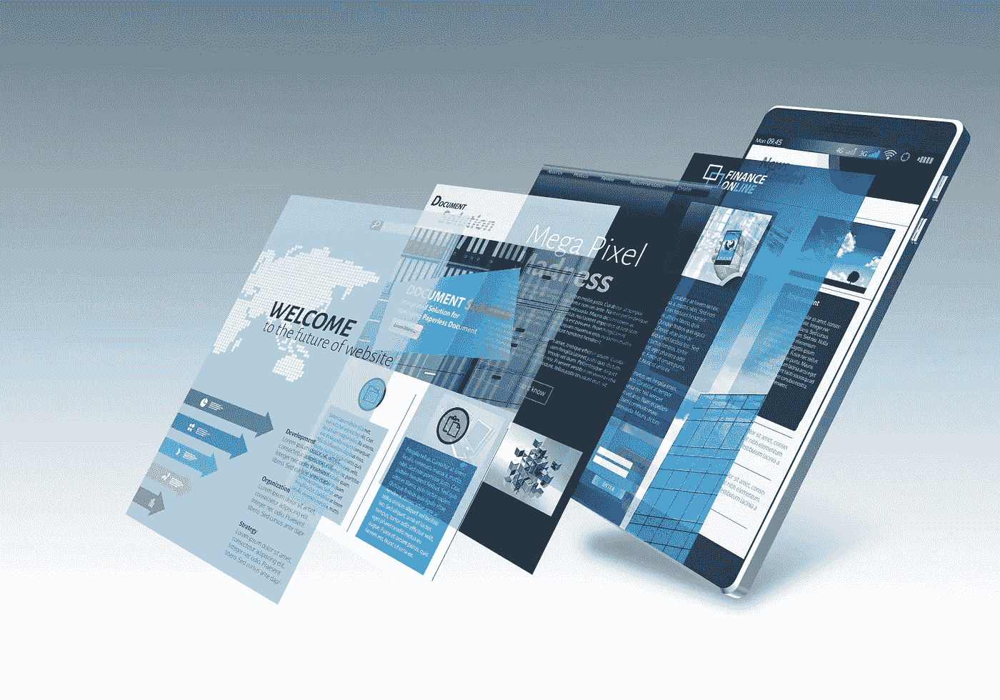
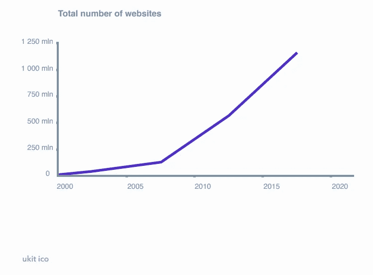
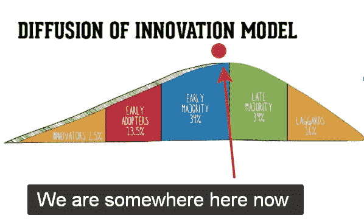
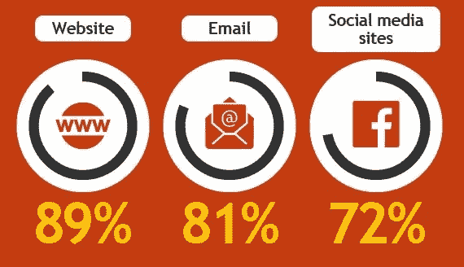
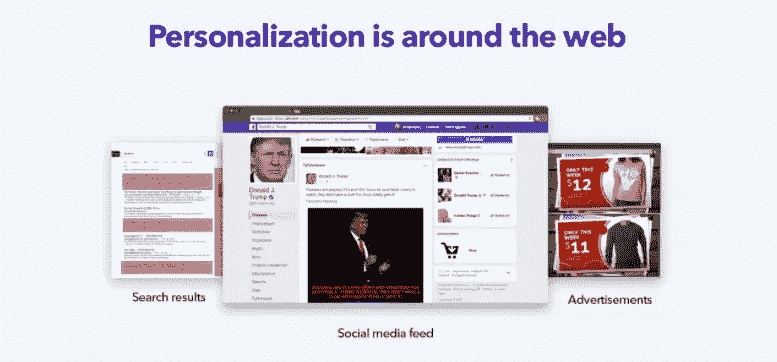
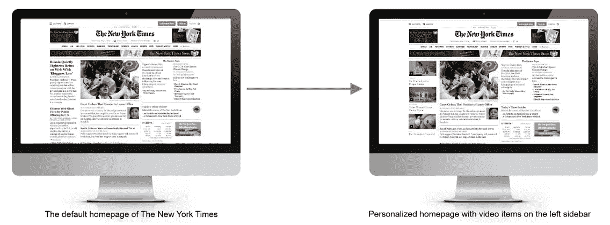
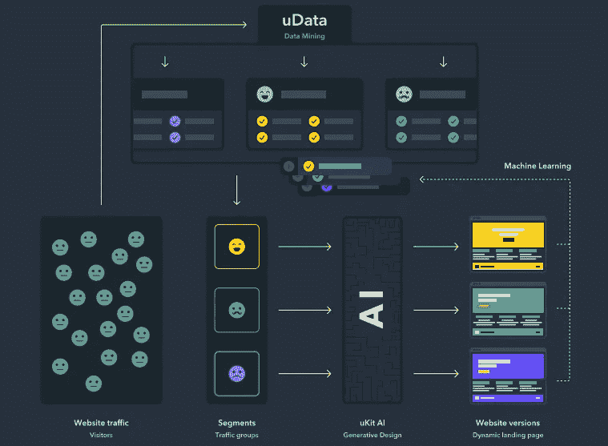
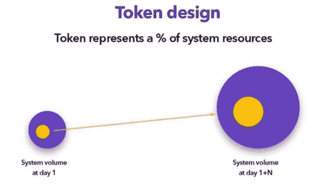

# 2018 年网站的事实(以及为什么标记化对这个行业来说是个好主意)

> 原文：<https://medium.com/hackernoon/facts-about-websites-in-2018-and-why-tokenization-is-a-good-idea-for-this-industry-4009dd85dfde>

发现区块链的另一个应用。并通过 uKit 人工智能项目将语言转化为行动。

大约 30 年前，现代网络仅仅从一个网站开始。如果你想分享一些信息或者提供商品和服务，创建一个网站，不管是什么类型的，仍然是一个好主意。拥有一个网站可以让每个人都可以访问你，因为人们不需要采取额外的步骤，如注册某个特定的社交网络或下载更多的移动应用程序。这就是为什么，虽然我们的技术和小工具在这个时候已经发生了巨大的变化，但网站是当代互联网的基石。

# 让我们来看一些关于网站细分市场现状的数字和事实

**现在已经有超过 10 亿人了。**没有人会告诉你确切的数字:一些消息来源称大约是 13 亿，其他人声称甚至更多——由于评分方法和每秒钟都有一些网站可能“诞生”或消失的事实，这个数字将一直浮动。但是我们确切知道的是，从长远来看，这是一个增长的趋势。很像人口趋势。

*Find more stats* [*here*](https://ico.ukit.com/download/ukit-ai-whitepaper_en.pdf) *on pages 19–25*

**网站数量的增长快于互联网人口的增长。**尽管世界上只有大约一半的人口能够访问互联网，而且亚洲和非洲等新兴市场发展迅速，但这是一个事实——到 2000 年底，每 1 个独立网站就有大约 9 个独立访问者；现在这个比例大约是 4:1。

## ***这可能会让 IT 行业的专业人士感到惊讶***

谁习惯了 LinkedIn/脸书/Angellist 账户作为个人网站甚至博客的良好替代品？但是今天，网络不再是个人网站和独立的博客。

**企业家，他们在线下世界创造工作场所，**如今成为大多数新网站所有者。例如，在过去的 7-10 年里，美国和欧盟拥有网站的小企业数量从不到 50%增长到超过 70%。他们的潜力还远未耗尽，因为世界上只有大约一半的企业拥有网站。

***如果以传统技术采用生命周期来看，意味着网站作为大众技术正处于黄金时代。***

因此，当网络先驱和早起的鸟儿进入加密、ML、VR、AR、物联网和你能想到的下一代技术和市场时，普通用户刚刚开始接受网站的想法。

## 大多数人的下一步趋势是什么？

网站会一直存在。最新的研究表明，小企业从创建和维护自己的网站中获得了明显的利润— **它帮助营业额增加了 45 %- 60%**。

根据采访，现代网站是营销活动的一个要素，也是获取客户的最有效工具。多达 89%的企业家指出了这一点。

*Part of the infographics done* [*by Invesp*](https://www.invespcro.com/blog/customer-acquisition-retention/)

**市场营销越来越受数据驱动。而且更有竞争力**。几个因素影响了这一趋势。首先，网站的增长速度超过了网络人口。其次，现在你需要前所未有地争取媒体对你提案的关注。如果你今天想吸引并保持某人的注意力，让你的信息更加清晰和个性化。要做到这一点，你需要了解你的收信人。

**为你提供商品和信息的大公司(网飞、亚马逊等)**已经在使用关于我们的数据以及人工智能自动化来使他们的网站更加个性化，并从中受益，因为在网站个性化后，我们往往会在他们的网站上花费更多的时间(通常是金钱)。

***有限的大数据访问和处理能力增加了少数大公司相对于大量小企业的竞争优势。这是下一个需要解决的问题，也是未来的趋势。***

*Another website personalization example from the famous brand that can afford it*

**我们已经见过十几次了:**最初只为行业巨头和专业人士提供的技术和工具变成了普遍的、负担得起的工具。这已经发生在网站本身——如今你不需要知道很多来建立一个网站，它的维护每年只需要花费你 50 美元。

# 如果我们把数据挖掘和网站建设结合起来，区块链会有什么不同呢

**市场上的下一个挑战是**让网站个性化变得像网站建设一样简单实惠。2018 年关于网站的另一个事实表明，超过 70%的互联网用户在访问网站时会遇到“得不到我们想要的东西”的问题。互联网上有将近 40 亿用户。

*Simplified scheme of how a mass market website personalization service might work: crowd-owned data management platform (in the picture above it’s called uData) is the key*

**[**uKit AI**](https://ico.ukit.com/)**团队认为** **让它变得负担得起的方法之一**是将大数据源和数据挖掘能力添加到一个广泛使用的网站建设平台的后端——就像我们已经拥有的那样。基本上，我们需要一个工具，通过从他们以前在其他网站上的行为中挖掘信息，了解它与哪种类型的访问者打交道。所以，这必须是一个基于人工智能的工具，它将不断学习，预测为什么不同的人会在这个特定的网站上提交申请或下单，并测试这些预测。**

**人工智能需要得到反馈，而对它的反馈就是新数据。网站所有者应该分享一些数据来训练系统，这样它就可以更好地与他们的网站合作。与此同时，这样的人群使用的人工智能变得每个人都负担得起。特别是，当你获得共享数据的代币，并可以用它们支付网站个性化。**

**这是我们去年 12 月在[展示的生态系统的概念，并获得了第一批令牌持有者。这个月，我们开始了下一阶段的活动:](/@ico.ukit/10-000-tokens-for-1-ukt-815771cb38b2)**

*****区块链&令牌化是可以平衡创造这种产品的各方机会的东西。*****

****一方面，我们仍然需要一家在市场上拥有专业知识的大公司**(实际上，公司[和我们的](/@ico.ukit/facts-about-company-behind-ukit-ico-ukit-group-12f8ce2f2f53)一样)——它将开发和维护这种基于人工智能的平台的基础设施，因为像这样的项目需要大量资源。一家大公司也将购买训练人工智能的核心数据量:数据已经由与大公司合作的数据管理平台(DMP)出售。**

****另一方面，我们有成千上万的中小企业主**，他们可能会为平台做出贡献，以便训练人工智能更有效地使用他们的特定网站。既然“数据是新的石油”，人们就应该因为分享数据而获得回报。**

*****在我们的例子中，奖励可能是不同的，并且取决于诸如由一个独特的参与者共享的数据量、由所有参与者共享的数据总量之类的参数。是什么让这种机制变得透明——当然是区块链。*****

****

**令牌是奖励计划吸引人的部分:共享数据和获得令牌，使你的网站在人工智能方面更加有效。[就这么简单](https://ico.ukit.com/tech)。**

****附言**。所以，这是我们对下一代网站应该如何看待和运作的看法。我们将很高兴在这里或我们的 Telegram 社区听到您的反馈。**