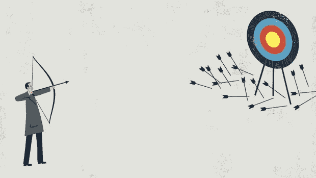

# 高效失败

> 原文：<https://medium.com/hackernoon/failing-efficiently-b5698f0e2058>

## 我自己叙述的基础

最近，我发现我为自己创造的公众形象有一些缺点——最重要的是我无法完全控制自己的形象。有了这个教训，我希望我能被激励去写更多，分享最好的自己。

首先，在未来的几个月和几年里，我将尽可能多地概述我的人生哲学。我最近读的雷伊·达里奥的 [*原则*](https://smile.amazon.com/Principles-Life-Work-Ray-Dalio/dp/1501124021/ref=sr_1_2?ie=UTF8&qid=1516879390&sr=8-2&keywords=principles) ，是一个不可思议的[灵感](https://hackernoon.com/tagged/inspiration)(我鼓励每个人都去读。)

我将阐述的第一个原则是**有效失败**的概念。

失败是生活的一部分。它是成功的反义词。

事实上，我认为没有经历过失败就不可能知道成功。没有人第一次挥棒就打出全垒打，你不可能一开始就不犯一些词形变化就流利地掌握一门新语言。

“成功”人士与普通人的区别并不是由任何遗传或社会经济优势决定的(尽管它们显然会有所帮助)。)“成功的故事”渗透在每一种文化和宗教中。这些故事突出了克服极端逆境的个人或团体，证明任何人都可以凭自己的力量取得成功。圣经中大卫和歌利亚的故事，一个普通人打败了一个非利士巨人，证明了这个真理的永恒性。因此，我不会试图指出任何内在品质，而是认为“有效失败”的能力是人生持久成功的关键。

> 但是“有效地”失败意味着什么呢？

## 我:**故障快**

当我使用术语*高效失败时，*许多人可能会想到“快速失败”，这是硅谷流行的一句口头禅。事实上，*快速失败*是这个原则的基石。

快速失败意味着尽快抛弃不好的想法，或者至少快速迭代。这是一种非常有价值的生活技能，也是效率失败的一部分。

在非天生的关系中(你不能选择你的家庭)，尤其是最重要的关系，如浪漫的伴侣或共同创始人，快速失败可能是避免心碎、失望和潜在的财务损失的最大方法。这当然节省时间。感觉有害、无益或不一致的关系应该以两种方式处理:终止或找出并解决根本原因。转储或迭代。

My favorite Twitter philosopher

类似地，当开发一个概念或技能，并且结果相当糟糕时，你有两个选择:继续或者改变策略。

> **例 1。当我在大学第一次接触科技时，我遇到的许多人告诉我需要学习编程…所以我尝试了。好家伙，是我不好。我很难通过第一次在线课程。从各方面来看，这都违背了我大脑的运作方式。抛开编码不谈，我深入研究如何让自己成为技术团队的无价之宝，并最终获得软件开发人员的尊重(有时)。**
> 
> **Ex 2。**当我离开自己参与创建的第一家软件公司时，我加入了一家本地风险投资公司，成为一名“常驻企业家”“EIR”的工作通常是为一家新成立的公司工作，同时帮助公司获得交易。我的第一个创业想法是一家名为“大头照”的公司——有点像优步的大头照。这个概念是，许多人有很好的相机，但他们并不使用，他们可以很快学会拍摄专业的头像，并从附近需要这样一张照片的任何人那里获得一些兼职收入。
> 
> 然而，当我开始思考这个想法时，我开始掌握风险投资的诀窍，我目前工作的行业开始加速发展。虽然我对大头照公司充满热情，但很明显这不是我职业生涯的正确方向。*(如果有人想开发这个，我非常倾向于资助这个想法，所以联系吧！)*

不管是因为他们没有工作，还是因为有更好的机会，一旦这一点变得明朗，就放弃那些对你的未来不利的追求。

## II:优雅地失败

每个人都知道输不起的人——当他们输掉一场垄断比赛时，他们最喜欢的运动队失去领先优势，或者他们没有得到他们希望的晋升时，他们就会大发雷霆。没人想成为那样的人。如果你*是*那个人，**停**！但是做一个输不起的人可能更阴险，无论是消极的攻击行为还是破坏工作或娱乐中的友好“竞争”。

当一份工作、一次冒险或一段关系没有结果时，去社交媒体或喝醉，向每个人发泄自己是如何被虐待或误解的，这是非常诱人的。不要这样做，直到经过深思熟虑，并且被信任的知己再次确认这种感觉确实是恰当的(比如优步的苏珊·福勒和最近曝光的许多可怕的性骚扰丑闻)。)经常反思，并且*时间，*有可能看到事情的另一面，并与这种情况和平共处。

> **Ex。至少可以说，我离开我的第一家软件公司是突然的，混乱的。我感觉受到了一位联合创始人的不公平对待，我的贡献被忽视了。幸运的是，我的另一位更为公平的共同创始人建议我离开——我完全获得了既得利益，我的贡献不会被遗忘。我已经在继续前进的过程中，这很有帮助，但我不能强调让我的愤怒占上风会有多么有害——它可能会危及我的创业公司和我自己的信誉。**

当面对失败或失望时，后退一步，深呼吸，向你信任的人咨询。最好的做法是经常走开。

## III:深思熟虑地失败

也许失败最重要的组成部分不是行为本身，而是之后发生的事情。虽然快速优雅地失败对成功很重要，但深思熟虑地失败是绝对必要的。否则，正如乔治·桑塔亚纳有先见之明地指出的那样，“那些不记得过去的人注定要重复过去”。

从我的观察和我自己的生活中，我发现除了有效失败的最重要部分之外，从失败中学习也许是最难做到的。

失败之后，最简单的方法就是相信自己没有错。指责他人或我们无法控制的因素比对我们的失败承担全部责任更方便。然而，当我们这样做时，我们什么也没学到。

我觉得这个概念不需要举例。也就是说，我在生活中经历的大部分痛苦都是因为我不能从过去的失败中吸取教训。直到 22 岁，我才真正开始为自己的行为承担责任。从那以后，有效失败变得容易多了。

遭遇失败时——认识到错误所在，拥抱现实，从发生的事情中吸取教训……或者冒险重蹈覆辙。

## 四。克服失败

正如我在成长过程中经历的那样，经历多次失败的一个额外好处是，一个人可以学会从这样的经历中走出来。失败的好处是，尤其是当失败迅速、优雅且深思熟虑地完成时，它能培养韧性。

根据我的经验，害怕失败是成功的最大阻碍。《沙丘》中的“恐惧”是精神杀手。没有恐惧，我们可以自由地沉浸在我们最大胆的智力、运动或浪漫的追求中……并且最有可能成功。

一名记者最近问我，是什么让我“在如此年轻的时候就取得了成功。”我对这个问题的回答是，缺乏对我的期望。由于我生活的大部分时间都是如此糟糕，我认为没有人，包括我自己，会有很高的期望。这反过来又让我能够继续我的创业努力，不受可能发生的事情的影响。

事后看来，我意识到这是不真诚的，因为我个人一直对自己抱有*非凡的*期望……只是从更长远的角度来看，因为我有失败的倾向。此外，我很久以前就接受了这样一个现实，那就是当一切都结束了，我对自己的期望才是唯一重要的。

因此，对这个问题更好的回答应该是“我愿意失败”不管是被学校开除还是被关进监狱，我很快意识到沉湎于失败对我没有任何好处。也许是因为这样的事情发生了太多次，我最终意识到别人是多么不关心我们的错误。也许我们的父母、配偶和孩子的失望会持续更长时间，但在大多数情况下，大多数人太专注于自己的生活，以至于没有关心或记住我们做错了什么。一旦我们认识到这一点，从失败中走出来就变得容易多了……并且把失败当成生活中重要的一部分。

每个人都有失败的时候。决定我们前进方向的是我们如何继续前进。接受我们可能会失败，给了我们成功的自由。

有一种黑暗、刺痛的感觉经常在深夜折磨着我。昨晚，事实上，就是那些夜晚中的一个，引导我最终完成了这篇博文。这种感觉是一种不确定性——我担心，我在生活中没有重大失败的时间越长，下一次真正的失败就越有可能是灾难性的。

在某种程度上，这篇文章表明我已经调整了必要的策略，以避免我年轻时困扰我的那种失败，但只有时间会证明…