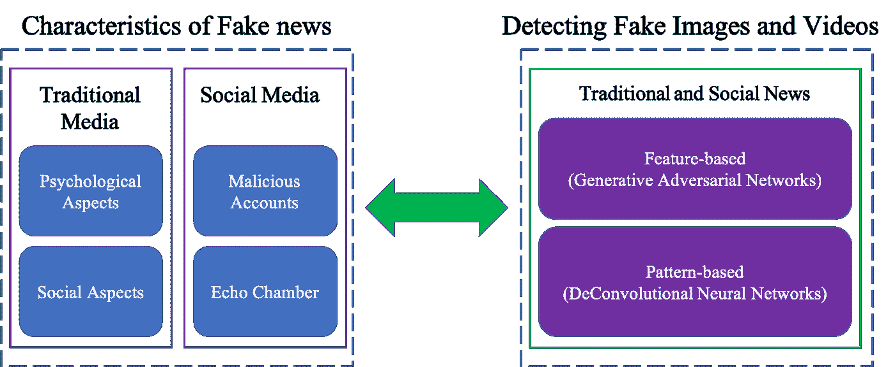
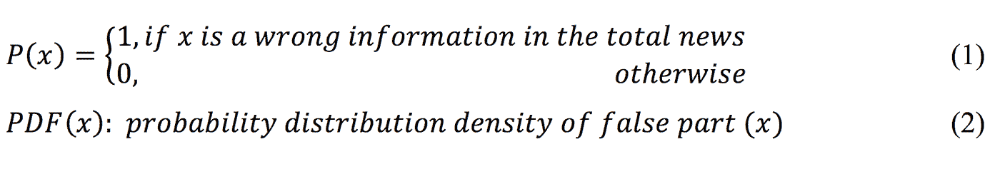
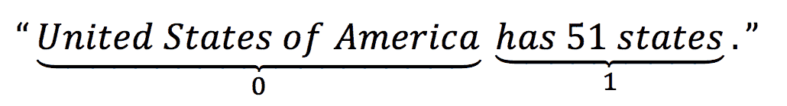
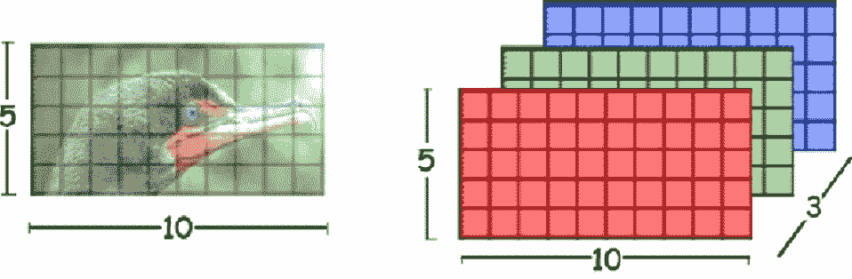
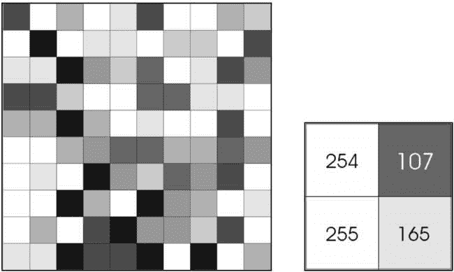
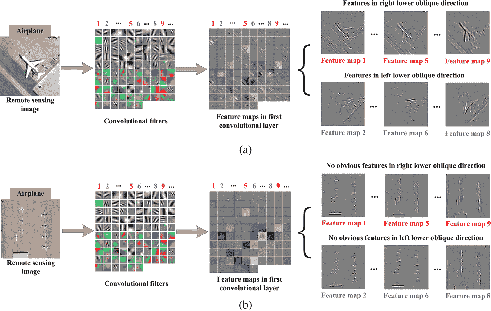
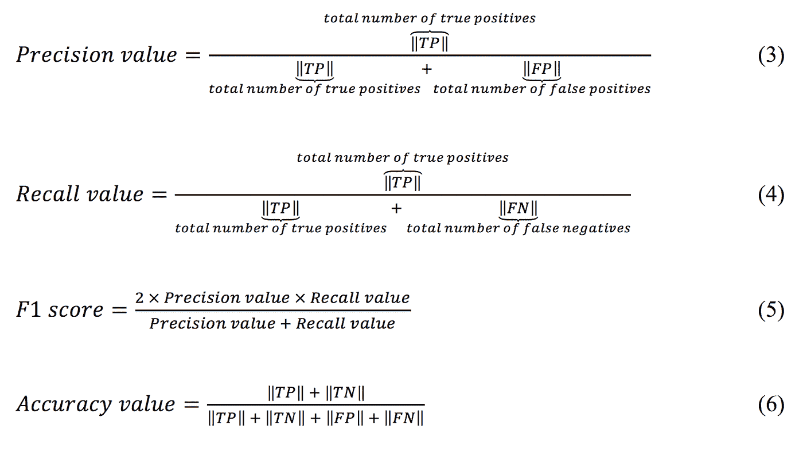

# 假新闻及其检测方法——从心理学到机器学习

> 原文：<https://medium.com/hackernoon/fake-news-and-the-detection-methods-from-psychology-to-machine-learning-part-1-facbadac3e85>

## 第一部分

> **作者简介**
> 
> 帕萨·优塞菲是 [Filestack](https://www.filestack.com/) 的[机器学习](https://hackernoon.com/tagged/machine-learning)工程师，他的主要职责是构建和实现[深度学习](https://hackernoon.com/tagged/deep-learning)微服务、API 和软件，因为它们与光学字符识别和其他机器学习服务等技术相关。他是一名博士生，目前正在圣安东尼奥的德克萨斯大学攻读电子和计算机工程学位。他的主要兴趣领域是计算机视觉和自然语言处理。

# 介绍

在过去的十年里，社交媒体通过为每个人提供自由的环境来分享他们的思想、观点和新闻，从而影响了社会。作为一种负面影响，这些环境被用来传播低质量、内容贫乏、甚至是彻头彻尾的“假”新闻。假新闻的传播对人们的思想和社会有着极端的影响，例如降低一个人对所有新闻来源的信任，使读者对大多数新闻渠道产生防御心理，等等。这就是为什么最近假新闻的检测已经成为研究领域中的顶级趋势之一。参考关于该领域的[最新作品之一](https://arxiv.org/pdf/1708.01967.pdf)，检测社交媒体中的假新闻具有传统现实检测方法和途径中无法找到的独有特征。在这篇博文中，我们将全面分析假新闻的特征和检测场景。在第一部分中，我们将检查诸如定义、基本概念及其特性等特征；在第二部分中，将讨论检测方法及其相应的特征提取和建模过程。图 1 显示了这篇博文中假新闻分析的大致地图。

*Figure 1: General map of Fake news analysis*

# 假新闻的特征

这一部分包括传统媒体和现代社交媒体上假新闻的特征。为了让这个博客对每个人都清楚，让我们来定义假新闻:

*假新闻，也称为“黄色新闻”，包括出于特定目的故意修改和/或向受众传递错误信息的文章。*

如果我们要划分新闻的历史，将有两个时期:前社交媒体(被称为“传统媒体”)和后社交媒体。首先，我们将讨论两个时期假新闻的特点和特征，然后我们将讨论检测方法。

# 传统新闻媒体中假新闻的特征

在社交媒体出现之前，假新闻的特点是集中在心理和社会方面。一个人听到消息，可能分不清是真是假。对于所有人来说，一个人相信他们对现实事实的知识是最精确的，并且他们往往对此有偏见。因此，这可以使他们成为黄色新闻记者的目标受众，这些黄色新闻记者希望在形成其他观点之前传播第一次体验的知识。心理学研究已经证明，纠正错误感知的信息比将真实数据从零开始传递给人们需要更多的时间，并且在大多数情况下，这使得人们由于他们可能不知道来自哪里的偏见而在他们的感知中进入防御模式。

传统媒体假新闻的另一个特点是社会接受度。黄记者的杠杆之一就是社会上的重复效应。当一个人从不同的渠道，如媒体渠道，甚至不同的人那里听到一个事实，这可以让他们相信他们已经听到的是真实的。这一事实在人们的头脑中就像一个正反馈循环，接受所有的信息。

# 社交媒体中假新闻的特征

在本节中，我们将讨论社交媒体对假新闻的影响及其新的特点和特征。在社交媒体中传播假新闻的最重要工具可能是“恶意账户”和“回音室效应”。在社交网络的最初几年，这些平台的创建者无法想象，他们的产品可以作为黄记者传播其虚假信息的最有力工具之一。考虑到在传统新闻媒体中了解到的假新闻的特点，他们意识到，通过在社交网络中创建多个账户，他们不仅可以推动在世界各地的扩散程序，而且还可以利用其心理和社会效应在人们心中留下印象。

社交媒体对黄记者在人与人之间传播虚假信息起主要作用的第二个特点是“回音室效应”。这种效果是社交网络中特定功能的输出之一，例如关注名人或名人。作为一种社会现象，大多数名人和名人在几乎所有的社交网络中都有账户。作为名人进入这些环境的结果，将有数百万人追随他们，并且作为这种追随过程的效果，人们将被通知他们最近的更新和他们发布的内容。此外，作为一个自然的链序列，著名的人(也称为“影响者”)正在跟随对方。因此，这种基于金字塔的关注者和追随者序列在影响者和他们的追随者之间传播假新闻方面发挥了不可避免的作用，这些影响者和他们的追随者是典型的容易受到与任何其他人相同的心理因素影响的人。

# 检测假新闻

在这篇博文的第一部分，我们讨论了传统媒体和现代社交媒体中假新闻的特点和属性。现在是时候定义假的问题函数了。一篇新闻文章可以用一个二进制字符串映射，该字符串表示其中是否有任何虚假部分。例如，让我们假设下面的新闻:

“美国有 51 个州。”

很明显这个信息是错误的。那么我们如何才能认识到这些信息的真实性呢？

这个句子有一个函数可以把它映射成二进制数 0，1 的序列。对于新闻的每一部分，我们可以定义假的二进制率和概率函数，如下所示:

考虑到上述定义，该句子可以映射为以下序列:

这句话有两个不同的情绪(语义部分)，一个是真的，另一个是错的意思是提供的新闻中假新闻的概率是 50%。

这些数学映射函数正被用于在深度神经网络中训练机器学习，以找到真假的比率。

# 特征抽出

任何新闻的特征通常包括在“基于语言的”类别中，例如新闻来源、标题和正文，或者“基于视觉的”类别中，例如图像和视频，它们是这篇博客帖子的主要检测对象。根据[图 2](https://www.researchgate.net/figure/Color-image-representation-and-RGB-matrix_fig15_282798184) 和[图 3](http://www.socialledge.com/sjsu/images/f/f4/) ，每幅彩色图像都是一个像素矩阵，每个像素代表所提供颜色的强度(值从 0 到 255)。

*Figure 2: A basic representation of color images*

*Figure 3: Intensity-based mapping of images for each channel*

图像和视频帧中的特征是显示图像中是否存在伪造部分的主要内容。在基于计算机视觉的机器学习算法中，图像的特征是卷积层和池层实现的结果。[图 4](https://www.spiedigitallibrary.org/journals/Journal-of-Applied-Remote-Sensing/volume-11/issue-4/042613/Do-deep-convolutional-neural-networks-really-need-to-be-deep/10.1117/1.JRS.11.042613.short?SSO=1) 示出了使用卷积层的属于两个图像样本的不同特征图的示例。

*Figure 4: Feature maps of two different images using convolutional layers*

在第二部分中，在检测图像和视频帧中的虚假信息这一类别中，我们将专注于特征地图，以查看是否有任何人工层。

# 建模和评估

在对伪检测问题、监督学习(即分类)或无监督学习(即聚类)进行建模时，使用基于等式(1)的以下定义:

*   真阳性(TP):表示新闻情绪是假的，并且它被预测是假的
*   真负值(TN):表示新闻情绪是真实的，并且被预测为非虚假的事实
*   假阳性(FP):表示新闻情绪是真实的，并且被预测是假的
*   假阴性(FN):表示新闻情绪是假的，而预测是真的

根据上述定义，评估 ML 模型的主要验证值如下:

# 结论

在这篇博文中，我们总结了假新闻，假新闻是如何产生的，以及假新闻是基于人类心理的哪些特征产生的。首先，我们提供了假新闻在传统新闻媒体中的属性，然后是社交媒体的新颖性及其对假新闻的影响。最后，我们将重点放在研究图像和视频中的假新闻，以及如何对它们进行自动评估。

# 第二部分

在这个由两部分组成的博客系列的第二部分中，主要焦点将是深度学习和假新闻中最顶级的趋势之一，“DeepFake”，这是一个使用机器学习方法和深度神经网络对图像和视频中的假新闻进行全面讨论和研究。将提出两种主要解决方案，第一种是使用“生成对抗网络”来生成和检测伪图像，第二种是显示“去卷积神经网络”及其在重新生成图像和检测内部伪层中的效果。