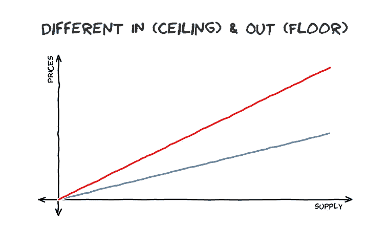
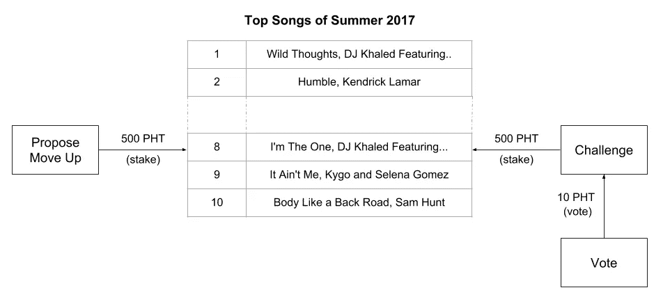

# 使用区块链令牌组学的内容监管

> 原文：<https://medium.com/hackernoon/fanbase-content-curation-using-blockchain-tokenomics-1b2633d9dc11>

Credit: hurricanehank / Shutterstock.com

感谢[海洋协议](https://oceanprotocol.com/)的[迪米特里·德·容格](/@DimitriDeJonghe)的智慧投入，感谢[咨询公司](https://new.consensys.net/)的[西蒙·德拉鲁维尔](/@simondlr)和[迈克·戈尔丁](/@ilovebagels)的激励工作。

今天的互联网已经成为大公司控制和支配网络空间的地方。

这些权力中心的主要动机是为股东谋利，而这些股东通常不代表或可能不关心网络的真正用户。

其结果是社交网络的兴起，其标准是:

1.  用户通过上传内容和个人信息来免费管理内容，以建立他们的社会地位和声誉。
2.  网络通过将用户数据出售给广告商等第三方来提取这一价值。

我相信有更好的方法:

> 由用户群拥有和管理的网络，他们分享并从其成功中获得经济利益。

# 挑战

难的是*网络效应*使得挑战既定现状变得困难。

Credit: Bloomicon / Shutterstock.com

> **网络效应:**参与网络的人越多，这个网络就越有用。

当一个社交网络超过某个门槛，权力就变得巩固。用户已经建立了一个社会和重复的地位，并发现很难切换到替代品，这可能有更少的参与者，他们将不得不重建他们的社会地位。

# 解决方案

[**货币价值包含**](/@jeffreyStern/the-blockchain-effect-on-network-effect-8b2644af22eb) —参与者通过获得经济奖励分享网络的成功，早期采用者因率先行动而获得更高的奖励。

我认为网络的使用者和拥有者之间不应该有任何区别。更具体地说，其活动是为社区管理优秀内容的共同目标的一部分的参与者应该分享他们产生的经济利益。

# 引入光流

[Lightstreams](http://lightstreams.network/) 是一种用于围绕数字内容构建去中心化社区的协议。

> 我们的使命是创建一个网络，围绕数字内容构建分布式的点对点社区。一个开放的生态系统，支持创新的分散应用程序，创作者和粉丝可以在一个低成本、公平和开放的市场中进行连接。

当在分布式网络中的参与者之间共享内容时，Lightstreams 设计关注隐私、机密性和可伸缩性的要求。Lightstreams 协议通过允许授权参与者向区块链智能合同添加文件来实现这一点，这些文件具有控制访问的相关可编程权限。

# 粉丝基础内容管理

通过结合用于控制对受限内容的访问的 Lightstreams 协议和[令牌管理市场](/@simondlr/introducing-curation-markets-trade-popularity-of-memes-information-with-code-70bf6fed9881)、[令牌管理注册中心](/@ilovebagels/token-curated-registries-1-0-61a232f8dac7)和[令牌管理与股份机](/@DimitriDeJonghe/curated-governance-with-stake-machines-8ae290a709b4)的概念，我们可以获得非常有趣的网络行为。

介绍**粉丝群内容监管，**我一直在思考的一个想法…

粉丝群策划内容的目标是创造条件，让粉丝从他们策划的内容中获得经济回报，同时建立他们的社会地位和声誉。

在 Fanbase 内容管理中，粉丝围绕他们热衷的特定音乐流派或艺术家形成社区。这些组由社区管理，类似于子街道由社区管理。

对于每个组，建立一个新的加密货币令牌，用于对提案进行投票和对内容进行排名。令牌的值基于 Lightstreams 的原生令牌 Photon (PHT)。这种新代币可以在二级市场上出售。

# 艺术家的迷你 ICO

艺术家可以通过分配给艺术家的新铸造的代币成为粉丝创建的社区的受益者。这将有效地为艺术家创造一个全新的资金渠道。

## 一个例子:TSWIFT 令牌

想象一下泰勒·斯威夫特是一个不知名的艺术家。她刚刚被一个在当地酒吧看过她表演的汤姆发现，并认为她很棒。汤姆说服泰勒创建一个智能合同，通过 TSWIFT 令牌围绕她的音乐建立社区..TSWIFT 令牌将用于:

*   解锁优惠和商品，包括音乐会和新音乐曲目的折扣票。
*   对提案进行投票，比如泰勒·斯威夫特下一场演出应该在哪里进行。
*   通过铸造 TSWIFT 代币资助泰勒·斯威夫特的事业。
*   通过购买 TSWIFT 代币为 Tom 和其他早期投资者积累财富。

## TSWIFT 令牌的值

那么 TSWIFT 令牌是如何具有金融价值的呢？

代币的价值代表了泰勒斯威夫特周围粉丝的关注度。TSWIFT 令牌的市场价格是智能合约算法的函数。也就是说，智能合同定义了铸造新 TSWIFT 令牌的价格，使得随着总供应量增加，铸造令牌的价格增加。一旦发布了智能合同，就不能修改该算法。

举个简单的例子，Tom 发布了一个 Taylor Swift 智能联系人，并通过向智能合同中存入 0.10 PHT 铸造了第一个 TSWIFT 令牌，该智能合同将 Tom 的资金保存在第三方托管中。0.10 PHT 的价格由智能合约算法定义。如果 Tom 想要购买另一个 TSWIFT 代币，算法说他将需要存入 0.20 PHT，然后将有两个 TSWIFT 代币在流通。

Tom 可以随时兑现他的 TSWIFT 代币，并取回一些 PHT 代币。当这种情况发生时，这些 TSWIFT 令牌将从流通中删除。由于流通中的代币供应量减少，铸造一枚金币的价格也降低了。

Source: [Token-Curated Registries 1.0](/@ilovebagels/token-curated-registries-1-0-61a232f8dac7)

**注意:**在铸造(购买)新代币和兑现(出售)代币之间存在保证金价格。汤姆将需要其他粉丝来为他铸造代币，以达到收支平衡并获得利润。

Tom 还可以选择在二级市场上向其他人出售他的 TSWIFT 令牌，作为直接用智能合约套现的替代方案。

泰勒·斯威夫特是智能联系的受益者，这样随着粉丝铸造新的代币，智能合同可以为她铸造一定比例的代币。例如，粉丝每铸造一个新的 TSWIFT 代币，泰勒·斯威夫特也将获得 0.3 英镑的 TSWIFT 代币。泰勒·斯威夫特可以通过从托管中提取一些 PHT 基金或在二级市场上出售她的代币来资助她的音乐事业。

## 另一个例子:排名前 50 的命中

我们还可以将粉丝群令牌管理应用于音乐流派。例如，一个名为 SUMHITS 的顶级夏季热门词汇可以用来创建一个围绕这一流派的社区。那些拥有 SUMHITS 代币的粉丝可以推荐曲目，并为他们最喜欢的热门歌曲投票。

这是如何工作的，任何人都可以通过下注一定数量的 SUMHITS 代币来提出建议。提案可以是:

1.  在夏季热门歌曲排行榜上增加一首歌曲的提议。
2.  将曲目移至排行榜更高位置的提议。

有一段时间，有人可以挑战这个提议。要对提议提出质疑，质疑者必须和提议者下相同的赌注。一旦提案受到质疑，就由机构群体进行投票。如果该提案在此期限后没有受到质疑，则立即生效。

*   如果社区投票给挑战者，那么挑战者将获得提议者的股份。
*   如果社区投票支持提议者，那么提议者将获得挑战者的股份。

参加投票的社区也必须投下代币。那些赢得投票的选民会按比例分享那些落选选民所下注的代币。

# 跟着我们

如果你对这篇文章或我们的项目有任何问题，请随时加入我们的电报小组提出来。

[电报组](https://t.me/joinchat/DZfAhw2IZSYcQchG3DPWaQ)

[Lightstreams 网站](http://lightstreams.network/)

还有，如果你喜欢你读过的…请鼓掌。谢谢！