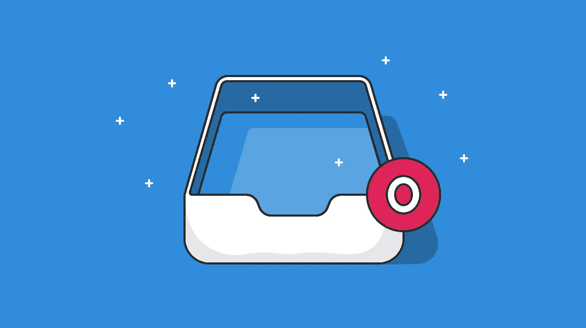
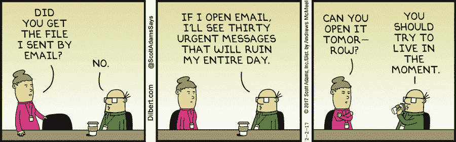
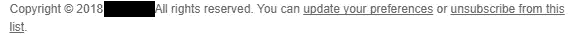
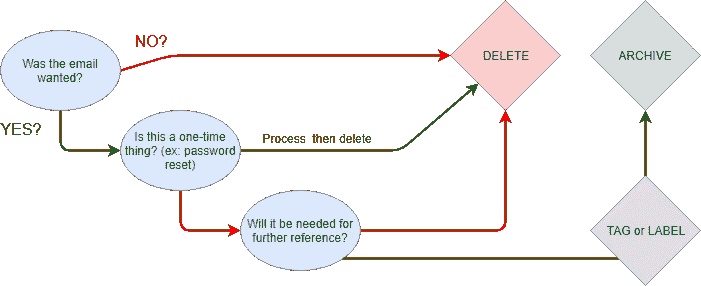
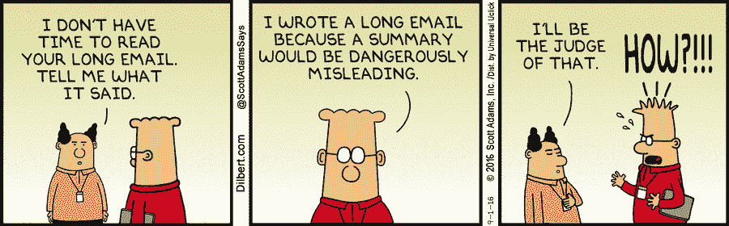

# 告别邮件超载:一个 7 步方法来区分收到邮件的优先次序

> 原文：<https://medium.com/hackernoon/farewell-email-overload-a-7-step-methodology-to-prioritize-incoming-emails-aac0035b6736>

电子邮件超载对注意力、压力和整体工作效率的影响是有据可查的。虽然它对生产力的影响是显而易见的，但其**诱发压力的特征却很少被讨论**。员工和学者可能会被快节奏和每天收到的大量电子邮件淹没。他们需要快速反应，并经常面临错过关键沟通的恐惧。

> *研究已经证明了电子邮件超载的负面影响，包括孤独感、焦虑和失控；更长的工作日；更快的工作节奏；任务碎片化；甚至电子邮件成瘾(Alberts，2013；蔡斯&克莱格，2011；杰里简，里德，&里斯，2013；马鲁兰达-卡特&杰克逊，2012)。alberts(2013)的定性研究显示，员工在管理电子邮件时会感到失控，会产生快速回复电子邮件的心理压力，并害怕错过通过电子邮件传达的重要信息。*

–[管理工作场所的邮件超载](https://www.researchgate.net/profile/Kim_Mcmurtry/publication/264710192_Managing_Email_Overload_in_the_Workplace/links/59da6dcb0f7e9b12b36d8897/Managing-Email-Overload-in-the-Workplace.pdf) |金·麦克默蒂，2014 年 8 月。

# 量化电子邮件超载的影响

电子邮件超载对生产力有几个影响。很难量化它们，因为每个公司和个人的使用和电子邮件习惯都不一样。然而一些影响现在被记录下来了:

*   **中断效应**:在电子邮件中断后，个人平均需要 [64 秒才能恢复工作。考虑到普通员工每天查看邮件 15 次，这已经是每天一刻钟的时间了。](https://pdfs.semanticscholar.org/dda7/06cda1110b2d476112b44c109f3a6e53d301.pdf)
*   信息不足:电子邮件通常不精确，主题误导(如果有的话)或者太模糊。在最好的情况下，这会导致更多的来回，或者信息被忽略。
*   管理电子邮件:考虑到收到的邮件数量庞大，处理电子邮件可能需要一段时间。不同的人、不同的行业和不同的估计，每天花在处理电子邮件上的时间是不同的。根据来源的不同，我们谈论的是每天损失的一到几个小时的工作时间:[根据福布斯](https://www.forbes.com/sites/annabelacton/2017/07/13/innovators-challenge-how-to-stop-wasting-time-on-emails/#796910779788)的 2.5 小时，[根据卡尔顿大学](https://newsroom.carleton.ca/archives/2017/04/20/carleton-study-finds-people-spending-third-job-time-email/)的每周 17 小时

# 良好的电子邮件习惯的必要性

有几种方法可以帮助你避免电子邮件超载。有些人专注于工具；其他公司有一套经过实地测试的流程来对洪水进行分类。再好的工具也无法修复坏习惯，所以答案并不一致。我们提出的解决方案包括两者的健康结合。

在这篇文章中，我们将关注你可以拥有的良好实践，这样访问你的邮箱将不再有压力，甚至可能变得有趣！我们希望，但我们在这里谈论的是电子邮件，抱歉。因为可以用来强化这些习惯的工具通常是特定于服务的，所以我们把它们留到了其他文章中。

*Source:* [*Dilbert Comics*](http://dilbert.com/strip/2017-02-02)

这些习惯的好消息是它们是服务竞争的。无论你的电子邮件服务提供商或客户是谁，你都可以强制执行:它们依赖于随处可见的基本功能。那么这些有价值的邮件习惯是什么呢？下面是对最具影响力的一个问题的快速概述:

# 7 步方法

养成良好的电子邮件习惯会让你更容易对它们进行分类，因为这减少了你要处理的原始邮件数量。他们只会带你到这里；很抱歉让你失望了，但是我们的电子邮件超载问题没有神奇的解决方法。

我们所拥有的是有效整理混乱的流程。为了清楚起见，我们将它组织成 7 个不同的步骤，它们本身重新组合成三个高级类别。让我们开始吧！

# 清理杂物

在我们开始整理你的收件箱之前，最简单的方法是**减少收到的邮件数量**。

## 步骤 0:清理收件箱

事实上，第一步也是最明显的一步经常被忽视:**减少每天收到的邮件数量**。彻底清理你的收件箱需要 30 分钟。这是值得的:

*   你真的在阅读你订阅的所有时事通讯吗？
*   你使用的应用程序发来的**邮件呢**，你需要全部吗？现在大多数服务都可以精确地设置电子邮件:不要让 Twitter 每提到一次就给你发邮件。
*   你收到的任何自动邮件都必须包含让你退订或管理联系频率的选项:充分利用这个设置。

是的，现在经历所有这些退订和选择是一件痛苦的事情，但是想想每天收到的所有无用的电子邮件(至少对你来说)所造成的复合时间损失。你应该得到更好的关注。

## 第一步:装满垃圾桶并存档

所有的电子邮件服务都有一个垃圾箱和一种存档电子邮件的方法，但是许多人忽略了这些功能。把它们想象成**你邮箱**的第一道防线。下面是一个简单的三步流程:

1.  这封邮件是要的吗？如果没有，请返回步骤 0 并将其删除。
2.  邮件是一次性的吗(比如密码重置邮件)？如果是，则处理并删除；如果答案是否定的，你可以继续走下去。
3.  你需要给**进一步参考**的邮件吗？如果没有，你知道路:直接到垃圾箱。如果是，您可能希望在存档之前对其进行适当的标记。我们将更深入地研究标记步骤。

# 整理乱七八糟的东西

既然我们已经有了简单的目标，是时候开始分类了。不用担心；你只需三步就能完成！

## 第二步:不要简单地阅读你的邮件，处理它们

这一步更多的是在你查看邮件的时候改变你的心态。去邮箱里读它就像去脸书“查看订阅”:一个时间冲水的入口。

相反，如果你想在处理邮件时保持高效，你就必须**带着一个目的去检查你的邮箱**:处理它们。

根据您的个人资料，它将采取不同的形式，以下只是一些建议，让您更清楚地了解我们的意思:

*   在你一天中的特定时间窗口处理邮件:比如早上一个，晚上一个。这有助于你确保不让电子邮件占用你的工作日。
*   **禁用邮件通知**:如果你还是经常被打断，那么上面的话还有什么意义呢？没有邮件要求你在一分钟内回复。
*   **先处理，后行动**:你可以第一次浏览你的邮箱，扔掉不必要的，回答容易的，标记需要更多时间的。之后，您就可以自由处理需要更多关注的问题了。

## 第三步:两分钟规则

2 分钟规则是一个简单而强大的概念。它不是专门针对电子邮件的，因为它是作为一种处理新任务的方式来制定的，但在我们这里描述的电子邮件方法中可以完美地工作。

可以总结为:处理这封邮件需要 2 分钟以内吗？现在就做。需要更多吗？现在就花时间计划你想什么时候做，或者把它委托给愿意为你做的人。

## 步骤 4:使用文件夹和过滤器进行高级排序

文件夹可能是整理邮件最简单的方法。只有你能决定哪些文件夹是你需要的，但是最佳点似乎在五个文件夹左右。一些实现了对文件夹的主题方法(例如`work`、`project`、`personal`、`shopping`和`services`)，而另一些则基于电子邮件状态创建流程(`action`、`waiting`、`archive`)。两个作品，挑最适合自己的。

手动排序是有用的，但是当您自动化这个过程时，它会变得更好。我们将在下一个技巧中解决这个问题。

**使用+号**

无论您的电子邮件提供商是谁，**您都可以在您的电子邮件地址**(在@之前)添加+任何内容。例如，Bob 可以通过他的`bob.mcbobby@gmail.com`地址接收发送到`bob.mcbobby+test@gmail.com`的电子邮件。有什么意义？嗯，它可以极大地帮助你理清头绪，这里有一些想法:

*   `youremail+news@provider.com`对于时事通讯
*   `youremail+social@provider.com`–社交网络电子邮件
*   `youremail+ecom@provider.com`对于您注册的购物网站
*   `youremail+official@provider.com`–官方/法律服务

**如果你彻底使用了+号，整理你的邮箱将会毫不费力**，因为你可以使用接收地址来过滤它。例如，发送到`youremail+news@provider.com`的电子邮件可以自动移动到简讯文件夹。这是在新邮箱中实现的一个非常好的实践。

# 避免增加噪音

现在你有了整理收件箱的基本知识，你想成为一个负责任的电子邮件公民吗？为你的同事、客户或潜在客户减少噪音不仅会让他们的生活更加轻松，也会让你的生活更加轻松！最终，电子邮件噪音会影响到从发件人到收件人的每一个人，甚至抄送人和密件抄送人。

## 第五步:有效写作

节约:你说得越少，越多人会愿意听你说话。让我们考虑以下两个人物角色(与你同事的任何相似之处纯属巧合):

1.  饶舌的鲍勃:他会回复几乎所有的电子邮件，并提供许多细节。他会告诉你你的邮件给他的感觉，他为晚餐做了什么安排，如果你幸运的话，你可能会在绒毛中发现一点信息。
2.  简洁的伊娃:她话不多，但当她说话时，她是认真的。她不是那种把个人生活和职业生活混为一谈的人，所以当你看到一封来自伊娃的电子邮件时，你会知道这又是一份乳蛋饼食谱。

人们最愿意听谁的话？我们都会毫不犹豫地给予简洁的伊娃更多的关注:她明白关注是一种稀缺资源，并尊重她的读者/听众。用技术术语来说，我们可以说伊娃的信噪比很低(- >噪音更少)，而鲍勃的信噪比却很高。

当涉及到专业邮件时，回复所有就像核选项一样:只有在你确定有必要的情况下才应该考虑。

所以在扔炸弹之前，这里有三个问题需要回答:

1.  你真的需要父母邮件中的任何人来听你说些什么吗？在`Reply`和`Reply All`之间存在一个充满可能性的世界:**负责任地选择你的接收者**。
2.  对话是关于一个主要问题还是一个决定？如果是的话，回复所有可能会有更多的来回。
3.  电子邮件是这种对话的最佳媒介吗？如果没有，你最好安排一次会议或一个电话来处理它。

## 第六步:行动导向写作

当你回复一封电子邮件时，想想你正在努力实现的行动。例如，如果你提议会面，不要只是提议:这需要不必要的`when/where are you available?`回答。相反，你可以通过建议三个你有空的时间窗口和一个地点，让你的回复立即可行。如果地点和时间合适，你的收件人可以在一个回复中“结束会议”。

**利用列表**

保持邮件的可操作性:使用编号列表。清单很棒，因为它迫使你简洁地组织你的想法。此外，他们将有助于在回复中引用你的邮件，因为回复者可以提到`third item`，甚至只提到`3/`，而不是`Monday's discussion with the marketing team regarding the pricing strategy`。

为了更进一步，只要有可能，你可以试着把你的清单分成两类:**信息流和行动流。**信息流是你想要交流的东西，而行动流需要接收者的行动:例如，如果你问他一个问题，或者委派一项任务。

# 接近收件箱零？

我们希望这个邮件分类过程的概述能帮助你保持收件箱的整洁，甚至找到零收件箱的圣杯。你可能会问，这是什么？

零收件箱是一种非常严格的电子邮件管理方法，目标是让你的收件箱一直是空的，或者尽可能的空。这个概念是由梅林·曼在谷歌技术讲座上介绍的。

收件箱零可能是为纯粹主义者准备的:它可能是一个理想而不是绝对的目标。**可以肯定的是，收件箱受益于整洁**。还记得我们在文章开头提到的复利时间损失吗？难道你不会感谢你今天花了几个小时来建立一个削减它的过程吗？不要让明天-你决定。

*原载于 2018 年 9 月 25 日*[*gwapit.com*](https://gwapit.com/blog/email/farewell-email-overload-prioritization/)*。*