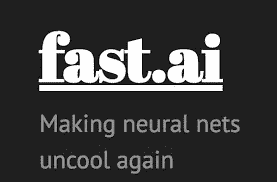
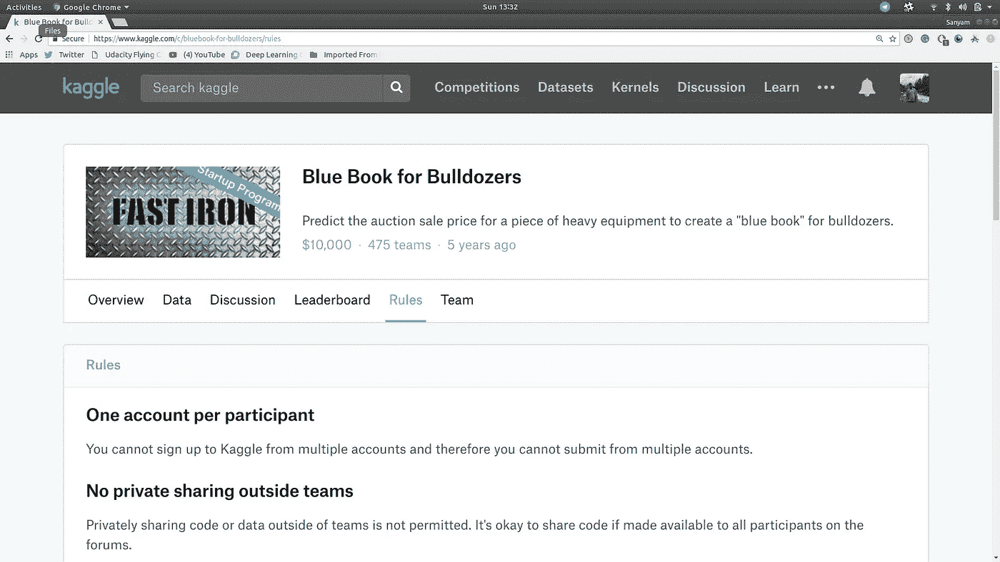
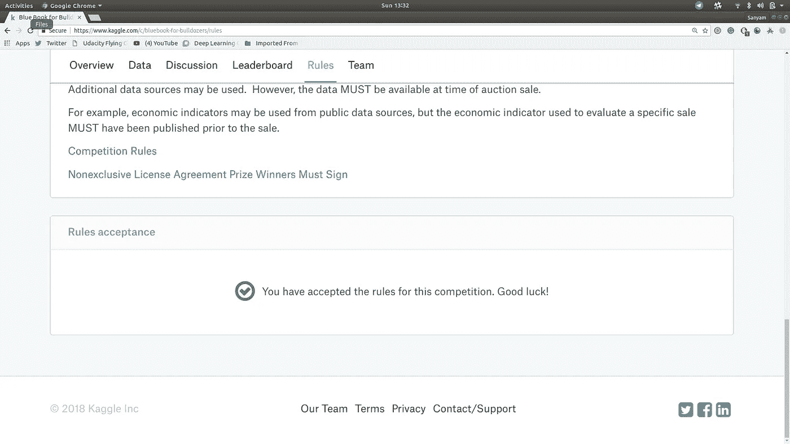
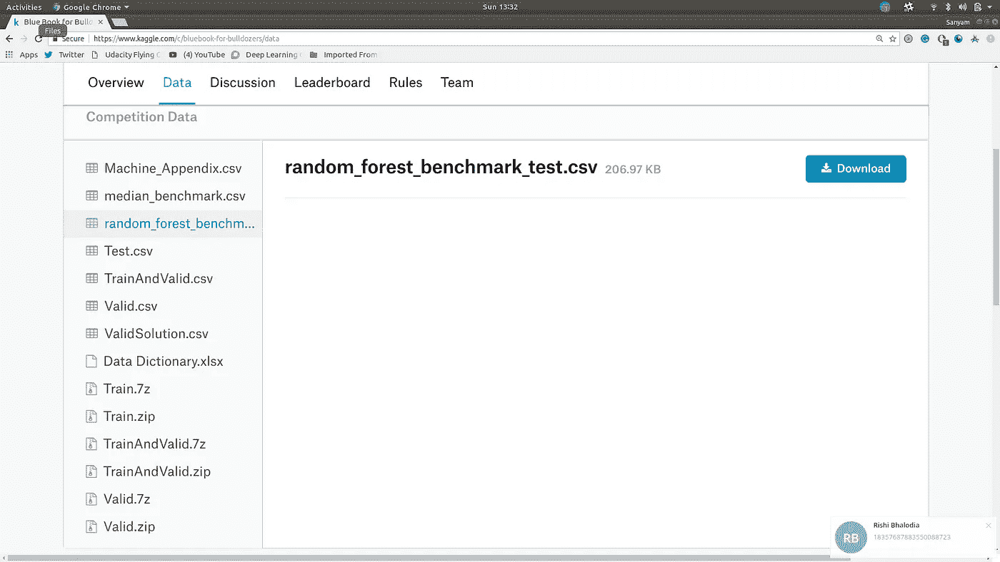
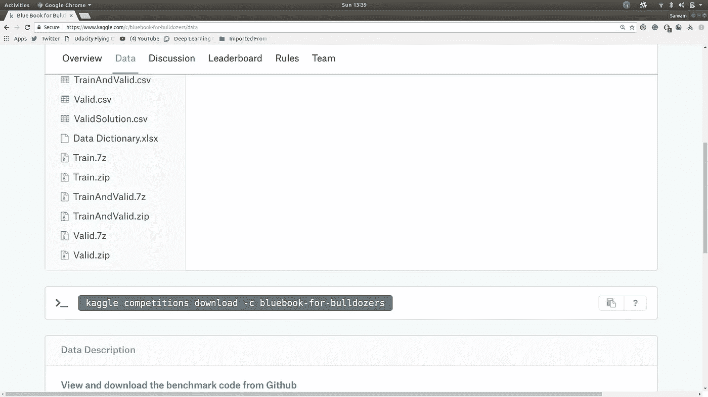

# 快速人工智能机器学习第一讲笔记

> 原文：<https://medium.com/hackernoon/fast-ai-machine-learning-lecture-1-notes-3ca45cec4235>



这些是程序员 MOOC 的 [Fast.ai](https://hackernoon.com/tagged/fast-ai) 机器[learning](https://hackernoon.com/tagged/learning)g 的(非官方)讲义。

你可以在这里找到[官方帖子](http://forums.fast.ai/t/another-treat-early-access-to-intro-to-machine-learning-videos/6826)

> 这是 1/12 部分的课堂讲稿。

# 介绍

*   在 USF 教授的课程，以 MOOC 的形式提供。
*   [课程网站尚未上线，一旦上线我会更新链接。同时，你可以在这里找到官方帖子
*   提示:检查视频中的“卡片”。

## 本地设置的替代方案:(具有快速人工智能支持)

*   Crestle
    定价:每小时 3 美分(近似值)
    Jupyter Nb 在浏览器中打开
*   图纸空间

## 本地设置说明:

假设您有自己的 GPU 和 Anaconda 设置(最好是 CUDA ≥9):

```
$ git clone [https://github.com/fastai/fastai](https://github.com/fastai/fastai)
$ cd fastai
$ conda env update
```

*   使用此处提供的[设置脚本](http://files.fast.ai/setup/paperspace)

```
$ bash | wget files.fast.ai/setup/paperspace
```

## 学习方法

*   跟着走。
*   先看后跟(失去推荐)。你可能会错过一些重要的信息，你可以尝试一下。

## 教学方法:

*   钻研代码
*   构建模型
*   理论随后出现，在这一点上，你将能够有效的编码。
*   尝试更多数据集。
*   编码做的越多越好(校友推荐)
*   写博文。

> “嘿，我刚刚学到这个概念，我将分享它”

## 优秀的技术博客:

*   [彼得·诺威格](http://nbviewer.jupyter.org/url/norvig.com/ipython/ProbabilityParadox.ipynb)(更多[此处](http://norvig.com/ipython/))
*   斯蒂芬·梅蒂
*   [朱丽亚·埃文斯](https://codewords.recurse.com/issues/five/why-do-neural-networks-think-a-panda-is-a-vulture)(更多[在此](https://jvns.ca/blog/2014/08/12/what-happens-if-you-write-a-tcp-stack-in-python/))
*   朱莉娅·费拉奥利
*   [陈](http://blog.echen.me/2014/10/07/moving-beyond-ctr-better-recommendations-through-human-evaluation/)
*   斯拉夫·伊万诺夫 (fast.ai 学生)
*   [布拉德·肯斯特勒](https://hackernoon.com/non-artistic-style-transfer-or-how-to-draw-kanye-using-captain-picards-face-c4a50256b814) (fast.ai 和 USF·MSAN 学生)

# 进口

*   自动重新加载命令:

```
%load ext_autoreload 
%autoreload 2
```

如果您修改了导入的源代码，您将不得不重新加载内核以反映这些变化。

如果您更改了源代码，这两行代码会自动重新加载 Nb。

```
%matplotlib inline 
```

内嵌式绘图

```
from fastai.imports import*
```

> 数据科学不是软件工程。原型模型需要以交互方式完成。
> 
> import *允许所有东西都存在，我们不需要确定细节。

## 朱庇特诡计

```
fn_name?fn_name??fn_name
```

*   给出 fn_name 库
*   给出了 fn 的详细信息
*   给出了 Fn 的源代码

## 获取数据

Kaggle:由公司/机构发布的真实世界问题。
这些都是非常接近真实世界的问题，让你对照其他竞争者来检验自己。

TL；博士:检查你技能的最佳地方。

> 杰里米:“我从 Kaggle 比赛中学到的东西比我一生中所做的任何事情都多”



*   转到竞争页面。
*   接受条款和条件。



*   下载数据集



运筹学

*   设置官方 Kaggle API



*   使用终端下载数据集。

运筹学

*   使用 CurlWget Chrome 扩展。
*   开始下载并取消它。
*   点击扩展。
*   将复制的命令粘贴到终端。

注意:推荐将数据下载到您云计算实例的有用技术。Crestle 和 Paperspace 将预下载大部分数据集。

> 好习惯:为你所有的数据创建一个文件夹

在 Jupyter 中运行 BASH 命令

```
!BASH_COMMAND
```

添加 Python 命令

```
!BASH {Python}
```

# 推土机蓝皮书:

目标:

> 竞赛的目标是根据用途、设备类型和配置来预测特定重型设备的拍卖价格。数据来源于拍卖结果公告，包括使用和设备配置信息。
> 
> Fast Iron 正在创建一个“推土机蓝皮书”，供客户评估他们的重型设备车队在拍卖中的价值。

*   看数据入门。

```
!head data/bulldozers/Train.csv
```

给出了前几行。

## 结构化数据:

(非官方定义)具有不同数据类型的数据列。

*   Pandas:
    处理表格数据的最佳库。
*   Fastai 默认导入熊猫库。
*   阅读 CSV

```
df_raw = pd.read_csv(f'{PATH}Train.csv', low_memory=False, 
                     parse_dates=["saledate"])
```

*   low_mem=False
    允许它将更多细节加载到内存中。

## Python 3.6 格式:

```
var ='abc'
f'ABC {abc}'
```

这允许 Python 解释{}内部的代码

## 显示数据:

```
df_raw 
```

简单地写这个会截断输出

```
display_all()
def display_all(df):
    with pd.option_context("display.max_rows", 1000, "display.max_columns", 1000): 
        display(df)
```

这允许打印完整的 df。

```
display_all(df_raw.tail().T)
```

由于列很多，我们采取了转置。

## 评估:

因为度量是 RMSLE，所以我们在这里考虑对数值。

均方根对数误差:实际拍卖价格和预测拍卖价格之间的误差。

## 随机森林:

*   简介:通用机器学习技术，可用于预测分类/连续变量。
*   它可以处理像素值/列。
*   总的来说，不会过拟合。
*   很容易避免过度拟合。
*   没有任何验证单元格也能正常工作。
*   不需要统计假设。

TL；大卫:这是一个很好的开始。

## 维度的诅咒:

列数越多，数据点位于边缘的数学空间就越空(数学属性)。

这导致点与点之间的距离毫无意义。

> 总的来说，假的。

*   即使数据点位于边界上，它们也有距离。
*   90 年代理论研究更重。
*   在大量的柱子上建立模型非常有效。

## 没有免费的午餐定理:

没有一种通用的模型可以适用于所有类型的数据集。

一般来说，我们会查看由某种原因/结构创建的数据。实际上，有一些技术可以很好地适用于我们处理的几乎所有常规数据集。决策树集成是应用最广泛的技术。

```
ValueError: could not convert string to float: 'Conventional'
```

SKLearn 不是最好的库，但对我们的目的来说还是不错的。

## 随机森林:

```
from sklearn.ensemble import RandomForestRegressor, RandomForestClassifier
```

*   回归量:
    连续值。
*   分类器:
    对值进行分类。

注意:回归！=线性回归。

# 特征工程

RandomForest 算法需要数字数据。

*   我们需要把一切都转换成数字。

数据集:

*   连续变量。
*   分类:
    -数字
    -字符串
    -日期

```
df_raw.saledate
```

日期内的信息:

*   是节日吗？
*   是周末吗？
*   天气。
*   事件信息。

```
??add_datepart
```

去看看源代码。

这将获取字段“fldname”
注意:df.fldname 将从字面上查找名为 fld name 的字段。

> df[fldname]通常是一个更安全的选项。这是一个安全的赌注，不会在我们犯错时出现奇怪的错误。不要偷懒做 df(点)fldname
> 
> 此外，df[fldname]返回一个序列。

该函数遍历所有的字符串，它在对象内部查找并找到具有该名称的属性。这样做是为了创建可能与我们的案例相关的任何列。(与维数灾难正好相反——我们正在创建更多的列)

> 向数据中添加更多的列没有坏处。

链接 getattr()

Pandas 在属性中分解出不同的方法。

pd.dt.___ 中链接的所有日期时间

最后，我们放弃了这一列。

## 处理字符串

*   UsageBand 有低、高、中。
*   Pandas 有一个分类变量，但默认情况下它不起作用。

```
train_cats
```

为字符串创建分类变量。它创建一个存储数字的列，并存储字符串和数字的映射。

> 确保对训练数据集和测试数据集使用相同的映射。

*   类似于。dt，。cat 允许访问分类数据。

因为我们会有一个决策树来拆分列。最好有一个“合乎逻辑”的顺序。

RF 由可以分裂的树组成。拆分可以是高对低+中，然后是低对中。

# 缺少值

```
display_all(df_raw.isnull().sum().sort_index()/len(df_raw))
```

*   。如果数据有空值，isnull()返回 T/F。
*   。sum()将空值相加。
*   然后，我们对它们进行排序，并按长度进行划分，以返回缺失的值。

# 节约

```
os.makedirs('tmp', exist_ok=True)
df_raw.to_feather('tmp/bulldozers-raw')
```

羽化:以类似于 RAM 中的格式保存文件。通俗地说——就是快。

> 提示:使用临时文件夹来存放你工作时出现的所有行动/需求。

# 最后的步骤

```
proc_df
```

Structured.fastai 中的函数

*   抓取 df 的副本
*   抓取从属列。
*   从属列被删除。
*   缺失值是固定的。
*   修复丢失的
    -数值:如果它确实有丢失的值，那么创建一个名为 Col_na(布尔列)的新列，并用中间值
    替换 _ na-非数值和分类:用代码替换并加 1。

```
df, y, nas = proc_df(df_raw, 'SalePrice')
```

# 运行回归器

```
m = RandomForestRegressor(n_jobs=-1)
m.fit(df, y)
m.score(df,y)
```

*   随机森林是可并行的
    n_jobs=-1 为我们的每个 CPU 创建一个独立的进程。
*   创建模型
*   归还分数

1 是最好的分数。

0 是最差的。

```
def rmse(x,y): return math.sqrt(((x-y)**2).mean())def print_score(m):
    res = [rmse(m.predict(X_train), y_train), rmse(m.predict(X_valid), y_valid),
                m.score(X_train, y_train), m.score(X_valid, y_valid)]
    if hasattr(m, 'oob_score_'): res.append(m.oob_score_)
    print(res)
```

# 检查过度拟合

*   我们可以创建一个验证数据集。
*   按日期排序，最近的 12，000 个日期将成为验证集。

```
def split_vals(a,n): return a[:n].copy(), a[n:].copy()n_valid = 12000  # same as Kaggle's test set size
n_trn = len(df)-n_valid
raw_train, raw_valid = split_vals(df_raw, n_trn)
X_train, X_valid = split_vals(df, n_trn)
y_train, y_valid = split_vals(y, n_trn)X_train.shape, y_train.shape, X_valid.shape
```

# 最终得分

> 如果你在 Kaggle LB 的上半部分，这是一个很好的开始。

```
print_score(m)
[0.09044244804386327, 0.2508166961122146, 0.98290459302099709, 0.88765316048270615]
```

0.25 将会在前 25%中获得一个 LB 位置

> 欣赏:没有任何思考或密集的特征工程，没有定义/担心任何统计假设-我们得到了一个体面的分数。

*如果你觉得这篇文章有用，并想保持联系，你可以在 Twitter 上找到我* [*这里*](http://twitter.com/bhutanisanyam1) *。*