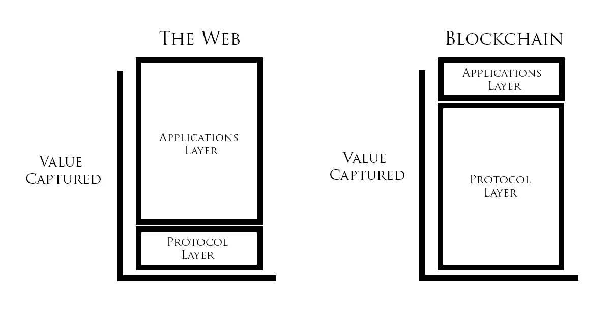

# Fat 协议与 DApps:在公共区块链上创造长期价值

> 原文：<https://medium.com/hackernoon/fat-protocols-vs-dapps-creating-long-term-value-on-the-public-blockchain-565637747557>

Fat Protocols vs. DApps; Photo by [Raphael Koh](https://unsplash.com/photos/92dgYPsir9k?utm_source=unsplash&utm_medium=referral&utm_content=creditCopyText) on [Unsplash](https://unsplash.com/search/photos/block?utm_source=unsplash&utm_medium=referral&utm_content=creditCopyText)

最近在 USV.com[上发表的一篇文章描述了一个叫做“胖协议”和“瘦协议”的概念不要与营养标签上的单词混淆，脂肪协议描述了在公共区块链上如何创造价值，以及价值储存在哪里。](http://www.usv.com/blog/fat-protocols)

根据这篇文章，如今以太坊和比特币等公共区块链的大部分价值在于协议层，而不是应用层。如果这看起来是高度技术性的，不要担心，因为我们将在一会儿分解它。

本文讨论了如何在区块链上创造和建立货币价值，以及为什么我们认为瘦协议和胖协议的想法不太正确。相反，人们需要的是一个真正革命性的、可访问的分布式黑仔应用程序，以赋予 crypto 它的“网景记忆”

## 当今互联网上的协议和应用

在我们深入讨论之前，让我们先回顾一下这些事情。

**首先，什么是协议？**简单来说，协议就是互联网的语言和软件基础设施。例如，为整个互联网提供动力的技术 TCP/IP 就是一种协议。其他协议包括电子邮件使用的 SMTP，以及在 Skype 等服务和许多电话网络中使用的 VoIP(我帮助创建的)等技术使用的协议。

**接下来，另一方面，应用**是用户与之交互的软件或程序。例如，脸书可以被描述为一个网络和电话应用，一个存在于互联网协议之上的应用。谷歌的大部分服务也可以被认为是应用程序，而不是协议；谷歌搜索是一个基于互联网协议运行的应用程序。

所以现在，我们准备探索所有这些与区块链有什么关系。

## **USV 的争论**

根据 USV 的文章，今天加密货币的所有财富(或者至少是其中的绝大部分)都是在协议层创建和绑定的。以太坊区块链本身捆绑了大量的财富，类似于一个协议。比特币、莱特币等大多数其他加密货币也是如此。虽然其中一些区块链有 DApps(相当于应用程序)，但只有一小部分区块链价值归属于它们。

此外，文章认为今天的互联网与此相反。具体来说，互联网上创造和存在的绝大多数价值都与脸书和谷歌等应用程序密切相关。

这就是 fat 协议这个术语的来源。简单地说，根据这篇文章，大多数公共区块链中的协议层是今天所有价值的所在，并将继续被创造。因此，协议层将继续是最大的(最肥的)，而应用层据称要薄得多，因为它包含的价值要少得多，并且将继续如此。

它还指出，互联网的原始协议集的发明者不能将它们货币化，因为它们是免费提供给所有互联网新来者使用的。在这一点上，我绝对同意 USV 的观点，因为在 1B，人们每天都在使用 VOIP，却没有向我支付任何版税！

## **大块头来了**

USV 的文章当然有一定的真实性。然而，认为区块链的绝大部分财富将存在于协议层面的观点是一种评估，它解释了这种情况，但没有解释其原因，事实上，这种观点正在迅速改变。

Value in the protocol layer; Source: [https://taylorpearson.me/fat-thin/](https://taylorpearson.me/fat-thin/)

许多人似乎忽略了以太坊，它被认为是“智能合约”的发明者，通过发明和普及 ICO 真正改变了世界。

> ICO 是商业史上第一次，一家公司或一个组织可以邀请几乎任何人参加众筹活动。

任何人都可以通过 ICO 筹集资金，创建新的或改进的服务，但不收取任何费用，但通过在加密交易所上市 ICO，为其用户社区创造巨大价值。比特币和以太坊的惊人成功主要为华尔街和传统金融之外的持有者创造了价值，这解释了为什么其他硬币和代币会迅速被采用，因为许多人急于复制这一模式。

以太坊社区成员通过在全球 100 多个加密交易所买卖 ETH，每秒钟对以太坊社区的价值进行投票。因此，ETH 的价格会根据社区对以太坊平台(Fat 协议)的健康状况以及 ICO 流程作为公司创建的未来商业模式(DApp)的可行性的共识而上涨或下跌。事实上，可以把 DApp 加密估值看作是华尔街用来评估上市公司的贴现现金流估值法的等价物。

因此，所创造的价值不是在以太坊的“Fat 协议”中创造或存储的，而是以太坊持续吸引相信平台及其效用的项目和成员的能力。ETH 价格的上涨与其作为部署 DApps 和 ICO 的主导平台的崛起直接相关，而其最近的价格下降可以直接归因于其他解决方案的崛起和 ICO 社区的监管压力。

> ICO 结构使一个社区能够以自己的速度诞生、成长，而没有来自金融投资者或风投的传统压力，来构建“市场需要”并交付社区需要的东西。

这种从我们如何创造和最大化利润到我们如何最大化社区增长的焦点转变是全新的和革命性的。这是我们 500 年来看到的最大的浪潮，它威胁着取代和拆除每天主宰我们生活的中央收费员创造的垄断。

社区银行和互联网服务提供商等声称“不作恶”的公司，已被“我们拥有你所有的钱，我们大到不能倒”和“我们拥有你所有的数据和数字身份”的合法垄断所取代。

世界各地的用户都愿意在这个 ICO " [寒武纪大爆发](/@CelsiusNetwork/celsius-network-leads-the-fintech-cambrian-explosion-5af72f90c3ce)"中“下注”资本，给年轻的公司一个机会，用人民为人民建造的 DApps 取代这些巨头。由于大多数 DApps 不需要产生任何收入或利润来增加他们的会员，他们可以很容易地与大多数银行和互联网收费员竞争。

每天，网上有越来越多的像以太坊一样由区块链驱动的 DApps。一旦这些应用程序扩展了它们的效用，创建了普通用户可以访问的友好的 UX，它们的功能就变得不可或缺了。就像今天的许多在线服务一样，随着这种情况的继续，DApps 在区块链应用层的价值将不可避免地膨胀。

不幸的是，事实是，今天大多数 DApps 都不是分散的、高度技术化的，并且不是非常用户友好的。要么是这样，要么是他们瞄准了非常特定的利基技术受众，如高级加密货币用户。

> 为了从 fat 协议创造或存储大部分价值的理念中发展，这个世界需要一种 DApp，它能够提供不可或缺的服务，同时还能为所有体验级别带来一流的 UX。它需要自己的杀手级应用。

## **摄氏网络 DApp**

Celsius Network 的最终目标一直是让下一个 1 亿用户使用 crypto，并帮助区块链跨越早期采用者和大规模采用之间的鸿沟。为了做到这一点，我们需要为下一波采纳者提供我们在本文中讨论的引人注目的、基本的、易于使用的应用程序。

就易用性而言，Celsius 花了大量时间来研究和开发一个极其流畅、自然且易于使用的界面。这是为了确保任何可以使用移动电话的人都可以参与并与区块链互动。我们希望消除不确定性，消除目前存在的所有技术障碍。我们还想通过说服大多数用户使用 HODL 来降低波动性。

HODL; Photo by [Lukas Blazek](https://unsplash.com/photos/UAvYasdkzq8?utm_source=unsplash&utm_medium=referral&utm_content=creditCopyText) on [Unsplash](https://unsplash.com/search/photos/hold?utm_source=unsplash&utm_medium=referral&utm_content=creditCopyText)

我们经常将它与经典的 Netscape Navigator 进行比较。Netscape Navigator 是最早广泛流行且易于使用的网络浏览器之一。从几十年前开始，它是普通大众早期采用互联网的主要催化剂之一。

> 我们的目标是让 Celsius Network DApp 成为加密货币的“网景时刻”，因为它有能力引发一场革命。

发展我们想要的 DApp 的下一个重要组成部分是，它需要提供一些不可或缺的、每个人都需要的东西。今天，大银行充当了巨大的收费员，通过对无担保贷款和信用卡债务收取难以置信的高利率来利用客户，而对储户的存款支付不到 1%的利息。

我们认为，这种做法是滥用和不可持续的，因为银行的所有权力都来自其储户群体。我们证明了公众想要为此做些什么，因为在我们的 ICO 期间，全球有超过 500，000 人访问了我们的网站，超过 20，000 人注册参与并了解加密货币和区块链。一旦他们发现加密货币和 Celsius 网络的结合作为银行的替代方案所提供的自由和灵活性，他们就用钱包投票，贡献了 5000 万美元来帮助我们建立这个平台。

不仅如此，我们还希望 Celsius 能够为整个金融界的贷款提供一些最低的利率(无需信用评分检查)，以及为储户的加密货币存款提供一些最高的利率。

这听起来不可能，但如果我们中的一小部分人停止向银行提供资金，转而创建一个向自己的成员放贷的社区，我们就可以获得大银行的所有利润，以较低的利率分配给借款人，以较高的利息支付给贷款人，同时为其成员每天衡量其价值的人建立一个由人民管理的社区平台。通过这种方式，我们的代币采用者可以从社区的增长和影响中受益，就像以太坊的采用者从相信和支持该社区中受益一样。

事实上，我们相信 Celsius 有能力带来下一波采用浪潮。每个人都需要借贷，每个人都需要储蓄。为什么不采取一种不不对称、不滥用的方式，让顶层的人获得所有利润呢？

## **摧毁护城河**

USV 的文章还说对了一件事，那就是，由于今天人们把太多的注意力放在了应用层上，我们现在有了这些高度集中的大规模数据仓库，它们被有效的护城河或墙所包围。您在 Google 上的个人数据，如您的搜索历史、电子邮件和 Google drive 中的内容都存在于 Google 的域中。脸书也是如此，他们收集了你大量可疑的数据。

这是仅在应用层快速开发和投资的不幸结果，没有首先充分利用协议的能力。

区块链最令人惊奇的特征之一是，在其上运行的 DApps 必须以有益于整个社区的方式运行，以便它们能够生存。如果有人要创造一个 DApp，采用类似于今天银行和科技公司运作的做法，他们肯定会很快被抛弃，因为区块链的公众用户可以用脚和钱包自由投票，这在当前的互联网上是不真实的。

这就是为什么我们认为，与公共区块链相结合的去中心化具有平衡的价值，而不仅仅关注某一层，而是同时利用协议(区块链)和应用层(DApps)的全部功能。此外，我们坚信，区块链技术公司将在某一点上很大程度上取代，或者至少，对我们每天使用的日益集中化的互联网的现有中坚力量提供极其可行的竞争。

事实上，正是通过民主行动党和区块链公众的力量，我们才能表明自己的立场，而不仅仅是一份“肥胖协议”。

权力属于人民！