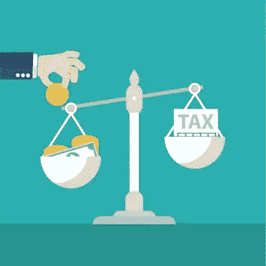

# 加密货币的 FBAR 报告要求

> 原文：<https://medium.com/hackernoon/fbar-reporting-requirements-for-cryptocurrency-8f40f2787ec9>

外国银行和金融账户报告(FBAR)适用于加密货币吗？这是一个加密税社区中的流行问题，没有人有明确的答案。本文分解了 FBAR 及其如何应用于加密货币。

# FBAR，什么时候适用？

根据 [**金融犯罪执法网络**](https://www.fincen.gov/) (FinCEN)发布的 FBAR 申报指示，在外国金融账户中拥有金融权益或签字权的美国人，如果该外国金融账户的总值在该日历年的任何时候超过 10 000 美元，必须申报 FBAR。金融账户包括但不限于证券、经纪、储蓄、活期、支票、存款、定期存款或金融机构(或履行金融机构服务的其他人)维护的其他账户。金融账户还包括商品期货或期权账户、具有现金价值的保险单、具有现金价值的年金保单以及共同基金或类似集合基金的股份。

在关于加密货币的唯一官方指导文件[**IRS Notice 2014–21**](https://www.irs.gov/pub/irs-drop/n-14-21.pdf)中，美国国税局(IRS)确定虚拟货币被视为财产，而非货币，用于 [**税收目的**](https://www.cryptotrader.tax/blog/the-traders-guide-to-cryptocurrency-taxes) 。从上面金融账户的定义可以看出，房产不在名单上。因此，一些人认为加密货币不属于 FBAR 备案要求。到目前为止，国税局和 FinCEN 都没有发布官方指导，以澄清 FBAR 是否适用于加密货币。如果你在互联网上研究这个问题，你会看到相互矛盾的结论，一些人认为加密货币不受 FBAR 的约束，而一些人则不这么认为。

# 行业专业人士在说什么？

2014 年 6 月，美国国税局小企业/自营部门的一名分析师在一次网络广播中表示，出于 FBAR 的目的，[比特币](https://hackernoon.com/tagged/bitcoin)不需要报告“……目前不需要。”国税局的分析师还表示，“FinCEN 已经表示，虚拟货币将不在 FBAR 报告，至少在这个申报季节。”然而，没有为 T2 未来的税收年度提供指导。美国注册会计师协会(AICPA)于 2016 年 6 月 16 日向国税局发出一封信，要求国税局就加密货币的 FBAR 报告要求提供进一步指导。但是国税局还没有做出任何回应。

一些税务律师认为，既然判例法发现外国在线赌博账户符合 FBAR 的备案要求，外国加密货币交易所也一样。2018 年 8 月 9 日，FinCEN 主任 Kenneth Blanco 发表了关于该机构加密货币方法的 [**演讲**](https://www.fincen.gov/news/speeches/prepared-remarks-fincen-director-kenneth-blanco-delivered-2018-chicago-kent-block) 。演讲提供了一些有益的澄清和见解，但也留下了一些重要的问题没有回答。Blanco 主任在发言中重申，ico 是汇款人，受 FinCEN 的反洗钱条例管辖。布兰科主任的发言还提出，某些点对点的交流是金钱的传递者。然而，这个演讲仍然留下了相当多的模糊之处。

# 宁可事先谨慎有余

尽管外国申报要求存在不确定性，但许多秘密税务专家建议谨慎行事。他们的观点是，报告永远不会有坏处，不报告风险太大，因为在最糟糕的情况下，不报告可能会导致 10 万美元的罚款和监禁。

在我的加密税务实践中，我建议我的客户申报 FBAR，如果他们拥有位于美国境外的任何加密交易所账户，并且账户价值在纳税年度的任何时候超过$10K 美元。即使 FinCEN 没有发布指南说加密货币需要根据 FBAR 进行报告，该机构也没有发布任何声明说如果你现在不在你的 FBAR 上报告加密货币，你将来不会因违反 FBAR 而受到牵连。换句话说，FinCEN 可以在未来回头对你进行处罚，你现在没有办法回头改变你的不报记录。没有税收或备案费用与 FBAR 备案，这几乎是一个没有大脑的文件。相反，不备案的风险很高，会让你处于一个不确定的世界。

‍

**Sharon Yip-Crypto Tax Advisors，LLC**

Sharon Yip 是一名拥有 20 年公共会计和公司税务经验的注册会计师。她是 [**Crypto Tax Advisors，LLC**](https://crypto-taxadvisors.com/) 的创始人和所有者，这是一家专门从事加密货币税收的税务公司。该公司专注于为从事复杂加密交易或参与加密货币的客户提供全职服务。沙龙提供全面和个性化的商业和税务服务。她的客户包括加密货币交易商、矿工和加密领域的企业主。

*使用* [***CryptoTrader 自动报告您的加密货币资本收益。税务***](http://www.cryptotrader.tax/) 。

*最初发布于*[*www . cryptotrader . tax*](https://www.cryptotrader.tax/blog/fbar-reporting-requirements-for-cryptocurrency)*。*