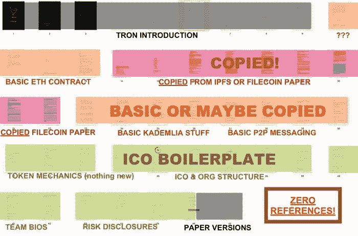
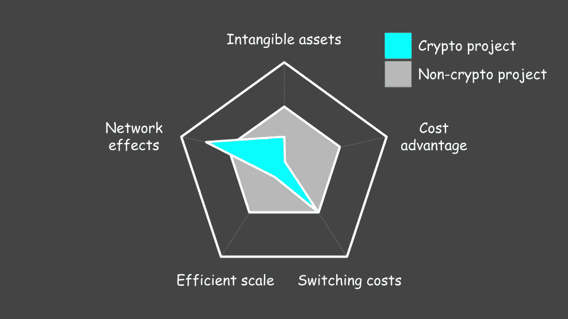

# 害怕秘密模仿

> 原文：<https://medium.com/hackernoon/fear-of-crypto-copycats-2ffabc375534>

在加密项目中，复制非常猖獗。

每个星期，我都会收到一些人发来的消息，他们正在建设“为 AR 分散土地”或“为中国分散土地”，或者，我最喜欢的，“以不同的名字分散土地”

考虑加密游戏。一个完整的游戏类别是带有重命名变量的 crypto namespaces 智能合约。

一个最明显的抄袭例子来自一个名为 TRON 的项目。其白皮书的正文抄袭了 IPFS 和 Filecoin。

Filecoin 的创始人 Juan Benet 发布了这个谴责性的分析，引起了社区的广泛嘲笑。

结果呢？创是十大硬币。

在这个颠倒的世界里，我们的项目领导要求其他项目采用他们的代码。最近，Vitalik [对 EOS consensus model](https://github.com/EOSIO/eos/issues/2718) 的一个提案发表了评论，担心他们的提案不安全。

> *“这似乎并不安全。”*

他接着概述了两个冲突块最终确定的情况，并以下面的建议结束:

> *“如果你想要一个直观的好方法来做这件事，我推荐使用我们的卡斯帕·FFG 论文中的算法:https://arxiv.org/abs/1710.09437"*

Vitalik 要求 Larimer“复制”以太坊基金会开发的算法。

在项目开源的环境中，抄袭就像区块链一样，势不可挡。一些人认为这意味着加密项目无法抵御竞争对手，获胜的项目将拥有最佳的上市策略。

沃伦·巴菲特会怎么说？

> *“在商业中，我寻找有牢不可破的‘护城河’保护的经济城堡”——沃伦·巴菲特*

项目应该建立护城河:抵御竞争对手的可持续竞争优势。

# 经济护城河的来源和秘密项目有吗？

经济护城河有五个来源:

1.  **成本优势**(例如规模经济):当一家公司利用其规模或独特的资产在成本上削弱竞争对手。
2.  **无形资产**(如专利、品牌、商业秘密):公司持有专利或品牌等无形资产，导致市场垄断或定价权。
3.  **有效规模**:当有限规模的市场由一家或少数几家公司(如公用事业、机场)提供最佳服务，而竞争者因市场回报低于资本成本而不愿意进入时。
4.  **转换成本**:当客户为了从一个供应商转换到另一个供应商而不得不产生费用或不便时。
5.  **网络效应**:随着更多人的加入，网络对新老用户的价值都增加。

加密项目有这些吗？

# 利用成本优势进行防御

假设我们是最大的智能合约协议以太坊。在一个有成本优势的行业，我们会利用我们的优势来削弱竞争对手。我们能做到吗？

绝对不行。我们将辛辛苦苦地想出像卡斯帕 offer 这样的创新，只为了让我们无畏的领袖把它提供给 EOS。

在开源领域，成为最大的意味着你不能等着别人为你开发解决方案。对于跟风者来说，划算的解决方案是等待，不在 R&D 花费任何资源，从创新者那里获取你需要的东西。

# 用无形资产辩护

有一些用无形资产保护项目的好例子。让我们逐一查看专利、品牌和商业秘密。

**专利:** Hashgraph 是一种新的智能合约协议，其底层技术已经获得专利。我们将会看到专利的可辩护性有多强，以及社会对专利公共区块链的反应如何。

**品牌:**品牌很重要，但很难说有多重要。比特币似乎受益于成为人们想到的第一种硬币。以太坊同样受益。0x 和阿拉贡有光晕效果。人们可能期望品牌在吸引和留住网络成员方面发挥有意义的作用，但现在下结论还为时过早。

商业秘密: Starkware 是一个专注于 STARK 技术的新项目(一种隐私和可伸缩性技术，很少有人精通)。他们计划向项目提供他们的专业知识以换取代币。要让这种模式发挥作用，他们的专业知识必须几乎无法复制。这个策略甚至比 Hashgraph 的更有趣。

我们看到有人试图用无形资产进行防御，但我们必须等待，看看这些防御是否有效。

# 以高效的规模进行防御

有效的规模意味着新公司进入一个给定的市场是无利可图的。新公司会压低利润，让所有人都无利可图。

这是否意味着加密项目应该选择利基市场？我们应该为猫建立一个预测市场，而不是建立一个智能合约协议吗？

这可能会在一段时间内阻止竞争对手，在这段时间内，我们的想法对潜在的竞争对手来说显得愚蠢或微不足道，但由于复制成本接近于零，有效的规模对于加密项目来说并不重要。如果有任何证据表明市场有价值，跟风者几乎可以免费进入。

# 利用转换成本进行防御

转换成本是存在的，尽管关于转换成本高到什么程度还存在争议([我认为足够高](https://www.tonysheng.com/doubts-contract-interoperability) ) [6](https://www.tonysheng.com/fear-crypto-copycats#fn:6) 。

以以太坊为例。平台上构建的项目越多，开发者就越多。开发人员越多，工具和共享的知识就越多。工具和共享知识越多，平台对其他开发人员的吸引力就越大。尝试要求开发人员在加入社区、学习语言并采用工具后进行转换。这将是很难的，除非他们讨厌这种体验，而新平台是两倍的好。

# 利用网络效应进行防御

比特币享有作为市值最大的加密货币的诸多好处。

因为它最大也最安全，比特币最有可能成为:

1.  有人购买的第一种加密货币
2.  被商家接受
3.  由机构投资者和政府持有
4.  被持有者视为价值储存手段

由于其网络效应，另一种加密货币很难超越比特币的领先地位。

作为一个新贵项目，如何建立网络效应？走向市场与网络效应的强度。

Telegram 的吨令牌计划代表着对走向市场的押注。通过利用他们数以亿计的用户，他们可以立即扩大网络规模。如果你从零开始，你可能会与发行人合作，或者筹集足够的资金来支付发行费用。

网络效应的强度在的《论价值储存的网络效应》中被萨曼尼很好地掩盖了。有些网络比其他网络有更强大的网络效应。

# 加密项目的护城河(或缺乏护城河)

上图比较了加密项目和一般非项目的资源的重要性。原点上的点意味着特定的壕沟源不适用。与“非加密项目”相比，更靠近原点的点意味着 moat source 比一般项目更不适用，反之亦然。

对于密码项目，网络效应更重要，转换成本同样重要，无形资产和高效规模不太重要，成本优势不重要。总的来说，有更少的方法来建立护城河，但说加密项目不能有经济护城河是不正确的。

加密项目很少有护城河来抵御竞争对手和模仿者。因此，走向市场至关重要。财力雄厚的竞争对手是一种生存风险。像[稳定基金](https://stable.fund/)这样的生态系统基金和像 Telegram 14 亿美元代币发行这样的大规模融资是合理的。

一旦一个项目达到一定规模，简单地复制和合并变更到协议中(同时保持分散)变得更加困难 [7](https://www.tonysheng.com/fear-crypto-copycats#fn:7) 。正如我们看到的比特币、以太坊、Zcash、Monero 等等，协议治理缓慢而混乱，最有争议的决策导致了硬分叉。虽然协议可以通过复制特征来引导，但是部署复制特征的容易程度与其大小和分散性成反比。

复制降低了整个行业的总体 R&D 成本(并使每个人受益)，但对资金雄厚的新项目和发行带来的好处却不成比例。然而，复制加上市仅在引导协议时有效。在足够大的范围内，复制不再有效。从足够长的时间来看，与选民有更清晰联系、执行力更强的团队能够胜出——但拥有资本和分销渠道会让这变得容易得多。

你在建项目吗？我很想听听你是如何考虑抵御竞争对手的。

*感谢* [*斯潘塞中午*](https://twitter.com/spencernoon) *和* [*凯尔萨马尼*](https://twitter.com/KyleSamani) *对本帖的投入*

*原载于 2018 年 5 月 16 日 www.tonysheng.com**的* [*。*](https://www.tonysheng.com/fear-crypto-copycats)