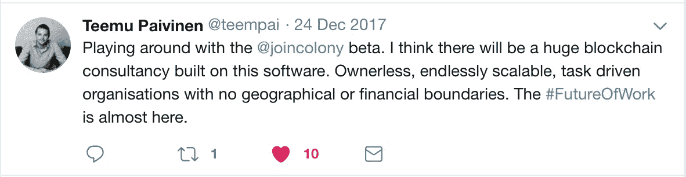

# 恐惧、不确定性和怀疑:不可避免的加密崩溃将如何上演

> 原文：<https://medium.com/hackernoon/fear-uncertainty-and-doubt-how-the-inevitable-crypto-crash-will-play-out-1d16b4bfd3f0>

Photo by [Sebastien Gabriel](https://unsplash.com/photos/dHOgx7fEByA?utm_source=unsplash&utm_medium=referral&utm_content=creditCopyText) on [Unsplash](https://unsplash.com/search/photos/fractal?utm_source=unsplash&utm_medium=referral&utm_content=creditCopyText)

正如[维基百科所说](https://en.wikipedia.org/wiki/Complex_system)，复杂系统是由许多可能相互作用的组件组成的系统。在许多情况下，将这样的系统表示为一个网络是有用的，其中的节点表示组件和它们交互的链接。

根据这个定义，具有互联分散网络的密码市场可以被视为一个高度复杂的系统。这些复杂系统的行为本质上很难建模，因为它们的部件之间或给定系统与其环境之间存在依赖、关系或交互。

处理复杂性的传统方法是减少或限制它。通常，这涉及到划分:将一个大系统分解成独立的组件。

# 密码市场的组成部分

无论是从[技术](https://hackernoon.com/tagged/technology)的角度，还是从市值、使用案例等角度，加密资产市场都可以以多种方式进行划分。在本文中，我们从较高的层面将加密市场分为五个部分:

🔋**基础** — [比特币](https://hackernoon.com/tagged/bitcoin)和以太坊。

🚀**长期价值** —构建技术和商业模式的项目，旨在成为未来业务的关键组成部分。

🎢**短期投机** —长期生存能力和价值潜力不确定且市场价值主要由投机驱动的发展中项目。

🕳 **骗局和庞氏骗局**——不合法的项目通过可疑的技术承诺筹集资金，而团队通常甚至不会尝试执行这些项目。

⚖️ **安全网和稳定性**——通过各种方式承诺低波动性或稳定性的项目，如拥有支持加密价值的资产。

# 密码市场存在泡沫吗？在哪个时间范围内？

关于加密市场的一个常见问题是，是否存在泡沫以及泡沫何时会破裂。关于泡沫的问题，尤其是关于未来技术的问题，部分是关于你看待市场的时间范围。美国研究员、科学家和未来学家罗伊·阿马拉创造了关于技术影响的阿马拉定律:

> “我们倾向于高估一项技术的短期效果，而低估其长期效果”

当你在短期内观察加密市场时，与资本流入相比，价值创造有限，主要的价值创造者是加密交易所和价值存储。

我们相信，从长远来看，加密资产背后的技术将是重要的价值创造者，因为它们是未来业务的关键构件，因此将获得这些未来业务可以获取的部分价值。然而，即使潜在的网络效应和其他指数级技术提供了加速，未来业务的形成和找到付费客户仍需要时间。

# 价值创造的长期观点

预测这些变化会以多快的速度发生总是具有挑战性，但是考虑业务发展将经历的阶段更容易。实际上，这些阶段不是连续的，而是更多地重叠和并行发生的:

⚙️ **构建模块的开发** —第一个长期价值创造项目是构建模块(协议、中间件等)。)来实现未来的业务。他们可以被认为是去中心化的组织，就像 AWS 对于创业公司一样。

🌐**新业务的出现** —随着构建模块的开发，新的组织开始出现，因为人们想出了如何通过利用新的构建模块来创造和获取价值的假设。

🚀**新业务的价值创造和价值获取** —随着新业务开始从最终客户那里创造和获取价值，构建模块获得了它们的份额，这有望成为区块链生态系统的重要组成部分([瘦协议 vs .胖协议 vs .瘦协议层](https://blog.zeppelin.solutions/thin-protocols-cc872258379f))

为了使它不那么抽象，我们可以使用 [Colony](https://colony.io) 作为一个例子，并考虑它可以实现什么类型的业务。在他们的[白皮书](https://colony.io/whitepaper.pdf)中，Colony 将自己描述为“去中心化协议栈的人层”。实际上，群体能够创造群体，一种新型的开放组织。

> “群体的存在是为了使其成员之间能够协作，并将集体努力引向某些共同的目标。因此，促进有效的劳动分工是《殖民地议定书》最重要的功能之一。”

为了让你对殖民地的时间线有所了解:

*   2015 年 10 月，Colony 通过出版“[工作的未来](https://blog.colony.io/the-future-of-work-cf99211e7ac4)”开始了他们的公众之旅，在那里他们展示了他们对未来的愿景。
*   2017 年 2 月，在 [Colony Beta Overview](https://blog.colony.io/colony-beta-product-summary-2121a357d61d) 中，他们宣布了私人测试版，以测试他们的假设并向用户学习。
*   2018 年 1 月，在[殖民地 Q1 2018 更新](https://blog.colony.io/colony-q1-2018-update-f570b37071ac)中，他们宣布了推出完全去中心化以太坊主网的计划，目标是在 2018 年第三季度推出。
*   2018 年第三季度，预计以太坊 mainnet 发布。

要预测 Colony 发布后的潜在采用率，您可以使用 Slack 作为基准。Slack 于 2013 年推出，四年内活跃用户数量已超过 600 万，并于 2017 年夏天[筹集了 2.5 亿美元的融资，估值为 50 亿美元](https://techcrunch.com/2017/07/26/slack-is-raising-a-250-million-round-at-5-billion-valuation/)。从 Techcrunch 的[信息图中可以看出 Slack 日活跃用户的增长，可以认为它在进入市场四年半后仍处于早期阶段。](https://infogram.com/slack-dau-1gqnmxqjd0qq2lw)

如果 Colony 要实现与 Slack 类似的产品市场适应性，那么更广泛的早期采用可以预计在 2020 年至 2021 年左右，这将意味着这些早期采用者由 Colony 驱动的组织将在 2025 年左右达到增长阶段。

加密货币企业家和投资者 Teemu PIV inen 认为工作的未来即将到来，但未来可能还需要一段时间才能捕捉到它的价值。

类似 Colony 的还有几个长期价值项目(🚀)正在开发或推出。这些长期价值项目正在解决以前没有解决的复杂问题，因此这些项目需要时间来实现加密市场对它们的预期潜力。

雄心勃勃的项目总会有一些会失败，但很可能其中一些会成功，它们是在 2020 年代启用新经济模式的项目。

# 什么会导致短期崩盘？

如上所述，密码市场需要时间来达到其全部潜力，并通过实际的价值创造变得可行。在加密市场能够创造巨大的实际价值之前，流入加密系统的法定货币的唯一重要来源是各种类型的投资者。

人们当然可以争辩说，密码系统可以是独立的，其中不同的服务也可以用密码资产来支付，但是我们越接近“真实”世界，就越需要从密码系统中流出。例如，秘密雇员的食宿费用、区块链矿工的电费、秘密交易者的兰博基尼，以及政府的税收仍然需要主要以法定货币支付。

它感觉当前许多投资者在市场中寻找短期利润(🎢)而不是资助长期有价值的项目(🚀).这种非理性繁荣、不明确的监管和技术壁垒使得投资者基础仍然相对有限，尤其是将机构投资者排除在该资产类别之外。

与庞氏骗局类似，短期内秘密市场的价格上涨是由涌入市场的新投资者资金推动的——直到它停止。

什么可能导致新投资者放缓(并为崩盘埋下种子)？我们认为，经济放缓将是几个因素的综合影响:

👩‍⚖️ **加强对 tges/ico 的监管** —监管机构更加关注令牌生成事件(或 ico)，这对生态系统的长期生存能力有利。这减缓了项目启动的数量，因为需要做更多的前期投资，并且需要时间来处理法律细节。

👨‍⚖️ **加强了对交易所的监管审查**——对加密交易所的审查也在加强，它们交易的是什么类型的硬币和代币，以及它们在遵守证券和金融服务监管方面的表现如何，这也有利于生态系统的长期生存。监管审查的加强减缓了上市新项目的数量，也减缓了交易所争取新客户的力度。

🕳 **对骗局和不道德行为的重新评估**——随着审查的加强和时间的推移，一些彻头彻尾的骗局将会被揭露。大规模暴露的一个潜在候选人是 Tether 及其与 Bitfinex 的联系，[这两个人都在 2017 年 12 月收到了美国商品期货交易委员会(CFTC)的传票](http://thehill.com/policy/technology/371432-financial-regulators-subpoena-major-cryptocurrency-exchange-and-token)。[长期以来，Tether 一直是社区中怀疑的目标](/@bitfinexed)，批评者猜测，Tether 实际上并没有持有足够的美元储备来支持加密货币的价值与美元挂钩的说法。骗局的广泛宣传，以及当人们失去金钱的故事出现时，将使新投资者对秘密市场更加怀疑。

👾**对交易所或代币项目的黑客攻击**—随着时间的推移，已经有几次黑客从各种交易所和代币项目中窃取了大量资金。例如，在日本，2018 年 1 月发生了一起 5.3 亿美元的外汇黑客攻击。黑客攻击后，该国金融服务机构(FSA)已下令该国所有加密货币交易所提交一份关于其风险管理系统的报告。这些安全问题越广为人知，解决方案越复杂，新投资者对进入加密市场是否安全，以及他们是否有技术能力保护自己的安全就越犹豫。

🙅‍♂️ **来自现状的公开警告**——世界各地的现状一再公开警告秘密市场的风险和投机性质。这些警告的宣传范围越广，就越能阻止未受教育的大众进入秘密市场。对于市场的长期健康来说，这是好事，因为这也将导致更多的人自学秘密市场，而不是把它们当成赌场。

如果人们相信这些论点…

*   加密市场需要新的投资者资金来推动价格上涨(在短期内)，以及
*   新投资者资金(来自现有投资者和新投资者)的增长将会放缓

……问题是，接下来会发生什么？

# 短期崩盘将如何收场

随着潮流开始转向，资金流动开始改变，这些是你最有可能看到的因素。

📉**做空市场**——加密对冲基金和其他金融机构的“聪明”资金会找到不同的方法做空加密市场，最直接的方法是在 [CME](http://www.cmegroup.com/trading/equity-index/us-index/bitcoin.html) 或 [CBOE](http://cfe.cboe.com/cfe-products/xbt-cboe-bitcoin-futures) 做空比特币期货。

🙅 **TGEs 无法筹集资金** —当通过 TGEs 筹集资金的项目公开失败的情况增加时，煤矿中的金丝雀将会出现。为了避免失败，TGE / ICO 组织者将提高他们所推广项目的门槛。

🎢**对投机项目信心的崩溃** —许多加密资产可以被视为对特定社区和任务的信心。当市场开始下跌时，这种信心将受到考验。如果大多数社区的信仰是基于快速致富的潜力，而不是长期的使命，那么这些人最有可能想避免快速变穷。

🔋**流向基地的加密航班** —随着对投机项目的信心崩溃，加密交易者将通过转向比特币或以太坊来寻找在加密市场内保值的方法。

⚖️ **资本外逃走向稳定**——新兴的保值方式是不同类型的稳定代币，承诺价格稳定或低波动性。这些稳定的资产可以被视为对秘密市场波动的对冲，特别是如果稳定机制不依赖于秘密市场本身。要注意的是，如果稳定机制将加密资产转换为传统资产，那么即使是稳定项目也会增加从加密市场流出的菲亚特，并对价格施加更大的下行压力。

💸**资本逃向法定现金**——当越来越多的人寻找方法完全退出市场，从交易所提取现金，或者用他们的秘密资产购买真实资产时，秘密现金的最后一步将会到来。

需要考虑的问题是，上述过程何时开始，或者已经持续了多长时间。

[拴系交流:如何避免被“拴系”。](/@bitfinexed/tether-exchanges-how-to-avoid-getting-tethered-d02c6ae2c52c)(一月三十一日)

[对冲基金押注比特币在 Cboe 期货市场的痛苦还没有结束](https://www.bloomberg.com/news/articles/2018-02-02/hedge-funds-bet-bitcoin-s-pain-isn-t-over-on-cboe-futures-market)(2 月 2 日)

在下一篇文章中，我们将研究保护您或您的项目免受崩溃影响的不同方法，以及当崩溃发生时，如何从崩溃中获益。