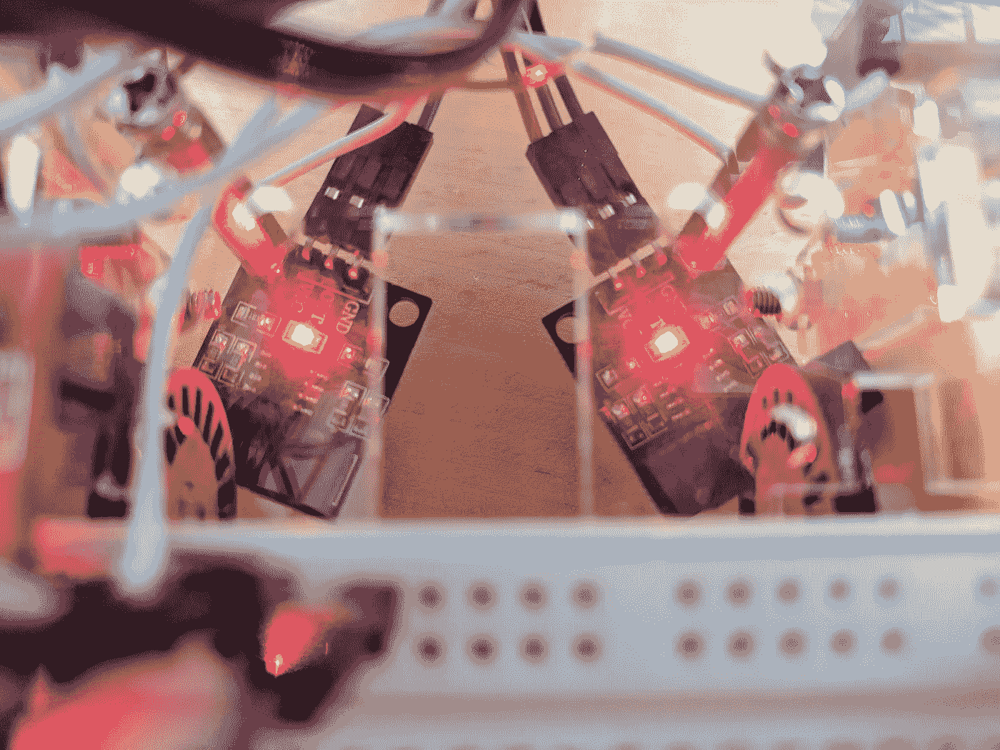
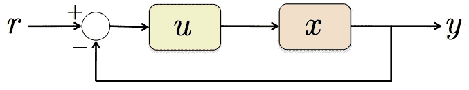
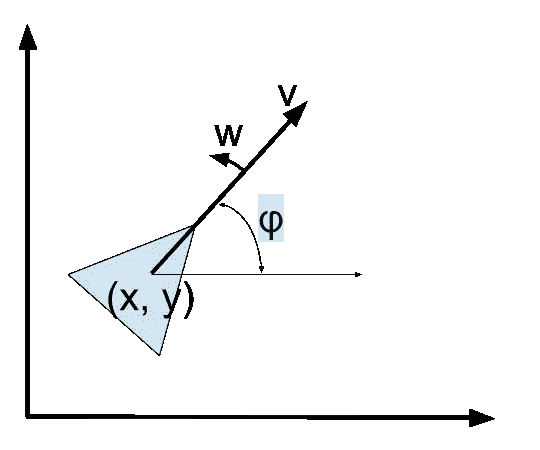

# 反馈和里程计:Coursera 用 ROS 和 ROSbots 控制移动机器人——第三部分

> 原文：<https://medium.com/hackernoon/feedback-odometry-courseras-control-of-mobile-robots-with-ros-and-rosbots-part-3-e9d8e4df6df1>

欢迎来到我们的多部分 [Coursera 的移动机器人控制](https://www.coursera.org/learn/mobile-robot) (CMR)系列的第 3 部分。这个系列用 [ROS](http://www.ros.org) 和 [ROSbots 机器人](http://www.rosbots.com)实现了从 CMR 学到的概念。

## 关于 ROSbots

ROSbots 是一个[面向制造者的 ROS + OpenCV 机器人套件](https://www.rosbots.com/purchase)。基于 Raspberry Pi 和 Arduino 兼容的 UNO 板，ROSbots 机器人套件迎合了制造商的愿望，非常容易实现你遇到的任何新的机器人概念。我们所有的代码都在 Github 上[开源。](https://github.com/rosbots)

## 第 2 部分前情提要，第 3 部分有什么

回到我们的移动机器人控制系列的[第 2 部分，我们写了使用独轮车模型直观地表示机器人动力学的便利性。但是由于我们的 ROSbots 机器人是差动驱动机器人，所以我们需要讨论独轮车模型如何与差动驱动模型动力学相关联。然后，我们遍历 ROS 代码，通过远程控制(RC)以系统的方式“驱动”我们的 ROSbots 机器人。](/@rosbots/unicycle-to-differential-drive-courseras-control-of-mobile-robots-with-ros-and-rosbots-part-2-6d27d15f2010)

在第 3 部分中，我们将利用差分驱动动力学来:

1.  引入反馈的概念
2.  描述我们的 ROSbots 车轮编码器传感器如何工作，以及
3.  使用反馈和编码器读数，定义计算机器人姿态(位置和方向)所需的方程。

*免责声明*:在这篇文章中，我们实际上不会展示任何 ROS 代码，而会坚持谈论反馈和里程计背后的方程和概念。但是这为下一篇有 ROS 代码的文章做好了准备——保证！！



ROSbots’ wheel encoders used for odometry

## 反馈需求

即使我们成功地向机器人发送了驱动命令，我们也不能保证机器人已经执行了命令。数据包可能已经丢失。沉重的负载可能会使发动机熄火。

为了知道我们的机器人是否真的移动了，我们需要传感器传回一些信息。我们需要反馈。

一般来说，我们在反馈系统中定义了几个组件:

1.  r → a *参考*我们希望达到的目标(即我们希望达到的目标、我们希望跟踪的速度、我们希望遵循的路线)。
2.  u → r 转化为一系列的*输入*命令，我们想给我们的机器人，以帮助我们实现，跟踪 r。
3.  x →这是我们当前的*状态*。我们的输入 u 通过一组称为动力学的规则影响状态，或者系统如何随时间演变。
4.  y →这是我们对当前状态的衡量。很多时候，实际上不可能直接观察到状态 x。但是我们可以制造传感器来测量它。



Credit: Magnus Egerstedt, Control of Mobile Robots, Georgia Ins<tute of Technology

测量值 y 被反馈到系统的起点，以帮助我们调整输入值 u。没有 y 和反馈过程，我们无法知道我们是否在跟踪我们的参考值，从而阻止我们实施有效、稳定的控制器来控制我们的机器人。

## 里程计

与 Coursera 球场上使用的 [Quickbot 机器人](http://gritslab.gatech.edu/Pickem/quickbot-a-robot-built-in-an-afternoon.html)和 [Khepera 机器人](https://en.wikipedia.org/wiki/Khepera_mobile_robot)一样，我们的 ROSbots 机器人配备了测量车轮转速的车轮编码器。

我们的 ROSbots 机器人的编码器盘上的凹口干扰了速度传感器上 U 形臂顶端的灯开关。

当轮子转动时，凹口在阻挡和打开灯开关之间交替——即“滴答”。通过计算“滴答”的次数，你可以确定轮子旋转了多少。

通过使用编码器，我们可以更新我们的机器人[里程计](https://en.wikipedia.org/wiki/Odometry)——它被定义为使用运动传感数据来更新机器人姿势，或者我们机器人的位置和方向。

回忆由以下定义的姿势:

```
x - position on the x-axis (ie in meters)y - position on the y-axis (ie in meters)φ - phi - angle of the unicycle counter clockwise from x-axis (ie in radians)
```

我们的独轮车模型的位置和角速度由下式定义:

```
v - directional velocityw - angular velocity
```



为了更新里程计，我们需要使用几个等式来帮助我们根据差动驱动机器人的每个左右轮行驶的距离计算我们的位置和方向的变化。

## 每个轮子旋转了多远？

第一个等式使用我们的编码器刻度来计算左右轮转动了多远，以米为单位

```
D_left = 2 * pi * R * (nTicksLeft / nTotalTicks)
D_right = 2 * pi * R * (nTicksRight / nTotalTicks)
```

1.  R →车轮的半径(米)
2.  nTicksLeft/Right →我们采样的刻度数，比如说，每秒(以 1 /秒为单位)。
3.  nTotalTicks →编码器盘每转的总刻度数

因为 R 的单位是米，所以 ntickslew/Right 的单位是 1/秒，那么 D_left 和 D_right 的单位都是米/秒。

## 我们的机器人的方向和角速度是多少？

使用 D_left 和 D_right，我们可以计算用于表示独轮机器人动力学的方向和角速度——分别为 v 和 w。

```
v = (D_right + D_left) / 2.0 (ie. in meters per second)
w = (D_right - D_left) / L (ie. in radians per second)
```

回想一下，L →我们机器人的轴距(即每弧度米数)

因为在我们的例子中，我们每秒对编码器刻度采样一次，所以 D_right 和 D_left 都以米/秒为单位，所以 v 也以米/秒为单位。

因为 L 的单位是米/弧度，所以 w 的单位是弧度/秒。

## 我们机器人的新姿势是什么？

对于独轮模型，姿势的变化定义如下:

```
dx/dt = v * cos(φ)
dy/dt = v * sin(φ)
dφ/dt = w
```

在我们的例子中，dt 是 1 秒——编码器滴答的采样速率。有了上一节中计算的 v 和 w，我们就可以确定机器人在某个δT 后的新姿态:

```
x' = x + (dx/dt * delta_t)
y' = y + (dy/dt * delta_t)
φ' = φ + (dφ/dt * delta_t)
```

如果 delta_t = 1 秒，那么 x '、y '和φ'将代表我们的机器人在 1 秒后的新姿态。

## 结论

在第 3 部分中，我们讨论了:

1.  控制系统中的反馈需求——特别是我们用来计算 ROSbots 差动驱动机器人姿态的系统。
2.  如何使用速度编码器来测量差动驱动机器人的运动。
3.  概述了独轮车模型机器人的动力学。
4.  我们需要用差动驱动机器人的速度编码器的运动测量值来计算独轮车的方向和角速度动力学
5.  如何用独轮车的方向和角速度来计算机器人的姿态变化——位置和方向/方位。

在接下来的第 4 部分中，我们将看一些实现这些方程的 ROS 代码，并使用这些实现来驱动我们的 ROSbots 机器人到一个特定的位置。

像往常一样，关注@rosbots on Medium 获取更新。在 Instagram 和[脸书](https://www.facebook.com/hackrosbots)上关注我们吧！

如果你想合作，或者只是想打个招呼，请不要犹豫，提出问题、评论、总体反馈。

如果你还没有这样做，[在这里](https://www.rosbots.com/purchase)购买你自己的 ROSbots 机器人来跟随。

谢谢！
杰克“机器人制造商”