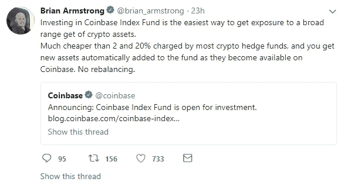
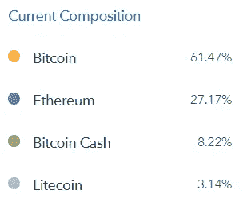
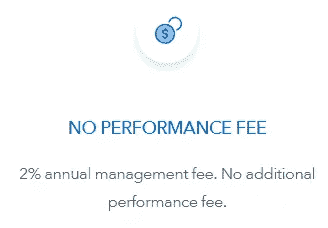
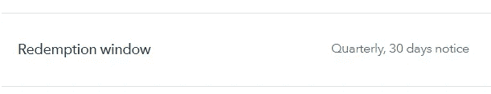

# 感觉被 25 万美元以上的比特币基地指数基金冷落了？

> 原文：<https://medium.com/hackernoon/feeling-left-out-by-the-250k-coinbase-index-fund-3b4199d4acc4>

比特币基地刚刚发布了其加密基金，其最低投资门槛为 25 万美元。

> 深呼吸

我刚才说的是 25 万美元。

不仅如此，你只能“分散化”4 种资产，由市值来平衡。这就像把你在纽约的一室公寓称为“宽敞”一样。别自欺欺人了。我们都知道没有足够的空间来招待你的朋友。毕竟，他们都在他们的其他朋友家，因为“他有一个后院”和“不收人参观费”。

> 关于我已经说得够多了。

人们想要一个鼓励多元化的解决方案。可以控制他们投资的东西。甚至可能从包括数百种加密货币的资产池中进行选择。如果我们足够努力地乞求，这个解决方案可能会在你选择的任何时候**提供重新平衡的能力。天啊，这样的事情会改变游戏规则的。**

> 好吧，叫我精灵吧，因为今天我在实现愿望。

> Shrimpy 是游戏改变者。

# 比特币基地·v·施莱姆皮？

[Shrimpy](https://www.shrimpy.io) 是一个让你控制自己资产的工具。只需将您的加密货币存入交易所，立即分配多样化的投资组合，并随着时间的推移重新平衡。没有最低投资，没有隐藏费用，没有交易限制，最重要的是它完全免费。

## 战略

有了 Shrimpy，[只要你的心愿意，随时重新平衡](https://hackernoon.com/portfolio-rebalancing-for-cryptocurrency-7a129a968ff4)。想要每小时重新平衡吗？去吧。你永远不想重新平衡吗？做我们的客人。

“broad range”

据 Brian 称，“比特币基地指数基金”甚至不会进行再平衡。

## 资产

与 Shrimpy 一起挑选垃圾。访问数百种不同的加密资产。现在，让我们看看比特币基地提供了什么。

Such range, much diversity.

比特币基地应该把他们的指数基金叫做“比特币基金”。没有人应该花费 2000 万美元，只选择“分散投资”到一只拥有 4 项加密资产的基金。尤其是当其中两个加起来只占基金的 11%时。

## 费用

你有钱。在 Shrimpy，我们假设你想保留你的钱。这就是我们的服务完全免费使用的原因。没有费用，没有订阅，也没有隐性成本。

比特币基地每年收取 2%的管理费。既然他们不重新平衡，我不知道“管理”方面在哪里起作用，因为听起来他们只是把它放在钱包里，直到你想要回来。在这 2000 万美元的投资中为自己节省 40 万美元，如果你只是想要一个存储你的密码的地方，就买一个 Ledger Nano S。

## 自由

通过 Shrimpy，您可以控制您的资金。选择你想要的资产，想投资多少就投资多少，然后立即变现。

比特币基地的赎回窗口是每季度一次。这意味着最糟糕的情况是投资者等待 3 个月后撤回投资。为了描绘出它将在加密领域存在多久，让我们看看 BTC。在不到 90 天的时间里，比特币的价格从 6000 美元涨到了 20000 美元，然后一路回落到 6000 美元。这意味着提前几个月决定清算你的资产会给你的投资组合带来灾难性的损失。

# 包裹

我们希望您拥有加密货币提供的灵活性。不要把自己锁在一项你会后悔的投资中。体验新金融市场的自由。

> 用虾米拥抱未来。

# 用 Shrimpy 重新平衡

Shrimpy 将整个投资组合管理和再平衡过程简化为一个点击式界面。快速选择资产，立即分配多样化的投资组合，并在预定的时间段内重新平衡。最棒的是，Shrimpy 现在完全免费使用！

点击[这里](https://www.shrimpy.io/)报名。

如果你还不确定，试试[的演示](http://www.shrimpy.io/demo)，看看我们能提供的一切！您也可以在[推特](https://twitter.com/ShrimpyApp)和[脸书](https://www.facebook.com/ShrimpyApp)上关注我们的更新，并在[电报](https://t.me/ShrimpyGroup) & [不和谐](https://discord.gg/gXyy95y)上向我们令人惊叹的活跃社区提问。

*捕虾队*