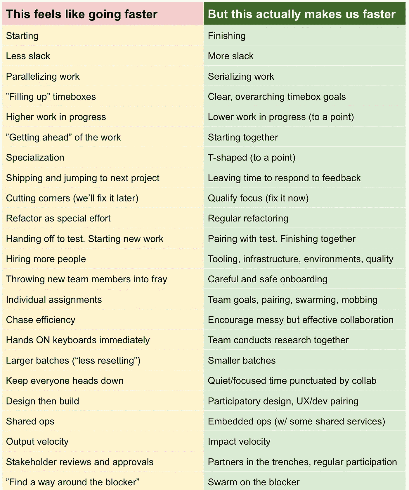

# 感觉更快，实际上更快

> 原文：<https://medium.com/hackernoon/feels-like-faster-vs-makes-us-faster-828686facc7e>

几天前我整理了这张对比表，并在推特上分享了它。显然它引起了共鸣。

明确一点，“快”不是最终目标。最终目标是可持续地产生有益的结果。运得快的垃圾还是垃圾。也就是说，*影响*速度很重要——它给你买了期权，让你更晚行动，更快转向。大多数公司(尤其是早期)增加复杂性的速度远远快于他们确定复杂性价值的速度。所以，要明确的是，我说的是影响力产生的速度，*不是*原始产出。

根据我的经验，我们可以做很多事情来显得忙碌、快速和高效。但是，与直觉相反的是，*看似*的速度，往往恰恰相反……尤其是在中长期。我在下面用了“感觉”这个词来表示，左边的东西感觉起来更有效率、更快、更有成效、更直观。

