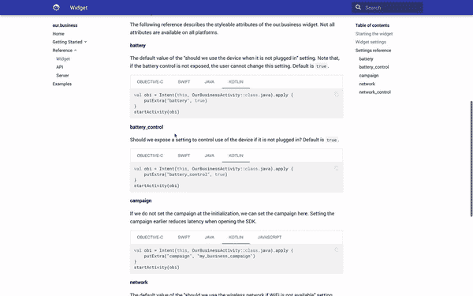

# mkdocs 材料中的防护代码标签

> 原文：<https://medium.com/hackernoon/fenced-code-tabs-in-mkdocs-material-a7951a9f8738>

啊，赫尔辛基又一个美丽的春天早晨。鸟儿在歌唱，醉汉在离开酒吧，我给自己 30 分钟时间写一个可怕的丑陋的黑客程序，让受保护的代码标签在 mkdocs 材料中工作。

我做这个黑客是因为似乎有几个人[真的需要这个功能](https://github.com/squidfunk/mkdocs-material/issues/434)，但是没有人站出来做点什么。这种攻击是暂时的——我确信有 100 种更干净的方法可以做到这一点，但这种方法可以完成任务！

首先，我抓住了`[markdown-fenced-code-tabs](https://github.com/yacir/markdown-fenced-code-tabs)`，它或多或少在几个 mkdocs 主题中有效，但在 mkdocs 素材中无效。

在网上搜索如何解决这个问题时，我发现了一个关于 GitHub 问题的有希望的线索。所以 CSS 样式是有效的，但是当你点击标签时，什么也没有发生。深入研究 HTML，我意识到所有的`aria`都不工作，原因超出了我的理解。

没有什么是快速的 JavaScript 破解不能解决的…

首先，在你的`mkdocs.yml`中，加上:

```
extra_javascript:
  - javascript/tabhack.js
```

然后，收起你的骄傲，包括:

这就对了。



快乐时光，快乐时光…