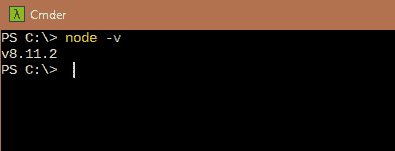

# 用 React 获取加密价格

> 原文：<https://medium.com/hackernoon/fetching-crypto-price-with-react-3a49f41bf80c>


## 特色课程

# 以太坊和坚固性:完全开发者指南

使用以太坊、Solidity 和智能合约构建基于区块链的生产就绪型应用[了解更多](https://click.linksynergy.com/link?id=qt/jYwyHv8A&offerid=507388.1466612&type=2&murl=https%3A%2F%2Fwww.udemy.com%2Fethereum-and-solidity-the-complete-developers-guide%2F)

# 现代用 Redux 反应【2019 更新】

(2018 年 12 月更新)掌握 React v16.6.3 和 Redux 搭配 React 路由器、Webpack、Create-React-App。包括钩子！[了解更多](https://click.linksynergy.com/link?id=qt/jYwyHv8A&offerid=507388.705264&type=2&murl=https%3A%2F%2Fwww.udemy.com%2Freact-redux%2F)

在我们深入研究代码之前，让我们谈一谈我们将要做的项目和一些必要条件。
你需要以下方面的知识:

1.  **HTML** :只有非常基础的知识。
2.  **JavaScript** :写函数的中级(ES6)。
3.  **CSS** :可选但首选。我们就不说为什么看起来如此如此了。这就是 CSS 发挥作用的地方。您可以从提供的 starter 模板开始，它包含了所有需要的 CSS。
4.  熟悉任何 API、节点或 react 将是您学习本教程的一大优势。

## 设置工具:

**NodeJS** :从此处[安装](https://nodejs.org/)。推荐 LTS 版本。我们不会为节点运行任何 JavaScript，但是我们需要节点来运行 react 应用程序。

确保验证 npm 也随它一起安装。如果你熟悉的话，你也可以使用 yarn，一种 npm 的替代品。本教程将使用 npm！

`npm -v`


`node -v`



如果两个命令都返回一个版本号，那就没问题了。这些数字可能与上图中出现的数字不同。

我们要做什么？
用比用文字解释更容易。

## 设置 react 应用程序

React 的一个复杂的事情是开始。如果不了解中级专家级别的 JavaScript 开发人员通常使用的多种工具，要设置它是非常困难的。脸书想出了一个可以让这项任务变得简单的工具。这个包叫做[创建-反应-应用](https://github.com/facebook/create-react-app)。

这个工具配置环境，以便我们可以直接做出反应，而不需要处理复杂的工具。从好的方面来说，它还允许将 react 应用程序与其本身分离，以便我们可以完全控制它。这是设置和控制的双赢。

**全局安装 create-react-app:** `$ npm install -g create-react-app`

**用这个包创建一个 app:** `$ create-react-app crypto-reactdev`

`crypto-reactdev`是我们的应用程序名称。


我得到一个错误消息，说***‘create-react-app’无法识别*** 。如果您得到同样的错误，有两种解决方案。使用其中一种:

*   将 node_modules 目录添加到 path。默认路径是`C:\Users\USERNAME\AppData\Roaming\npm\node_modules`


*   或者使用稍微不同的命令:
    `npx create-react-app crypto-reactdev`

我用了第二个。

它将创建一个新目录，`crypto-reactdev`包含所需的文件和文件夹。


## 每个文件和文件夹的用途是什么？

`package.json`包含应用程序使用的模块列表。每个模块执行一个功能或一组功能。
`node_modules`存储 package.json 中列出的所有包。
`src`包含所有 React 源代码文件。
`public`包含样式表和图片等静态文件。

现在，您已经有了一个工作的 React 应用程序。设置很容易，不是吗？

在终端打开目录，很多编辑器都是自带终端的。你也可以利用这点。以下截图将来自 VS 代码，与 Git Bash 终端集成。一个简单的命令将启动服务器:
`$ npm start`


默认端口是 3000，忙的话会要求尝试 3001！它还会在网络浏览器上打开网址。浏览器上的输出应该是这样的


多亏了`create-react-app`，当你修改文件时，它会自动重新加载。

## 反应过来

公共目录是可访问的，并呈现给浏览器。

基本文件是 index.html。它有下面一行:

`<div id="root"></div>`

这是我们注入 React 的`div`。我们根本不会碰这个文件。
在`src`目录下，看一下`index.js`文件。


看这一行:
`ReactDOM.render(<App />, document.getElementById('root'));`

1.  它从`index.html`文件中获取根 div。
2.  在 div 中注入`App`组件。

*你也可以使用 querySelector，它只是用来选择这个块！*

让我们删除服务人员，因为我们不会在这个项目中使用他们。从`index.js`中移除导入`registerServiceWorker`和`registerServiceWorker();`。同时从`src`目录中删除`registerServiceWorker.js`文件。

## 上面这些进口的都是什么？

在 react 中，每个渲染的部分都是一个组件。

*   需要 React 来处理 JSX。你看到的类似 html 的代码不是 html，而是 JSX。
    当创建一个 div 时，它(babel)将代码传输到`React.createElement()`。
    这需要反应。你可以参考[巴别塔文件](https://babeljs.io/)了解关于巴别塔的细节。
*   `import React, { Component } from 'react'`从 React 导入`React`和一个名为`Component`的方法。`React.Component`是指`React`内的`Component`。
    当我们提到`Component`时，它是指作为`{Component}`导入的组件。用`Component`是我个人的喜好。
    去掉`{Component}`改用`React.Component`并不能降低进口成本。这两种方式的工作方式完全相同，在性能上没有任何差异
*   ReactDOM 用于处理包含页面上所有元素的 DOM。这曾经是 React once 的一部分，现在已经被拆分为一个不同的部分。这个包提供了特定于 DOM 的方法，可以在应用程序的顶层使用。

**让我们进入主文件，** `**src/App.js`**`

您在浏览器中看到的内容来自该文件。移除 return 下的所有内容，使其看起来像下面这样。


***你注意到浏览器中运行的 app 上的变化了吗？看看变化。***

*请忽略我在截图中注入代码的编辑器设置。
import 语句右边的 import Size 和‘edited by You…’是由扩展注入的，不是代码的一部分。
参考* [*上的实际代码本 GitHub 资源库*](https://github.com/therj/crypto-reactdev) *。注意提交，我经常提交小的每一个变化。如果没有本地设置，可以在 web 上的* [*codesandbox 这里*](https://codesandbox.io/s/0xnx1w361w) *使用。*

return 语句有几个条件:

1.  它只能返回一个元素:可能是一个`div`或一个`p`元素。
2.  如果你必须返回多个元素，创建一个父 div 并返回父 div。
3.  多行时，回车必须包含在括号()中。在单行中返回时，括号是可选的。

由于我需要多行回车，我将使用括号。


html 中的`class`翻译成 JSX 的`className`，因为`class`与 JavaScript `class`冲突。类`App`和`App-header`在我们在`App.js`中导入的`App.css`文件中预定义。


这个应用程序没有太多的样式。既然是关于 react，就不讨论关于 CSS 了。如果你的应用看起来不像我们的，你可以随时从库中替换`App.css`中的样式。我们强烈建议从提供的启动文件开始，[从这里获取](https://github.com/therj/crypto-reactdev)。

**回头反应过来！**

React 由装配在一起的组件组成。这些部件被保持得尽可能小。

让我们将 react 应用程序分解成几个组件:

1.  个人加密货币。
2.  父组件来处理所有单个组件的数据。

保持项目有序是一个更好的主意，所以在`src`中创建一个名为`components`的目录。

在`components`中创建两个文件:

`Crypto.js`和`Crypto.css`。

**crypto . CSS**

```
.crypto {
list-style-type: none;
padding: 0;
display: inline-flex;
}
```

在进入`Crypto.js`之前，我们必须谈谈功能组件 React。
在 React 中有两种方式定义组件。我们在 App.js 中使用类 App extends Components 做了一个，那种组件叫做纯组件或者有状态组件。它们看起来像:

```
Class ClassName extends Component {
Render () {
Return (
<ComponentName>
Any text or resource!
</ComponentName>
)
}
```

有一种新的现代方式来声明组件，这些被称为无状态组件。无状态功能组件提供了更好的性能，并且编写起来不那么笨拙。这不是写的代码行，这几乎是相同的。

它像 ES6 函数一样被声明。无状态功能组件对于表示组件很有用。这意味着它们不能使用状态，状态是指声明它的组件所拥有的对象。它仅限于当前组件。它有组件可以跟踪数据。状态可以被初始化，或者数据可以在组件内动态改变。

任何不使用状态的组件都应该以无状态的方式声明。箭头函数更加紧凑，为编写函数表达式提供了简洁的语法。

```
Const MyComponent = (props) => {
Return (
<Component>
{prop.myProperty}
</Component>
)
}
```

**把无状态 vs 有状态的话题留到另一个讨论，我们继续看 app** `**crypto-reactdev**` **！**

**Crypto.js**


我们正在进口`React`，和一线的`Component`。然后我们导入样式表文件。

我们正在创建一个类`Crypto`,并将其导出为默认类，这样它就可以被导入到其他位置，与其他组件一起使用。

在 Crypto 组件中创建一个`constructor`,这样当我们创建一个元素时，我们的数据就会被设置。我们使用虚拟数据来设置状态，因此`id`和`price`是固定的。这些值将在以后从 API 中获得。`super()`需要被调用，因为`Crypto`扩展了父类，而`super`从父类调用构造函数，这是 JavaScript 规则所强制的。


每个组件都必须有一个名为 render 的函数。在构造函数之外的`Crypto`类中定义 render。

```
render () {
return (

       )
}
```

Return 将包含该类将返回的任何内容。

让我们用一些代码来填充…


```
render () {
let crypto = this.state.data.map (
(currency) => {
<li key={currency.id}>
<h3>{currency.id} </h3>
<h4>$ {currency.price}</h4>
</li>
})
return (
<div className="crypto-container">
<ul className="crypto">{crypto}</ul>
</div>
)
}
```

在渲染中，我们映射这些值。这与 ES6 中引入的 JavaScript map 函数相同。定义这个键是为了跟踪价格变化时我们需要更新的`li`。它包含其他数据，如屏幕上的`id`和`price`。

React `{}`中的花括号指的是 JavaScript 代码。`{crypto}`指`crypto`变量。
return 语句返回容器内的单个加密组件。`className`用于造型。现在我们的`Crypto`组件已经准备好了，但是输出屏幕没有变化，因为我们还没有渲染任何东西。

渲染的组件是 App。我们使用
`import Crypto from './components/Crypto'`在`App`中导入`Crypto`

如下图所示，将`<Crypto/>`组件包含在`App`中。


浏览器应该输出类似这样的内容。


## 添加更多组件

我们的应用程序已经为处理每种加密货币设置了更多的子组件。这将使我们能够使用相同的组件与特定的功能和风格的每一个。
在组件文件夹内，使用两个文件`Currency.js`和`Currency.css`。我给`Currency.css`添加了一些 CSS，在这里找到[。](https://github.com/therj/crypto-reactdev)

由于`Currency.js`不会使用状态，我们应该将这个组件声明为功能性的(或者无状态的)。

`const Currency = props => {
return (
)
}
export default Currency`

这就是它是如何被宣布的。它不需要 `*render*` *功能。*

在返回之前，我们需要变量集，所以使用对象析构从 props 获取变量。所有需要的变量都是结果中的内部数据。我将从 [CoinMarketCap API](https://coinmarketcap.com/api/) 中得到这个。

还要注意，将它声明为 ES5 函数而不是使用箭头函数是可能的，但是您可能会经常遇到 react 的绑定问题。我推荐箭头函数，它们比较不容易混淆！

```
const {
id,
name,
symbol,
price_usd,
percent_change_1h,
percent_change_24h,
percent_change_7d,
} = props.data
```

我们想返回单一货币，所以返回

`<li className= {'currency ' + id}>
<p className="currency-name">
{name} ({symbol})
</p>
<h1>${(+price_usd). toFixed (2)} </h1>
<p>{percent_change_1h} % 1hr</p>
<p>{percent_change_24h} % 24hrs</p>
<p>{percent_change_7d} % 7days</p>
</li>`


该返回数据表示单一货币。
由于我们现在需要更多的数据字段，我在`Crypto.js`中添加了虚拟数据字段


该数据可用于`Currency`组件。我们必须在`Crypto.js`中导入`Currency`组件。我们需要用`h3`和`h4`来渲染这个组件而不是`li`。

`const crypto = this.state.data.map (currency => (
<Currency data={currency} key={currency.id} />
))`

这将遍历状态中的所有数据。

数据中的单个对象在映射函数中作为货币接收。这作为数据在`Currency`组件中传递。我们还通过键来跟踪组件。

我们得到了什么？


*优秀的输出，除了数据。*

## 获取 react 组件的数据！

有多种方法可以获得数据，使用软件包来帮助我们可能是最简单的方法。

我不期望你熟悉 react 生命周期方法，你也可以单独使用它！

我将使用 Axios，使用异步 REST API 很容易。
Axios 不自带`create-react-app`。我们使用以下方式添加到我们的应用程序中:

`$ npm install axios –save`

在`Crypto.js`中导入 axios，那是我们将获取数据的地方。
`import axios from 'axios'`

现在，我们通过 API 获取货币数据。我们在`Crypto`类中创建一个函数来实现这一点。

```
fetchCurrencyData = () => {axios.get('https://api.coinmarketcap.com/v1/ticker/?limit=10') .then(response => { const wanted = ['bitcoin', 'ethereum'] const result = response.data.filter(currency => wanted.includes(currency.id), )
  this.setState({data: result})
 }).
  catch(err => console.log(err))}
```

`fetchCurrencyData()`是必需的功能。我们只过滤比特币和以太坊的结果数据集。我们还在获得结果后将状态数据设置为结果。

由于数据被修改，react 将反映出`Currency`组件的变化。

如果你现在检查浏览器，你不会看到任何变化。这是因为我们定义了函数，但从未调用过它。
我们希望在组件加载时以及之后的每一分钟调用这个函数。

React 有一个叫做生命周期方法的东西，大概有 8 种方法。这些就像内置函数。这里只说一个。

我们将使用`componentDidMount`方法。这将在组件可见时执行代码。
在`Crypto`组件内，添加该方法如下:

`componentDidMount () {
this. fetchCurrencyData ()
this.interval = setInterval (() => this. fetchCurrencyData (), 60 *1000)
}`

这将使用我们之前声明的函数获取货币数据。它还使用`setInterval`每 60 秒运行一次以获取新数据。

现在，我们应该有一个可用的比特币、以太坊和比特币收报机。


## 清理 react 应用！

总有一些可以纠正的地方，下面是我们在这个项目中可以清理的地方。
在浏览器中检查控制台并移除不使用的组件。


从`App.js`中删除徽标导入，从`Currency.js`中删除`{Component}`

## 扩大货币

我们有比特币和以太币报价机，我们可以将其扩展到更多的货币。

我们使用 REST API URL 从这个位置获取数据。可以看到可用的`ids`。我们依次有`bitcoin`、`ethereum`、`ripple`、`bitcoin-cash`、`eos`、`litecoin`、`stellar`、`cardano`、`iota`、`tron`。

将其中一些添加到`Crypto.js`中的`wanted`列表中。

这是我的输出


数据应该会自动刷新。

如果没有更新，请等待一段时间。CoinMarketCap 每 5 分钟更新一次数据，我们每分钟获取数据。获取新数据可能需要 6 分钟。

# 结束语:

## 如果这篇文章有帮助，请点击拍手👏按钮下面几下，以示支持！⬇⬇