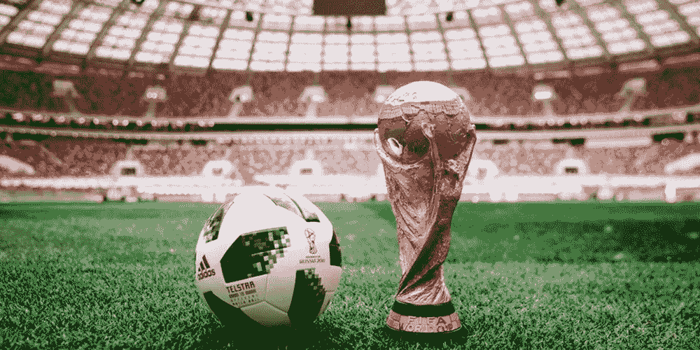
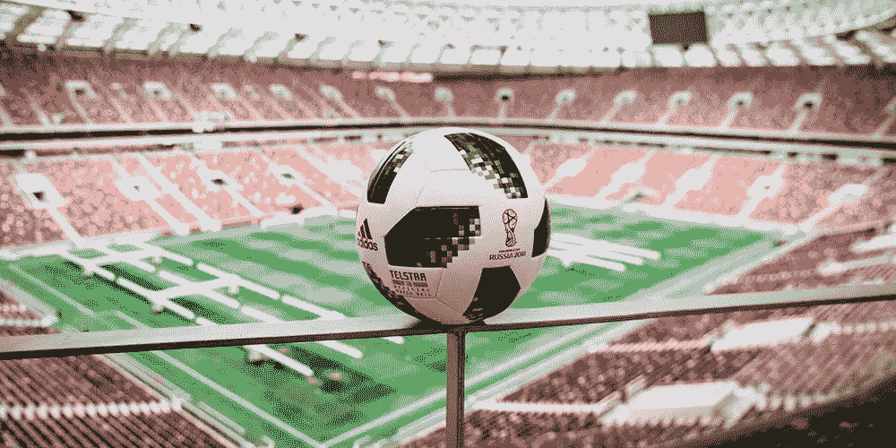

# 2018 年国际足联世界杯背后的技术

> 原文：<https://medium.com/hackernoon/fifa-world-cup-2018-technologies-and-their-impact-3c6199ce753b>

据说，足球把全世界数百万人团结在一起。你可以感受到激情，听到呐喊，你不能错过某支球队挺身而出时的兴奋。然而，当你把突破性的技术注入到一个已经具有纪念意义的活动中时，光环会蔓延到数十亿人！

我们有一些足球技术的支持者。例如，前阿根廷国家队球员哈维尔·萨内蒂支持 VAR。同样，前葡萄牙国家队球员努诺·戈麦斯宣称，在这场美丽的足球比赛中，技术将会消除错误。然而，各方并未达成一致。

其他几个人讽刺了这一发展，说它消除了游戏中的不确定性和惊奇。人们说他们不想要完美，相反，这个游戏尽管有不完美之处，却是完美的。

在我们开始表明立场之前，让我们分析一下 2018 年 FIFA 世界杯使用的不同技术，看看它们是如何工作的。

# 视频助理裁判

俄罗斯 2018 是我们第一次见证这项技术，到目前为止，这是一次令人惊叹的经历。事实上，本届世界杯被称为“点球年”——在 36 场比赛之后，裁判已经判罚了 20 个点球。

视频助理裁判，或 VAR，作为裁判的额外支持，它可以用来纠正之前没有发现的错误。

负责比赛的裁判可以依靠视频助理的口头交流，视频助理正在屏幕上观看视频片段。裁判也可以选择自己观看录像，以确定所通过的判决。

# VAR 是如何工作的？

VAR 团队由视频助理裁判和另外 3 名视频助理裁判组成。尽管看似卑微的称谓，这些成员都是国际足联的高级官员。在整个比赛过程中，只有 13 名被选中的裁判会担任这一职务。

这一任命是基于他们在国家比赛中作为视频比赛官员的表现，他们被要求展示他们的 VAR 知识。其中一些裁判被选为 2018 年俄罗斯奥运会的视频比赛官员。

视频助理裁判从一个操作室进行操作，对于本届世界杯，中央控制室位于莫斯科的国际广播中心。VAR 团队可以访问 33 个不同的广播摄像机。在这些摄像机中，有 8 台以超慢动作模式播放录像。其他四个摄像头处于超慢动作状态。

VAR 影响了四个改变游戏规则的决策。

*   目标或能导致目标的进攻
*   处罚决定
*   直接红牌事件
*   认错人

# 球门线技术

是目标吗？这是一次侥幸脱险吗？守门员放好了吗？裁判正确吗？球门线技术的实现是为了平息这些争论。足球爱好者会深情地记得这项技术可能有用的传奇游戏。也许，它会改变历史的进程。

然而，这项技术在 2014 年巴西世界杯上首次亮相。为了让这项技术发挥作用，体育场内安装了 14 台不同的高速摄像机。需要七个不同的摄像机来监控每个球门柱，它们的焦点在球门线上。这些摄像机从体育场的上层监控所需的位置，对于其他人，则使用屋顶。

# 球门线技术是如何工作的？

“这些相机有什么独特之处？”嗯，他们每秒可以捕捉 500 帧。他们还可以将捕捉到的图像发送到图像处理系统。这种传输是通过光缆完成的。

球的 3D 坐标总是受到监控，这确保了球不会被球员或裁判弄错，反之亦然。无论球在什么位置(无论是在球场上还是在飞行中)，这项技术都令人印象深刻。误差幅度也很小——正负 0.6 英寸。

这种技术的操作方式很简单，整个球都要过线。当条件满足时，摄像机捕捉到这一点，并向裁判的手表发送信号。裁判是如何被告知的？这个信号使裁判的手表震动，然后在一秒钟内，“进球”这个词闪过他手表的屏幕。这是快速的，以确保在不导致游戏暂停的情况下做出决定。

在球门线技术被采用之前，人们提出了其他一些想法。事实上，2010 年世界杯在技术的使用方面是一场灾难，这导致国际足联对 4 种不同的系统进行了测试。这是职业网球中使用的鹰眼，基于磁力原理工作的 GoalRef 和 Cairos GLT，以及他们最终采用的 GoalControl。

# 电子性能和跟踪系统

这是另一项值得一提的技术。有了这些电子系统，方便了快捷可靠的通信。不同的团队都有专用的工作站，通过这些工作站，他们可以为教练和医务人员交换重要信息。

除此之外，还有位于主论坛上的光学跟踪摄像机。这些摄像机用于密切监视球员和球，并将反馈提供给分析人员。也可以从这些摄像机中收集见解，分析师利用这些见解在比赛过程中保持实时互动。

# 阿迪达斯 Telstar 18

1970 年，Telstar 被用于世界杯。当时，它看起来非常平凡，但这就是启发了最新 2018 年世界杯比赛用球的比赛用球。新的发展充满了全新的材料，高科技和回收包装。球中还嵌入了近场通信(NFC)芯片，以确保与复杂的智能手机通信。

# 普京目标体系

在西伯利亚秘密实验室深处的某个地方，专门为足球世界锦标赛开发了一个特殊的控球系统，并被命名为 PGS(普京进球系统)。锦标赛开始时，一个带纽扣的特殊包被送到了弗拉基米尔·普京。是的，他现在有两个带按钮的箱子。现在重要的是不要把它们搞混了。

# PGS 是如何运作的

有按钮的箱子主人可以控制球。根据击球的方向，人们可以控制球的路径。如果球飞到了俄罗斯队的球门柱上，按下按钮后球就出界了。如果它飞向敌人的球门柱，它将是一个目标。

第一次普京进球系统测试发生在俄罗斯队和沙特队的比赛中。比赛以 5:0 结束，东道主受益。该系统证明了其有效性。在那之前，俄罗斯队连续输了 12 场比赛，所以这就是为什么决定使用 PGS，但坚持更可能的选择。最终 3:1 负于埃及，0:3 负于乌拉圭。

当然，这些只是谣言，但你永远不会知道。

# 结论

你印象深刻了吗？你应该这么做。我们已经从第一届世界杯走了很长的路，见证一个足球和科技共存的世界真的很令人兴奋。主管世界杯的机构，国际足联，在这件事上也没有停下脚步。我们希望在 2022 年看到卡塔尔现有技术的改进。

[由罗曼·昆采维奇撰写](https://www.linkedin.com/in/roman-kuntsevich-55819515a/)