# 利用社会网络分析打击犯罪

> 原文：<https://medium.com/hackernoon/fight-crime-with-social-network-analysis-7a879d4a65ea>

侦探需要他们能得到的一切帮助，而社会网络分析(SNA)是现代打击犯罪的有力工具。由于强烈依赖于干净的数据，SNA 还不足以单独根据这样的结果采取行动，但它是情报评估中的一个里程碑。

# 什么是图？

这是一个非常基本的概念:制作一些点(更准确地说，节点或顶点)，并将它们连接起来(连接通常称为边):这是一个图。这个概念简单而通用，足以用于许多问题，例如原子建模、疾病传播、语言处理和网页排序等等。此外，研究社会行为也非常有用。

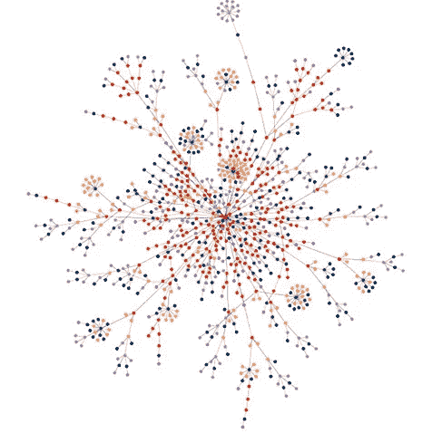

[Source](http://authenticorganizations.com/harquail/2011/01/24/your-authentic-social-network-the-identity-graph/)

# 社会网络分析

1932 年，在哈德森的纽约女子训练学校出现了一个没有先例的现象:两周内 14 个女生出走。雅各布·莫雷诺，一位杰出的社会科学家，被雇来寻找一个解释。他模拟了个人的关系、智力和社会活动。他创造了一个模型，揭示了主要的驱动力是他们的社会环境；他们的行为就像他们身边最亲近、最有影响力的人一样。这是第一个有充分记录的案例之一，其中分析社会行为有助于揭开复杂群体行为的神秘面纱。

Jacob L. Moreno, an early social scientist, among others ([Source](https://images.gr-assets.com/authors/1477039107p5/7352712.jpg))

社交网络分析用节点(顶点、点、参与者)和它们之间的链接(关系、交互)来模拟人或组之间的连接。使用不同的测量方法，可以研究这种社会网络的结构，从而给出特定群体行为的答案。

# 执法部门的新曙光

不用做太多研究，就可以肯定地说，在一个犯罪组织中，有些人比其他人更重要。不幸的是，在更大更复杂的组织中，很难决定谁更重要。此外，这也是一个公平的假设，那些虽然还不是组织的一部分，但已经连接到这种网络的外围的人，他们自己更容易成为犯罪分子。SNA 是一种分析这些网络的工具，可以识别有影响力的参与者或濒危者。有了这些信息，执法部门可以采取更有效的行动，同时也可以减少此类活动的数量。

# 预防犯罪的数据来源

像任何分析工具一样，没有充分可靠的[数据](https://hackernoon.com/tagged/data)，SNA 是没有用的。虽然获取信息有多种方式，但每种方式都有自己的缺点。

## 共同违规数据

共同犯罪的数据可以很容易地从犯罪记录中获得(当然，如果一个人有权利的话)。在共同犯罪图中，如果两个人一起犯罪，那么他们之间就有一种无向联系。个人之间的关系应该被加权，因为可能有些配对在犯罪记录中出现多次。

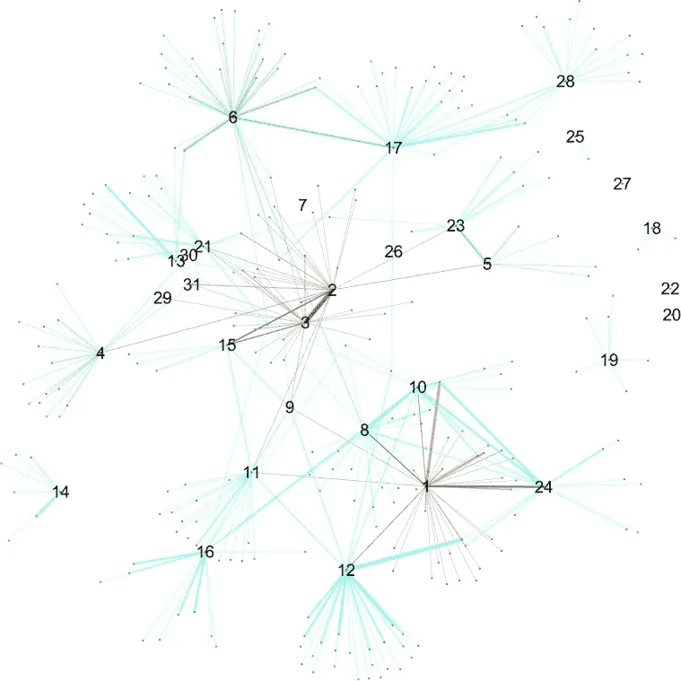

Co-offending network of a Swedish street gang ([Source](https://www.ncbi.nlm.nih.gov/pmc/articles/PMC4361400/))

## 监控数据

监视是一种获取信息的系统方法，通常通过电子设备。关于监控的法律因国家而异，并在世界范围内引起争论。例如，瑞典警方只能在个人已经实施或可能实施犯罪的情况下保留此类信息。

Surveillance and co-offending network of the same gang where the nodes are scaled by local clustering coefficient ([Source](https://www.ncbi.nlm.nih.gov/pmc/articles/PMC4361400/))

## 基于情报的数据

智力是一个更广义的概念；它包括监视和其他不太正式的信息集。

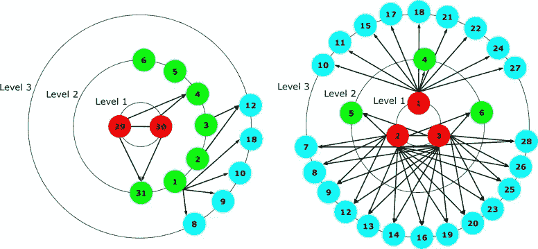

Intelligence based network of the Swedish street gang in 2007 and 2010 ([Source](https://www.ncbi.nlm.nih.gov/pmc/articles/PMC4361400/))

## 缺点

看到共同犯罪和监视网络之间的差异，人们可能会认为这里有问题，这是理所当然的。这些问题源于这样一个事实，即由于犯罪组织的性质，收集足够高质量的数据特别困难，而且所有数据来源都有其问题:

*   共同违规记录可能会丢失数据；许多罪行可能永远不会被发现，但也可能发生个人被错误地指控犯罪的情况。
*   情报通常基于人类信息，因此，它可能反映了数据源的观点，可能接近也可能不接近现实。
*   在被认为有意义的案件中收集监视记录。因此，有些事件比其他事件记录得更多。

# 社会网络分析中的基本度量

假设情报部门设法收集了足够的、没有偏见的数据，下一个任务将是找到核心行动者，对网络影响最大的人。虽然有很多度量(事实上，图论中的一切都可以应用)，但不需要完整性，我列出了一些最基本的。

## 程度中心性

最明显的一个:它计算一个节点有多少条边。在这种解释中，一个节点的进出边越多，相关联的人就越重要。例如，在下图中，节点 5 有 3 条边，而节点 3 有两条。

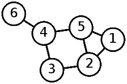

([Source](https://en.wikipedia.org/wiki/Graph_theory))

## 中间状态

介数是另一个简单的测量方法:它计算这个节点在任何两个其他节点的最短路径中出现的次数。

## 特征向量中心性

前面的测量假设每个节点和每个边都同等重要。当然，通常在 SNA 中，情况并非如此。很容易发生这样的情况，一个人有很多关系，但所有这些关系都是与没有影响力的人。因此，虽然可能有几十种关系，但这个人不能被认为是重要的。

对于特征向量中心性，节点的重要性基于它与其他重要节点的连接数量。当然，有趣的问题是我们如何定义“重要”。在这种情况下，如果一个节点有很多连接，或者连接到有很多连接的节点，或者连接到一个节点，而这个节点又连接到一个有更多连接的节点，那么这个节点就被认为更重要。

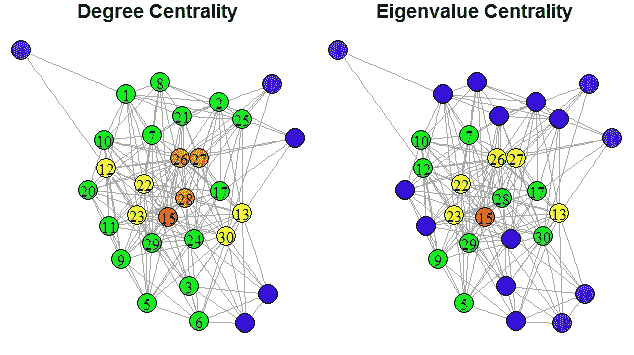

[Source](https://stackoverflow.com/questions/24841789/how-to-find-degree-centrality-of-nodes-in-a-matrix)

这被证明是一个方便的措施，尤其是在大型网络中。例如，谷歌著名的网页排名算法也使用特征向量中心性。

## 派系

在一个图中，如果每个节点之间有连接，那么节点的子集称为团。识别这些群体是描述群体内聚力的有力技术。政治学和社会学的研究揭示了群体凝聚力与激进化易感性之间的密切联系。在社交网络中，实际上使用较弱的团体定义更有用:

*   *n-团*:节点的子集，其中每个点最多可以用 *n* 步到达。
*   *k-core* :节点的子集，其中每个顶点在子组中至少有 *k* 个连接。

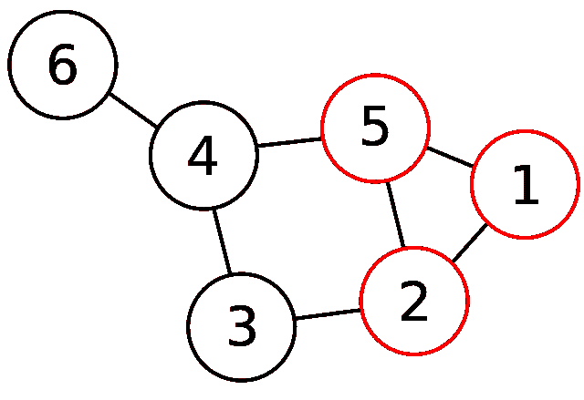

{1,2,5} forms a clique. ([Source](http://www.wikiwand.com/en/Clique_problem))

识别这些组有助于描述组织的结构。例如，在某些情况下，自杀式炸弹袭击者形成一个小团体，在其他情况下，他们处于外围，彼此独立。有了派系，意识形态的同质性及其对网络的影响就可以估计出来。

# 个案研究

美国执法部门已经在尝试社交网络分析的应用，到目前为止，结果令人信服。

*免责声明:本部分是网上研讨会“* [*利用社会网络分析减少暴力犯罪*](https://it.ojp.gov/CAT/Resource/78) *”的总结。还有，我从幻灯片上拍了照片。你可以在这里找到那些***。**

## *堪萨斯城*

*历史上，堪萨斯城是美国十大最暴力的城市之一。一个最引人注目的统计数据是，315 平方英里中只有 13 平方英里占了所有凶杀案的 47%。2012 年，新市政府成立后，他们做出了重大改变。他们建立了一个名为 KC NoVa(堪萨斯城非暴力联盟)的组织，目的是减少杀人和严重袭击。*

*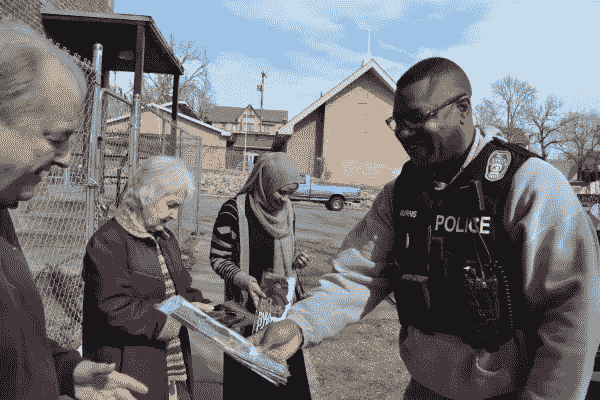*

*KCPD provides social services to reduce violence ([Source](http://kansascitynova.org/news.php?id=39))*

*2014 年，根据所有可用信息，警方发现了 832 人之间的联系。在这个过程中，他们确定了 66 个暴力团体。这些团体中有 47.5%被认为是极端暴力的，13%被认为是高度组织化的。*

*NoVA 用图的方法，比如中间中心性，从每个群体中召集个体。他们通知这些人暴力是不可容忍的，并提供了一些服务，如教育和就业准备。*

*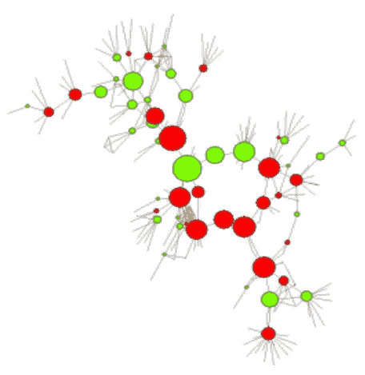*

*Betweenness centrality used on a gang called Dime Block. Red indicates that the person has an arrest warrant ([Source](https://iir.adobeconnect.com/p5yuw5ulrof/?proto=true))*

*结果是压倒性的:凶杀案减少了 28 %,达到了过去 30 年来的最低水平。*

*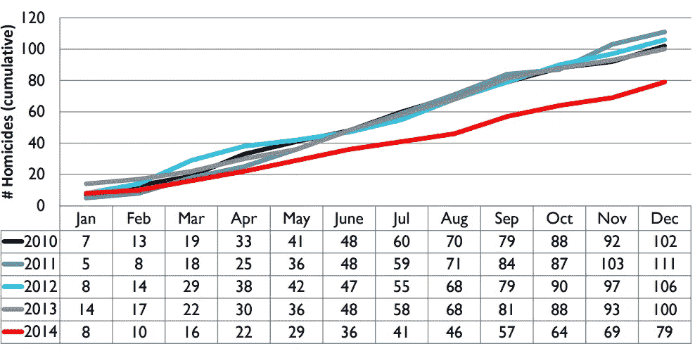*

*Kansas City monthly homocides ([Source](https://iir.adobeconnect.com/p5yuw5ulrof/?proto=true))*

## *芝加哥*

*这可能令人惊讶，但艾尔·卡朋市并不在美国最暴力的城市之列。当然，还有改进的余地。*

*2010 年 8 月，制定了减少群体暴力战略，以解决和减少与帮派有关的枪击案件。从当地项目组收集原始数据后，他们得出以下结论:*

*   *以国家为基础的旧帮派已经过时，正在瓦解。*
*   *帮派现在规模更小，地理位置更集中。*

*VRS 采用了两种方法。首先，他们使用审计来识别最活跃的派别。一种方法是给每个派系分配一个节点，如果他们之间有任何冲突，就连接两个派系。*

*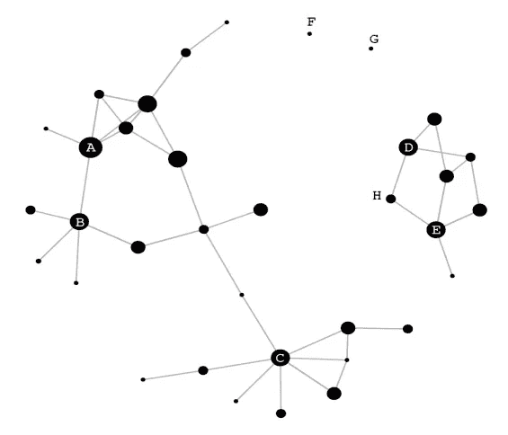*

*Conflict network of Chicago to identify the most active networks. ([Source](https://iir.adobeconnect.com/p5yuw5ulrof/?proto=true))*

*接下来，他们调查了最活跃群体的社会结构，以确定最重要的个人。为了实现这一目标，他们创建了一个共同犯罪网络，如果有记录在案的犯罪，他们就在个人之间建立联系。*

*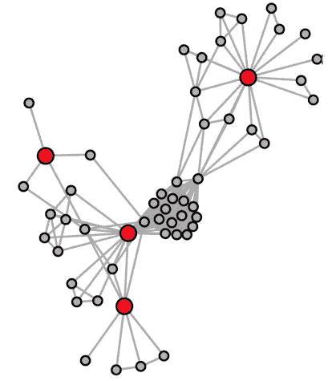*

*Co-offending network to identify the most influential persons in a group ([Source](https://iir.adobeconnect.com/p5yuw5ulrof/?proto=true))*

*芝加哥的结果也不言自明。总体枪击事件减少 23%,在使用 SNA 的派别中受害者减少 32%。*

*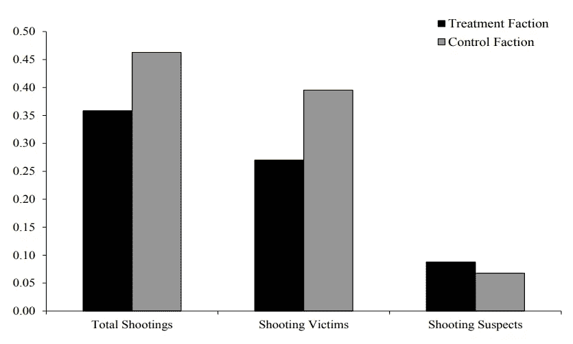*

*Results after 12 months of evaluation ([Source](https://iir.adobeconnect.com/p5yuw5ulrof/?proto=true))*

# *TL；速度三角形定位法(dead reckoning)*

*社会网络分析(SNA)是一种现代化的高效工具，可以让侦探们从另一个角度来看待犯罪组织。不幸的是，由于基础数据很有可能不充分或有偏差，因此不能仅仅根据这些指标做出决策。*

*尽管如此，由于当局倾向于更广泛地使用主动战略，SNA 是更有效的情报评估的重要工具。美国和斯堪的纳维亚半岛的结果表明，在合理使用的情况下，SNA 可以显著改善当局的运作方式。*

**如果你想知道更多关于这个主题的信息，看看我这篇文章所基于的这些优秀的资源:**

*   *[*詹妮弗·约翰逊(Jennifer A. Johnson，p .)，约翰·大卫·雷泽尔(John David Reitzel，p .)，诺伍德(Norwood，B. F .)，麦考伊(McCoy，D. M .)，卡明斯(Cummings，d . b .)&泰特(Tate，r . r .)(2017。05 27).FBI —社会网络分析:调查*T5 的系统方法](https://leb.fbi.gov/articles/featured-articles/social-network-analysis-a-systematic-approach-for-investigating)*
*   *[*利用社会网络分析减少暴力犯罪*](https://iir.adobeconnect.com/p5yuw5ulrof/)*
*   *[*犯罪网络数据的复杂性:以其对犯罪控制和网络研究的后果为例*](https://www.ncbi.nlm.nih.gov/pmc/articles/PMC4361400/)*