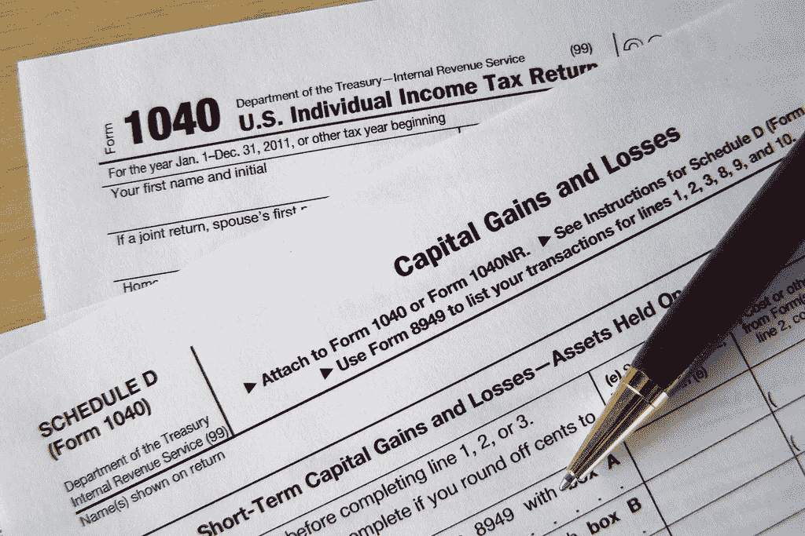
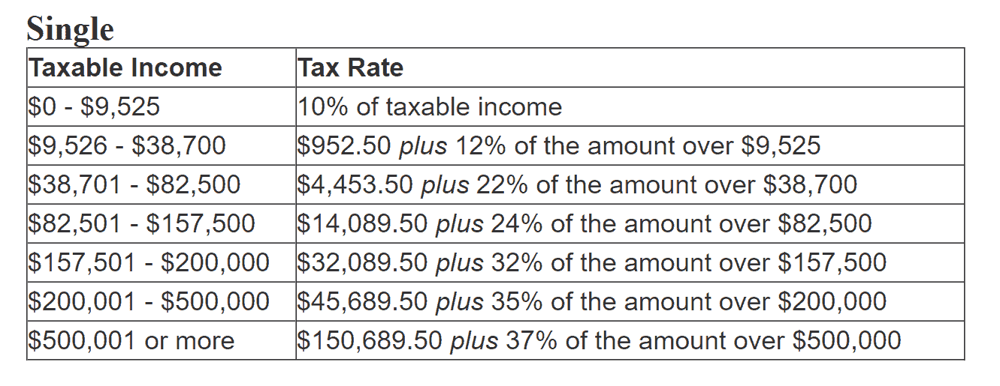
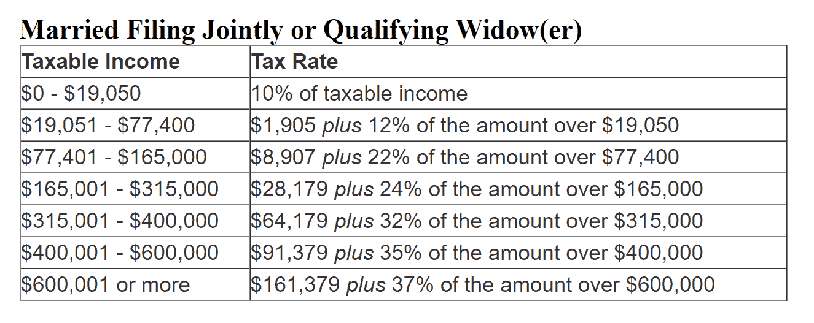
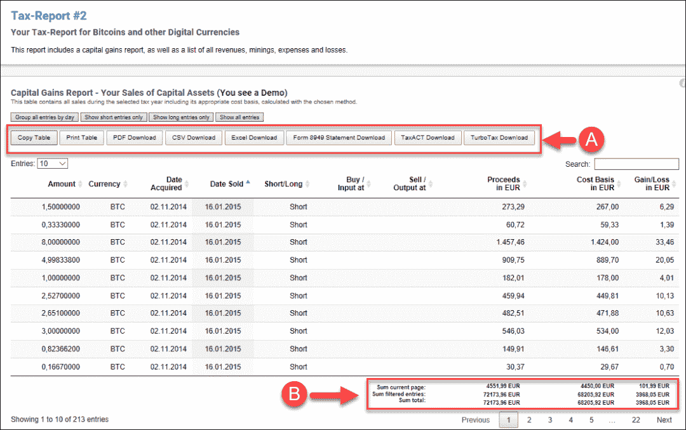

# 以下是如何在纳税时从秘密熊市中获益的方法

> 原文：<https://medium.com/hackernoon/filing-your-crypto-taxes-101-how-does-it-work-e3d35798c403>

Source: [ccPixs.com](http://ccPixs.com)

去年感恩节，比特币正处于牛市之中，在圣诞节前达到创纪录的 19511 美元。现在，比特币只值 3752 美元。

如果你在比特币和其他加密产品价格高的时候购买了它们，那么现在加密市场的灰色状态还有一线希望:你今年遭受的任何损失都可能使你处于较低的税收等级。此外，索赔这些损失比你想象的要容易。

请继续阅读，了解您需要知道的关于如何提交加密损失的所有信息。

# 申报你的加密税 101:它是如何工作的？

出于税收目的，美国和大多数其他政府将加密货币视为资产。这意味着，每当你交易加密货币时，交易都属于两种类型之一:资本收益或资本损失。

*   **资本收益**。当你出售加密货币的价格高于你购买加密货币的价格时，就会产生资本收益。
*   **资金损失**。如果你以低于购买价格的价格出售加密货币，这将被视为资本损失。

你必须出售或购买一项资产来触发应税收益或损失。一旦你决定采取行动，税务机关认为损失是“实现”如果你的损失足够大，你可以用它来进入一个较低的税级。

# 扣除你的加密损失

索赔损失的最大好处之一是，你可以抵消从其他来源获得的收入。

在美国，国税局允许你每年从你的日常工作收入中扣除高达 3000 美元的净资本损失。如果你损失的金额超过 3，000 美元，你可以在明年报税时再获得 3，000 美元的扣除。

如果你目前的工作年收入刚刚超过 5 万美元，那么 3000 美元的加密货币损失可能会使你处于较低的税收等级。这可能会节省数千美元的税款。

此外，如果你通过股票或出售房产获得了一些收入，你可以从这些收入中扣除的金额是没有限制的。

# 例子

下面来看看 2018 年单身个人的税级。

如果你的秘密税损失使你低于 38，700 美元，你只需支付 952.50 美元，外加任何超过 9，525 美元金额的 12%。但如果你的收入达到 38，701 美元或更多，你的税负会明显更高。

如果你已婚并共同申报或丧偶，进入一个较低的税率等级可以节省更多的税收。

# 加密采矿收入如何影响税收？

除了加密货币交易商之外，加密货币矿商也可以使用扣除来达到更低的税级。

国税局 2014 年 3 月发布的一份[通知](https://www.irs.gov/pub/irs-drop/n-14-21.pdf)提供了一些相关细节:

“……当纳税人成功“开采”虚拟货币时，虚拟货币在收到之日的公平市场价值可计入总收入。”

如果你开采的加密货币的价值下降，你决定出售它，那么这将意味着你已经引发了资本损失。你可以像通过交易所买卖硬币一样来挂失。

国税局的分析师告诉美国消费者新闻与商业频道，电费和其他费用也可能被注销。

# 这就是变得复杂的地方…

计算你赚了多少或亏了多少是一件令人头疼的事情，尤其是如果你没有记录你的购买情况，或者如果你去年下了大量的交易订单。

要弄清楚你亏了多少或赚了多少，需要访问历史定价数据。没有这些历史数据，你将无法确定你的加密资产在买卖时的价格。

# 加密货币税收工具

幸运的是，有软件可以帮你处理所有的加密税务数据。

下面描述的工具名为 [CoinTracking.info](https://cointracking.info?aa=108) ，可以从你所有的加密货币钱包和交易所导入你的交易。该界面将指导您如何进行导入。

在导入过程的最后，您可以下载 IRS 表格 8949。这是你需要提交的报失表格。

其他下载选项包括 CSV、TaxACT 和 TurboTax。

# 警惕自称的“加密会计师”

如果你使用一个加密税收计算器来做你自己的税，报税是一个简单的过程。你所要做的就是从 IRS 表格 8949 中取出总数，并把它转到 IRS 表格 1040 附表 d 中。

事实上，大多数与密码交易员合作的注册会计师使用[硬币追踪](https://cointracking.info?aa=108)和其他公开可用的软件来确定他们客户的欠款。这些工具不难使用。很多都有免费试用，让你在承诺之前看到它们是如何为你自己工作的。

# 结论

如果你去年在加密市场上损失了钱，你可以在纳税时抵消一部分，甚至全部损失。报告你的资本损失可能有助于你降低税率。如果你的扣除使你有资格获得较低的等级，那么当你今年提交你的税款时，提交它们可以为你节省数千美元。