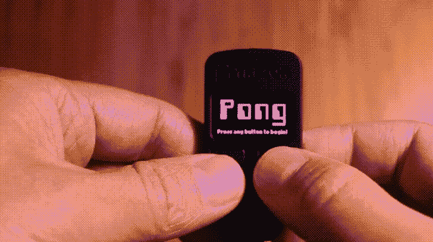
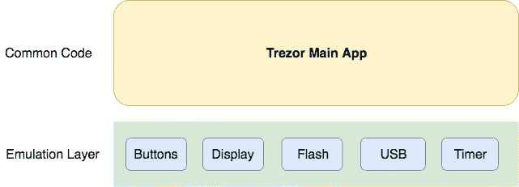
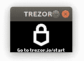
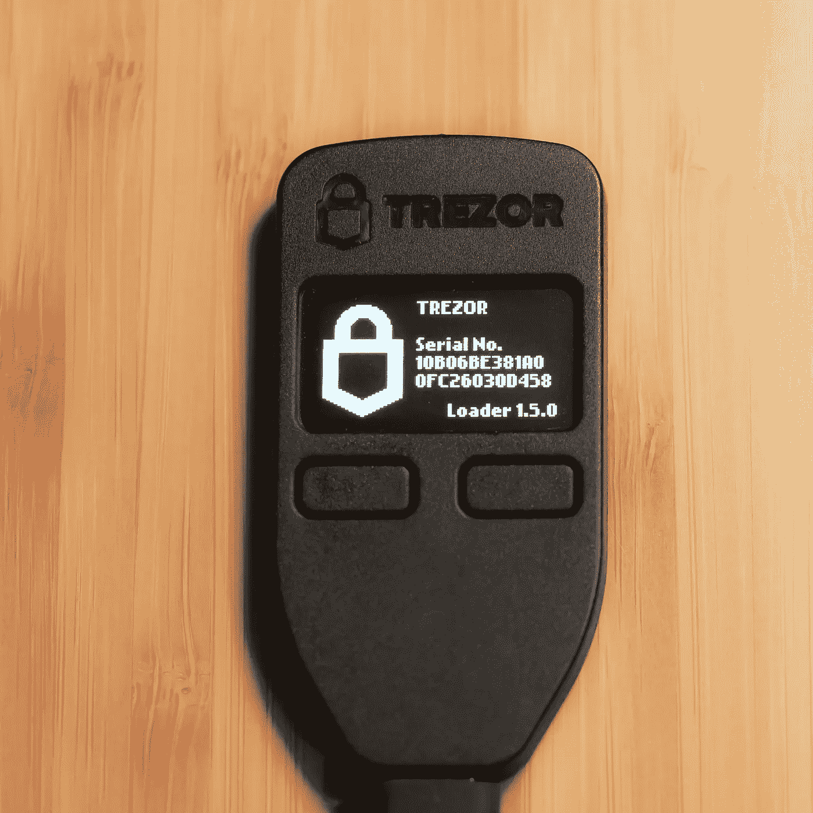
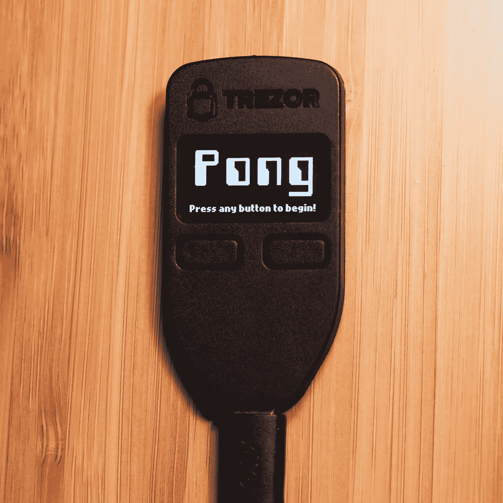

# 我的加密钱包终于派上用场了！

> 原文：<https://medium.com/hackernoon/finally-a-use-for-my-crypto-wallet-66250af48728>

如果你拥有加密货币，你就是估计 8%的美国人口中的一员。你可能会把硬币放在一个软件钱包里，要么放在比特币基地这样的交易所，要么使用以太坊钱包或比特币核心这样的开源选项。你们中的一些人可能已经采取了下一步，买了一个硬件钱包来保护你的钥匙。

Trezor One、Ledger Nano S 和 KeepKey 是当今市场上最受欢迎的硬件钱包。虽然它们在架构和支持的货币方面各有优势，但它们都可以安全地存储您的私钥。硬件钱包允许您直接在设备上签署交易，这样您的密钥就不会暴露在设备之外。这种方法的优点是，即使黑客破坏了你的桌面系统，他们也无法访问你的加密库或干扰你的[加密](https://hackernoon.com/tagged/crypto)交易。

我最近买了一个 Trezor。然而，在将一些货币转移到钱包后，我很快意识到，除了最初的货币转移，这些设备没有什么乐趣。随身携带这些钱包是没有意义的，因为加密货币基础设施在这个时候几乎不存在。因此，硬件钱包闲置在架子上或保险箱里，静静地保护着钥匙和硬币免受伤害。

但那很无聊。对于这些硬件钱包，我们还能做些什么呢？来点游戏怎么样！鉴于 crypto 从游戏社区获得的一切——通过囤积采矿钻机推高 GPU 价格——现在是 crypto 回报的时候了。

女士们先生们，我向你们介绍一个在 Trezor One 上运行的永恒经典:Pong。



虽然显示屏相当小，只有两个按钮，但 Trezor One 仍然是一个有趣的学习如何对嵌入式设备进行编程的小设备。处理器是[意法半导体 STM32F205](https://www.st.com/content/ccc/resource/technical/document/datasheet/bc/21/42/43/b0/f3/4d/d3/CD00237391.pdf/files/CD00237391.pdf/jcr:content/translations/en.CD00237391.pdf) ，它有一个 ARM 32 位 Cortex-M3 CPU。大约有 1MB 的闪存和 128KB 的内存。该设备有一个 128x64 位有机发光二极管显示器和两个按钮。

如果你想为 Trezor One 编写自己的固件，这里有一些指导让你开始。

# 设置构建环境

这些说明假设你运行的是 Ubuntu 18.04 LTS，但是稍加调整，它们可以在任何机器上运行。这些步骤适用于版本 1.6.2 的固件。

## 获取 Trezor 源代码

第一步是下载 Trezor 源代码。

```
$ mkdir workspace
$ cd workspace
$ git clone https://github.com/trezor/trezor-mcu.git
```

## 安装依赖项

接下来，您需要安装构建所需的所有依赖项。

```
sudo apt install build-essential python python-pip libsdl2-dev
```

下载并解压 [GNU ARM 嵌入式工具链](https://developer.arm.com/open-source/gnu-toolchain/gnu-rm/downloads)。

```
$ cd workspace
$ tar -xjf ~/Downloads/gcc-arm-none-eabi-7-2018-q2-update-linux.tar.bz2
$ echo "export PATH=~/workspace/gcc-arm-none-eabi-7-2018-q2-update/bin:$PATH" >> ~/.bashrc
$ source ~/.bashrc
```

你还需要安装谷歌协议缓冲区。不幸的是，Ubuntu 提供的软件包太过时了，所以你需要自己[这里](https://github.com/google/protobuf/releases/)获取最新版本。

```
$ cd workspace
$ mkdir protoc
$ cd protoc
$ wget [https://github.com/google/protobuf/releases/download/v3.6.0/protoc-3.6.0-linux-x86_64.zip](https://github.com/google/protobuf/releases/download/v3.6.0/protoc-3.6.0-linux-x86_64.zip)
$ unzip [protoc-3.6.0-linux-x86_64.zip](https://github.com/google/protobuf/releases/download/v3.6.0/protoc-3.6.0-linux-x86_64.zip)
$ echo "export PATH=~/workspace/protoc/bin:$PATH" >> ~/.bashrc
$ source ~/.bashrc
```

最后，安装几个 Python 模块。

```
$ pip install protobuf ecdsa
```

## 构建固件

既然已经安装了所有的依赖项，就可以开始构建固件了。要构建固件:

```
$ cd ~/workspace/trezor-mcu
$ ./script/setup
$ ./script/cibuild
```

新构建的映像将存储在 firmware/trezor.bin 中。稍后我们将讨论如何处理该映像。

# Trezor 仿真器

如果你计划创建你自己的 Trezor 固件，很有可能你第一次尝试的时候不会成功。为了缩短修改代码/构建/加载周期，您可以使用 Trezor 模拟器来测试您的更改，而不必在设备上实际加载固件。



下面是模拟器运行的截图。128x64 有机发光二极管显示器出现在自己的窗口中。通过按下左箭头键和右箭头键来模拟按钮。



Trezor One Emulator

要构建模拟器，您需要设置一些环境变量，并再次运行安装脚本来清除任何以前的构建工件。

```
$ cd ~/workspace/trezor-mcu
$ export EMULATOR=1 TREZOR_TRANSPORT_V1=1
$ ./script/setup
$ ./script/cibuild
```

仿真器可执行文件显示在固件目录中，可以这样运行:

```
$ ./firmware/trezor.elf
```

# 自定义固件

好了，现在你已经准备好构建设备固件和模拟器了，所以你可以创建你自己的 Trezor 固件了！

Trezor 应用程序固件的入口点位于 firmware/trezor.c 中的 main 函数中。您可以在该函数初始化后删除所有内容，并开始编写自己的代码。

## 向显示器绘图

你要做的第一件事就是在显示屏前画画。Trezor 显示器是一个 128x64 的有机发光二极管，其中像素(0，0)位于屏幕的左上角。显示芯片硬件可通过 SPI 总线访问(见 oled.c ),但无需直接与硬件交互。Trezor 固件在 oled.h 中提供了一个简单的 API，用于在显示器上绘图和打印。

显示 API 包含在 oled.h 中，非常简单。

```
#define OLED_WIDTH   128
#define OLED_HEIGHT  64
#define OLED_BUFSIZE (OLED_WIDTH * OLED_HEIGHT / 8) void oledInit(void);
void oledClear(void);
void oledRefresh(void); 
void oledSetDebugLink(bool set);
void oledInvertDebugLink(void); 
void oledSetBuffer(uint8_t *buf);
const uint8_t *oledGetBuffer(void);
void oledDrawPixel(int x, int y);
void oledClearPixel(int x, int y);
void oledInvertPixel(int x, int y);
void oledDrawChar(int x, int y, char c, int zoom);
int oledStringWidth(const char *text, int font); 
void oledDrawString(int x, int y, const char* text, int font);
void oledDrawStringCenter(int y, const char* text, int font);
void oledDrawStringRight(int x, int y, const char* text, int font);
void oledDrawBitmap(int x, int y, const BITMAP *bmp);
void oledInvert(int x1, int y1, int x2, int y2);
void oledBox(int x1, int y1, int x2, int y2, bool set);
void oledHLine(int y);
void oledFrame(int x1, int y1, int x2, int y2);
void oledSwipeLeft(void);
void oledSwipeRight(void);
```

例如，要在某个位置(x，y)绘制像素:

```
oledDrawPixel(x,y);
```

一旦理解了所需数据的格式，绘制位图也很简单。oledDrawBitmap 函数采用一个指向位图结构的指针，如下所示:

```
typedef struct {
    uint8_t width, height;
    const uint8_t *data;
} BITMAP;
```

“宽度”和“高度”字段指定图像的尺寸。“数据”数组由从图像左上角开始的像素数据组成。每个字节代表 8 个像素，最低有效位位置对应于最左边的像素(即小端)。比特值 1 表示白色，0 表示黑色。如果你想显示标准的 Windows 位图文件，你必须做两件事。

首先，你需要将图像缩小到 128x64 的尺寸。您可以使用 Gimp 之类的图像编辑器来完成，或者使用 Linux 上的 convert 实用程序更容易:

```
convert title.bmp -resize 128x64 title_resize.bmp
```

第二步是将位图文件转换成 Trezor display API 可用的 C 数组。我编写了一个脚本，将标准的 Windows 位图文件转换为 Trezor API 使用的 C 数组格式。输入位图必须是 24 位模式，这意味着每个像素存储为三个字节，每种颜色(红色、绿色和蓝色)一个字节。该脚本将中间字节(绿色)转换为 0 或 1，因为 Trezor 显示是黑白的。你可以在 这里找到名为 bmp2trz.py [**的 Python 脚本。**](https://github.com/syscall7/trezor-pong/blob/master/bmp2trz.py)


Converting Bitmap forTrezor API

## 阅读按钮

Trezor 有两个按钮，分别称为“是”和“否”。button API 在 buttons.h 中公开，有一个保存按钮状态的全局变量叫做“button”，这个结构有以下字段:

```
struct buttonState {
        volatile bool YesUp;
        volatile int YesDown;
        volatile bool NoUp;
        volatile int NoDown;
};
```

有两种方法可以读取按钮状态。您可以检查按钮当前是否被按下，也可以检查按钮是否被按下和释放。

在读取全局按钮变量之前，首先调用“buttonUpdate”来更新状态。然后，您可以直接测试全局按钮变量字段。例如，下面是无限期等待任一按钮被按下的示例代码:

```
do
{
    delay(100000);
    buttonUpdate();
} while (!button.YesUp && !button.NoUp);
```

# 安装固件

要将您的自定义固件加载到设备上，您首先需要让设备进入引导加载程序模式。将 Trezor 插入 USB 端口时，按住两个按钮即可进入引导加载程序模式。当您处于引导加载程序模式时，屏幕如下所示:



Trezor One in Bootloader Mode

当 Trezor 处于引导模式时，您可以使用 trezorctl 实用程序上传您的自定义固件映像。要安装 trezorctl 实用程序，您需要安装以下软件:

```
$ sudo apt-get install python3-dev python3-pip cython3 libusb-1.0-0-dev libudev-dev
$ pip3 install --upgrade setuptools
$ pip3 install trezor[hidapi]
```

然后你可以安装你的固件，如下所示。

**这一步要小心！此操作将完全擦除图像以及您在设备上设置的任何键。如果你的钱包里有很多钱，并且你不确定你在做什么，不要继续。如果你的钱包里确实有现金，我建议你在将新固件加载到设备上之前，仔细检查你的种子词是否安全地存储在纸上。**

```
$ trezorctl firmware_update -f firmware/trezor.binFirmware fingerprint: f5392f9b390b6381bfaa24a39a7ed0f7eba2e9cbfa21b9c224ce500b38918766Please confirm action on device...
```

您必须确认您想要继续删除当前映像，并在设备上加载新的固件映像。

这里有一段视频展示了升级过程。

需要说明的是，在升级过程中以及之后的每次引导中，引导加载程序都会检测到 Satoshi Labs 没有对升级映像进行签名，并提示用户是否要继续使用未签名的固件。

如果你想让 Pong 在你的 Trezor 上运行，如果你不想的话，你不必从头开始实现这个游戏。用户 flightcrank 在 github 上有一个相当简单的实现，你可以在这里找到。我已经将那个版本移植到 Trezor 上，只做了很小的改动，所以如果你想从我的 flightcrank 的 Pong 实现移植到 Trezor 上开始，你可以在这里找到代码。

[](https://github.com/syscall7/trezor-pong) [## syscall7/trezor-pong

### trezor-pong -将 pong 移植到 trezor 上

github.com](https://github.com/syscall7/trezor-pong) 

Pong Start Screen

编码快乐！