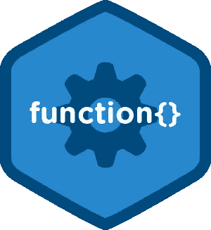

# 最后是 Java 中的函数式编程

> 原文：<https://medium.com/hackernoon/finally-functional-programming-in-java-ad4d388fb92e>



在许多帖子中，我们探讨了不同语言的函数式编程概念，其中***【F #】***和 ***Scala*** 是讨论的焦点。然而，因为我一直在我的工作场所上做一些 ***Java*** ，探索这些相同的概念似乎很有趣，也让我大开眼界，因为距离我上次认真使用 ***Java*** 已经有很长时间了。

## 高阶函数

如这里所解释的 [***高阶函数，它们是什么？***](https://hackernoon.com/higher-order-functions-what-are-they-be74111659e8)*高阶函数是简单函数，可以接收函数作为参数，并可以返回另一个函数作为结果。*

*在现代的 ***Java*** 中，我们可以轻松做到这一点。语法并不是最好的，因为没有类型推理，我们必须显式声明函数类型，在 ***Java*** 中意味着某种 ***接口*** 。让我们看看怎么做。*

*首先，假设我们有一个对象集合，这是一个狗的集合，我们有一个作用于每只狗的函数。我们希望能够在每个对象(狗)上调用这个函数。*

*让我们看看如何创建这样一个函数。*

```
*@FunctionalInterface
interface DogAge *{* Integer apply*(*Dog dog*)*;
*}*List*<*Integer*>* getAges*(*List*<*Dog*>* dogs, DogAge f*) {* List*<*Integer*>* ages = new ArrayList*<>()*;

    for *(*Dog dog : dogs*) {* ages.add*(*f.apply*(*dog*))*;
    *}* return ages;
*}**
```

*我们定义了一个接口，给定一只狗，它从中提取一些整数值。然后，我们定义一个函数 ***getAges*** 将传递的函数( ***接口*** )应用到每只狗。*

*现在，我们必须创建我们想要应用于每只狗的实际函数。*

```
*DogAge f = dog -> dog.getAge*()*;

*getAges(*dogs, f*)*;*
```

*注意，我们不需要像在旧的 ***Java*** 中那样定义 ***DogAge*** 实现。那会是下面的方式，但是拜托，不要再用了。*

```
*DogAge dontUseMe = new DogAge*() {* @Override
    public Integer apply*(*Dog dog*) {* return dog.getAge*()*;
    *}
}*;*
```

*前者实际上是编译器看到第一个时生成的。*

*我们可以更深入一步，做以下事情。*

```
**getAges(*dogs, dog -> dog.getAge*())*;*
```

*在这里，我们将函数直接传递给 ***getAges*** 方法。*

*不知何故， ***getAges*** 是一个*高阶函数*，因为它可以接收函数作为参数。Java 通过接收一个 ***接口*** 来保持签名的怪异，但我猜这将在语言的未来版本中得到改进。*

*为了有个比较点，我们先定义一下 ***Scala*** 中的 ***getAges*** ，看看有什么区别。此外，我们将立即更改函数的名称，使其更加通用。*

```
*def extractStringFromDogs(dogs: List[Dog], f: Dog => String) = 
    dogs.map(f)*
```

*在 ***Java*** 中，我们可以做到。*

```
*@FunctionalInterface
interface DogMapper *{* String apply*(*Dog dog*)*;
*}*List<String> extractStringFromDogs(List<Dog> dogs, DogMapper f) {             return dogs.stream().map(dog -> f.apply(dog)).collect(Collectors.toList);
}*
```

*碰巧在 ***Java*** 中已经有一个结构解决了同样的问题。那就是 ***功能< A，B >*** 。换句话说，我们可以做。*

```
*List<String> extractStringFromDogs(List<Dog> dogs, Function<Dog, String> f) { return dogs.stream().map(dog -> f.apply(dog)).collect(Collectors.toList);
}extractStringFromDogs(dogs, dog -> dog.getName());*
```

*现在，如何定义实际返回其他函数的函数呢？*

*在 ***Scala*** 中，我们可以做如下操作。*

```
*scala> def sum(): (Int, Int) => Int = (a, b) => a + b
**sum**: **()(Int, Int) => Int**scala> sum()
**res1**: **(Int, Int) => Int** = $$Lambda$1067/2036949810@715f45c6scala> sum()(4,5)
**res2**: **Int** = 9scala> res1(2, 3)
**res3**: **Int** = 5*
```

*在这里， ***sum*** 返回一个函数，可以存储并在另一个时间求值。这是函数式语言非常强大和重要的构造。我们能在 Java 中做同样的事情吗？*

*让我们首先为这个特殊的问题定义我们自己的函数类型( ***函数接口*** )。*

```
*@FunctionalInterface
interface TakeTwo *{* Integer apply*(*Integer a, Integer b*)*;
*}**
```

*正如我们所见， ***TakeTwo*** 在语义上与我们在 ***Scala*** 中定义的相同。*

*现在，我们可以再次定义*求和方法。**

```
**TakeTwo sum*() {* return *(*a, b*)* -> a + b;
*}*TakeTwo mySum = *sum()*;

Integer finalSum = mySum.apply*(*5, 6*)*;**
```

**这和我们在 ***Scala*** 中做的完全一样，只是在 ***Scala*** 中，语法简洁，不需要定义一个 ***函数接口*** 作为函数类型使用。是的，达到了同样的结果。**

**同样，我们实际上不必自己定义 ***TakeTwo*** ，因为在 ***Java*** 中已经定义了一个等价的接口，名为 ***BiFunction*** 。通过使用它，我们可以用下面的方式写出 ***sum*** 。**

```
**BiFunction*<*Integer, Integer, Integer*>* sum*() {* return *(*a, b*)* -> a + b;
*}***
```

## **更多的功能界面。**

**为了支持函数式编程的努力， ***Java*** 融合了很多这些 ***函数接口*** 。其中一些是:**

## **消费者**

***Java:***

```
**public interface Consumer*<*T*> {* void accept*(*T t*)*;
    ....
}**
```

***Scala***

```
**T => Unit**
```

## **述语**

***Java***

```
**public interface Predicate*<*T*> {* boolean test*(*T t*)*;
    ...
}**
```

***Scala***

```
**T => boolean**
```

## **供应者**

***Java***

```
**public interface Supplier*<*T*> {* T get*()*;
*}***
```

***Scala***

```
**:=> T**
```

## **功能**

***Java***

```
**public interface Function*<*T, R*> {* R apply*(*T t*)*;
    ...
}**
```

***Scala***

```
**T => R**
```

## **双功能**

***Java***

```
**public interface BiFunction*<*T, U, R*> {* R apply*(*T t, U u*)*;
     ...
}**
```

***Scala***

```
**(T, U) => R**
```

**这些只是在新的*和它们在 ***Scala*** 中的对应物中可以找到的几种函数类型( ***函数接口*** )。注意，在 ***Scala*** 中，我们不需要为它们定义任何接口，我们只需要这些函数就可以了，我们可以随心所欲地定义它们。***

## **结论**

**不知何故， ***Java*** 肯定是在向函数式编程发展，尽管语法不是最方便的，但结果是一样的。**

*****Scala*** 语法，另一方面，要精确得多，更好地展示了意图，不需要创建接口作为函数类型。**

**我只希望 ***Java*** 继续发展，同时减少冗长并增加新的功能结构，因为最终，我们，工程师，是从中获得真正利益的人。**