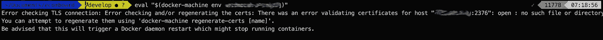
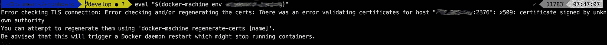
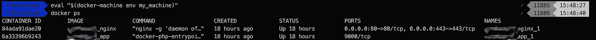

# 最后，您可以共享 Docker 机器——无需脚本

> 原文：<https://medium.com/hackernoon/finally-you-can-share-docker-machines-without-a-script-8f946d050f7>


[Docker](https://hackernoon.com/tagged/docker) 机器是供应新 Docker 主机或*机器*的最简单方式。我用它来设置新的远程登台服务器，最多需要一分钟。它为 Docker 引擎选择一个合适的 Linux 发行版，并安装 Docker 守护进程，这一切都是一次性完成的。

它可以通过 15 个不同的云提供商完成所有这些工作！您可以在其中任何一个中设置一个服务器，使用同样简单的命令 *docker-machine create* 。
例如，如果您使用的是 [AWS](https://hackernoon.com/tagged/aws) ，Docker Machine 会代表您调用 AWS API，在您的 AWS 帐户中创建一个 EC2 实例。

—它非常快
—命令行非常简单
—它管理所有的 SSH 密钥和 TLS 证书，即使您有几十台服务器
—让您的服务器立即为 Docker 部署做好准备

但是有一个问题……它只能在你的电脑上本地存储它的所有配置。

所以在你设置好你的服务器并部署好你的项目后，你的队友将无法连接到*机器*并自行重新部署。

如何与队友共享 Docker 主机的访问权限？他们需要 SSH 密钥和机器创建的 TLS 证书来连接到远程 Docker 守护进程。
您至少需要 TLS 证书才能从本地 Docker 客户端连接到您的远程 Docker 主机，因为这是 Docker 连接到端口 2376 上显示的 Docker HTTP API 的安全方式。

## 顺便问一下，它是如何工作的？

我已经在这里展示了 Docker Machine 如何在你的本地计算机上存储密钥和证书。都在`~/.docker/machine/machines`里。

## 失败 1:使用 Docker 机器通用驱动程序

docker Machine“generic”驱动程序使用带有 SSH 的现有 VM/主机创建*机器*。例如，如果您已经为您的服务器提供了 Terraform，这也很好，因为它会连接到这些服务器并为您安装 Docker 守护程序。

通用驱动程序听起来像是让您的队友安装 Docker 机器的有效解决方案:

```
docker-machine create \
  --driver generic \
  --generic-ip-address=YOUR_SERVER_IP \
  --generic-ssh-key PATH_TO_YOUR_SSH_KEY \
  my_project
```

这将连接到远程服务器，重启 Docker 守护进程，停止所有正在运行的容器，并…重新生成远程 TLS 证书。这意味着他们可以连接，但你不能再连接了！



Error checking and/or regenerating the certs. You can attempt to regenerate them using ‘docker-machine regenerate-certs [name]’

嗯，你可以从你的终端重新生成本地和远程证书，你的队友下一次也必须这样做，等等..失败

## 失败 2:复制文件夹

现在你知道 Machine 如何在内部存储 *machine* 的配置，第二个想法就是简单地将`~/.docker/machine/machines/xxx`文件夹直接复制到你的队友`~/.docker/machine/machines`文件夹中。

让我们试一试，并尝试连接到 Docker 主机:



There was an error validating certificates for host “YOUR_SERVER_IP:2376”: x509: certificate signed by unknown authority

哇，机器检测到您复制的客户端证书不是您自己创建/签名的(您自己的主证书存储在`~/.docker/machine/certs`)并拒绝连接。失败

## 失败 3:使用 Docker 机器“无”驱动程序

这个看起来符合要求，但是好像已经坏了一段时间了。

## 解决方案

解决方案是为这个 Docker 主机导入客户机证书和 SSH 密钥，同时还要从最初创建 Docker *机器*的开发人员那里导入主证书。

您不想覆盖自己的主证书，所以我们将它们保存在*机器*文件夹中，并修改*机器* `config.json`文件以指向这些特定的主证书。

1.  将您的*机器*文件夹克隆到一个临时目录中，并将您的证书克隆到其中:

```
$ cp -R ~/.docker/machine/machines/my_machine . && \
  cp ~/.docker/machine/certs/* ./my_machine/certs
```

2.更新`./my_machine/config.json`以兼容你的队友 Docker 存储路径(Docker 机器只取绝对路径，所以你需要用`/Users/her_username/.docker`替换`/Users/your_username/.docker`)(假设 OSX):

```
$ sed -i.bak 's/machine\/certs/machine\/machines\/my_machine\/certs/' ./my_machine/config.json$ sed -i.bak 's/your_username/her_username/' ./my_machine/config.json
```

3.存档您的*机器*配置:

```
$ tar -zcf my_machine.tar.gz my_machine
```

让他们将档案解压到他们的`~/.docker/machine`中。瞧啊。



莱昂内尔是总部位于伦敦的初创公司 Wi5 的首席技术官，也是《面向未来的工程文化课程[](https://hackernoon.com/why-the-platform-model-is-broken-a51478b1b4ee)**的作者。你可以在*[*https://getlionel.com*](https://getlionel.com)上联系他*