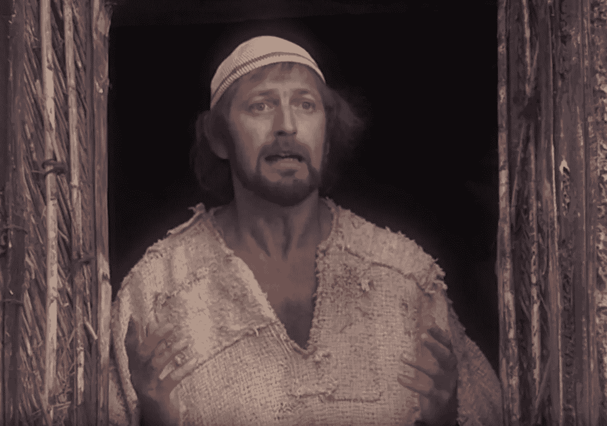

# 金融无神论

> 原文：<https://medium.com/hackernoon/financial-atheism-ed51ef0eeb09>

Brian of Nazareth

在 2001 年 9/11 悲剧事件后，山姆·哈里斯开始写他的书《信仰的终结》,这本书恰好与理查德·道金斯的《上帝错觉》、丹尼尔·丹尼特的《打破魔咒》和克里斯托弗·希钦斯的《上帝并不伟大——宗教如何毒害一切》同时发行。这些书开启了事后来看通常被称为*的新无神论运动*，尽管可以说从来没有任何关于无神论的新东西。无神论几乎肯定先于宗教，因为宗教观念要求持有这种观念的人*相信*某种教义或故事。无神论就是拒绝那些无法通过实验验证的描述世界的方式。根据这个词的定义，苍蝇可能是无神论者。无神论经常被指责为只是另一套信仰，而事实上，这个词本身更好地描述了它。有神论。不相信有神论的观点。它不是你生活的行为准则或规则，它只是拒绝那些无法被科学证实的东西。许多人，尤其是宗教人士，很难理解这一点。如果你相信一个超自然的实体创造了每个人生活中的一切，你可能不会太舒服地用一个词来描述一个完全拒绝你所相信的东西，甚至是这个词所描述的无神论者。存在的不同宗教世界观的数量可能相当于地球上所有宗教人士的总和，但基于拒绝这些观点的世界观只需要一个词——无神论。它不是宗教的对立面，只是缺乏宗教。相对于所有其他数字来说，它相当于零。

2008 年，另一个不信的亚文化运动诞生了。让我们称之为*金融无神论*——拒绝不可证实的价值主张。随着比特币的发明，一种拒绝欺骗性代币价值表达的方法诞生了。我们这些有幸出生在世俗国家的人都从*而不是*宗教煽动家的思想支配我们的生活中获益。我们可以*选择*相信或不相信什么想法。然而，我们能选择的方式仍然非常有限，那就是我们向对方表达价值的方式。我们被告知要使用一个系统，在这个系统中，我们都有一定数量的价值令牌分配给我们的名字，作为屏幕上的数字和纸币上的数字，我们都生活在集体幻觉中，认为这些数字在某种程度上是合法的，它们的真实性不容质疑。对于外行人来说，分配给某个比特币地址的比特币余额可能看起来同样有问题，但如果你对哈希算法有基本的了解，就不会有问题。在写这篇文章的时候，比特币区块链上的最新区块的散列以连续十八个零开始。这些零表示工作证明，确保这个块是有效的，并且其中的每个事务都实际发生了。如果你能理解散列算法的概念，如果你对数学有直觉，你就会意识到寻找这个特定散列所花费的巨大计算量。这简直令人兴奋不已。这个*必须*是一组合法的事务。伪造一个这样的假版本在经济上是不可行的。不要相信。验证。

单词 *cryptocurrency* 的复数形式有误导性。成为金融无神论者的工具集是比特币，而且仅仅是比特币。它的共识规则与它的公共区块链为我们提供了一种验证我们交易的方式的铁一般的安全性结合在一起。比特币的历史，从 Satoshis 的离开到 Mike Hearns，从 bcash fork 到 SegWit2x 的失败，都是其抵御绑架企图能力的证明。发明比特币的人在寻求一种去中心化货币的过程中是不妥协的，也是主要的，这种货币的货币政策是一成不变的，因此无论国王、政治家或银行家如何诱惑，都无法增加其供应量。毕竟，这是曾经存在过的所有其他货币的遭遇。替代区块链或替代硬币可以被视为比特币的通胀企图。比特币的竞争货币的概念是一个矛盾，因为比特币的创始原则之一是固定的货币供应。尽管如此，寻租行为在这个领域随处可见，贪婪似乎再次成为人类行为的主要动力。

所有这些给那些不熟悉区块链的人带来了很多困惑。他们不能把科学和科学论派分开，因为最响亮的声音不是匿名程序员的自由主义朋友圈的声音，而是那些试图在流行词汇的浪潮跌落到令人清醒的海岸之前驾驭它的蛇油推销员的声音。所谓的*加密货币空间*在这方面是独一无二的，因为它同时代表了人类所能提供的最好和最坏的东西。这就像是在北美发现的想法多样性的放大版本，在那里美国宇航局和平坦地球协会同时运作。比特币不是追随思想领袖。聪不是耶稣。Satoshi 是拿撒勒的 Brian 告诉他的追随者为他们自己考虑。比特币是每个人消除对自我宣称的更高真理的信任的工具，比如政府支持的资金或“替代”区块链。不要相信。验证。

比特币是世俗化的第二阶段——货币和国家的分离。如果你想从中获益，你需要参与进来。它不需要信仰，它需要理解。离开邪教并不容易。它要求你把自己从群体中分离出来。为大规模迁移做好准备。