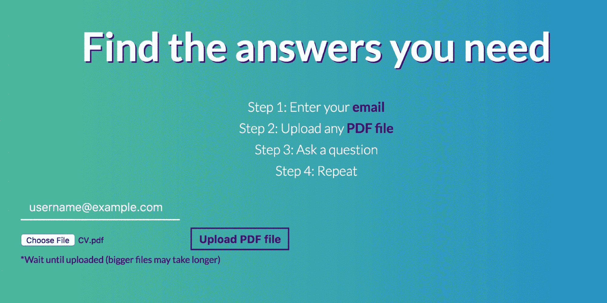
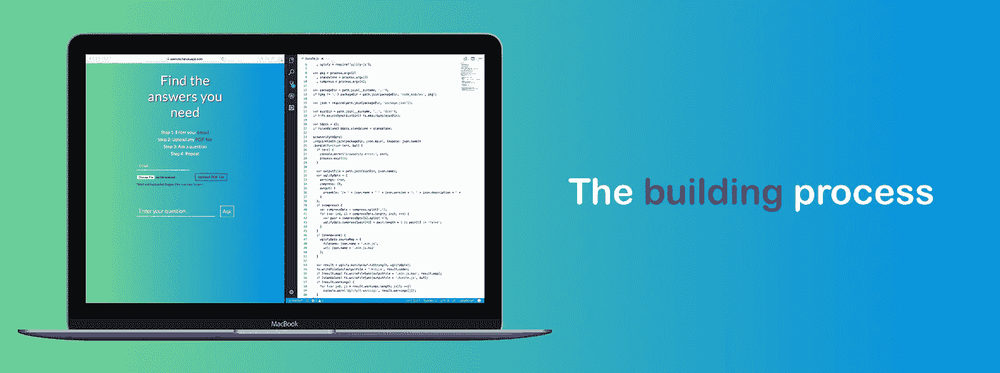
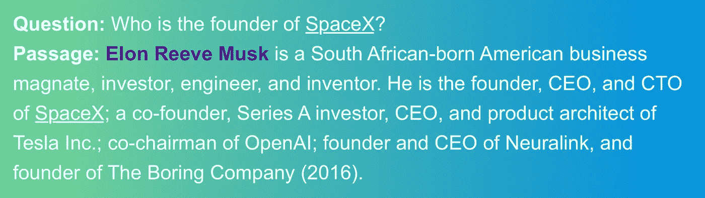
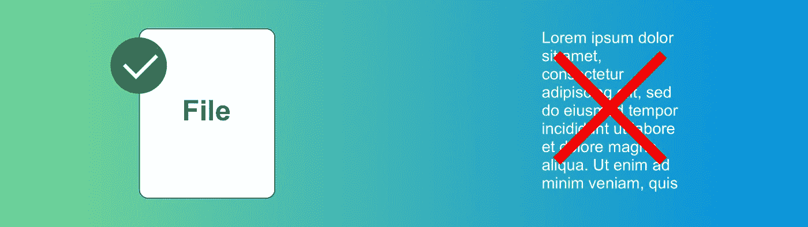
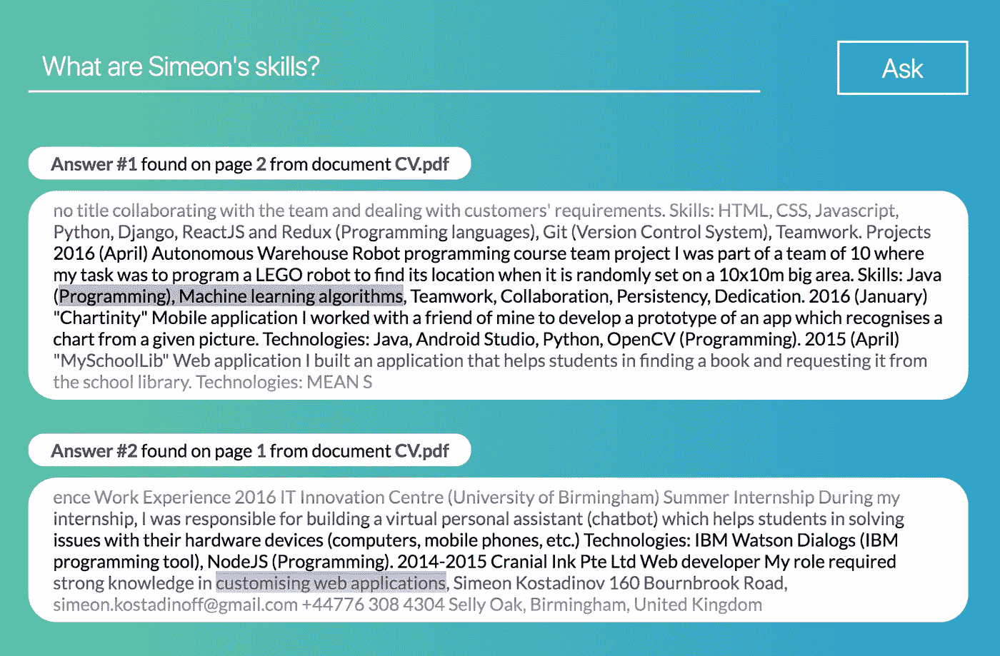
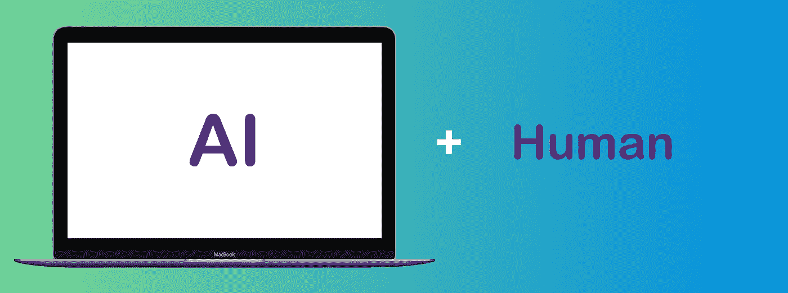

# 找到你需要的答案

> 原文：<https://medium.com/hackernoon/find-the-answers-you-need-330a35f8db00>

## 在几秒钟内搜索您的(大型)文档

回到 2017 年 5 月，我正处于大学三年级的考试期。一次好的准备需要我完成许多作业和测验，并回答多项选择或开放性问题。大多数答案经常在讲师的笔记中找到。所以，我发现自己**多次阅读几十页**，只为了在笔记的某处找到完全正确的答案。我不是唯一一个这样做的人。

An ordinary student preparing for exams.

那次经历让我想:**有没有更有效的方法？**

快进几个月，我决定开始我的人工智能之旅。我开始[学习](https://hackernoon.com/tagged/learning)一些最强大的最先进的算法是如何工作的，并最终开始在[每周博客](/@simonnoff)中记录我的知识。

看到深度学习和自然语言处理的快速进步，我决定解决许多学生在大学期间面临的问题。

带着我最近学到的知识和创造有价值产品的热情，我建立了 [*Asknote*](https://asknote.herokuapp.com/) 。

# 它是如何工作的？

*Asknote* 是一个网络应用程序，可以让你在任何文档中找到你需要的答案。它是这样工作的:

## **#1。输入您的电子邮件**

首先，你需要输入你的邮箱。

添加文件和提问时都会用到它。通过这种方式，系统授权您，仅根据您自己的文档提供答案。

重要的是:永远把你的电子邮件放在字段中。否则，您将收到一条错误消息。

## **#2。上传您的 PDF 文件**

接下来你需要添加一个你选择的 PDF 文件。只需点击*选择文件*，紧接着*上传 PDF 文件*。

*重要提示:上传文件后，等待屏幕上显示成功消息。然后，您将确保您的文档已成功处理。*

## **#3。问你的问题**

完成以上步骤后，只需填写你的问题，点击*提问*即可。

你应该输入一个问题，你希望这个问题的答案藏在文档的某个地方。

您将收到前 5 个最相关的答案及其相关的页码和文件名。这样你就可以写下正确预测的结果，并且只读相应的页面。

## **#4。重复**

重复步骤 **#2** 和 **#3** 任意多次。您的答案将在仔细分析所有文件后提取出来。

# 它是如何制作的？

太好了！现在你完全明白如何使用 *Asknote* 。

在这一节中，我想与您分享一些关于构建该应用程序所涉及的过程的见解。

## #1.回答任何问题

我面临的第一个挑战是如何根据一篇文章和一个问题预测答案。

我立即投入到一项广泛的研究中，寻找这一领域最新的人工智能进展。我遇到了一个惊人的[排行榜](https://rajpurkar.github.io/SQuAD-explorer/)，它列出了所有的算法。本质上，它们每一个都取一个问题和一段话，用向量表示，输出答案的起止位置。

由于它们实现的相似性，我决定首先理解它们背后的数学原理。这让我写了一篇[文章](https://towardsdatascience.com/how-the-current-best-question-answering-model-works-8bbacf375e2a)，解释最佳模式。

对于 *Asknote* ，我选择了第二好的模型(由*Allen Institute for Artificial Intelligence*开发)，因为它的性能对于用例来说非常出色。

## #2.让我们做文件，而不是文本

到目前为止一切顺利！我收到了正确的答案，系统正常工作。但是，作为一名学生，我并没有想象自己复制和粘贴大量文本来寻找答案。像我一样的千禧一代在处理技术时会变得非常不耐烦，所以一切都需要快速进行，不超过 2-3 个动作。

这个过程需要更简单。

为此，我引入了 **PDF 上传。**系统接受您的文件并进行分析，最终提供最佳结果。我想要一个可靠且稳定的解决方案，所以我花了相当多的时间来完善后端以同时执行操作。这极大地改善了文件上传体验。

仍然有一些缺点我想指出来。我尽了最大努力来避免它们，但是我想，它们将在 0.1 版中保留:

*   目前，您只能添加 PDF 文件。任何其他格式都将被拒绝。*(我计划在未来几周内支持 Word 文档、网页或图片)*
*   您一次可以上传一个文件。对于多个，就一个一个做吧。*(别担心，我们会在所有文件中搜索您的答案)*
*   PDF 中包含文本的图像不会被处理。这意味着你不能根据照片里面的信息找到答案。
*   大文件(100 多页)有时可能需要更长时间(5-15 秒)。*(我知道这有时很烦人，所以我会在下一个版本中继续改进)*

## #3.不同的用户

我在项目开始时有不同用户的想法，但不知道具体如何执行。我觉得*不需要整个认证过程，*因为这是体验核心功能前的一个额外步骤。

相反，我决定**要求电子邮件区分不同的用户。**电子邮件是您的唯一密钥，因此在搜索答案时，只会显示您的文档。这使得您可以随时提出任何问题，即使您重新加载或关闭页面。

## #4.答案设计

由于该项目利用了一种全新的深度学习技术，这种技术仅在几个月前推出(因此没有经过多次迭代)，*人们有时会对最终结果的准确性不满意。*

我的解决方案是引导用户走向正确的预测，但让他自己选择答案。系统不会显示概率最高的预测，而是显示**前 5 个最相关的答案及其相关的页码和文档名称。**

# 让我们一起努力吧

随着我最近在人工智能领域的进步，我开始意识到机器和人类之间的合作可以极大地提高我们的总生产力——这是决定经济增长的力量。

Asknote 完美地诠释了这种合作关系。

人工智能系统通过提供几个建议来简化搜索，让人类做出最终决定。这导致了复杂问题的解决，例如**在几秒钟内回答任何问题。**

这个项目让我受益匪浅。希望你也觉得有用。很高兴听到你的想法。

## 谢谢你的阅读。如果你喜欢这篇文章，给它一些掌声👏。希望你有一个伟大的一天！