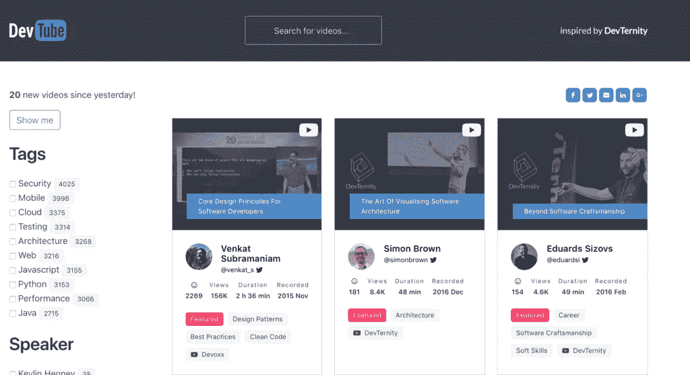

# 在 dev.tube 中查找数以千计的开发者讲座

> 原文：<https://medium.com/hackernoon/find-thousands-of-developer-talks-organized-in-dev-tube-a136396fe0fc>

我最近了解到一个我非常喜欢的新的开发者相关网站。这里列出了许多关于软件开发的会议录音。

这个网站叫做 [dev.tube](https://dev.tube/) ，最近出现在 [ProductHunt](https://www.producthunt.com/posts/devtube) 上，我最初是在那里了解到它的。

它是开源的，你可以贡献网站的[源代码，甚至可以修改已经嵌入其中的 YouTube 视频细节。](https://github.com/watch-devtube)

它有一个搜索功能，可以帮助您搜索与已经添加的视频相关的特定内容。它还列出了一些与现有视频相关的最常见标签。此外，它还显示一个著名的会议发言人列表，您可以使用它来过滤您的结果，只显示特定的发言人。

dev.tube 的开发者之一 Eduards Sizovs 最近活跃在 [HackerNews](https://news.ycombinator.com/item?id=17390527) 上，回答了人们关于该网站的一些问题。他毫不犹豫地在改进和实现新功能方面做了很多承诺，他和其他开发人员已经启动了这个网站，并计划实施。其中一个是根据视频长度过滤视频的选项，另一个是改变*观看*按钮，使整个视频卡可点击。

你可以查看它的[源代码](https://github.com/watch-devtube)，也可以[贡献](https://github.com/watch-devtube/contrib)关于你想要包含在列表中的视频的建议。它是开源的，你可以贡献网站的源代码，甚至可以修改已经嵌入其中的 YouTube 视频细节。

在撰写本文时，已经有成千上万的视频被添加进来，更多的视频可能正在被添加进来。