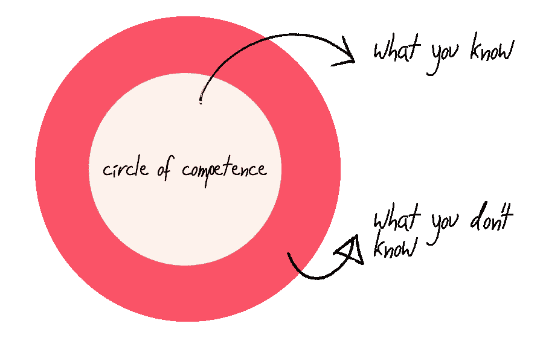

# 找到你的能力范围——如何做好一名软件架构师

> 原文：<https://medium.com/hackernoon/find-your-circle-of-competence-how-to-do-well-as-a-software-architect-81ecb7817f9c>

作为一名软件架构师，你是需求和实现之间的纽带。做出具有坚实基础的决策是一个持续的挑战，这些决策使未来的功能能够适应现有的生态系统，并与良好的软件原则保持一致，例如 solid、DRY、YAGNI 等等。

构建软件需要不断的改进工作。新型技术每天都在涌现，很难让你跟上每件正在发生的事情。正如著名的苏格拉底所说，你学得越多，你就越意识到你知道的是多么少。我作为软件架构师大约 3-4 年的经验(按头衔，不是如果你亲自问我；)教会了我把自己划分到特定的领域，而不是跳到所有乍一看似乎很棒很热门的事情上。

# 能力圈

我最近读到一个叫做能力圈的东西。能力圈来自最好的投资者之一沃伦巴菲特，是与一个人的技能或专业知识相匹配的主题领域。这个原则来源于把钱投资在你有充分理解的领域。

我之所以提到这个原则，以及为什么它引起了我的关注，是因为这种原则不仅适用于财务决策，而且适用于所有事情。包括软件开发，我都应用过。

你越有经验，你就会意识到你不可能把每件事都做好*。我不认为这是什么新的或壮观的事情，但缩小和评估你自己和你做得如何是重要的。你如何**保持专注于对你来说重要的事情？我很想听听！***

# *适用的能力范围*

*去年 10 月，我有机会加入金融业，成为一家全球银行的架构师/开发人员。我以前在另一个行业做过类似的工作，所以这对我来说是一件全新的事情，无论是业务还是公司规模。*

*我以前的工作和公司在许多技术领域都处于领先地位，但很少有那些具有挑战性的项目能让我们这些技术人员充分利用我们的工具箱。这是我离开的原因之一。总之，这不是重点。:)*

*关键是，当我签下这份新工作时，我知道会有很多挑战，比如:*

*   **定义软件领域的愿景和标准**
*   **设定编码标准和最佳实践**

*这些挑战相当广泛，需要做出许多决定。你如何确保你能完成这些？我知道在某种程度上，我可以从我以前的工作中获得的经验中受益，但某种系统会更好。*

*为什么不看看如何将能力圈原理运用到我的情况中。*

*好的，这是一张圆圈的图片:*

**

*但我认为这样更准确:*

**

*把你知道的分成你的舒适区和你不知道的舒适区。*

***舒适于***

*   *首先，我主要关注后端开发，尤其是。NET 平台。*
*   *我提倡测试(TDD)，一直努力应用干净的代码和良好的软件原则等。所以在我的能力范围内，我可以加上这个。*
*   *我有配置、构建管道和持续部署的经验。*
*   *我也很擅长沟通，善于用语言将技术术语传递给非技术人员。所以交流这些事情应该是可行的。*

***在**不舒服*

*   *网络、VIP、堡垒、防火墙规则、DMZ 和所有这些呢？不，我在那里不太舒服。*
*   *核心银行解决方案？号码*
*   *UX 和前端*
*   *银行监管和法律呢？不，不是真的，颤抖…*

*好吧，就这样。我现在已经把我知道的和我不知道的分开了。这是一个粗略的概述和例子，只是为了给你一个提示，告诉你我是如何把事情分开的。现实中的清单要长得多，也复杂得多。*

*通过做这个小练习，我可以回顾上面提到的两个挑战并回答这个问题:*

*我如何*定义软件领域的愿景和标准*并*设定编码标准和最佳实践*给定我所知道的和我能做出贡献的地方？*

*如果我着眼于挑战的角度，把我的自信区域记在心里，我做出好决定的可能性会比我应该开始关注圈子之外的方面的可能性大。*

*在圈子之外，也就是你确实知道自己不是专家的领域，邀请他人帮助你，并接受这一点。让他们成为教授你的专家。这将帮助你扩大你的圈子，也希望你能扩大别人的圈子。这是我生活的哲学之一。它让我专注于我知道自己擅长的领域。*

*请注意，这与你想学什么无关，而是一种让你专注于你知道自己能做好的领域的方法。*

*作为一名软件架构师，你如何保持专注？*