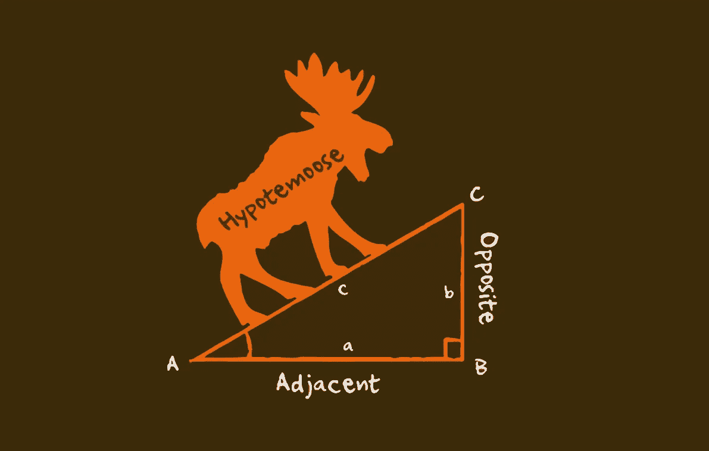
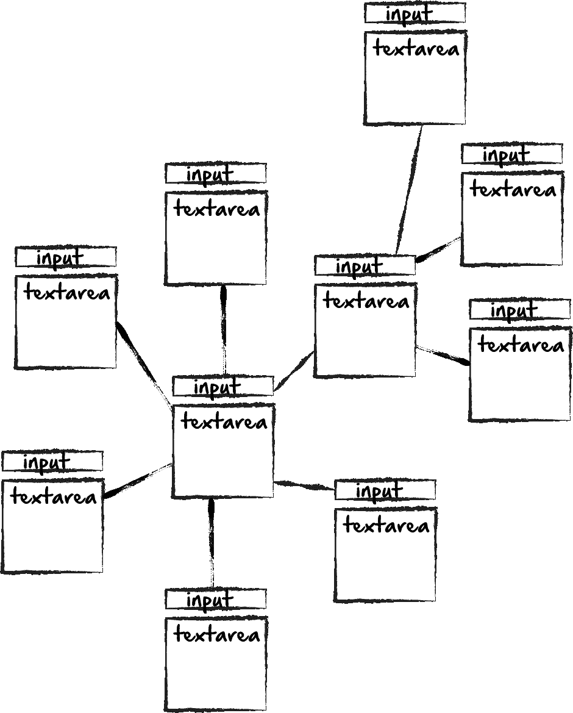
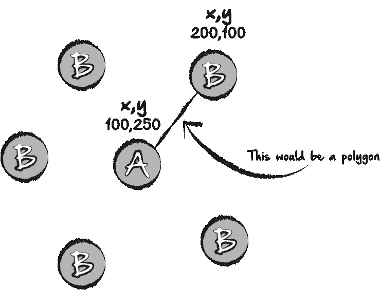
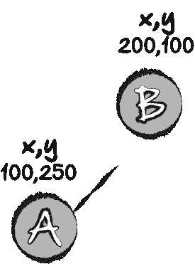
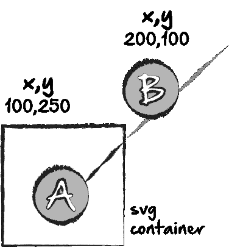
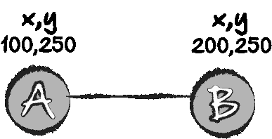
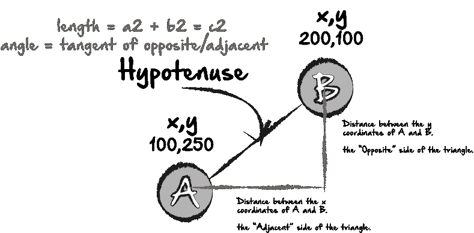

# 用 JavaScript 求斜边

> 原文：<https://medium.com/hackernoon/finding-a-hypotenuse-with-javascript-5d28996f8fef>



最近，我想到了一个可以让你集思广益的网站。以下是我的基本设想:



用户将从一个中心思想或想法开始，并且能够分支相关的思想或想法。这对于计划课程、演示甚至学习都很有帮助。当我对这个想法进行头脑风暴时，我想到了这个项目需要的 4 个组成部分:

# 1 个输入/文本区

# 2 创建一个新想法分支的按钮。

# 3 一条线，在视觉上连接想法和分支的想法。

为此，我很快遇到了一个问题。创建输入/文本区域很容易。创建一个创建新的输入/文本区域的按钮也很容易。难的是在视觉上以一种既实用又有意义的方式来设计它。例如，为了简单起见，我们可以简单地让每个创建新表单元素的按钮将表单元素垂直放置在前一个元素的下方。虽然从编程的角度来看，这可能更简单，但从视觉上看，这对用户来说没有太大意义，因为很难区分哪个分支文本框与哪个先前的想法或文本框相连接。正如通常为我服务的那样，我决定从小处着手，看看我是否能让机制先在小范围内工作。我从点开始，每个点代表一个 from 元素/文本框。每个点宽 25 像素，高 25 像素，黑色。我的第一个目标是在第一个点被点击时添加一个新的点，然后在每次第一个点被点击时在它周围分布后续的点。为了解决这个问题，我创建了一个名为“click”的变量，并将其设置为 0；然后，在每次点击事件中，我都加一。

```
let clicks = 0;
  $('button').click(function() {
    clicks = clicks + 1;
```

然后我在 if 语句中创建一个元素。

```
if(clicks == 1) {
  let blackDot = document.createElement('div');
  blackDot.id = "outerDiv1";
  document.body.appendChild(blackDot);
  document.getElementById('container').appendChild(blackDot);
  blackDot.className = "blackDotClass";
}
```

这是最基本的。然后我给它添加一个顶部和左边距。不包括在类“blackDotClass”中，因为每个创建的元素的边距都不同。例如，第一个点位于父元素的右侧，第二个创建的点位于父元素的下方，第三个位于父元素的左侧，依此类推。我会这样插入:

```
if(clicks == 1) {
  let blackDot = document.createElement('div');
  blackDot.id = "blackDotID1";
  document.body.appendChild(blackDot);
  document.getElementById('container').appendChild(blackDot);
  blackDot.style.marginTop = "25px";
  blackDot.style.marginLeft = "200px";
  blackDot.className = "blackDotClass";
}
```

然后，如果第二次单击父点，我们可以这样做:

```
if(clicks == 2) {
  let blackDot = document.createElement('div');
  blackDot.id = "blackDotID2";
  document.body.appendChild(blackDot);
  document.getElementById('container').appendChild(blackDot);
  blackDot.style.marginTop = "0px";
  blackDot.style.marginLeft = "200px";
  blackDot.className = "blackDotClass";
}
```

我们唯一改变的是“ID”和上边距。然后，对于第三个元素，我们可能会改变顶部和左边距，将每个新元素放在围绕父点的圆圈中。这一部分足够简单，但对于没有物理线将一个点连接到另一个点的用户来说，这仍然会令人困惑。否则，再一次，除了空格之外，很难判断哪些元素实际上是相连的。

我最初的想法是用多边形来解决这个问题。由于每个“点”或“元素”或我们使用的任何东西都有一组 x 和 y 坐标，我可以使用父元素的坐标和坐标来绘制一条从一个元素到下一个元素的多边形线。这是我所设想的图表:



实际上，在得出 svg 多边形不起作用的结论之前，我对这个想法进行了多次反复。原因是多边形是 svg 元素，必须在 svg 容器中。因此，你不只是简单地将 a 和 b 排列在一起，而是将它们和 svg 元素本身排列在一起，SVG 元素有自己的维度集。以此为例:



您可能会开始该过程，并将所有内容正确排列，并以上面的示例结束，其中线没有从点 a 连接到点 b。自然，假设该线不够长，并且是坐标或多边形长度的问题。当您的问题可能是 svg 容器不是正确的大小或没有正确对齐。你实际拥有的是这个:



你的线是对的，你的坐标可能是对的，但是因为 svg 容器太小，你只能看到实际多边形的一小部分。当然，你可以在容器周围做一个边框来看它在哪里，但是想象一下当你有几个元素，然后是 svg 容器和多边形时，做这件事会变得多么复杂…这是一个噩梦。

所以我想出了一个稍微简单一点的解决方案。只是一个 div，宽度为 1，有边框。每当我单击“A”并创建一个新的子元素“B”时，我还会创建第三个元素“C ”,即连接这两个元素的线条，或者在这两个元素之间创建一个带边框的 div。



如果 A 和 B 在同一 X 轴上，并且显示设置为 inline，或者它们包含在 span 标记中，那么您的工作就完成了，因为您不需要对 y 轴进行任何计算。然而，再一次，从用户的角度来看，如果所有东西都在一条直线上，就很难知道想法和元素在哪里连接。因此，在这些思维导图中，它们通常是圆形的。这是我想到的。在我创建了 B 之后，通过点击 A，我得到了每个 B 的坐标，就像我对多边形所做的那样。

```
 let element1 = dot1.getBoundingClientRect();
  let element2 = dot2.getBoundingClientRect();
  console.log(element1);
  console.log(element2);
```

我还想找到我的元素的中点。万一我的点是 300px 大，我不希望线连接到顶部，而是中间。我将高度和宽度除以 2，这是我可以从“getboundingClient”函数中找到的数据。

```
let midpointX1 = element1.width/2;
  let midpointY1 = element1.height/2;

  let midpointX2 = element2.width/2;
  let midpointY2 = element2.height/2;
```

我的思维过程是这样的。如果我知道 x 和 y 坐标，也包括在“getBoudningClient”函数中，那么我就有希望做一些数学运算。我想知道的是连接这两个元素的线的长度，以及线的角度。我可以用一些三角学来做这个，首先，我用勾股定理来求长度:A 的平方+ B 的平方= C 的平方。



通过将两个元素的关系转化为三角形的角，我们可以用数学来发现线的长度，正如我上面提到的，然后我们可以用切线来发现线的角度。我要做的是创建一个函数，获取两者的坐标，并运行它们来找到我要找的东西。

```
let midpointX1 = element1.width/2;
  let midpointY1 = element1.height/2;

  let midpointX2 = element2.width/2;
  let midpointY2 = element2.height/2;

  let top1 = element1.top - midpointY1;
  let top2 = element2.top - midpointY2;
  let left1 = element1.left - midpointX1;
  let left2 = element2.left - midpointX2;

  function findTriangle (w, x, y, z) {

    let difference = function (a, b) { return Math.abs(a - b); }
    let opposite = difference(w, x);
    let adjacent = difference(y, z);

    let hypotenuseLengthSquared = Math.pow(opposite, 2) + Math.pow(adjacent, 2);
    console.log(hypotenuseLengthSquared);

    let hypotenuseLength = Math.sqrt(hypotenuseLengthSquared);
    console.log(hypotenuseLength);
    console.log(adjacent);

    let angle = Math.atan(opposite/adjacent)*100;
    console.log(angle);
    return [opposite, adjacent, hypotenuseLength, angle];
  }
  let triangle = findTriangle(top1, top2, left1, left2);
  console.log(triangle);
```

函数“findTriangle”取左上角的元素，减去中点，假设我们的元素是对称的，并基本上给出两个元素的 x 和 y 坐标，以计算斜边的角度和长度。我还有一个函数返回相邻的和相对的边，以防我以后需要用到它们。现在，我将使用这些坐标和返回值创建我的 div。

```
let newDiv = document.createElement('div');
  newDiv.id = "test";
  document.body.appendChild(newDiv);
  document.getElementById('dot1').appendChild(newDiv);
  newDiv.style.borderColor = "#1cce3a";
  newDiv.style.borderWidth = "3px";
  newDiv.style.borderStyle = "solid";
  newDiv.style.borderColor = "#1cce3a";
  newDiv.style.width = ""+triangle[2]+"px";
  newDiv.style.transform = "rotate("+triangle[3]+"deg)";
  newDiv.style.zIndex = -1;
```

因为我的返回语句是一个数组，所以当我调用元素的宽度和变换时，我只使用了我需要的数组索引[2]和[3]。

现在，我可以在第二个 if 语句中运行这个完全相同的函数。由于第二个点在 DOM 上看起来比第一个点稍低，所以该函数将计算两者之间的距离并返回连接线(div ),这样它们在屏幕上就可以在视觉上连接起来，我们可以得到类似于我最初的视觉效果。然而，即使有这些精确的计算，事情也很容易变坏。例如，如果容器被设置为 flexbox 显示，它将丢弃所有的计算。但是，总的来说，这是一个非常有趣的练习。

写这篇文章的一个主要原因是，作为一个年轻人，我讨厌数学。我对此一点也不擅长，而且老实说，我也没怎么努力。即使在第一次学习 JavaScript 的时候，我也会碰到这样的练习，你需要通过一些复杂的公式找到一些晦涩的数字。我总是对自己说，“为什么我需要用这个？毫无意义！!"。我知道至少对我来说，当我有这些想法时，我会立即开始忽略。但是，在这个过程中，看到使用毕达哥拉斯定理和其他三角学方程是多么的实际和有用，这很酷。关键是，如果你也有过这种感觉，不要忽视。您可能需要比您想象的更快地使用这些信息！随时寻求反馈或问题。谢谢！